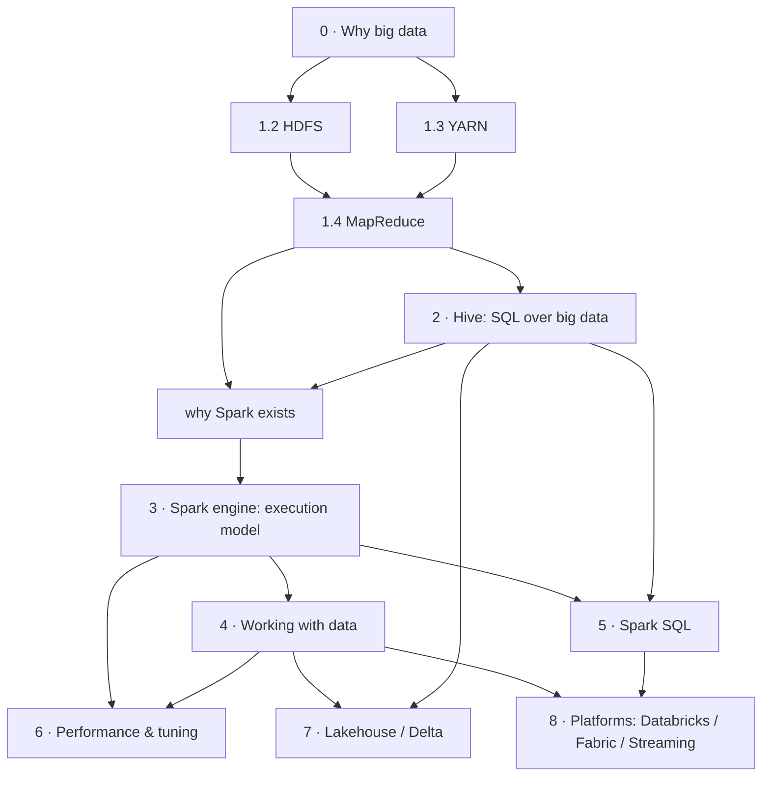

# Master plan — the Spark ecosystem as one learning journey

**Date:** 2026-07-11 · **Status:** awaiting approval · **Scope:** the whole ecosystem on-ramp —
Big Data → Hadoop (HDFS, YARN, MapReduce) → Hive → Spark → PySpark → Spark SQL → the lakehouse.

This document is the answer to the standing brief's *Final Deliverables* (1–8). It sits **above**
the existing Spark review — [`spark-editorial-review.md`](spark-editorial-review.md) — which
already owns the detailed article-level plan for the Spark tab. Where this plan reaches the Spark
tab, it **defers** to that document rather than restating it. Nothing here is published; it lives
in `.claude/reviews/` like every other planning artifact.

Read [`DECISIONS.md`](../DECISIONS.md) (§"Editorial curation workflow") first: the rule is *review
a whole section, produce a written plan, wait for the owner to approve, then rewrite one article at
a time.* This plan is the review for the missing foundational sections. **No content has been
written or moved.**

---

## 0. The problem this plan solves

The brief's success test is one sentence:

> *A developer who begins the curriculum feeling overwhelmed should finish it feeling confident
> enough to start working with the technology.*

That developer is told to "start at the beginning." Today there is no beginning. The site's
strongest ecosystem content — the Spark tab — assumes the reader already knows what a cluster, a
block, a partition, and a shuffle are. The material that would teach those things is either
**absent** (HDFS, YARN, MapReduce have no concept article at all) or **buried as infrastructure
how-tos** three levels deep in `DevOps → Docker → Big Data → …`, written to stand up a Docker
cluster, not to teach a mental model.

So the ecosystem has a **missing bottom layer**. A reader who lands on "What Is Spark?" meets
MapReduce, Hadoop, and the Hive metastore in the first article (the rewrite already softens this)
but has never been introduced to any of them. The single highest-value structural change available
is not another Spark article — it is **building the on-ramp that makes the Spark tab the middle of
a journey instead of its start.**

Two facts frame everything below:

- **The foundational concepts are scattered across five different top-level tabs.** Hadoop and Hive
  concepts live under DevOps/Docker; PySpark basics live under Python; Spark-on-Fabric and
  Spark-on-Synapse live under Azure; Structured Streaming's only real coverage is under Stream
  Processing. No reader path connects them.
- **The learning order is inverted or absent.** The brief's non-negotiable is *motivation before
  mechanism, concept before syntax.* The current ordering teaches Spark optimisation before Spark
  execution, and never teaches the storage and compute substrate underneath either.

---

## 1. The curriculum (Deliverable 1)

Nine modules. The first three are the new on-ramp this plan is mostly about; modules 4–7 are the
Spark tab, already planned in detail in the Spark review; module 8 is platform tracks that already
exist and need only to be connected back.

The spine is designed so **every module answers the question the previous one raised.** Hadoop
raises "MapReduce is painful to write" → Hive answers it with SQL. Hive raises "this is still slow
and disk-bound" → Spark answers it with in-memory execution. Spark raises "how do I not shoot
myself in the foot" → Performance answers it. And so on.

### Module 0 — Why big data at all? *(new — the true entry point)*

The reader has never questioned that one computer is enough. Start there.

| # | Article | The one question it answers |
|---|---|---|
| 0.1 | When one machine stops being enough | Why can't I just buy a bigger server? (vertical vs horizontal scaling, the wall you hit) |
| 0.2 | The three hard problems of distributed data | Once you use many machines: how do you *store* across them, survive one *dying*, and *coordinate* them? |
| 0.3 | A map of the ecosystem | One picture of how every name they're about to meet fits together — returned to at the end of every module |

### Module 1 — Hadoop: the foundation *(mostly new)*

| # | Article | The one question it answers |
|---|---|---|
| 1.1 | What Hadoop is (and what it is not) | Is Hadoop one thing? (No — a storage layer, a resource layer, a compute model. Frame the three.) |
| 1.2 | HDFS — storing a file too big for one disk | How do you store a 10 TB file when no disk is 10 TB? (blocks, replication, NameNode vs DataNode) |
| 1.3 | YARN — sharing a cluster fairly | If ten jobs want the cluster at once, who decides? (ResourceManager, NodeManager, containers) |
| 1.4 | MapReduce — the original compute model | How did the first generation actually process the data? (map → shuffle → reduce, and *why it hurt* — disk between every step) |
| 1.5 | Running Hadoop: the three modes | Standalone / pseudo-distributed / fully-distributed — *(the one existing article that survives mostly intact)* |

### Module 2 — Hive: SQL over big data *(consolidate + reframe)*

| # | Article | The one question it answers |
|---|---|---|
| 2.1 | Why Hive exists | If MapReduce is Java and painful, how did analysts ever use Hadoop? (Hive = SQL that compiles to jobs) |
| 2.2 | Tables over files: schema-on-read | How can a folder of CSVs be a "table"? (schema-on-read vs schema-on-write, managed vs external tables) |
| 2.3 | The metastore — the part that outlived Hive | Why does `hive_metastore` appear in tools nobody installed Hive on? (metastore modes, clients, Derby→MySQL) |
| 2.4 | Where the data actually lives | HDFS vs S3 vs ADLS as the warehouse directory — *(rescued from the DevOps how-to)* |

> Module 2 is where the existing Hive content (currently duplicated **6×** across the site per the
> Spark review) is made canonical. Everything else becomes a pointer here.

### Module 3 — Spark: the engine

Owned by the Spark review, `010-foundations` + `020-execution-model`. Summary of the spine:
what Spark is → Python vs PySpark vs Spark → install → RDD/DataFrame/Dataset → lazy evaluation &
Catalyst → architecture → jobs/stages/tasks → narrow vs wide → shuffle → partitions → AQE →
**reading the Spark UI** (the keystone article). See the Spark review §5.3.

### Module 4 — Working with data in PySpark

Owned by the Spark review, `030-working-with-data`: DataFrame basics → missing values →
duplicates & windows → joins → broadcast → caching → writing/partitioning → tables & catalogs →
Hive integration → connecting to Azure storage.

### Module 5 — Spark SQL *(new module, thin today)*

The brief names Spark SQL as a first-class topic; the site barely covers it as a subject.

| # | Article | The one question it answers |
|---|---|---|
| 5.1 | Spark SQL and the DataFrame API are the same engine | Is `spark.sql("…")` different from `df.filter(…)`? (No — same Catalyst plan; a two-language front door) |
| 5.2 | Temp views, the catalog, and `spark.sql()` | How do I run SQL against a DataFrame? |
| 5.3 | Spark SQL ↔ Hive | How Spark reads Hive tables and *is* HiveQL-compatible; where they diverge |

### Module 6 — Performance & tuning

Owned by the Spark review, `040-performance`: the nine gotchas made canonical, plus the four
rescued from the truncated monolith, plus UDFs. The Spark UI article (module 3) is the spine that
ties every gotcha to something the reader can *see*.

### Module 7 — The modern lakehouse *(reframe + expand)*

| # | Article | The one question it answers |
|---|---|---|
| 7.1 | From Hadoop to the lakehouse | The 15-year arc: warehouse → data lake → lakehouse, and *why* each shift happened |
| 7.2 | Delta Lake | What does a transaction log buy you on top of Parquet? (currently 182 words for a format the site's own projects depend on) |

### Module 8 — Platform tracks *(exist already; connect back)*

Not part of the linear spine — these are "now apply it on a platform" branches that each **must**
open by linking back to the relevant core module:

- **Databricks** — its own tab (Spark review §5.4).
- **Azure (Synapse / Fabric)** — Spark-on-Fabric and Synapse Spark pool content; link back to
  modules 3–5.
- **Structured Streaming** — the Stream Processing tab; currently disconnected from Spark entirely.

---

## 2. Dependency graph (Deliverable 2)

The hard prerequisite chain. An arrow means *you cannot understand the target without the source.*



**Linear reading order** (what a stressed developer follows top to bottom):

> Why big data → HDFS → YARN → MapReduce → Hadoop modes → **Why Hive** → schema-on-read → the
> metastore → where data lives → **What is Spark** → Python vs PySpark vs Spark → install → RDD/DF/DS
> → lazy & Catalyst → architecture → jobs/stages/tasks → narrow vs wide → shuffle → partitions → AQE
> → **reading the Spark UI** → DataFrame basics → missing values → dupes & windows → joins →
> broadcast → caching → writing → tables & catalogs → Hive integration → **Spark SQL** → performance
> gotchas → **lakehouse & Delta** → platform track of choice.

The two **bold hinge points** are where a reader's mental model either clicks or doesn't: *Why
Hive* (SQL is just compiled jobs) and *What is Spark* (in-memory beats disk-between-steps). Both
already have signature illustrations briefed (the ruined-library card catalogue S-09; the
relay-vs-filing-cabinet S-03).

---

## 3. Existing-article mapping (Deliverable 3)

The Spark review already maps the 41 files in the Spark tab. This table covers the **ecosystem
content the Spark review did not reach** — the buried foundations and the cross-tab Spark pages —
so that no useful topic is lost.

| Existing article | Where it lives now | Curriculum home | Action |
|---|---|---|---|
| `…/BigDataStack/4.9.2_Hadoop_Concepts.md` | DevOps/Docker | 1.5 Hadoop modes | **Rewrite** — salvage the three modes; drop the broken trailing heading; it is *all* the Hadoop concept content that exists |
| `…/BigDataStack/4.9.1_Hive_Concepts.md` | DevOps/Docker | 2.4 Where data lives | **Move + rewrite** — good "shared storage" material, misfiled as infra |
| `Spark-DataBricks/4.0_Hive/Hive_Concepts.md` | Spark tab | 2.2 + 2.3 | **Split + rewrite** — clients & metastore modes → 2.3; screenshots → Mermaid; "is Hadoop mandatory" is a keeper |
| `Spark-DataBricks/1.16_ConnectingSparkToHive.md` | Spark tab | 4 (Hive integration) | **Keep/improve** — already in Spark review scope |
| `Python/Pyspark.md` | Python tab | 4.1 DataFrame basics | **Rewrite + dedupe** — "Common df operations" table is pasted **twice** (Part 1 ≡ Part 2); the session-info + analyse-df snippets seed the new DataFrame-basics article |
| `…/BigDataStack/4.5_Hadoop_Cluster_*.md` | DevOps/Docker | — | **Keep as lab** — legit "stand up Hadoop in Docker" how-to; add a link up to Module 1 |
| `…/BigDataStack/4.6`, `4.7`, `4.8_Hive-ApacheOfficial` | DevOps/Docker | — | **Keep as labs** — infra how-tos; cross-link to Module 2 |
| `…/BigDataStack/4.1_PySpark`, `4.2_Bitnami`, `4.4_Spark_Hive_MSSQL` | DevOps/Docker | — | **Keep as labs** — cross-link to Module 3 |
| `Microsoft-Fabric/Pyspark_SparkSQL.md` | Azure/Fabric | 8 (platform) | **Keep** — add "prerequisite: modules 3–5" banner |
| `Microsoft-Fabric/PandasVsSparkDf.md` | Azure/Fabric | 4.1 or 8 | **Keep/improve** — genuinely useful comparison; link from DataFrame basics |
| `Microsoft-Fabric/FabricSparkStreaming.md` | Azure/Fabric | 8 (streaming) | **Keep** — one of two streaming pages; connect to Spark |
| `Synapse-ADF/2.2_PySparkWarehouse.md` | Azure/Synapse | 8 (platform) | **Keep** — link back to modules 4–5 |
| `StreamProcessing/5_AmazonKinesisSparkIntegration.md` | Stream Processing | 8 (streaming) | **Keep** — the site's only Spark-streaming worked example; connect to Spark |
| `DE-Projects/Download-Haddop-Jars.md` | Projects | reference | **Keep** — utility page |

For the 41 Spark-tab files, defer to **Spark review §3 and §5.3** — no re-mapping here.

---

## 4. New articles to write (Deliverable 4)

Ordered by how much each unblocks the learning journey. Items marked ★ are prerequisites for the
whole spine to read coherently.

**Foundational on-ramp (this plan's core ask):**

1. ★ **When one machine stops being enough** (0.1) — the true entry point; nothing before it
2. ★ **HDFS — storing a file too big for one disk** (1.2) — no article exists
3. ★ **MapReduce — the original compute model** (1.4) — no article exists; the "why Spark" hinge
4. ★ **A map of the ecosystem** (0.3) — the one diagram every module returns to
5. **YARN — sharing a cluster fairly** (1.3) — no article exists
6. **The three hard problems of distributed data** (0.2)
7. **Why Hive exists** (2.1) — reframes existing Hive content around motivation
8. **Schema-on-read: tables over files** (2.2)

**Spark tab (already identified by the Spark review — listed for completeness):**

9. **Reading the Spark UI** (3, keystone) · **AQE** · **Joins** · **Lazy evaluation & Catalyst** ·
   **DataFrame basics** · **UDFs** — see Spark review §4.

**Spark SQL & lakehouse:**

10. **Spark SQL is the same engine as the DataFrame API** (5.1)
11. **From Hadoop to the lakehouse** (7.1) — the arc that gives the whole site a narrative spine
12. **Delta Lake, properly** (7.2) — expand from 182 words

---

## 5. Merge / split / rewrite (Deliverable 5)

The big cross-tab consolidations. (Within-Spark-tab merges — gotchas monolith, skew ×3, caching
×5, shuffle ×3 — are in Spark review §1 and §8; not repeated.)

- **Hive, 6 copies → 1 canonical Module 2**, everything else a pointer. The two "Hive Concepts"
  files are *not* duplicates (one is architecture, one is warehouse-storage) — merge them by
  *topic* into 2.3 and 2.4, don't just delete one.
- **`Python/Pyspark.md`** — internally duplicated (the ops table appears twice); split its useful
  halves into DataFrame-basics (4.1) and let the reference table live once.
- **Hadoop concepts** — currently one thin file; **split into four** (HDFS, YARN, MapReduce, modes)
  because each is a distinct mental model and the brief's rule is one idea per article.
- **Streaming** — the Stream Processing tab and the Fabric streaming page both teach Spark
  Structured Streaming with no link to Spark. Don't merge the tabs; add a Structured Streaming
  concept article in Module 8 that both platform pages point to.

---

## 6. Illustrations for the new articles (Deliverable 6)

The site's signature. Every new foundational article gets at least one sketch briefed *before*
its prose, per [`STYLE.md`](../illustrations/STYLE.md) (one claim, writable as one sentence). These
are **candidates to add to the manifest** when each article is written — not yet briefed formally.

| Article | Analogy | The single claim |
|---|---|---|
| 0.1 One machine isn't enough | One strongman vs a moving crew | Past a point you stop hiring a bigger person and start hiring more people |
| 1.2 HDFS blocks & replication | A giant book torn into chapters, 3 copies in 3 buildings | You don't store the whole book anywhere; you store pieces, thrice, in different places |
| 1.2 NameNode | The library front desk that only holds the index card, not the books | Lose the desk and you can't find anything, even though every book is safe |
| 1.3 YARN | An airport control tower assigning gates to planes | Many jobs want the runway; one tower decides who gets it and when |
| 1.4 MapReduce | A national census: hand out forms → fill locally → sort by district → tally | Move the question to the data, not the data to the question — but file everything to disk between steps *(pairs with existing S-03 relay-vs-filing-cabinet)* |
| 2.2 Schema-on-read | Reading the label when you *open* the box, not when you pack it | Hadoop stores anything; the schema is applied at read time, so the same files can be many tables |
| 7.1 Hadoop → lakehouse | A building repeatedly renovated on the same foundation | Each generation kept the storage idea and replaced the engine on top |

Existing Spark-tab briefs (S-01…S-09, G-01…G-04) already cover the Spark hinge points; see
[`manifest.md`](../illustrations/manifest.md).

---

## 7. Revised navigation (Deliverable 7)

Today the ecosystem is smeared across five tabs with no reading order. Proposed top-level shape —
**a single learning spine, then platform branches:**

```
- Big Data Foundations              [NEW TAB]
    index.md                        (the ecosystem map — Module 0.3)
    010-why-big-data/               Module 0
    020-hadoop/                     Module 1  (HDFS, YARN, MapReduce, modes)
    030-hive/                       Module 2  (canonical Hive home)

- Spark                             (Spark review §5.3 — docs/Spark/)
    010-foundations/  020-execution-model/  030-working-with-data/
    040-spark-sql/    050-performance/       060-lakehouse/   090-reference/

- Databricks                        (Spark review §5.4 — docs/Databricks/)

… platform tabs unchanged, each cross-linked back to the spine:
- Azure (Synapse / Fabric)          → link Spark pages back to Modules 3–5
- Stream Processing                 → link back to Module 8 streaming
```

The DevOps/Docker/BigDataStack **labs stay where they are** — they are correctly filed as
infrastructure. Only their *conceptual* content migrates up to Foundations, leaving a one-line
"the concepts live here →" pointer.

This adds **one new top-level tab** and one new sub-module (`040-spark-sql/`) to the layout the
Spark review already proposed. Everything else is that review's plan.

### URL stability

Same blocking prerequisite as the Spark review §5.5: `mkdocs-redirects` is now installed
(commit `5b68d3f`). Every foundational article moved out of `DevOps/Docker/…` changes a public
URL and **must** get a `redirect_maps` entry in the same commit as the move. `use_directory_urls:
false`, so a filename is its URL.

---

## 8. Prioritised roadmap (Deliverable 8)

Two tracks that don't block each other. Track A is already moving; Track B is what this plan adds.

**Track A — finish the Spark tab** *(in flight, unchanged).*
Continue the Spark review's phases: rewrite article-by-article in reading order, write the keystone
new articles (Spark UI, AQE, joins, lazy/Catalyst), then the one-batch restructure into
`docs/Spark/` + `docs/Databricks/`. This plan does not disturb it.

**Track B — build the on-ramp** *(new).* Independently valuable, independently revertible.

- **B0 — approve this plan.** *(You are here.)* Decide the three open questions in §9.
- **B1 — the entry point.** Write Module 0 (Why big data + the ecosystem map). Highest leverage:
  it's what a lost reader hits first, and the ecosystem map becomes the recurring "you are here."
- **B2 — Hadoop.** Write HDFS → YARN → MapReduce → modes (Module 1). MapReduce is the hinge that
  earns Spark; it must land before the Spark tab's "why Spark exists" paragraph, which currently
  references MapReduce cold.
- **B3 — Hive, made canonical.** Consolidate the 6 scattered copies into Module 2; convert the
  screenshots to Mermaid; leave pointers behind.
- **B4 — wire the seams.** Every foundational article ends with a "next" link; the Spark tab's
  opener gains a "coming from Foundations?" entry; the platform tabs gain their back-links.
- **B5 — Spark SQL & lakehouse.** Modules 5 and 7 — smaller, and partly dependent on Track A
  reaching `030-working-with-data`.

**Recommended interleave:** do **B1 next**, before returning to Track A. The reason is the brief's
own success test — a reader needs a door before they need a better-decorated room, and Module 0 is
currently a hole. B2–B3 can then alternate with Track A's Spark rewrites so each published stretch
of the spine is continuous top-to-bottom.

---

## 9. Open decisions (need approval)

1. **Scope of Track B now.** Full on-ramp (Modules 0–2, ~13 new/rewritten articles), or just
   **Module 0 + MapReduce** as the minimum that makes the Spark tab read from a real beginning?
   *(Recommendation: Module 0 first as a standalone deliverable, then decide.)*
2. **New tab vs. extend Spark.** A separate **Big Data Foundations** tab (recommended — it's a
   distinct subject with its own reading order), or fold Modules 0–2 into the front of the Spark
   tab as `000-foundations/`?
3. **Interleave order.** Pause Track A to build Module 0 next (recommended), or finish the current
   Spark rewrite (`Python vs PySpark vs Spark`) first, then start Track B?
4. **The DevOps labs.** Confirm the infra how-tos (`4.1`–`4.8` in BigDataStack) stay put as labs
   with only their concept content migrating up — vs. moving the labs too.
```
