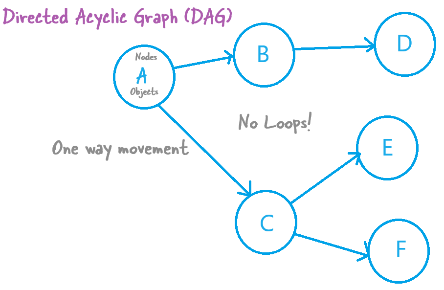

What is Airflow(AirBnB + Workflow)?

Open source **linux-based** workflow engine. Its essentially a job scheduler. But, a very complex job scheduler. The main idea behind Airflow is defining a workflow using a DAG.

> Airflow is Linux Only. Even though its not clear. They say you can install it on windows. But, behidn the scenes you need to activate linux kernel.
> It is built on Python. meaning, it uses a lot of services that are cread in python.
> Its a workflow engine service
> It includes a web server to include a web app UI
> It uses Python libraries to do your work.

Airflow - a birds eye view

Airflow Concepts

https://www.youtube.com/watch?v=lVS6lz5wuH4

