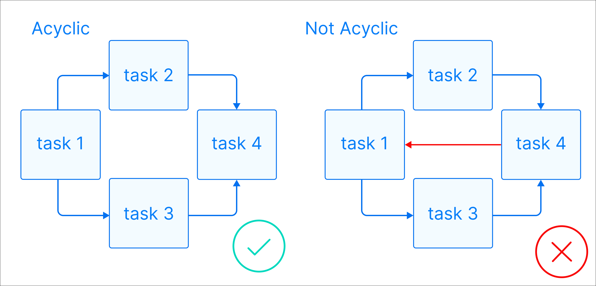
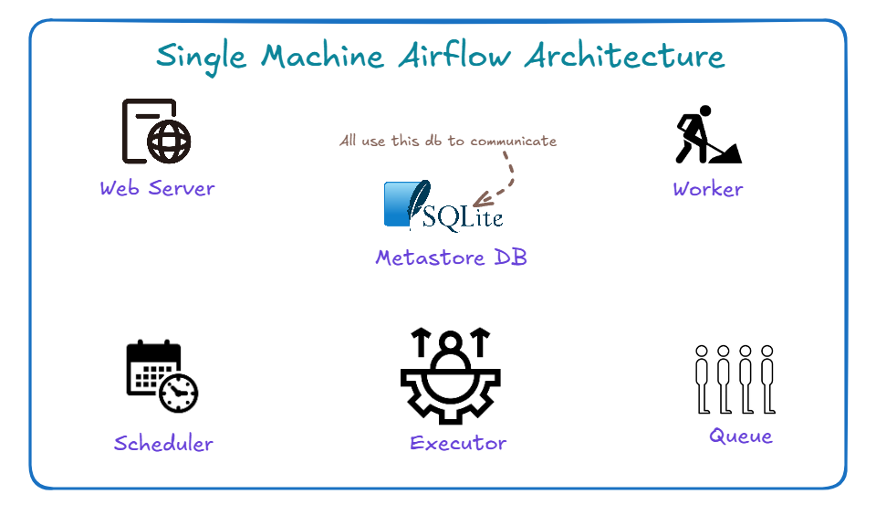

## What is Airflow(AirBnB + Workflow)?

Open source **linux-based** workflow engine. Its essentially a job scheduler. But, a very complex job scheduler. The main idea behind Airflow is defining a workflow using a DAG.

> Airflow is Linux Only. Even though its not clear. They say you can install it on windows. But, behidn the scenes you need to activate linux kernel.
> It is built on Python. meaning, it uses a lot of services that are cread in python.
> Its a workflow engine service
> It includes a web server to include a web app UI
> It uses Python libraries to do your work.

Airflow - a birds eye view

Airflow Concepts

https://www.youtube.com/watch?v=lVS6lz5wuH4

## Airflow core components

The web server: This provides the main web interface for Airflow.
Scheduler: It schedules the tasks.
Meta Database: Stores information about the tasks and their status etc.
Trigger: It triggers tasks
Executor: How and which syste, to execute the tasks. Doesn't run tasks.
Queue: List of tasks waiting to be executed
Worker: Is the process that actually performs the tasks.

## Airflow Core concepts

DAG: This is the workflow. This is the data pipeline. Dags never contain a loop. It has to be acyclic. No cycles in Dag.

Operator: Opertor is a task.
operator. Airflow has thousands of operators. Like Python opereator to operation python code.

How to find operators: Go to astronomer registry.

Tasks/Task Instance: Task is a specific instance of an operator. Actual units of work that gets executed.
Workflow: The entire process defined by the DAG. The "DAG is the workflow"

## What Airflow is not

Its not a data processing freamework. It can't process large data itself.
Its not a real-time streming framework. Use Kafka for that
Its not a data storage system. While it uses some databse for its own work. But, its not a data stroage system

Where airflow might not be a a best solution:

If you want to scheudule something every second. High-frequency scheduling is not good.
When you want to process large datasets **directly**. Want to process terabytes  of data directly. Airflow  isn't the tool. If you want to do such a thing. Trigger a spark job from Airflow. Let spark do that work. But, you can still process some data in Airlflow. Don't take it as a replacment for Spark.
Airflow can't process for real-time data processing. Use Kafka insted.
For simple workflow Airflow is an overkill. Use other systems for that. Like, ADF, cron jobs, Power Automate etc.

## Architectures to learn Airflow

Single-node architecture: All airflow of airlflow runs on one machine.

The single node is great for smaller workflow and getting started.

Multi-Node Airflow Architecture

