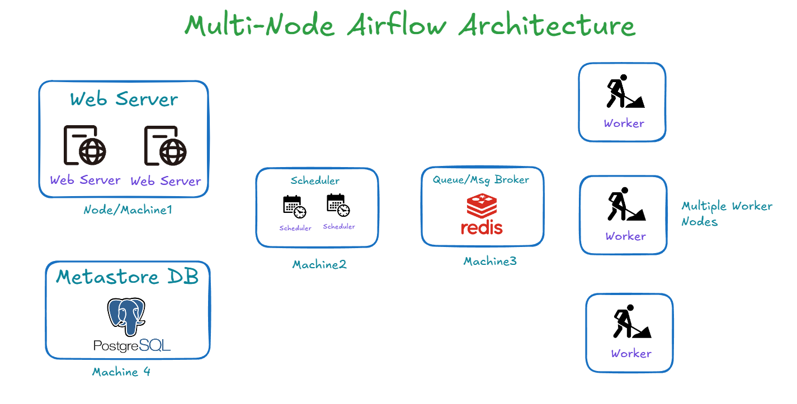

## What is Airflow?

Airflow, short for Air(Bnb)(Work)flow, is an open-source **Linux-based** platform to build, schedule, and monitor workflows. It’s mainly used for data-related (ETL) workflows. The main strength of Airflow is that using it you can create **workflows as code**.

**Remember:** 
- **Airflow is for Linux.** It is meant for Linux ONLY. You might find some installation method to prove otherwise, but behind the scenes, there will always be a Linux kernel, Docker container, WSL, or something similar. And since most servers run on Linux, why bother trying to run workflows on Windows? 
- **Built on Python:** In Airflow, Python is everywhere.

## Airflow Core Components

- **Web Server:** Provides the primary web interface for interacting with Airflow.
- **Scheduler:** Responsible for scheduling tasks.
- **Meta Database:** Stores information about tasks, their status, and other metadata.
- **Trigger:** Initiates tasks based on predefined conditions.
- **Executor:** Determines how and where tasks will be executed but doesn’t run the tasks itself.
- **Queue:** A list of tasks waiting to be executed.
- **Worker:** The process that actually performs the tasks.

To get a quick understanding of Airflow's concepts, you might want to check out this [video](https://www.youtube.com/watch?v=lVS6lz5wuH4).

## Airflow Core Concepts

- **DAG (Directed Acyclic Graph):** This is the core of your workflow. A DAG is essentially a data pipeline and must be acyclic, meaning it cannot contain any loops.  

    

    

- **Operator:** An operator represents a task. Airflow offers a wide variety of operators, including those for Python to execute Python code.
- **Finding Operators:** To explore available operators, visit the Astronomer Registry.
- **Tasks/Task Instance:** A task is a specific instance of an operator, representing the actual unit of work that gets executed.
- **Workflow:** The entire process defined by the DAG. Essentially, the "DAG is the workflow."

## What Airflow is Not

- **Not a Data Processing Framework:** Airflow can't process large volumes of data by itself.
- **Not a Real-Time Streaming Framework:** For real-time streaming, tools like Kafka are more appropriate.
- **Not a Data Storage System:** Although Airflow uses databases for its operations, it is not meant for data storage.

### When Airflow Might Not Be the Best Solution:

- **High-Frequency Scheduling:** If you need to schedule tasks every second, Airflow may not be suitable.
- **Large Data Processing:** Airflow is not designed to process large datasets directly. If you need to handle terabytes of data, it’s better to trigger a Spark job from Airflow and let Spark do the heavy lifting.
- **Real-Time Data Processing:** Airflow is not ideal for real-time data processing; Kafka would be a better option.
- **Simple Workflows:** For straightforward workflows, Airflow might be overkill. Alternatives like ADF, cron jobs, or Power Automate may be more appropriate.

## Different type of Airflow Setup

### Single-Node Architecture

In a single-node setup, all components of Airflow run on one machine.  

This architecture is ideal for smaller workflows and getting started with Airflow.

### Multi-Node Airflow Architecture

As your workflows grow, you might consider a multi-node architecture for better scalability and performance.  

