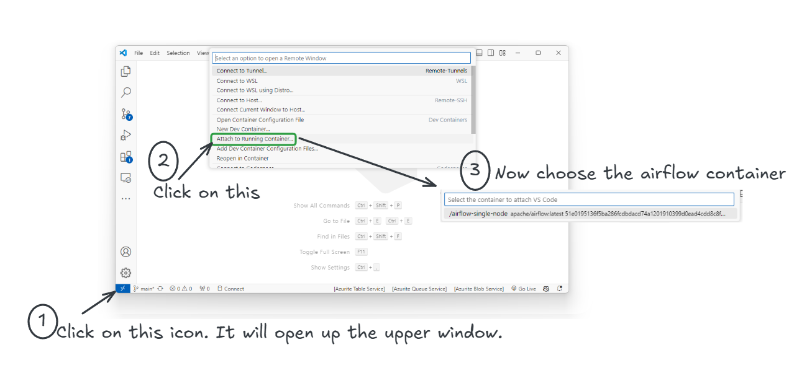

# <span style="color: #00796B; font-family: Segoe UI, sans-serif;">Overview

In this guide, I'll show you how to get started with Airflow using just a few simple commands, so you can quickly begin developing your own workflows.

I have used the following setup:

1. A Windows laptop
2. Docker Desktop installed
3. Visual Studio Code
4. VS Code **Remote Development** pack - This lets you connect to the container and develop code locally.


## <span style="color: #00574F; font-family: Segoe UI, sans-serif;">1. **Create the Airflow Container**
### <span style="color: #003366;font-family: Segoe UI, sans-serif;">Download Airflow Docker Image</span>
Run the following command in your command prompt or power shell to pull the latest Airflow Docker image: `docker pull apache/airflow:latest`

### <span style="color: #003366;font-family: Segoe UI, sans-serif;">Create a Docker Volume</span>
Execute this command to create a Docker volume named `airflow-volume` for data persistence: `docker volume create airflow-volume`

### <span style="color: #003366;font-family: Segoe UI, sans-serif;">Initialize Airflow Database</span>
Initialize the Airflow database using the following two commands:
```bash
docker run --rm --network dasnet -v airflow-volume:/opt/airflow apache/airflow:latest db init
```
```bash
docker run --rm --network dasnet -v airflow-volume:/opt/airflow apache/airflow:latest users create  --username airflow  --firstname FIRST_NAME  --lastname LAST_NAME   --role Admin   --email admin@example.com   --password airflow
```
> Note: I use a network dasnet. Hence --network part. You can totally remove the --network.

### <span style="color: #003366;font-family: Segoe UI, sans-serif;">Start the Airflow Webserver</span>
To start the Airflow webserver, use this command:

```bash
docker run -d --name airflow --network dasnet -p 8080:8080 -e AIRFLOW_UID=50000 -v airflow-volume:/opt/airflow apache/airflow:latest webserver
```

> Note: I use a network `dasnet`, which is why I added the `--network` part. You can skip the `--network` if you don’t need it. Also, 8080 is a very common port. If it clashes with any other apps on your laptop, you can change it to something like 8084:8084 or any other random number that might not cause a conflict.

## <span style="color: #00574F; font-family: Segoe UI, sans-serif;">2. **Connect to Your Container from VS Code**
   After creating the container, connect to it using Visual Studio Code:

   - Open VS Code and click on the "Remote Explorer" icon on the left sidebar.
   - Click on the **Remote Development** icon (usually in the bottom left corner).
   - Select the Airflow container from the list to connect.

   


## <span style="color: #00574F; font-family: Segoe UI, sans-serif;">3. **Create the `hello_world.py` Script**</span>
   Now, let’s create your first DAG inside the container:

   - In VS Code, go to **File** > **New File**.
   - Select **Python** as the file type.
   - Navigate to the `/opt/airflow/dags` directory.
   - Name the file `hello_world.py`.

   


   - Paste the following code into the file and save it:

        ```python
        # Contact: das.d@hotmail.com
        # Import these two modules from Airflow and Python standard libs
        from airflow import DAG  # DAG module to create a Directed Acyclic Graph (DAG) for Airflow
        from airflow.operators.python_operator import PythonOperator  # PythonOperator to define tasks using Python functions
        from datetime import datetime  # datetime module - standard datetime work in python

        # Define a simple Python function that prints 'Hello World'
        def print_hello():
            print('Hello World')

        # Set default arguments for the DAG
        default_args = {
            'owner': 'airflow',  # The owner of the DAG, usually the person or team responsible for it. For our container all users are 'airflow'
            'depends_on_past': False,  # Whether this task should depend on previous runs (set to False to avoid dependencies)
            'start_date': datetime(2023, 1, 1),  # The start date for the DAG's first run
            'retries': 1,  # Number of retries in case of task failure
        }

        # Instantiate the DAG
        dag = DAG(
            'hello_world',  # Unique identifier for the DAG
            default_args=default_args,  # Use the default arguments defined above
            description='A simple hello world DAG',  # Some description
            schedule_interval='@daily',  # Define the schedule for the DAG (runs daily)
        )

        # Define a task using PythonOperator
        t1 = PythonOperator(
            task_id='print_hello',  # Unique identifier for this task
            python_callable=print_hello,  # The Python function to be executed by this task
            dag=dag,  # The DAG to which this task belongs
        )

        # All done - The DAG and task are now defined, and Airflow will take care of scheduling and running the task
        ```


## <span style="color: #00574F; font-family: Segoe UI, sans-serif;">4. **Start the Airflow Scheduler**</span>
   To run your DAG, you need to start the Airflow scheduler:

   - Open the terminal in VS Code (which is already connected to the container).
   - Run the following command:

     ```bash
     airflow scheduler
     ```

   


   The scheduler will start, and it will pick up your `hello_world` DAG to run it according to the schedule you've set (daily in this case).

