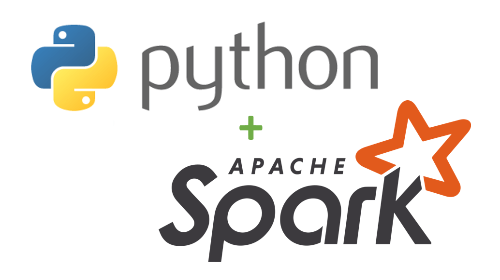

Understanding different types of data and the operations performed on them is crucial in the world of data. Various programming languages are commonly used for handling this data. The table below explains the types of data, key operations, and the languages used.

| **Category**             | **Definition**                                                                                     | **Details**                                                                                                                                                                      |
|--------------------------|---------------------------------------------------------------------------------------------------|----------------------------------------------------------------------------------------------------------------------------------------------------------------------------------|
| **Types of Data**        | **Structured**          | Data in table format with rows and columns. Sources include SQL Server or files like .csv and Excel.                                       |
|                          | **Semi-structured**     | Data with some structure but not like a table, e.g., JSON files. Needs adjustments to become structured.                                    |
|                          | **Unstructured**        | Data without a specific format, like PDF files.                                                                                         |
| **Data Operations**      | **Data Integration**    | Connecting different data sources. The first step to link different data sources.                                                      |
|                          | **Data Transformation** | Cleaning and organizing data to make it ready for use. Involves cleaning, sorting, and aligning data.                                       |
|                          | **Data Consolidation**  | Combining data from multiple sources into one place to avoid silos.                                                                     |
| **Languages Used**       | **SQL**                 | The main language for data tasks. Widely used for all data-related work.                                                                              |
|                          | **Python**              | A popular language with many libraries for data work. Very useful for data operations.                                                               |
|                          | **Others**              | Languages like Scala, R, .NET, and more, used for various data tasks.                                                                                                       |
| **Types of Data**        |                                                                                                    |
| Operational Data         | Fresh data from operations, stored in SQL DB (e.g., Amazon daily sales).                                                                  |
| Analytical Data          | Cleaned data for reports, usually in a warehouse. Data engineers convert operational data to analytical data.                                 |
| **Data Pipelines**       | Workflows to ingest, transform, and export data.                                                                                          |
| **Data Lake**            | A large, unstructured data store holding petabytes of data. Data begins its journey here. Unlike warehouses, it’s a 'dumping ground'.                             |
| Brands                   | Azure Data Lake Storage G2, Databricks DataLake, Snowflake, Amazon S3/Lakeformation, Google Biglake, Dermio Lakehouse, Starbrust Data Lakehouse, Cloudera Data Platform, Teradata Vantage Cloud, Oracle Cloud Infra, Vertica Unified Analytics Platform |
| **Data Warehouse**       | Structured data storage with disciplined, large capacity. Like the sun compared to the earth (SQL server).                            |
| Brands                   | Azure Synapse, Snowflake, Google BigQuery, Amazon Redshift, IBM Db2 Warehouse, Firebolt                                                                                       |
| **Apache Spark**         | - Open-source big data engine.                                                                                       |
|                          | - Handles batch and real-time processing.                                                                            |
|                          | - Started at UC Berkeley in 2009.                                                                                    |
|                          | - Enhances Hadoop for interactive queries and streaming.                                                             |
|                          | - Supports Java, Scala, Python, and R.                                                                               |
|                          | - Includes libraries for machine learning, stream, and graph processing.                                             |
|                          | - Core handles task distribution, scheduling, and I/O.                                                               |
|                          | - Uses RDD for easy data handling.                                                                                   |
|                          | - Efficiently processes data across server clusters.                                                                 |

**Main Tools for Azure Data Engineering:**
- Azure Synapse Analytics
- Azure Data Lake Storage Gen2
- Azure Stream Analytics
- Azure Data Factory
- Azure Databricks

**Things to Remember:**
- Data in a relational database is ALWAYS structured.
- In a data lake, data is stored as files.

**Quiz:**
Which Azure service provides capabilities for running data pipelines AND managing analytical data in a data lake or relational data warehouse?

**Answer**: Azure Synapse Analytics.