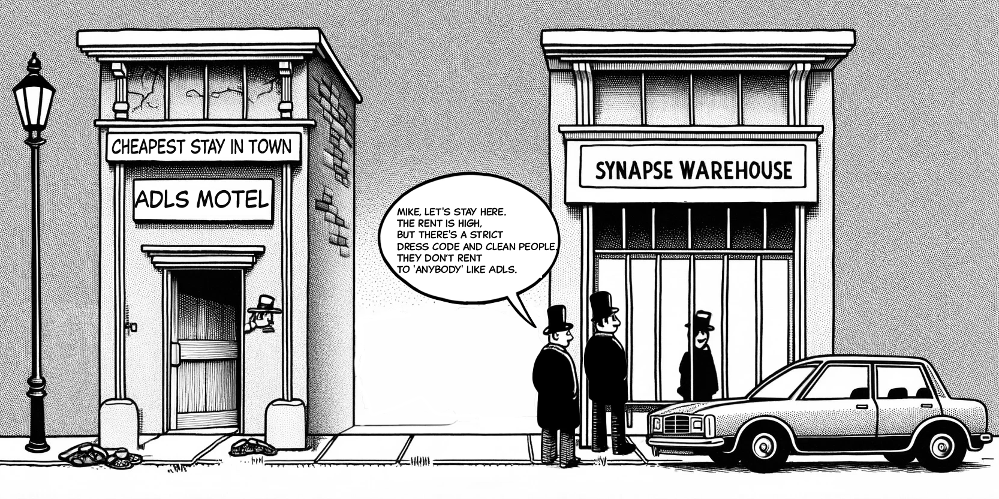

- [Data Lake? What is it. How different it is from a Data warehouse?](#data-lake-what-is-it-how-different-it-is-from-a-data-warehouse)
  - [Azure Data Lake](#azure-data-lake)
  - [Key Features](#key-features)
  - [Tip](#tip)
  - [Technical Definition](#technical-definition)
- [How is Azure Data Lake Used?](#how-is-azure-data-lake-used)
  - [Data Warehouse](#data-warehouse)
  - [Real-time Data Analytics](#real-time-data-analytics)
  - [Data Science and Machine Learning](#data-science-and-machine-learning)
  - [Quiz](#quiz)
- [How to Upload Data to ADLS?](#how-to-upload-data-to-adls)
- [How to Make Your Data Secure in ADLS?](#how-to-make-your-data-secure-in-adls)
  - [RBAC (Role-Based Access Control)](#rbac-role-based-access-control)
  - [Auditing Access](#auditing-access)
- [Storage Account Keys](#storage-account-keys)
  - [VIP Keys](#vip-keys)
  - [Shared Access Signature (SAS) Keys](#shared-access-signature-sas-keys)
  - [Network Access](#network-access)
  - [Enable Microsoft Defender for Storage](#enable-microsoft-defender-for-storage)
  - [Examples](#examples)

## Data Lake? What is it. How different it is from a Data warehouse?

A data lake is like a huge storehouse where you keep data in its original form. It's like your laptop's hard drive. You can store any file in any format. The difference is that your laptop's hard drive can break, and you may lose data, and it can hold at most 1 TB or 2 TB. But a data lake is similar but much more. It doesn't break, has huge storage capacity, and has more data passage speed. It also *plugs in* well with applications like Spark, Power BI, and others.

Data warehouse? If SQL Server is a planet, a data warehouse is the entire galaxy or universe. It may have huge storage, but it doesn't let just any data come and stay. Data has to be tables like SQL server.

### Azure Data Lake

Azure Data Lake is Microsoft’s data lake. It works like a sophisticated file system, capable of storing exabytes of data with throughput in gigabytes. It connects well with analytical tools and can handle real-time and batch data. It’s essentially an advanced version of Azure Blob Storage.

Data stored in Azure Data Lake is treated as if it’s stored in Hadoop, which is important in big data technology. This allows you to use tools like Azure Databricks, Azure HDInsight, and Synapse Analytics.

The Gen2 version of Azure Data Lake can store files in subfolders, making it even more powerful. You need to enable this feature during creation, but you can also upgrade from Gen1 to Gen2.

### Key Features

1. **Subfolders:** Unlike Azure Blob Storage, which is flat, Azure Data Lake Gen2 supports subfolders, helping you organize better.
2. **Batch Deletion:** You can delete multiple subfolders in one operation, unlike the flat file system where each deletion is a separate operation.

### Tip

If you don’t need sorting or analysis, don’t enable the hierarchical namespace. If you do, make sure to enable it.

### Technical Definition

Azure Data Lake Storage (ADLS) is an HDFS-compatible file system hosted in Azure Storage.

## How is Azure Data Lake Used?

### Data Warehouse

Operational data from Azure SQL DB or Azure Cosmos DB is staged in ADLS for cleaning and preparation before moving to a data warehouse.

### Real-time Data Analytics

Real-time data analytics is useful for things like election news and Twitter trends. Azure Stream Analytics can create jobs to process and analyze this data in real time, writing results to ADLS.

### Data Science and Machine Learning

ADLS stores the vast amounts of data needed for machine learning processes.

### Quiz

What option must you enable to use Azure Data Lake Storage Gen2?
- **Answer:** Hierarchical namespace.

## How to Upload Data to ADLS?

- Use the standard upload method.
- Use Azure Storage Explorer.
- Use the Copy Data tool.
- Use the .NET/Python SDK.
- Use Azure PowerShell.
- Use the REST API.

Remember, ADLS is not free. Create a storage account to get started and enable the hierarchical namespace.

## How to Make Your Data Secure in ADLS?

- **At Rest:** All data is encrypted by Storage Service Encryption.
- **In Transit:** Enable transport-level security and enforce HTTPS.
- **CORS Support:** Optionally enable CORS on storage accounts to add appropriate headers for HTTP GET requests.

### RBAC (Role-Based Access Control)

Assign RBAC roles to security principals or managed identities at various scopes like subscription, resource group, storage account, or individual container.

### Auditing Access

Use the built-in Storage Analytics service to audit Azure Storage access.

## Storage Account Keys

### VIP Keys

Every storage account has a primary and secondary key, providing full access to the account. Access these keys under storage account settings -> Security + networking -> Access keys.

### Shared Access Signature (SAS) Keys

SAS tokens are less powerful than storage account keys but still provide significant access, either at the storage account level or for specific operations.

### Network Access

Configure which networks can access your storage account. You can restrict access to your organization or allow the entire internet to access it.

### Enable Microsoft Defender for Storage

Just like Microsoft Defender Antivirus for Windows, you can enable Microsoft Defender for your storage account to detect anomalies and potential threats.

### Examples

1. **Project with a Third-Party Vendor:** Use a shared access signature to provide time-bound access to image assets in an Azure Storage account.
2. **Default Network Rule:** The default rule is to allow all connections from all networks.
3. **Detecting Anomalies:** Microsoft Defender for Storage detects anomalies in account activities and notifies you of potential threats.