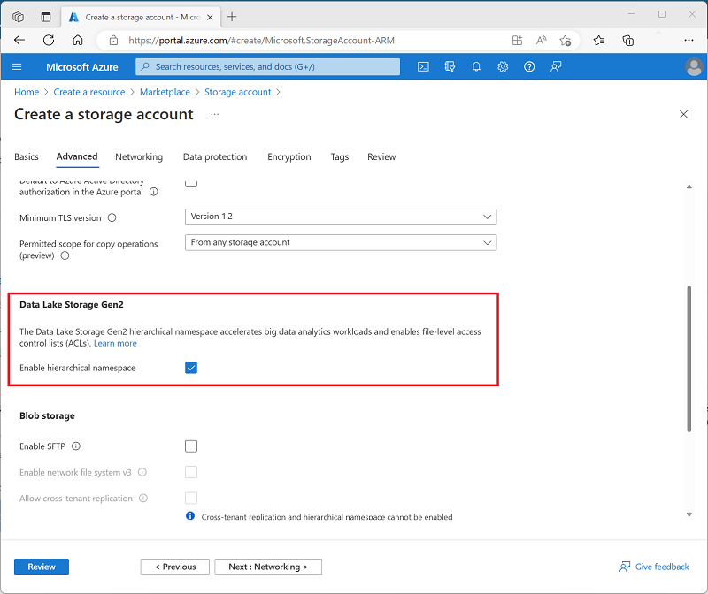
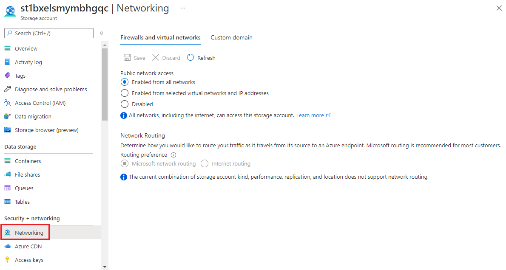

## Data Lake. What is it?

A data lake is like a big storehouse where data is kept in its natural format, no format, no structure, any file. This makes it differnt from a data warehouse. In warehouse only the clenest, tidiest, formattest data is allowed in. In data lake it can be a bit messy.

Azure Data Lake is the Data Lake for Microsoft. Its works like a hi-fi file system. Meaning, it stores exabytes  of data, the throghput is in Gigabytes, it connects amazingly with analytiacal tools, can handle real-time ingestion, can handle batch-data as well. Behidn the scene is actually evolved Azure blob storage.

Also, data stored in Azure Data Lake is treated as if it's stored in a system called Hadoop, which is a big deal in the world of big data technology. This means you can use other fancy tools like Azure Databricks, Azure HDInsight, and Synapse Analytics.

And now the Gen2 version also is capable of keeping files in subfolders. That  makes it even more powerful. Right now if you want to have this feature you have to enable it during the creation. Also you can upgrade your G1 to G2.

I said, its an evolved versionn of Azure blob storage. Whats the main storage. In blob, everything is on the same plane. No subfolders. In ADLS G2 you can have subfolders.

Subfolders are great, they  let you sort more. Anything else? Yes, say you have hundredes of subfolders inside a parent folder. With just one click(operation) you can delete 'em all. For flat file system, you will have to have hundres of operation to delete them.

Tip: You dont want any  sorting.  You dont want to analyze the data. Don't enable Hierarchical namespce. But, you want to do anaysis enable it. 

Technical  definition: ADLS is an HDFS-compatible **file system** hosted in Azure Storage.

## How is Azure Data Lake Used?

### Data warehouse

Typically here operational data is stored in Azure SQL DB or Azure Cosmos DB. From there data is 'staged' on to ADLS. Here it is cleaned and made reporty-friendly and then pushed to a Warehouse.

### Real-time  data analytics

Nowadays  real-time  data analytics is in. Election news, twitter trends etc all real time stuff. In real-time processing, real-time data is.

Example: How many message were generated in every five minutes with a hashtag - live reporting. Here a stream of data is collected and summed(to  make it simple) over five minutes(to make it simple)

Azure stream analytics can create jobs that can sum up that live streamed data as it arrives and write the results to azure data lake.

## Data sciene  and machine leanring

Machine learning processes humoungous amount of data. And that data can be stored in ADLS.

Quiz:

What option must you enable to use Azure Data Lake Storage Gen2? 

Answer: Hierarchical namespace.

## How to upload data to ADLS?

Just use plain simple upload method which you use on a daily basis to upload any file to web.
Use Azure storage explorer
The Copy Data tool
The .NET/Python SDK
Azure PowerShell
The REST API

Note: Everything runs on money. So, ADLS is not free. To let Microsoft charge you have to create a storage account before you start using ADLS.

Remember to enable Hierarchical namespace!

## How to make your data secure in ADLS?

When  the data is sitting: All data is automatically encrypted by Storage Service Encryptioin.
Encryption on the go: Here data is made secure by enabling transoport-level security. Remember to enforce Https.
CORS supprot:  CORS support is an optional flag you can enable on Storage accounts. The flag adds the appropriate headers when you use HTTP GET requests to retrieve resources from the Storage account.

RBAC: You can assign RBAC roles to a security principal or a managed identity for Azure resources that are scoped to a subscription, a resource group, a storage account, or an individual container or queue.

## Auditing access: 
You can audit Azure Storage access by using the built-in Storage Analytics service.

## Let's explore storage account keys

Storage account can be accessed by  a user or an app. 

### Storage account keys - VIP + Most powerful keys
Every storage account has a primary and secondary(backup) keys. If you have them you have access to everything. It's that VIP keys.

To access it storage account-> Security + networking > Access keys.

### Shared Access  Signature keys

You can't share your super-powerful storage account keys. Hence, azure provides SAS tokens. You can have storage-account level SAS. Its as powerful as the storage account keys. Or you can provide a key to a specific operation or ability.

### From which all network will you let users access your storage account?

You can restrict network from which your stroage account can be acccessed. Say, you want the entire inetrnet to access it. Or you want your own organization to acccess it. It all can be configured.

### Enable Microsoft Defender for Storage.

You must have heard about Microsoft Defender Antivirus for your windows. Now, you can enable this for your storage account as well.

Examples:

1. You are working on a project with a 3rd party vendor to build a website for a customer. The image assets that will be used on the website are stored in an Azure Storage account that is held in your subscription. You want to give read access to this data for a limited period of time. What security option would be the best option to use? 

Answer: A shared access signature is a string that contains a security token that can be attached to a URI. Use a SAS to provide time-bound and read/write/read-write/contribute etc permission to your storage account.

2. When configuring network access to your Azure Storage Account, what is the default network rule? 

To allow all connections from all networks
To allow all connection from a private IP address range
To deny all connections from all networks

Answer: The default network rule is to allow all connections from all networks.

3. Which Azure service detects anomalies in account activities and notifies you of potential harmful attempts to access your account? 

Answer: Microsoft Defender for Storage detects anomalies in account activity. It then notifies you of potentially harmful attempts to access your account.
