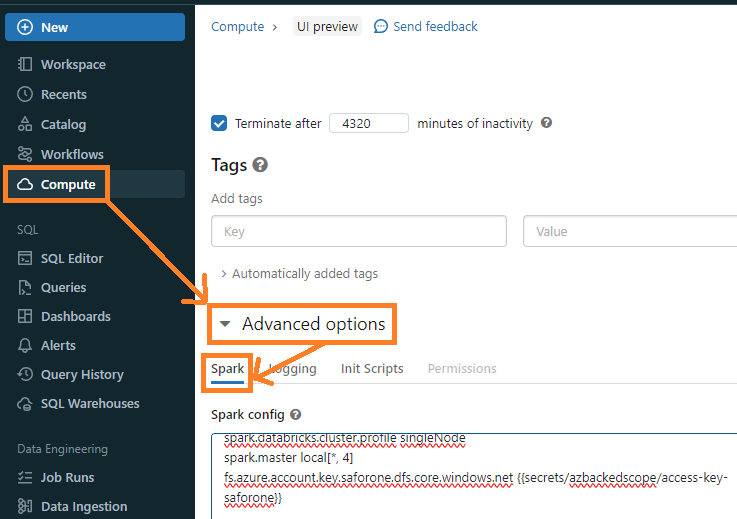

---

### Accessing ADLS from Databricks Using Access Key Authentication

Azure Data Lake Storage (ADLS) offers several authentication methods, including access keys, Shared Access Signature (SAS) tokens, and OAuth. In this article, we'll focus on how Databricks chooses the access key authentication method when accessing ADLS and how to set it up.

#### Setting up the Access Key in Databricks Cluster Configuration:

1. Navigate to the Databricks workspace, select **compute**, then **Advanced options**, and choose **spark config**.
2. Inside the **Spark Config** section, input the following line: 
```
fs.azure.account.key.<STORAGE_ACCOUNT_NAME>.dfs.core.windows.net {{secrets/<SECRET_SCOPE>/<SECRET_KEY_NAME_NOT_VALUE>}}
```
Replace `<STORAGE_ACCOUNT_NAME>`, `<SECRET_SCOPE>`, and `<SECRET_KEY_NAME_NOT_VALUE>` with your specific values.

This configuration provides Databricks the access key required to authenticate with ADLS.



#### Accessing ADLS in a Databricks Notebook:

Once the cluster configuration is set up, you can access ADLS in your notebook without any additional authentication steps. Here's a simple example:

```python
storageAccountName = "saforone"
containerName = "demo"
filename = "circuits.csv"

adls_path = f"abfss://{containerName}@{storageAccountName}.dfs.core.windows.net/"
df = spark.read.csv(adls_path + filename)
df.show()
```

#### How Databricks Chooses the Authentication Method:
<p style="font-family: 'Roboto', sans-serif;">
When Databricks encounters a configuration related to an authentication method for ADLS, it uses that method. In our case, by providing the access key configuration, we're explicitly instructing Databricks to use the access key authentication method.

The specific configuration property set in Databricks instructs which authorization method should be used. For instance:

By setting spark.hadoop.fs.azure.account.key.<storage-account-name>.dfs.core.windows.net, Databricks is directed to use Shared Key authorization.
Alternatively, using spark.hadoop.fs.azure.sas.<container-name>.<storage-account-name>.blob.core.windows.net indicates the preference for SAS token authentication.
</p>

### Conclusion:

When we set properties like `account key` or `sas` in the cluster configurations, Databricks knows exactly which authentication method to use for ADLS access. It's as straightforward as that - choose the right property, and Databricks handles the rest!

---