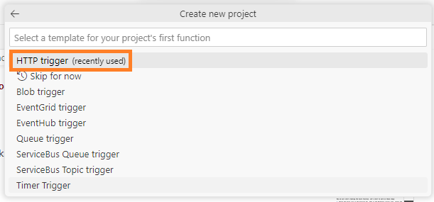
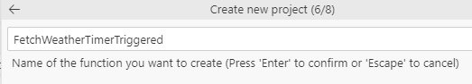
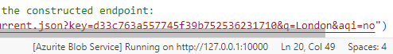
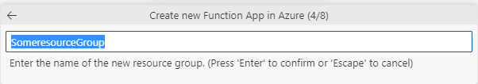
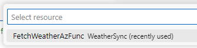

## Table of Contents
- [Azure Functions Quickstart - Create, Debug, Deploy, Monitor](#azure-functions-quickstart---create-debug-deploy-monitor)
  - [Create](#create)
    - [Create the Azure Function Project](#create-the-azure-function-project)
    - [Add Python packages to `requirements.txt`](#add-python-packages-to-requirementstxt)
  - [Debug](#debug)
    - [Test/Debug the Azure Function](#testdebug-the-azure-function)
  - [Deploy](#deploy)
    - [Create an Azure Function App](#create-an-azure-function-app)
    - [Deploy the Azure Function To The Azure Function App](#deploy-the-azure-function-to-the-azure-function-app)
  - [Monitor](#monitor)
    - [Monitor the function post deployment](#monitor-the-function-post-deployment)
  - [Appendix](#appendix)
    - [Key takeways](#key-takeways)
    - [When to choose Azure Functions](#when-to-choose-azure-functions)
      - [Advantages:](#advantages)
      - [Challenges:](#challenges)
    - [Azure Functions: V2 Python Programming Model Vs V1](#azure-functions-v2-python-programming-model-vs-v1)
    - [The folder structure of Azure Functions(V2)](#the-folder-structure-of-azure-functionsv2)
    - [What is this Azurite](#what-is-this-azurite)
    - [What happens during debugging](#what-happens-during-debugging)
      - [Azure Function Core Tools Warms Up](#azure-function-core-tools-warms-up)
      - [User Clicks `Execute Function Now..`](#user-clicks-execute-function-now)
  - [Common Errors](#common-errors)
    - ["AzureWebJobsStorage" app setting is not present](#azurewebjobsstorage-app-setting-is-not-present)

---
<!-- This section is included in nav. See the frontmatter on top! -->


# Azure Functions Quickstart - Create, Debug, Deploy, Monitor

Here, we'll learn quickly about Azure Functions. It's a cloud service by Azure where you can run pieces of code without worry about server and hosting. We'll start by setting up our workspace in VS Code and adding it with essential extensions. Then, we'll test our function. After debugging, we'll deploy it to Azure. Then, we'll monitor its performance. If you want to know more, I've put some essential info in the appendix section.

## Create

Let's start by installing the following three Visual Studio Extensions and One Command Line Tool:

| Extension Name | Why Install? | How to Install? |
|----------------|--------------------------------------------------------|---------------------------|
| [Azure Tools for Visual Studio Code](https://marketplace.visualstudio.com/items?itemName=ms-vscode.vscode-node-azure-pack) |This extension holds a collection of extensions, including the Azure Functions extension. While you can install **just** the **Azure Functions extension** in this 'pack', having the full collection is never bad | `Ctrl+Shift+X`, "Azure Tools for Visual Studio Code", `Install`|
| [Python extension for Visual Studio Code](https://marketplace.visualstudio.com/items?itemName=ms-python.python) | Provides extensive features for Python development, enabling linting, debugging, and IntelliSense for Azure Functions written in Python. |  `Ctrl+Shift+X`, "Python", `Install` |
|[Azurite](https://marketplace.visualstudio.com/items?itemName=Azurite.azurite) | An Azure Storage emulator, crucial for local testing and debugging of Azure Functions. | `Ctrl+Shift+X`, "Azurite", `Install`.  |
|[Azure Functions Core Tools](https://go.microsoft.com/fwlink/?linkid=2174087) | Command-line tools essential for local development and testing of Azure Functions. These tools enable local function runtime, debugging, and deployment capabilities. | Install via npm with the command: `npm install -g azure-functions-core-tools@3 --unsafe-perm true` (for version 3.x) Or using GUI  |

### Create the Azure Function Project

- Open Visual Studio and Click the Azure Icon on the Left
- In the Workspace (local) area, click the thunder button, and select **Create New Project**.

- Choose a folder location for the project

- Select **Python** as the programming language.

- Opt for **Model V2** as the programming model.

- Choose the Python environment. Refer to the Appendix section for more details.
- Select **HTTP trigger**. Refer to the appendix section below for more details.

- Provide a unique name for our function.

- VS Code will generate a complete project structure like shown below

- Write your custom code, say you want to perform some blob operations, in `function_app.py`. This is the main/entry point function to the Fnction app.


### Add Python packages to `requirements.txt`

Add library names of Python packages you imported in your script, like `numpy` , in `requirements.txt`.

- When you start you local debugging VS Code will install the `requirements.txt` packages to your local python virtual enviornment's `.venv`.
  
  
- During actual deployment, VS Code will install the packages to Azure cloud.
## Debug
### Test/Debug the Azure Function

Now, I will show you how to debug the azure function:

- With your function_app.py open press `Ctrl+Shift+P`. Select **Azurite: Start**.

     

    This action starts the Azurite storage Emulator. You can check the status at the bottom right corner of VS Code, where you should see something like this:

     

- Press `F5`. Then, under Workspace **Right-click** the function and select **Execute**.
  

- If the execution is successful, the output will be similar to this:
  
## Deploy
### Create an Azure Function App

Now, our function is ready and we need to deploy it to Azure. To deploy an azure function we need Azure Function App. This is like a container for the function. You can create the Azure Function app from the portal. But, here I will show you how to do it right from VS code.

  - Click the Azure icon, then select the thunder icon in the workspace.
  - Choose `Create Function app in Azure..(Advanced)`.
  
  - Assign a unique name to your function app.
  
  - If you're working on an Azure Function in Python, ensure you set the runtime environment to Python.
  
  - Decide on using an existing resource group or create a new one. Ensure consistency in the chosen region.
  
  - Carefully select the hosting plan. If you're budget-conscious, consider the Consumption-based plan. 
  
  - Allocate a storage account for the Azure Function App. Using separate storage accounts for each function app simplifies the structure.
  
  - Incorporate an Application Insights resource for detailed insights and improved monitoring.

After these steps, your Azure Function App is set up. The next phase involves deploying your Azure Function to this newly created app.

### Deploy the Azure Function To The Azure Function App

- The deployment process is straightforward. In the workspace, click the thunder icon and choose **Deploy to Function App**.
  
- Visual Studio Code will display the Function App where you can deploy our Azure Function. Select the Function App.
   
  
- Click **Deploy**
   
  

  Note: This will overwrite ANY function present in the Azure Func app.
- After successful deployment, you will see output like the following in the console:
  
  
- And you can see the Function inside the Azure Function App:
  
  

## Monitor
### Monitor the function post deployment

- Open the Azure Function in the Azure portal.
  
  

- Go to the "Monitor" section to access detailed information about function invocations.

## Appendix

### Key takeways

- Azure function is different from Azure Function App. Azure Function app is the container which holds Azure Functions.
- Azure functions can be developed using Python V2 Programming model, which uses decorators, lesser files, less-complex folder structure and a function_app.py
- HTTP-triggered functions and Timer-triggered functions are common in Function apps. Timer-triggered function have in-built trigger mechanism.

### When to choose Azure Functions

Imagine you're thinking of using Azure Functions to convert JSON files to Parquet. Should you just use simple Python code in Azure Functions or go for Databricks? Here are some advantages and challenges of Azure Functions to help you decide:

#### Advantages:

- **Auto-scaling**: The function can scale up and down. This means you don't have to worry about resources if the workload increases, and you don't have to be concerned about costs if it decreases.
- **Pay-as-long-as-you-use**: You only pay for the actual time your code runs, making it very cost-efficient.
- **Triggers:** It offers numerous event triggers and has a built-in timer for automatic scheduling.
- **Serverless**:  There's no need to fret about server infrastructure. Just focus on writing the correct code.
- **The V2 programming model** makes it easier and to create Azure functions. See section below.


#### Challenges:
- **Time Limit:** There's a limit to how long Azure Functions can run. If you have a big file or slow processing, it might not finish in time.
   
- **Not for Heavy Work:** Azure Functions is good for small tasks. If you're doing a lot of heavy calculations or have very big files, it might not be the best choice.
   
- **Slow Start:** If your function is not used for a while and then suddenly starts, it might take a bit more time to begin, which can delay your processing.

For tasks that involve heavy data manipulation, transformation, and analysis, Databricks often becomes a preferred choice due to its scale-out architecture, optimized data processing capabilities, advanced dataframe support, built-in data cleansing tools, integrated machine learning libraries, and robust resource management. In contrast, for simpler tasks like just converting files, and when the data volume isn't immense, Azure Functions can offer a speedy and cost-effective approach.

### Azure Functions: V2 Python Programming Model Vs V1

The V2 programming model for Python, gives more Python-centric development experience for Azure Functions. Here are some key points about the V2 model:

- Need fewer files for a function app, so you can have many functions in one file.
- Decorators are used instead of the `function.json` file for triggers and things.
- Blueprints are a new thing in V2. They help group functions in an app.
- With blueprints, functions aren't directly indexed. They need to be registered first.
- All functions go in one `function_app.py` file, no need for many folders.
- No need for the `function.json` file now. Decorators in the `function_app.py` file do the job.

### The folder structure of Azure Functions(V2)

This is how the project folder structure looks like:


Here is what each item means:

<div style="font-family: monospace; font-size: 0.9em; line-height: 1.2;">
    <div><strong>&lt;project_root&gt;/</strong></div>
    <div>│</div>
    <div>├── 📁 <strong style="color:blue">.venv/</strong> - <span style="color:grey;">(Optional)  Python virtual environment.</span></div>
    <div>│</div>
    <div>├── 🛠 <strong style="color:darkgreen">.venv/pyvenv.cfg</strong> - <span style="color:darkblue;">Local python, version, command.</span></div>
    <div>│</div>
    <div>├── 📁 <strong style="color:orange">.vscode/</strong> - <span style="color:darkred;">(Optional) VS Code config.</span></div>
    <div>│</div>
    <div>├── 🐍 <strong style="color:teal">function_app.py</strong> - <span style="color:navy;">Default location for functions.</span></div>
    <div>│</div>
    <div>├── 🐍 <strong style="color:purple">additional_functions.py</strong> - <span style="color:brown;">(Optional) Additional functions.</span></div>
    <div>│</div>
    <div>├── 📁 <strong style="color:goldenrod">tests/</strong> - <span style="color:olivedrab;">(Optional) Test cases.</span></div>
    <div>│</div>
    <div>├── 🛠 <strong style="color:maroon">.funcignore</strong> - <span style="color:forestgreen;">(Optional) Declares ignored files.</span></div>
    <div>│</div>
    <div>├── 🌐 <strong style="color:green">host.json</strong> - <span style="color:darkmagenta;"> Configuration options.</span></div>
    <div>│</div>
    <div>├── 🏠 <strong style="color:indigo">local.settings.json</strong> - <span style="color:sienna;"> Local app settings.</span></div>
    <div>│</div>
    <div>├── 📄 <strong style="color:midnightblue">requirements.txt</strong> - <span style="color:crimson;">Python packages for Azure.</span></div>
    <div>│</div>
    <div>└── 🐳 <strong style="color:darkslategray">Dockerfile</strong> - <span style="color:darkcyan;">(Optional)  Custom container.</span></div>
</div>

I will try to modify the section later to give you a better understanding of the project structure.

### What is this Azurite

When you click F5 you will see a message which looks like the one below.  


This is where Azurite comes into play. Azurite is a free tool to mimic Azure Storage on your computer. It helps in testing Azure storage without actually using the real Azure services. It saves money,can work offline, its safe, and quick.

### What happens during debugging

Here are the events that take place when you debug an Azure Function using VS Code:

#### Azure Function Core Tools Warms Up
- The **Azure Functions Core Tools** will set up the libraries mentioned in the `requirements.txt` file to the virtual environment's **.venv\lib\site-packages** using the command:
    ```
    Executing task: .venv\Scripts\python -m pip install -r requirements.txt
    ```
    
- Then the virtual environment is activated with `.venv\Scripts\activate`.
- It starts the debugger using `func host start`
    
- Then it attaches to the Azure Function runtime, loads the Azure Function app and set a breakpoint at the first line of the code.
  - You'll notice two main things in the output:
    -  **Functions:** This lists down all functions in your Azure Function app.
    -  A line like `[2023-10-25T04:16:47.402Z] Host lock lease acquired by instance ID '0000000000000000000000002B26484C'`, tells that the debugger has locked  the Azure Function host. This lock prevents the Azure Function host from being restarted by another process while the debugger is attached.
    

#### User Clicks `Execute Function Now..`
- Now the user right-clicks on the function and clicks `Execute function Now..`. This executes the function.
  
- The rest is stepping through the function and checking if all is working fine. And, finally the debugging completes.


## Common Errors

### "AzureWebJobsStorage" app setting is not present


The "AzureWebJobsStorage" app setting error indicates that our Azure Functions app is missing a crucial configuration related to the storage account connection string. This could also be realted to the following deployment failure message

```bash
12:23:58 PM FetchWeatherAzFunc: Deployment Log file does not exist in /tmp/oryx-build.log
12:23:58 PM FetchWeatherAzFunc: The logfile at /tmp/oryx-build.log is empty. Unable to fetch the summary of build
12:23:58 PM FetchWeatherAzFunc: Deployment Failed. deployer = ms-azuretools-vscode deploymentPath = Functions App ZipDeploy. Extract zip. Remote build.
12:24:00 PM FetchWeatherAzFunc: Deployment failed.
12:35:57 PM FetchWeatherAzFunc: Starting deployment.
```

**To resolve this:**

- **Create or Identify a Storage Account**: If you don't already have an Azure Storage account, create one in the same region as our function app.

- **Get the Storage Account Connection String**: Navigate to the Azure Storage account in the Azure Portal. Under the "Settings" section, click on "Access keys." Here, you'll find two keys (key1 and key2) each with a connection string. You can use either of these connection strings for the next step.

- **Update Function App Settings**:
   - Navigate to our Azure Functions app in the Azure Portal.
   - Under the "Settings" section, click on "Configuration."
   - In the "Application settings" tab, locate or create the `AzureWebJobsStorage` setting.
   - Add the setting:
     - Name: `AzureWebJobsStorage`
     - Value: [our Azure Storage Account connection string from step 2]
   - Click "OK" or "Save" to add the setting and save our changes on the main configuration page.

- **Restart our Function App**: After adding the necessary setting, restart our function app for the changes to take effect.
Following these steps will resolve the error related to the "AzureWebJobsStorage" app setting.

---
<!--
Here is a detail of all the files and folders present in a VS Azure Functions Workspace:

<table style="width:100%; border-collapse: collapse;" border="1">
<thead>
<tr style="background-color: #e6f7ff;">
    <th style="padding: 10px; text-align: left;">📂📄Folder/File</th>
    <th style="padding: 10px; text-align: left;">🔍 Description</th>
</tr>
</thead>
<tbody>
<tr style="background-color: #f9f9f9;">
    <td style="padding: 10px;"><strong>Project Root Folder</strong></td>
    <td style="padding: 10px;">Main folder, named after the project. Contains all.</td>
</tr>
<tr>
    <td style="padding: 10px;"><strong>Function Folder</strong></td>
    <td style="padding: 10px;">Named after your function. Holds:<br> • <code>__init__.py</code> - Main function file.<br> • <code>function.json</code> - Configurations.</td>
</tr>
<tr style="background-color: #f9f9f9;">
    <td style="padding: 10px;"><strong>.vscode</strong></td>
    <td style="padding: 10px;">VS Code specific configurations:<br> • <code>settings.json</code><br> • <code>extensions.json</code><br> • <code>launch.json</code></td>
</tr>
<tr>
    <td style="padding: 10px;"><strong>.python_packages</strong></td>
    <td style="padding: 10px;">Stores Python packages. Like <code>node_modules</code> in Node.js.</td>
</tr>
<tr style="background-color: #f9f9f9;">
    <td style="padding: 10px;"><strong>.gitignore</strong></td>
    <td style="padding: 10px;">Tells Git what to exclude.</td>
</tr>
<tr>
    <td style="padding: 10px;"><strong>host.json</strong></td>
    <td style="padding: 10px;">Global configuration affecting all functions.</td>
</tr>
<tr style="background-color: #f9f9f9;">
    <td style="padding: 10px;"><strong>local.settings.json</strong></td>
    <td style="padding: 10px;">Settings for local runs. Includes <code>AzureWebJobsStorage</code> etc.</td>
</tr>
<tr>
    <td style="padding: 10px;"><strong>requirements.txt</strong></td>
    <td style="padding: 10px;">Lists dependencies. Azure uses this for deployments.</td>
</tr>
<tr style="background-color: #f9f9f9;">
    <td style="padding: 10px;"><strong>proxies.json</strong> (optional)</td>
    <td style="padding: 10px;">Configuration for proxies.</td>
</tr>
<tr>
    <td style="padding: 10px;"><strong>.venv</strong></td>
    <td style="padding: 10px;">Virtual environment directory. Contains:<br> • <strong>bin/Scripts</strong><br> • <strong>lib</strong><br> • <strong>include</strong><br> • <strong>share</strong><br> • <strong>pyvenv.cfg</strong></td>
</tr>
<tr style="background-color: #f9f9f9;">
    <td style="padding: 10px;"><strong>pyvenv.cfg</strong></td>
    <td style="padding: 10px;">About the virtual environment. Holds:<br> • <strong>home</strong><br> • <strong>include-system-site-packages</strong><br> • <strong>version</strong></td>
</tr>
</tbody>
</table>
-->

© D Das  
📧 [das.d@hotmail.com](mailto:das.d@hotmail.com) | [ddasdocs@gmail.com](mailto:ddasdocs@gmail.com)