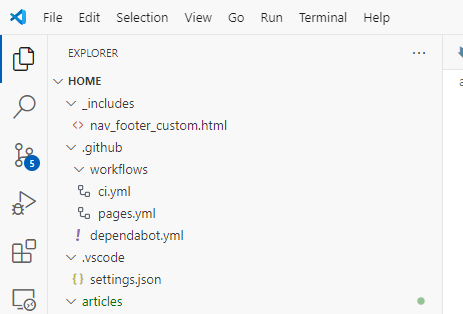

# Learning GitHub Actions
Learn the basics of GitHub Actions, including core concepts and essential terminology.

## I am busy, explain quicly what are Github Actions?

GitHub Actions is a feature provided by GitHub. It is a CI/CD service. Using Github actions you can create workflow which will build, test and deploy your code right from Github. Your workflow can be like, the moment you comit your code changes to your Git repository the workflow will get fired and your code will be deployed to your PROD server.

Alright, but,my code is windows-based and my friend is develops linux apps. I want my code to be built only in Windows. How can we do it using Github Actions?

GitHub provides Linux, Windows, and macOS virtual machines to run your workflows, or you can host your own self-hosted runners in your own data center or cloud infrastructure.

## What are the components of Github action?

Alright, let's first focus on the work that Github actions does. I mean, the Github Action workflow.

You can configure a GitHub Actions workflow to be triggered when an event occurs in your repository, such as a pull request being opened or an issue being created. Your workflow contains one or more jobs which can run in sequential order or in parallel. Each job will run inside its own virtual machine runner, or inside a container, and has one or more steps that either run a script that you define or run an action, which is a reusable extension that can simplify your workflow.

Diagram of an event triggering Runner 1 to run Job 1, which triggers Runner 2 to run Job 2. Each of the jobs is broken into multiple steps.

### Github actions workflow

Workflows are just workflows defined using a YAML file in github.Workflows are defined by a YAML file checked in to your repository and will run when triggered by an event in your repository, or they can be triggered manually, or at a defined schedule.

Workflows are defined in the .github/workflows directory in a repository, 

and a repository can have multiple workflows, each of which can perform a different set of tasks. For example, you can have one workflow to build and test pull requests, another workflow to deploy your application every time a release is created, and still another workflow that adds a label every time someone opens a new issue.

### Events
An event is a specific activity in a repository that triggers a workflow run. For example, an activity can originate from GitHub when someone creates a pull request, opens an issue, or pushes a commit to a repository. You can also trigger a workflow to run on a schedule, by posting to a REST API, or manually.

### Jobs
A job is a set of steps in a workflow that is executed on the same runner. Each step is either a shell script that will be executed, or an action that will be run. Steps are executed in order and are dependent on each other. Since each step is executed on the same runner, you can share data from one step to another. For example, you can have a step that builds your application followed by a step that tests the application that was built.

### Runners
A runner is a server that runs your workflows when they're triggered. Each runner can run a single job at a time. GitHub provides Ubuntu Linux, Microsoft Windows, and macOS runners to run your workflows; each workflow run executes in a fresh, newly-provisioned virtual machine.

# Lets create a small Github workflow

> Remember: GitHub Actions uses YAML syntax to define the workflow. Each workflow is stored as a separate YAML file in your code repository, in a directory named .github/workflows.

[Read More](https://docs.github.com/en/actions/writing-workflows)

[Read More](https://learn.microsoft.com/en-us/training/modules/build-first-bicep-deployment-pipeline-using-github-actions/2-understand-github-actions)