# Installing a Self-Hosted Agent on Local Windows(No Container)

## Download and Configure the Agent

Log on to the machine using the account for which you've prepared permissions.

### Sign In to Azure Pipelines

1. Open your web browser and sign in to [Azure DevOps](https://dev.azure.com/).
2. Navigate to your organization settings: `https://dev.azure.com/{your-org}`.

###  Navigate to Agent Pools

1. Choose **Azure DevOps** > **Organization settings**.
2. Select **Agent pools**.

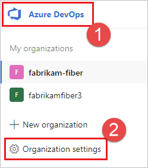

3. Choose the **Agent pools** tab.

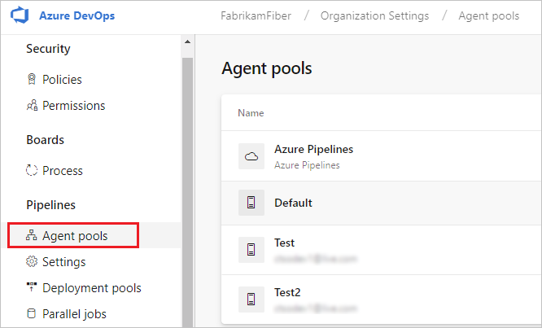

4. Select the **Default pool**, go to the **Agents** tab, and choose **New agent**.

###  Download the Agent

1. In the **Get the agent** dialog box, choose **Windows**.
2. On the left pane, select the processor architecture of your Windows OS (x64 for 64-bit Windows, x86 for 32-bit Windows).
3. On the right pane, click the **Download** button.

### Unpack the Agent

1. Follow the instructions on the page to download the agent.
2. Unpack the agent into a directory without spaces in its path (e.g., `C:\agents`).

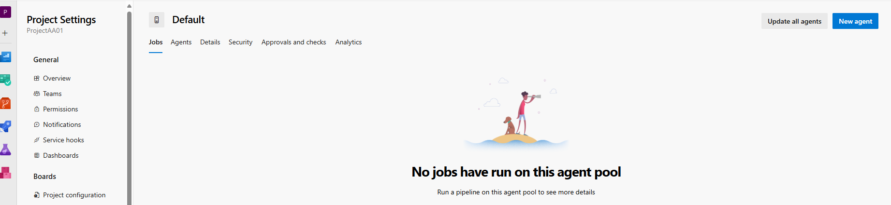

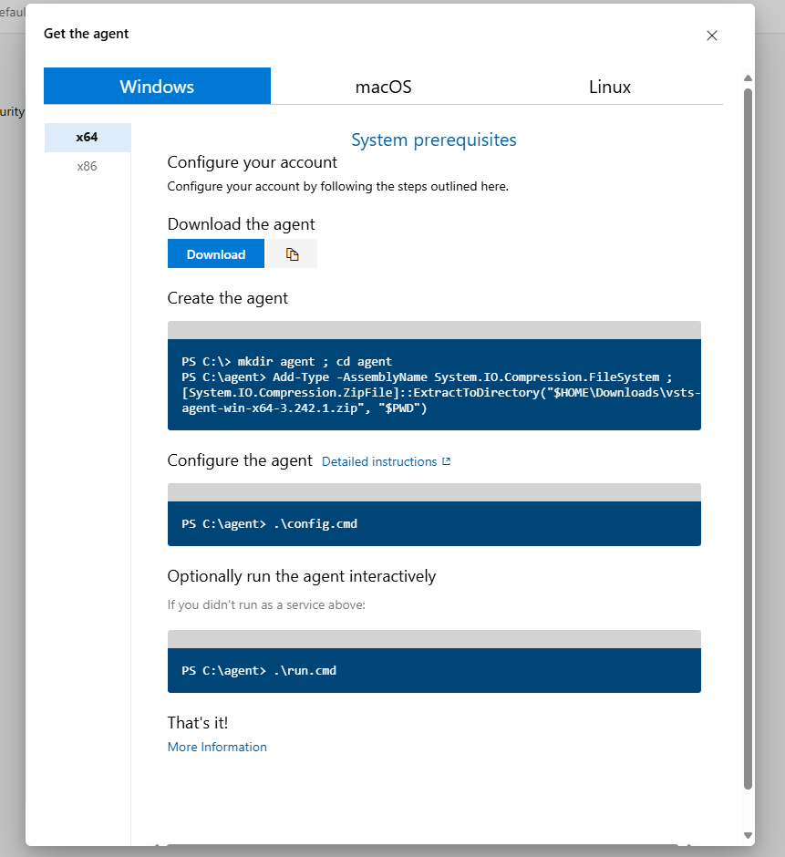

Put the extracted contents directly inside the `C:\agents` folder.

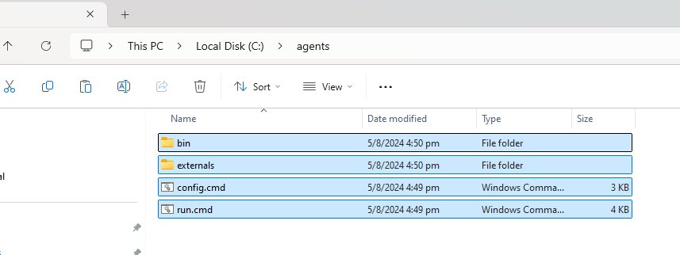

### Configure the Agent

1. Open a Command Prompt in the `C:\agents` directory.
2. Run the `config.cmd` script.
3. When setup asks for your server URL, enter `https://dev.azure.com/{org-Name}` (e.g., `https://dev.azure.com/MOUMITA001/`).
4. Choose **PAT** (Personal Access Token) for authentication and enter your PAT.

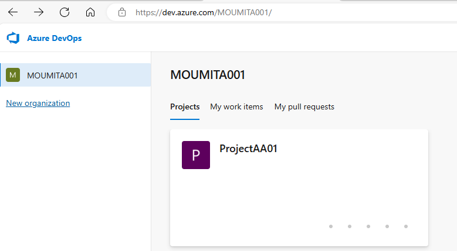

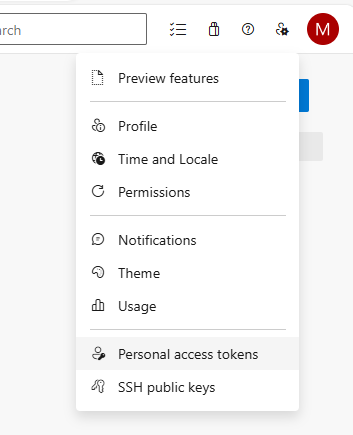

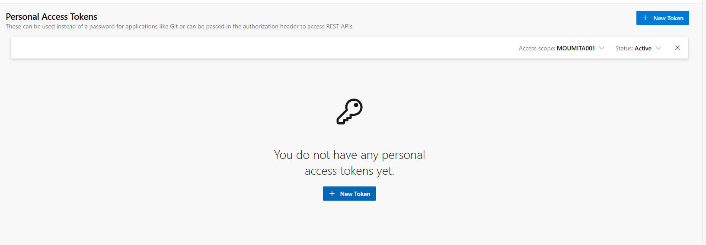

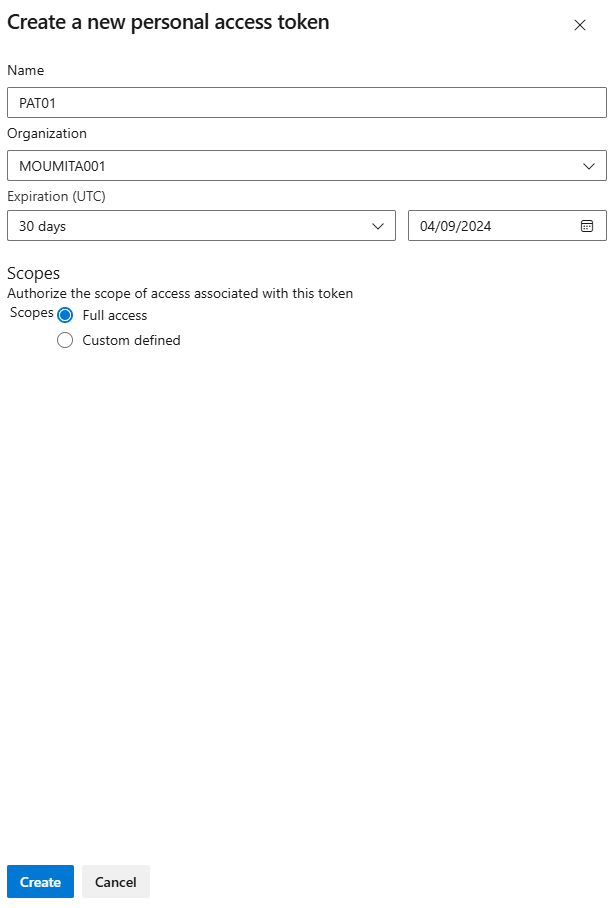

## Starting an Agent

To start the agent, run the `run.cmd` script in the `C:\agents` directory.

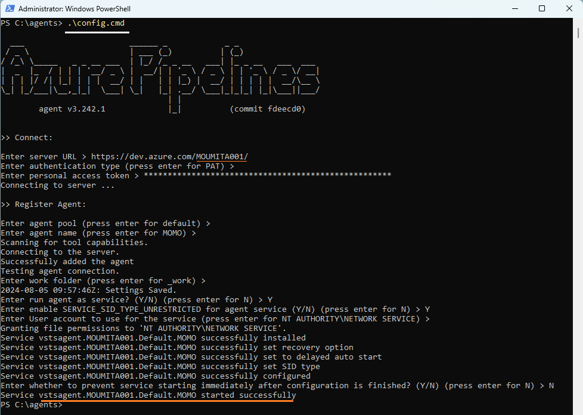

## Removing an Agent

To remove the agent, follow these steps:

1. Stop the agent by closing the Command Prompt window running the agent.
2. Open a new Command Prompt in the `C:\agents` directory.
3. Run the `config.cmd remove` command.

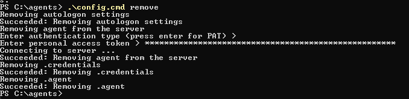

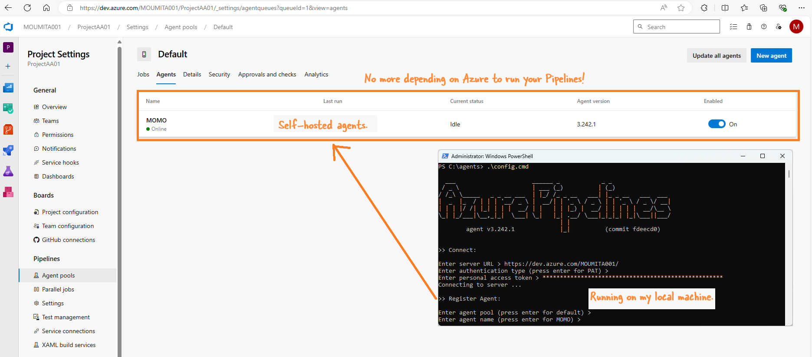

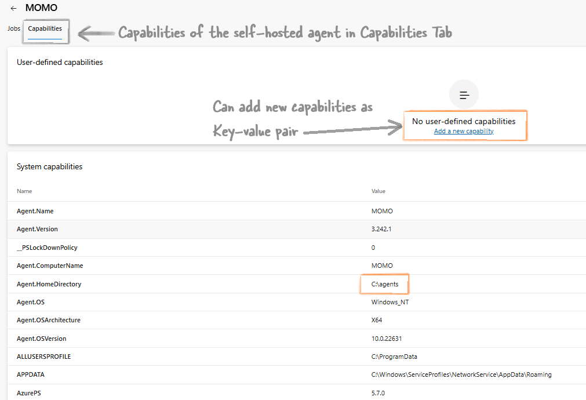
