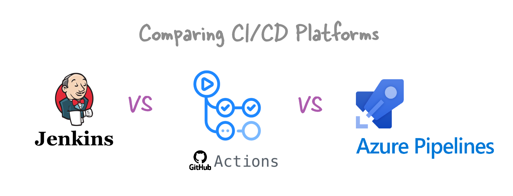

  

    Table of contents
  

  {: .text-delta }
1. TOC
{:toc}

# Jenkins Vs GitHub Vs Azure DevOps

CI/CD tools help automate the process of building, testing, and deploying code. This is super important for big projects with multiple environments and strict deployment rules.

In this article, I will give you a quick summary of the popular CI/CD tools.

For busy people, GitHub is the best. It's very well integrated with VS Code and has everything in one place – repositories, version control, CI/CD, and many VS Code extensions. It makes development work very convenient and efficient.

## Jenkins

### What is Jenkins?
Jenkins is an open-source CI/CD software mainly based on Java. It helps with CI/CD, but for version control, you need to use something else like GitHub.

### Hosting
Jenkins is self-hosted, meaning you need to install and manage it on your infrastructure, whether on-premise or on cloud services like Azure, AWS, or Google Cloud.

### Pricing
Jenkins is free software, but you will have to pay for the infrastructure, servers, maintenance, and everything else.

### Best For
If your company prefers open-source tools and needs a lot of customization, Jenkins is a good choice. You can control everything and customize it heavily. But remember, you have to handle all the infrastructure, installation, maintenance, and troubleshooting yourself. Companies like **Netflix**, **Etsy**, and **Yahoo** use Jenkins. Note, Jenkins doesn't come with version control like Git, which you'll need for CI/CD projects.

## GitHub

GitHub is the most popular, the easiest, and the most all-in-one choice for CI/CD. It provides version control and CI/CD all as a service. You can have your own runners too (servers) for hybrid setups and to reduce costs. Personally, this is my first choice.

### What is GitHub Actions?
The CI/CD part of GitHub is done using GitHub Actions. These are just workflows for building, deploying, etc., written in a .yml file.

### Hosting
GitHub Actions is cloud-based. It uses GitHub’s infrastructure, so you don’t need to manage any servers. But you can have your own runners (hybrid setup) if you want more customization and don't want to pay a lot for services.

### Pricing
- Free for public repositories.
- For private repositories, a number of hosted runner minutes are included with each pricing tier. Additional minutes cost $0.008 per minute for Linux.

### Best For
- The easiest, most all-in-one solution with version control (GitHub repositories) and CI/CD (GitHub Actions) together.
- Examples: **Facebook**, **Airbnb**, many open-source projects.

## Azure DevOps

### What is Azure DevOps?
Azure DevOps is a collection of development tools by Microsoft that supports the entire software development lifecycle, including Git repositories, CI/CD pipelines, and more. It was earlier known as TFS.

So, like GitHub, it also has its own repositories and version control. It can connect easily with Git repositories as well.

### Hosting
Azure DevOps offers both cloud and self-hosted options. You can use Microsoft’s cloud infrastructure or set up your own servers.

### Pricing
- Free for open-source projects with up to 10 parallel jobs.
- Basic plan: Free for the first 5 users, then $6 per user/month with one free pipeline.
- Additional pipelines start at $40/month for cloud-hosted or $15/month for self-hosted.

### Best For
- Teams heavily invested in the Microsoft ecosystem.
- Organizations needing integration with Azure services.
- Examples: **Microsoft**, **Adobe**, **Accenture**.

## Let's put the comparison in a table

| CI Tool           | Open Source | Hosting         | Free Version | Build Agent Pricing                                  | Supported Platforms                  |
|-------------------|-------------|-----------------|--------------|-----------------------------------------------------|--------------------------------------|
| **GitHub Actions**| No          | Cloud           | Yes          | Additional minutes start at $0.008 per minute       | Linux, Windows, macOS                |
| **Jenkins**       | Yes         | Self-hosted     | Yes          | Free                                                | Linux, Windows, macOS                |
| **GitLab CI**     | No          | Cloud/Self-hosted| Yes         | Additional units start at $10 for 1,000 minutes     | Linux, Windows, macOS, Docker        |
| **Azure DevOps**  | No          | Cloud/Self-hosted| Yes         | Additional pipelines start at $15/month (self-hosted)| Linux, Windows, macOS                |