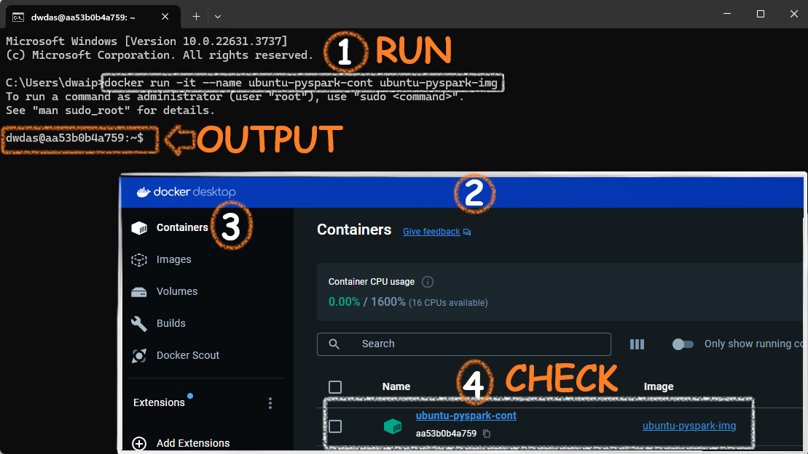

## <span style="color: navy;">Table of contents</span>

- [Create An Ubuntu Container With PySpark Installed](#create-an-ubuntu-container-with-pyspark-installed)
  - [Step 1: Create the Dockerfile](#step-1-create-the-dockerfile)
  - [Step 2: Build the Docker Image](#step-2-build-the-docker-image)
  - [Step 3: Run the Docker Container](#step-3-run-the-docker-container)
  - [Setup Details](#setup-details)


# <span style="color: teal;">Create An Ubuntu Container With PySpark Installed</span>

In this tutorial, I will guide you through creating a simple Ubuntu container with Python and PySpark installed. Follow the steps below to proceed.

>The Ubuntu Image base alredy comes pre-installed wtih Python 3.8, 3.9. This dockerfile additionally installs 3.12

## <span style="color: BlueViolet;">Step 1: Create the Dockerfile</span>

Save the following contents in **Dockerfile.txt** then **remove** the **.txt** extension.

```yaml
# Use Ubuntu 20.04 as the base image to avoid "externally-managed-environment" restrictions
# This concept was introduced in Ubuntu 22.04 to better manage Python environments
FROM ubuntu:20.04

# Set environment variable to avoid interactive prompts during package installation
ENV DEBIAN_FRONTEND=noninteractive

# Update the package list to ensure we have the latest information about available packages
RUN apt-get update

# Install necessary packages including curl, sudo, and nano
RUN apt-get install -y curl sudo nano software-properties-common

# Add the 'deadsnakes' PPA (Personal Package Archive) to access newer Python versions
RUN add-apt-repository ppa:deadsnakes/ppa

# Update the package list again to include the new PPA
RUN apt-get update

# Install Python 3.12, pip, and OpenJDK 11
RUN apt-get install -y python3.12 python3-pip openjdk-11-jdk-headless

# Install the PySpark library using pip
RUN pip3 install pyspark

# Clean up the package lists to reduce the image size
RUN apt-get clean && rm -rf /var/lib/apt/lists/*

# Create a root user and set its password
# 'rootpassword' should be replaced with a secure password
RUN echo 'root:Passw0rd' | chpasswd

# Create a new user 'dwdas', set a password, and add this user to the sudo group
# 'Passw0rd' should be replaced with a secure password
RUN useradd -ms /bin/bash dwdas && echo 'dwdas:Passw0rd' | chpasswd && adduser dwdas sudo

# Allow the 'dwdas' user to run sudo commands without a password
RUN echo 'dwdas ALL=(ALL) NOPASSWD:ALL' >> /etc/sudoers

# Set the working directory to the home directory of the new user
WORKDIR /home/dwdas

# Switch to the new user 'dwdas'
USER dwdas

# Expose port 8888, commonly used for Jupyter Notebook, if needed
EXPOSE 8888

# Set the default command to start a bash shell
CMD ["bash"]

```

## <span style="color: BlueViolet;">Step 2: Build the Docker Image</span>

Open CMD, navigate to the folder with the Dockerfile, and run

```sh
docker build -t ubuntu-pyspark-img .
```


After successfully running the command, you will see an image in your Docker Desktop app:


## <span style="color: BlueViolet;">Step 3: Run the Docker Container</span>

In command prompt, run:

```sh
docker run -it --name ubuntu-pyspark-cont ubuntu-pyspark-img
```

This will create a container with the image we created earlier and start it. You can see it from the Container section of your Docker window.



## <span style="color: Blue;">Setup Details</span>

Here is a table describing the features and components of the setup:

| **Feature/Component**                               | **Description**                                                                                 |
|-----------------------------------------------------|-------------------------------------------------------------------------------------------------|
| **Base Image**                                      | `ubuntu:20.04`                                                                                  |
| **Environment Variable**                            | `DEBIAN_FRONTEND=noninteractive` to avoid interactive prompts during package installation       |
| **Package List Update**                             | `apt-get update` to ensure the latest information about available packages                      |
| **Essential Packages Installation**                 | `curl`, `sudo`, `nano`, and `software-properties-common` installed                              |
| **Python PPA Addition**                             | `add-apt-repository ppa:deadsnakes/ppa` to access newer Python versions                         |
| **Package List Update (Post-PPA Addition)**         | `apt-get update` to include the new PPA                                                         |
| **Python and Java Installation**                    | `python3.12`, `python3-pip`, and `openjdk-11-jdk-headless` installed                            |
| **PySpark Installation**                            | `pip3 install pyspark` to install the PySpark library                                           |
| **Package List Cleanup**                            | `apt-get clean && rm -rf /var/lib/apt/lists/*` to reduce image size                             |
| **Root User Setup**                                 | Root user created with a password (to be replaced with a secure one)                            |
| **New User Creation**                               | `dwdas` user created with a password, added to the sudo group, and allowed to run sudo commands without a password |
| **Working Directory**                               | Set to the home directory of the new user `dwdas`                                               |
| **User Switch**                                     | Switch to the new user `dwdas`                                                                  |
| **Port Exposure**                                   | Port `8888` exposed, commonly used for Jupyter Notebook                                         |
| **Default Command**                                 | `bash` shell set as the default command                                                         |

*For any questions or further assistance, please contact D Das at das.d@hotmail.com.*


