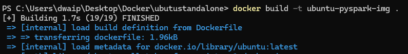

## <span style="color: navy;">Table of contents</span>

- [Ubuntu Pyspark Setup On Docker on Windows](#ubuntu-pyspark-setup-on-docker-on-windows)
  - [Background](#background)
  - [Perform these three steps to Install](#perform-these-three-steps-to-install)
    - [Create the Dockerfile](#create-the-dockerfile)
    - [Build the Docker Image](#build-the-docker-image)
    - [Run the Docker Container](#run-the-docker-container)


# <span style="color: teal;">Ubuntu Pyspark Setup On Docker on Windows</span>

## <span style="color: CadetBlue;">Background

If you have a Windows machine and want to learn Spark programming, you have two main options: 

1. **Install a real-world Spark with a multi-node cluster**: This is a more complex setup and overkill to learn Pspark.
2. **Install Python and then use `pip install pyspark`**: This option is simpler and installs both the PySpark libraries and a minimal Spark runtime environment for local execution.

Here, I will show you how to create a simple container for your development needs using Docker. This container will have:

1. **Base Image**: Uses `ubuntu:latest` for the latest updates and security patches.
2. **Essential Packages**: Installs `curl`, `sudo`, and `nano`.
3. **Python Installation**: Adds the `deadsnakes` PPA and installs Python 3.12, `pip`, and `venv`.
4. **Virtual Environment**: Creates a virtual environment in `/opt/venv` and upgrades `pip` within it. To ensure compatibility and avoiding issues with system-wide package management.
5. **PySpark Installation**: Installs PySpark within the virtual environment.
6. **User Setup**: Creates a user `dwdas` with sudo privileges without a password prompt.


We will use the **Dockerfile** approach to create this setup. Follow these steps:

## <span style="color: CadetBlue;">Perform these three steps to Install</span>

### <span style="color: BlueViolet;">Create the Dockerfile</span>

Create a folder and save this  **[Dockerfile](Dockerfile)** in it.
Or
1. Create a text file **Dockerfile.txt** inside any folder.<br>
2. Open [this file](Dockerfile) and paste its contents into **Dockerfile.txt**.<br>
3. **Remove** the **.txt** extension.

> **Remember**: **REMOVE** the .txt extension from **Dockerfile.txt** before using.

### <span style="color: BlueViolet;">Build the Docker Image</span>

Open CMD, navigate to the folder with the Dockerfile, and run:

```sh
docker build -t ubuntu-pyspark-img .
```


<p style="color: #006600; font-family: 'Trebuchet MS', Helvetica, sans-serif; background-color: #e6ffe6; padding: 15px; border-left: 5px solid #00cc66;">
<b>ubuntu-pyspark-img</b> is the name you gave to your Docker image. The dot <b>.</b> is for current folder.
</p>

After successfully running the command, you will see an image in your Docker Desktop app:


### <span style="color: BlueViolet;">Run the Docker Container</span>

In command prompt, run:

```sh
docker run -it --name ubuntu-pyspark-cont ubuntu-pyspark-img
```

This will create a container with the image we created earlier and start it. You can see it from the Container section of your Docker window.


---


*For any questions or further assistance, please contact D Das at das.d@hotmail.com.*


