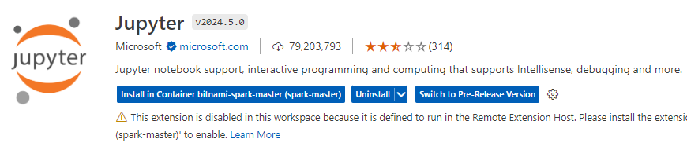

- [Connect to docker container from Visual Studio Code](#connect-to-docker-container-from-visual-studio-code)
    - [Summary of Steps](#summary-of-steps)
  - [Install Dev Containers Extension](#install-dev-containers-extension)
  - [Attach to the running container](#attach-to-the-running-container)
  - [Install Jupyter notebook support extension in the conatiner](#install-jupyter-notebook-support-extension-in-the-conatiner)
  - [Install ipykernel](#install-ipykernel)
  - [Errors](#errors)
    - [failed: mkdir -p /.vscode-server](#failed-mkdir--p-vscode-server)
      - [Wrong Resolution](#wrong-resolution)
        - [Add user:root method](#add-userroot-method)
        - [docker run -u root method](#docker-run--u-root-method)
      - [Correct Method](#correct-method)
    - [No Kernel Visible](#no-kernel-visible)
    - [Py4J Error](#py4j-error)


# <span style="color: teal;">Connect to docker container from Visual Studio Code</span>

Here, I will show you how to connect to a container using VS Code to run Python code, create Jupyter notebooks, and more. This setup is very helpful. Containers are essentially Linux OS environments, and you can't log into them directly to install VS Code.

The connection is mainly done using the VS Code Dev Containers extension, which is the key component for connectivity. The following sections provide detailed steps to guide you through the process.

### Summary of Steps

1. **Install VS Code Dev Containers Extension** on your local machine.

2. Open a terminal and run the following commands in the container:
   ```bash
   sudo su
   mkdir -p /.vscode-server
   chmod -R 777 /.vscode-server
   ```

3. **Attach to the Running Container:**
   Open a remote window from the bottom left corner in VS Code.

4. **Install Jupyter Notebook Support Extension** in the container.

5. **Install Required Python Packages:**
   Open a terminal and run the following commands in the container:
   ```bash
   sudo su
   pip install ipykernel
   pip install py4j
   ```

## <span style="color: Purple;">Install Dev Containers Extension</span>

In **Visual Studio Code** press **Ctrl+Shift+X**, search  **Dev Containers** and **install**.


## <span style="color: Purple;">Attach to the running container</span>

- Click the **Open Remote Window** button in the bottom-left corner of VS Code and select **Attach to Running Container** from the command palette that appears.


- Pick your active container from the presented list.


Note: Here you will encounter like this, go to the errors section to resolve it


## <span style="color: Purple;">Install Jupyter notebook support extension in the conatiner</span>

To use Jupyter Notebook in a container, you need to **install** the VS Code extension **in the container**. When a create a notebook for the first time you'll be asked to install the extension in the container. You can also search for the extension in VS Code and install it.


## <span style="color: Purple;">Install ipykernel</span>

To run Jupyter cells, you will need the ipykernel package. Usually, you will be prompted to install it in VS Code.


Just click **Install** to install it.


**Note:** If installing it from VS Code doesn't work, you can directly install it in the container.

```sh
sudo su
pip install ipykernel
```


## <span style="color: Red;">Errors</span>

### <span style="color: Chocolate;">failed: mkdir -p /.vscode-server</span>

When trying to attach to a Docker container using the VSCode Dev extension, you may encounter an error during the **Installing VS Code Server step**:


**Reason:** Insufficient permissions for VSCode to create a folder **.vscode-server** inside the root folder. It cannot create this folder: **/.vscode-server**.

For example, when it runs this command:

```sh
mkdir -p /root/.vscode-remote-containers/bin/
```
#### Wrong Resolution

##### Add user:root method

If you use a docker-compose file to create the containers you can add `user: root` to every container. 


##### docker run -u root method

Alternaively, you can start the container with root. This is feasible only for single containers.

`docker run -u root -it --name myCont theImageFileName /bin/bash`

#### Correct Method

The correct method is to create the folder using the root user and provide permissions to it for the normal user. This way, you can create a normal container without needing to add the root user to the container.

To achieve this run the following commands in the container and then try to connect VS code again:

```bash
sudo su
mkdir -p /.vscode-server
chmod -R 777 /.vscode-server
```


> Note: You may not always have su access or password. To resolve it you may have to create a Dockerfile and users inside it with elevated permission. Refer to my BitnamiSparkCluster [article](3-BitnamiSparkClusterOnDocker.html) to create such containers.

### <span style="color: Chocolate;">No Kernel Visible</span>

Install the Jupyter extension in the container.



Also, go to the Docker container and install ipykernel:

```sh
sudo su
pip install ipykernel
```


Then it will detect the kernel automatically.


### <span style="color: Chocolate;">Py4J Error</span>

While running code, you may get this error:


**Install** **py4j** in the **container** to resolve it:

```sh
sudo su
pip install py4j
```


