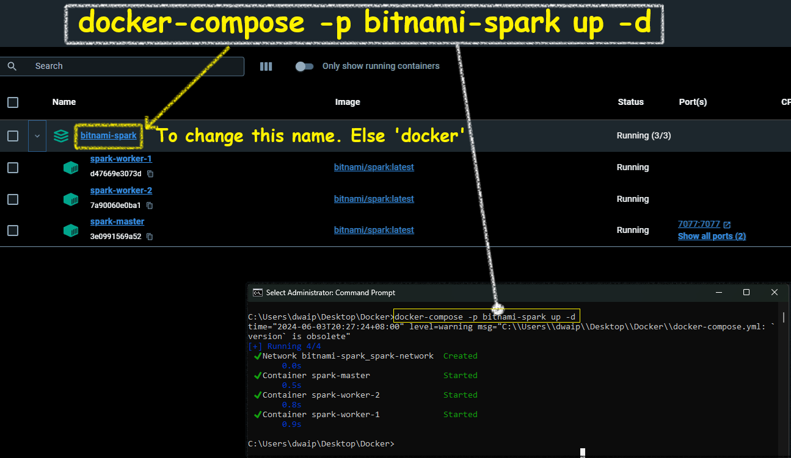

## Table of contents
- [Create a Spark cluster using Bitnami Spark Image](#create-a-spark-cluster-using-bitnami-spark-image)
  - [Steps](#steps)
- [Appendix](#appendix)
  - [docker-compose.yml](#docker-composeyml)
  - [How to add an extra node to the cluster](#how-to-add-an-extra-node-to-the-cluster)

# Create a Spark cluster using Bitnami Spark Image

Here I will show you how you can setup a Spark Cluster, 1 master, 2 workers node. We will use the VMWare Bitnami image for this.
</p>

Make sure Docker is installed and running on your machine. [You can Download Docker from here](https://www.docker.com/products/docker-desktop).

## <span style="color: #3333cc;">Steps</span>

- Create a file **docker-compose.yml** with the content from the [docker-compose](#docker-composeyml) section.
- **CD** to the folder containng the docker-compose and run the following command

  ```bash docker-compose -p fancyName up -d ```
      

- Open the Docker app and navigate to the container section. The containers should be up and running.
  


# Appendix

## docker-compose.yml

Here is the content for the docker-compose.yml file. Simply copy the contents into a file named `docker-compose.yml` in your folder.

```yaml

# Define the YAML version
version: '3.8'

services:
  # Define a service named "spark-master"
  spark-master:
    # Specify the Docker image to use for the spark-master service
    image: bitnami/spark:latest
    user: root #Optional - This is required else, error in attaching containers using VS code

    # Define the ports to expose for the spark-master service
    ports:
      # Expose port 7077 from the container to port 7077 on the host machine
      - "7077:7077"
      # Expose port 9090 from the container to port 8080 on the host machine
      - "9090:8080"

  # Define a service named "spark-worker-1"
  spark-worker-1:
    # Specify the Docker image to use for the spark-worker-1 service
    image: bitnami/spark:latest
    user: root #Optional - This is required else, error in attaching containers using VS code

    # Define the environment variables for the spark-worker-1 service
    environment:
      # Set the SPARK_MASTER_URL environment variable to the URL of the Spark Master node
      - SPARK_MASTER_URL=spark://spark-master:7077
      # Set the SPARK_WORKER_MEMORY environment variable to the amount of memory to allocate to each Spark worker
      - SPARK_WORKER_MEMORY=2g
      # Set the SPARK_WORKER_CORES environment variable to the number of cores to allocate to each Spark worker
      - SPARK_WORKER_CORES=1

  # Define a service named "spark-worker-2"
  spark-worker-2:
    # Specify the Docker image to use for the spark-worker-2 service
    image: bitnami/spark:latest
    user: root #Optional - This is required else, error in attaching containers using VS code

    # Define the environment variables for the spark-worker-2 service
    environment:
      # Set the SPARK_MASTER_URL environment variable to the URL of the Spark Master node
      - SPARK_MASTER_URL=spark://spark-master:7077
      # Set the SPARK_WORKER_MEMORY environment variable to the amount of memory to allocate to each Spark worker
      - SPARK_WORKER_MEMORY=2g
      # Set the SPARK_WORKER_CORES environment variable to the number of cores to allocate to each Spark worker
      - SPARK_WORKER_CORES=1
```

## <span style="color: #3333cc;">How to add an extra node to the cluster</span>

<p style="color: #006600; font-family: 'Trebuchet MS', Helvetica, sans-serif; background-color: #e6ffe6; padding: 15px; border-left: 5px solid #00cc66;">
To add an extra node simply duplicate the configuration of an existing worker node in your <code>docker-compose.yaml</code> file, making sure to change any necessary details (like the service name) to avoid conflicts.
</p>


```yaml
# Define the YAML version
version: '3.8'

services:
  # Define a service named "spark-master"
  spark-master:
    # Specify the Docker image to use for the spark-master service
    image: bitnami/spark:latest
    user: root #This is required else, error in attaching containers using VS code

    # Define the ports to expose for the spark-master service
    ports:
      # Expose port 7077 from the container to port 7077 on the host machine
      - "7077:7077"
      # Expose port 9090 from the container to port 8080 on the host machine
      - "9090:8080"

  # Define a service named "spark-worker-1"
  spark-worker-1:
    # Specify the Docker image to use for the spark-worker-1 service
    image: bitnami/spark:latest
    user: root #This is required else, error in attaching containers using VS code

    # Define the environment variables for the spark-worker-1 service
    environment:
      # Set the SPARK_MASTER_URL environment variable to the URL of the Spark Master node
      - SPARK_MASTER_URL=spark://spark-master:7077
      # Set the SPARK_WORKER_MEMORY environment variable to the amount of memory to allocate to each Spark worker
      - SPARK_WORKER_MEMORY=2g
      # Set the SPARK_WORKER_CORES environment variable to the number of cores to allocate to each Spark worker
      - SPARK_WORKER_CORES=1

  # Define a service named "spark-worker-2"
  spark-worker-2:
    # Specify the Docker image to use for the spark-worker-2 service
    image: bitnami/spark:latest
    user: root #This is required else, error in attaching containers using VS code

    # Define the environment variables for the spark-worker-2 service
    environment:
      # Set the SPARK_MASTER_URL environment variable to the URL of the Spark Master node
      - SPARK_MASTER_URL=spark://spark-master:7077
      # Set the SPARK_WORKER_MEMORY environment variable to the amount of memory to allocate to each Spark worker
      - SPARK_WORKER_MEMORY=2g
      # Set the SPARK_WORKER_CORES environment variable to the number of cores to allocate to each Spark worker
      - SPARK_WORKER_CORES=1

  # Define a service named "spark-worker-3"
  spark-worker-3:  # New worker node
    # Specify the Docker image to use for the spark-worker-3 service
    image: bitnami/spark:latest
    user: root #This is required else, error in attaching containers using VS code

    # Define the environment variables for the spark-worker-3 service
    environment:
      # Set the SPARK_MASTER_URL environment variable to the URL of the Spark Master node
      - SPARK_MASTER_URL=spark://spark-master:7077
      # Set the SPARK_WORKER_MEMORY environment variable to the amount of memory to allocate to each Spark worker
      - SPARK_WORKER_MEMORY=2g
      # Set the SPARK_WORKER_CORES environment variable to the number of cores to allocate to each Spark worker
      - SPARK_WORKER_CORES=1
```
