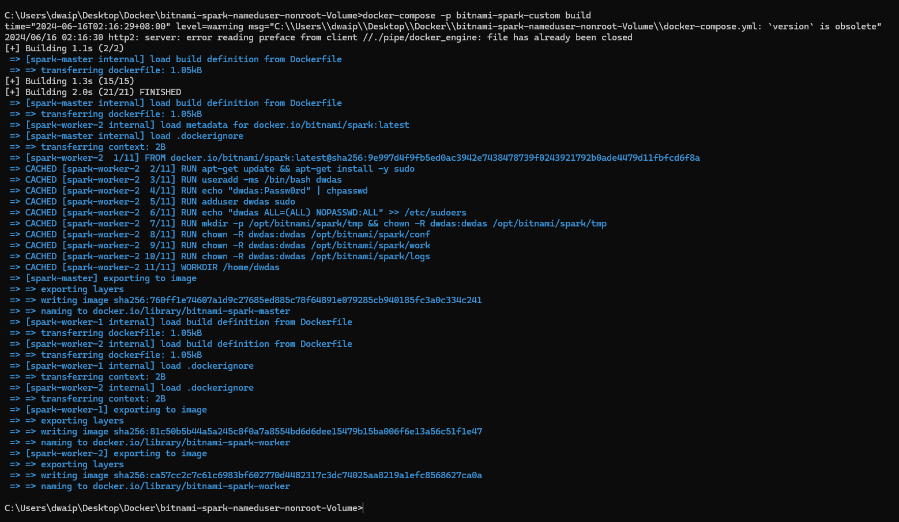
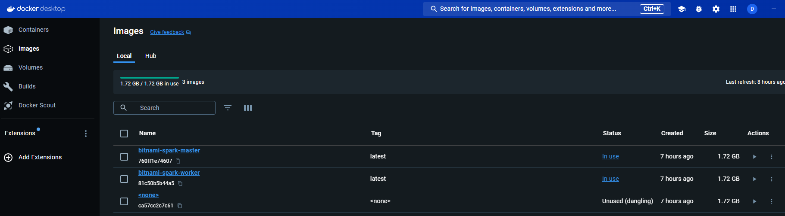
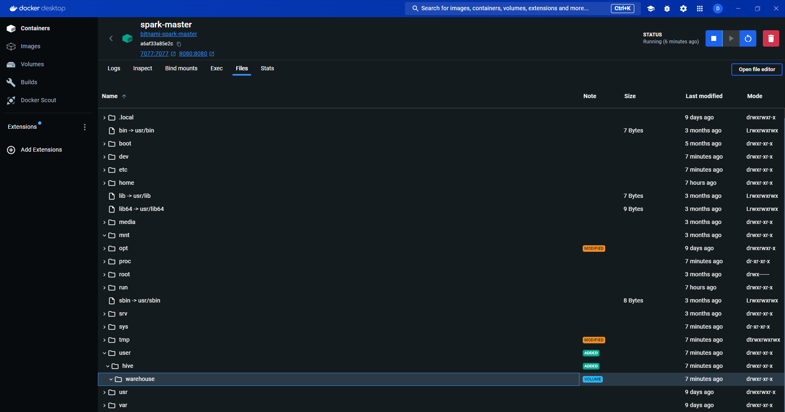
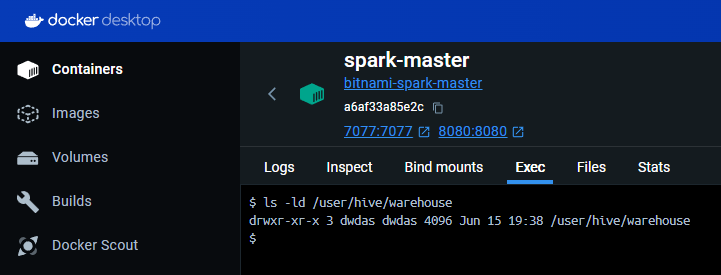
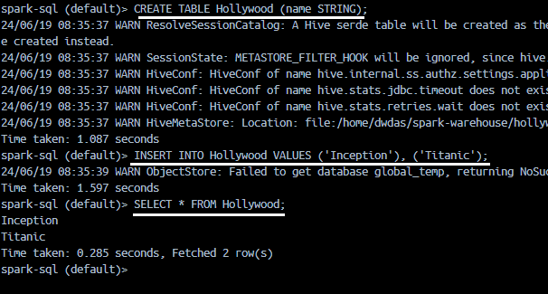
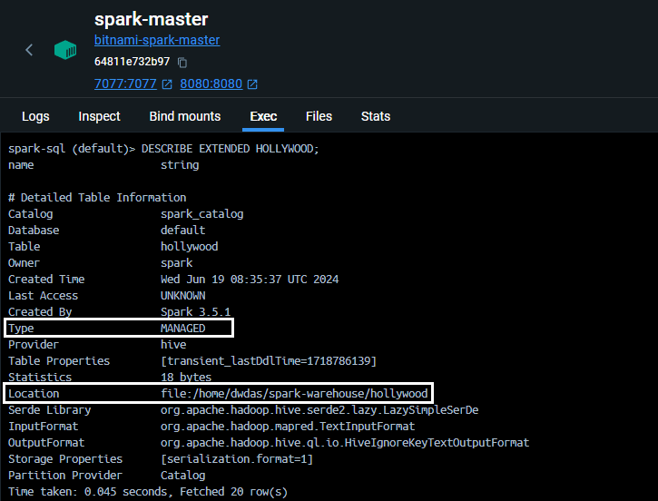
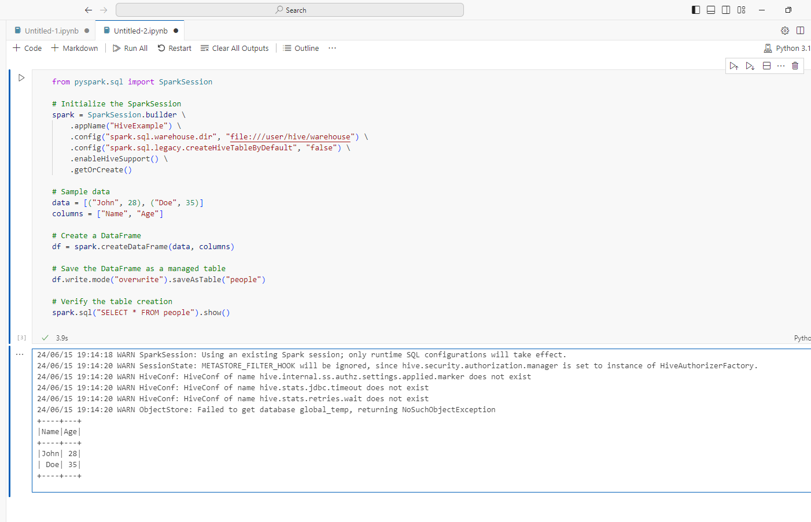

- [Bitnami Spark Cluster with Shared Volume](#bitnami-spark-cluster-with-shared-volume)
  - [Steps to create the environment](#steps-to-create-the-environment)
    - [Create the Dockerfile](#create-the-dockerfile)
    - [Create the docker-compose.yml file](#create-the-docker-composeyml-file)
    - [Build Your Docker Images](#build-your-docker-images)
    - [Run the containers using the images](#run-the-containers-using-the-images)
    - [Check Permissions for /user/hive/warehouse](#check-permissions-for-userhivewarehouse)
    - [Connect to SparkSQL using spark-sql CLI](#connect-to-sparksql-using-spark-sql-cli)
    - [Connect to a container and create a spark session](#connect-to-a-container-and-create-a-spark-session)
  - [Common Errors](#common-errors)

# Bitnami Spark Cluster with Shared Volume

Here, I will show you how to set up a Spark Cluster with the following Details:

| **Configuration Detail**      | **Value**                                   |
|-------------------------------|---------------------------------------------|
| **Image**     | `bitnami/spark:latest` (Spark 3.5.1), OS_FLAVOUR=debian-12 |
| **Spark Mode**                | 1 Master + 2 Workers                        |
| **Spark Submission URL**      | `spark://spark-master:7077`                 |
| **Spark URLs Local**          | [Master http://localhost:8080/](http://localhost:8080/), [Worker 1 http://localhost:8081/](http://localhost:8081/), [Worker 2 http://localhost:8082/](http://localhost:8082/) |
| **Spark Worker Specs**        | Memory 2G, Cores 2                          |
| **Common Mounted Volumes**    | `spark-warehouse:/user/hive/warehouse` to all nodes      |
| **Mounted Folder Details**    | Temp Dir: `/opt/bitnami/spark/tmp`, Spark Conf: `/opt/bitnami/spark/conf`, `/opt/bitnami/spark/work`, Logs Dir: `/opt/bitnami/spark/logs` |
| **Networks**                  | `spark-network` (bridge network)            |
| **User**                      | `dwdas` (Password: Passw0rd, Sudo Privileges: `NOPASSWD:ALL`), Working dir: `/home/dwdas` |
| **Java Version**              | OpenJDK 17.0.11 (LTS)                       |
| **Python Version**            | Python 3.11.9                               |
| **JAVA_HOME**                 | `/opt/bitnami/java`                         |
| **SPARK_HOME**                | `/opt/bitnami/spark`                        |
| **PYTHONPATH**                | `/opt/bitnami/spark/python/`                |
| **spark-sql CLI**                | Just use `spark-sql`. Location: `/opt/bitnami/spark/bin/spark-sql`                |
| **spark-shell CLI**                | Just use `spark-shell`. Location: `/opt/bitnami/spark/bin/spark-shell`                |


## Steps to create the environment

### Create the Dockerfile

Create a  **Dockerfile.txt** with the contents below(remove .txt later).


```Dockerfile
# Use the official Bitnami Spark image as the base image
FROM bitnami/spark:latest

# Switch to root user to install necessary packages and set permissions
USER root

# Install sudo package
RUN apt-get update && apt-get install -y sudo

# Add a non-root user named dwdas with a home directory and bash shell
RUN useradd -ms /bin/bash dwdas

# Set the password for dwdas as Passw0rd
RUN echo "dwdas:Passw0rd" | chpasswd

# Add the user to the sudo group and configure sudoers file to allow passwordless sudo
RUN adduser dwdas sudo
RUN echo "dwdas ALL=(ALL) NOPASSWD:ALL" >> /etc/sudoers

# Ensure dwdas has write permissions to necessary directories and files
RUN mkdir -p /opt/bitnami/spark/tmp && chown -R dwdas:dwdas /opt/bitnami/spark/tmp
RUN chown -R dwdas:dwdas /opt/bitnami/spark/conf
RUN chown -R dwdas:dwdas /opt/bitnami/spark/work
RUN chown -R dwdas:dwdas /opt/bitnami/spark/logs

# Switch back to the non-root user
USER dwdas

# Set the working directory
WORKDIR /home/dwdas
```

### Create the docker-compose.yml file

In the same folder, create a `docker-compose.yml` with the content below.

```yaml
version: '3'  # Specify the version of Docker Compose syntax

services:  # Define the services (containers) that make up your application

  spark-master:
    build:
      context: .  # Build context is the current directory (where the Dockerfile is located)
      dockerfile: Dockerfile  # Dockerfile to use for building the image
    image: bitnami-spark-master  # Name the image for the master node
    container_name: spark-master  # Set a custom name for the master container
    environment:
      - SPARK_MODE=master  # Environment variable to set the Spark mode to master
    ports:
      - "8080:8080"  # Map port 8080 on the host to port 8080 on the container for Spark Master web UI
      - "7077:7077"  # Map port 7077 on the host to port 7077 on the container for Spark Master
    volumes:
      - spark-warehouse:/user/hive/warehouse  # Mount the shared volume for Hive warehouse
    networks:
      - spark-network  # Connect the master container to the defined network

  spark-worker-1:
    build:
      context: .  # Build context is the current directory (where the Dockerfile is located)
      dockerfile: Dockerfile  # Dockerfile to use for building the image
    image: bitnami-spark-worker  # Name the image for the worker node
    container_name: spark-worker-1  # Set a custom name for the first worker container
    environment:
      - SPARK_MODE=worker  # Environment variable to set the Spark mode to worker
      - SPARK_MASTER_URL=spark://spark-master:7077  # URL for the worker to connect to the master
      - SPARK_WORKER_MEMORY=2G  # Set the memory allocated for the worker
      - SPARK_WORKER_CORES=2  # Set the number of CPU cores allocated for the worker
    depends_on:
      - spark-master  # Ensure that the master service is started before this worker
    ports:
      - "8081:8081"  # Map port 8081 on the host to port 8081 on the container for Spark Worker 1 web UI
    volumes:
      - spark-warehouse:/user/hive/warehouse  # Mount the shared volume for Hive warehouse
    networks:
      - spark-network  # Connect the worker container to the defined network

  spark-worker-2:
    build:
      context: .  # Build context is the current directory (where the Dockerfile is located)
      dockerfile: Dockerfile  # Dockerfile to use for building the image
    image: bitnami-spark-worker  # Name the image for the worker node
    container_name: spark-worker-2  # Set a custom name for the second worker container
    environment:
      - SPARK_MODE=worker  # Environment variable to set the Spark mode to worker
      - SPARK_MASTER_URL=spark://spark-master:7077  # URL for the worker to connect to the master
      - SPARK_WORKER_MEMORY=2G  # Set the memory allocated for the worker
      - SPARK_WORKER_CORES=2  # Set the number of CPU cores allocated for the worker
    depends_on:
      - spark-master  # Ensure that the master service is started before this worker
    ports:
      - "8082:8081"  # Map port 8082 on the host to port 8081 on the container for Spark Worker 2 web UI
    volumes:
      - spark-warehouse:/user/hive/warehouse  # Mount the shared volume for Hive warehouse
    networks:
      - spark-network  # Connect the worker container to the defined network

volumes:
  spark-warehouse:
    driver: local  # Use the local driver to create a shared volume for the warehouse

networks:
  spark-network:
    driver: bridge  # Use the bridge driver to create an isolated network for the Spark cluster
```
### Build Your Docker Images

In command prompt run the following command to build your Docker images

```bash
docker-compose -p bitnami-spark-cluster build
```



There will be two images: One for the Master and the other for the worker nodes. The images section will also show one dangling image. Ignore it.



### Run the containers using the images

Now run the following:

```bash
docker-compose -p bitnami-spark-cluster up -d
```

You should see three containers running inside a compose stack.


And a volume will be created and shown in teh **Volumes** section:


The volume will be mounted to all the three containers:



### Check Permissions for /user/hive/warehouse
The `/user/hive/warehouse` folder is the mounted directory we created. The user `dwdas` should have the correct permissions for this folder in all three containers. To check this, connect to each container through the terminal using either:

```bash
docker exec -it spark-master bash
```

Or through Docker Desktop's EXEC tab.

Then run:

```bash
ls -ld /user/hive/warehouse
# The permission should be rwx for dwdas
```


**Note:** If you don't have `rwx` or owner permissions for the warehouse folder and see an output like this:



You will need to either provide `rwx` permission for `dwdas` or make `dwdas` the owner of the folder:

```bash
chown dwdas:dwdas /user/hive/warehouse
```

If that doesn't work, you can use:

```bash
chmod 777 /user/hive/warehouse
```

### Connect to SparkSQL using spark-sql CLI

Open any container's terminal(Master/worker) and input **spark-sql**.


Let's create a simple table and see query it. paste the following in the terminal:

```sql
CREATE TABLE Hollywood (name STRING);
INSERT INTO Hollywood VALUES ('Inception'), ('Titanic');
SELECT * FROM Hollywood;
```

A table will be created in SPARK as extended tabble and you will be able to see the select result:


```SQL
DESCRIBE EXTENDED HOLLYWOOD
```
Will give this result:



Note: its a manged table in location /home/dwdas/spark-warehouse/

### Connect to a container and create a spark session

Open VS Code and use Dev Containers to attach to the running Master container. Then, open a Jupyter notebook and run the following commands.

To know how to connect VS code to a container, refer to my article [here](02-ConnectVSCodeToDocker.html).

```python
from pyspark.sql import SparkSession

# Initialize the SparkSession
## Note: file:///user/hive/warehouse is the way and not /user/hive/warehouse. Add file: Else, wont be able to find the directory
spark = SparkSession.builder \
    .appName("HiveExample") \
    .config("spark.sql.warehouse.dir", "file:///user/hive/warehouse") \
    .config("spark.sql.legacy.createHiveTableByDefault", "false") \
    .enableHiveSupport() \
    .getOrCreate()

# Explanation:
# - `spark.sql.warehouse.dir`: Specifies the default location for managed databases and tables.
# - `spark.sql.legacy.createHiveTableByDefault`: Ensures that Hive tables are not created by default unless explicitly specified.
# - `enableHiveSupport()`: Enables Hive support, allowing Spark to leverage Hive Metastore, run HiveQL queries, and use Hive functions.

# Sample data
data = [("Kim Jong Obama", 28), ("Vladimir Trump", 35)]
columns = ["Name", "Age"]

# Create a DataFrame
df = spark.createDataFrame(data, columns)

# Save the DataFrame as a managed table
df.write.mode("overwrite").saveAsTable("people")

# Verify the table creation
spark.sql("SELECT * FROM people").show()

# Additional Information:
# - Hive Metastore Integration: Spark can directly access the Hive Metastore, providing a unified metadata layer for Spark and Hive.
# - HiveQL Queries: You can run HiveQL queries using Spark SQL, using the familiar Hive syntax.
# - Hive Functions: Spark supports Hive's built-in functions in Spark SQL queries.
# - Table Management: Spark can read from and write to Hive-managed tables, including creating, dropping, and altering tables.
# - Compatibility with Hive Data Formats: Spark can read from and write to Hive's data formats like ORC and Parquet.
# - Access to Hive UDFs: User-defined functions created in Hive can be used within Spark SQL queries.

```
If everything works fine, we will be able to see the spark internal table created!



## Common Errors