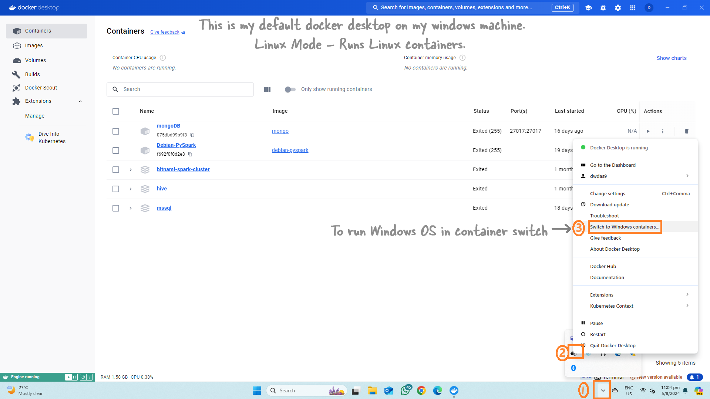

### Running Windows OS as a Container in Docker

When you think of containers, you usually picture a small Linux OS. And you’re right! But did you know that containers can run a small Windows OS too?

### Switching Docker Desktop to Windows Mode

When you run Docker Desktop on your Windows laptop and download popular apps like MongoDB or Spark, you’re using Linux OS containers. However, Windows can also be run in containers. To do this, you need to switch Docker Desktop to Windows mode.



And you can switch back to Linux containers easily.


**Note:** When you switch to Windows mode, you won’t be able to see your Linux containers.


### Switching Using Command Line

You can also switch using the command line:

```powershell
& $Env:ProgramFiles\Docker\Docker\DockerCli.exe -SwitchDaemon
```

### Further Reading

For more information, check out: [Windows Containers Documentation](https://learn.microsoft.com/en-us/virtualization/windowscontainers/)

### Microsoft Base Images

Microsoft offers several base images to start building your own container images:

- **Windows**: Contains the full set of Windows APIs and system services (excluding server roles).
- **Windows Server**: Contains the full set of Windows APIs and system services.
- **Windows Server Core**: A smaller image with a subset of Windows Server APIs, including the full .NET framework and most server roles (excluding some like Fax Server).
- **Nano Server**: The smallest Windows Server image, supporting .NET Core APIs and some server roles.

### Ready-Made Bundles

Microsoft offers ready-made bundles that combine Windows Server 2022 with apps like MongoDB.

For example, if you need MongoDB on Windows Server 2022, you can use this [Dockerfile](https://github.com/MicrosoftDocs/Virtualization-Documentation/tree/main/windows-container-samples/mongodb).

### Other Combinations

Other combinations you can create include:

- aspnet
- iis
- Django
- apache-http-php
- nginx
- dotnet35
- golang
- nodejs
- python
- python-django
- rails
- ruby
- server-jre-8u51-windows-x64
- mongodb
- mysql
- redis
- sqlite
- sqlserver-express
- PowerShellDSC_iis-10.0

Now you know that containers are not just small Linux OSs. They can be a mini Windows OS too!