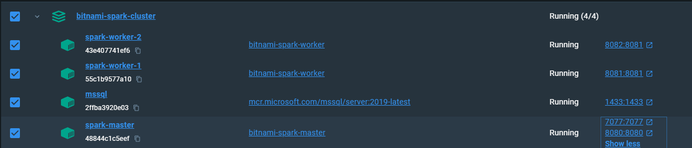

# Setting Up a Complete Data Warehouse with Spark Cluster & External  Hive with External Metastore (MSSQL)

Here, I will show you how to create a complete warehouse setup with a Spark Cluster and a standalone Hive with an external metastore database (MSSQL). The setup will use 5 containers:

| Containers            | Image                                       |
|----------------------|---------------------------------------------|
| Spark Master         | `bitnami/spark:latest`                      |
| Spark Worker 1       | `bitnami/spark:latest`                      |
| Spark Worker 2       | `bitnami/spark:latest`                      |
| MSSQL (Metastore DB) | `mcr.microsoft.com/mssql/server:2019-latest`|
| Hive Metastore       | `apache/hive:4.0.0`                         |

## Create Spark clusters and MSSQL server containers

- Download the  [zip](Dockerfiles/Spark-Hive-MSSQL-Complete.zip)file on your laptop.
- Go to Step1-Spark-MSSQL folder and run run.bat or execute its commands
- This will create the four containers:


| Container Name            | Image                                       | Access URL
|----------------------|---------------------------------------------|
| spark-master       | `bitnami/spark:latest`                      |
| spark-worker-1       | `bitnami/spark:latest`                      |
| spark-worker-2         | `bitnami/spark:latest`                      |
| mssql | `mcr.microsoft.com/mssql/server:2019-latest`|

- Access Spark Master at: [http://localhost:8080/](http://localhost:8080/)
- Access Spark Worker 1 at: [http://localhost:8081/](http://localhost:8081/)
- Access Spark Worker 2 at: [http://localhost:8082/](http://localhost:8082/)
- Connect to SQL server from local SSMS - localhost,1433, sql serer auth dwdas/Passw0rd

SPARK_HOME: 
Java_home
Python_Home
Pysparkpath

CREATE DATABASE hive_metastore;
GO
CREATE LOGIN dwdas WITH PASSWORD='Passw0rd';
GO
USE hive_metastore;
GO
CREATE USER dwdas FOR LOGIN dwdas;
GO
ALTER ROLE db_owner ADD MEMBER dwdas;
GO

# Add a non-root user named dwdas with a home directory and bash shell
RUN useradd -ms /bin/bash dwdas

# Set the password for dwdas as Passw0rd
RUN echo "dwdas:Passw0rd" | chpasswd

# Set the password for the root user
RUN echo "root:Passw0rd" | chpasswd

    Docker volumes:
      - hive-metastore:/opt/hive/metastore  # Mount volume for Hive metastore logs and local metadata storage
      - hive-warehouse:/user/hive/warehouse  # Mount shared volume for Hive warehouse




## Create the 


## Create a Hive metastore container and connect it to MSSQL for the metastore database


Brain DUMP! DONT PUBLISH!

Yes, that's correct. In your setup, you will primarily need two directories:

1. **hive-metastore**: This directory is used for logs or temporary metadata storage. Even though the main metadata is stored in the MSSQL database, having this directory helps in maintaining local configurations and logs.

2. **hive-warehouse**: This is the primary directory used for storing the actual data of managed tables. Both Hive and Spark (when configured to use Hive's metastore) will use this directory to store table data.

When Spark is configured to use Hive's metastore, Spark can directly interact with Hive's metastore and warehouse directory to create and manage tables. This means Spark will handle the creation and placement of data in the Hive warehouse directory. Therefore, both Spark and Hive need to have access to the `hive-warehouse` directory to ensure seamless interaction and data consistency.

### Key Points:
- **Hive Metastore**: The metadata about tables, including the location of table data, is stored in the Hive metastore, which in your case is backed by MSSQL.
- **Hive Warehouse**: The actual data of managed tables (internal tables) is stored in the Hive warehouse directory.
- **Spark Integration**: When Spark is configured to use Hive's metastore, it will directly create and manage tables in the Hive warehouse directory.

### Updated Docker Compose Configuration

Ensure both Hive and Spark services have access to the `hive-warehouse` volume.

```yaml
version: '3'

services:
  # Hive Metastore service
  hive-metastore:
    build:
      context: .
      dockerfile: Dockerfile
    container_name: hive-metastore
    environment:
      - SERVICE_NAME=metastore
      - IS_RESUME=true
    ports:
      - "9083:9083"
    networks:
      - spark-network
    volumes:
      - hive-metastore:/opt/hive/metastore
      - hive-warehouse:/user/hive/warehouse  # Mount shared volume for Hive warehouse


  # Spark service
  spark:
    image: your_spark_image  # Replace with your Spark image
    container_name: spark
    environment:
      - SPARK_MASTER=spark://spark-master:7077
      - SPARK_WORKER_CORES=2
      - SPARK_WORKER_MEMORY=1G
      - SPARK_DRIVER_MEMORY=1G
    networks:
      - spark-network
    volumes:
      - hive-warehouse:/user/hive/warehouse  # Mount shared volume for Hive warehouse

networks:
  spark-network:
    external: true
    name: spark-network
    driver: bridge

volumes:
  hive-metastore:
    driver: local  # Use local driver for Hive metastore logs and local metadata storage
  hive-warehouse:
    driver: local  # Use local driver for Hive warehouse
```

### Explanation

- **hive-metastore**: This volume is used for Hive metastore logs and local metadata storage.
- **hive-warehouse**: This shared volume is mounted in all relevant services (Hive Metastore, Hive Server2, and Spark) to ensure that all services can read and write data to the same directory.

### Configuration for Hive and Spark

1. **`hive-site.xml` Configuration**: Ensure your `hive-site.xml` has the correct settings for the Hive warehouse directory and metastore connection.

   ```xml
   <configuration>
     <property>
       <name>javax.jdo.option.ConnectionURL</name>
       <value>jdbc:sqlserver://<MSSQL_SERVER>:<PORT>;databaseName=<DATABASE_NAME></value>
     </property>
     <property>
       <name>javax.jdo.option.ConnectionDriverName</name>
       <value>com.microsoft.sqlserver.jdbc.SQLServerDriver</value>
     </property>
     <property>
       <name>javax.jdo.option.ConnectionUserName</name>
       <value><DATABASE_USER></value>
     </property>
     <property>
       <name>javax.jdo.option.ConnectionPassword</name>
       <value><DATABASE_PASSWORD></value>
     </property>
     <property>
       <name>hive.metastore.warehouse.dir</name>
       <value>/user/hive/warehouse</value>
       <description>Location of Hive warehouse directory</description>
     </property>
   </configuration>
   ```

2. **`spark-defaults.conf` Configuration**: Add the following to your Spark configuration (`spark-defaults.conf`):

   ```properties
   spark.sql.warehouse.dir=/user/hive/warehouse
   spark.sql.catalogImplementation=hive
   spark.hadoop.hive.metastore.uris=thrift://hive-metastore:9083
   ```

### Creating and Querying Tables

With this setup, when you create tables using Spark, they will be managed through Hive's metastore and stored in the Hive warehouse directory.

1. **Start Spark Shell or Submit a Job**:

   ```sh
   spark-shell --master local[*] --conf spark.sql.catalogImplementation=hive
   ```

2. **Create a DataFrame and Save it as a Hive Table**:

   ```scala
   import spark.implicits._
   import org.apache.spark.sql._

   // Sample data
   val data = Seq(
     (1, "Alice", 29),
     (2, "Bob", 32),
     (3, "Cathy", 28)
   )

   // Create DataFrame
   val df = data.toDF("id", "name", "age")

   // Save DataFrame as a Hive table
   df.write.saveAsTable("default.people")

   // Verify the table creation
   spark.sql("SELECT * FROM default.people").show()
   ```

3. **Verify the Table in Hive**:
   - Use the Hive shell to verify that the table has been created:

     ```sh
     hive
     ```

   - Run the following commands in the Hive shell:

     ```sql
     SHOW TABLES;
     SELECT * FROM default.people;
     ```

These are the folders you should have in your setup with both Spark and Hive

1. Hive Warehouse:
   - This is the default location where Hive stores table data.
   - Typically located at `/user/hive/warehouse` in HDFS, or a specified local path if you're not using HDFS.
   - Defined by the `hive.metastore.warehouse.dir` property in `hive-site.xml`.

2. Spark Warehouse:
   - This is the default location where Spark SQL stores table data when not using Hive.
   - By default, it's a directory named `spark-warehouse` in the current working directory.
   - Can be configured using the `spark.sql.warehouse.dir` property.

In your setup with both Spark and Hive, you have a few options:

Option 1: Use Hive Warehouse for both Spark and Hive
1. Configure Spark to use the Hive metastore:
   - Set `spark.sql.hive.metastore.version` and `spark.sql.hive.metastore.jars` in Spark configuration.
2. Use the same warehouse directory for both:
   - In `hive-site.xml`:
     ```xml
     <property>
       <name>hive.metastore.warehouse.dir</name>
       <value>/path/to/warehouse</value>
     </property>
     ```
   - In Spark configuration:
     ```
     spark.sql.warehouse.dir=/path/to/warehouse
     ```

Option 2: Separate warehouses for Spark and Hive
1. Keep Hive warehouse as is:
   - In `hive-site.xml`:
     ```xml
     <property>
       <name>hive.metastore.warehouse.dir</name>
       <value>/path/to/hive/warehouse</value>
     </property>
     ```
2. Set a different warehouse for Spark:
   - In Spark configuration:
     ```
     spark.sql.warehouse.dir=/path/to/spark/warehouse
     ```

Recommended Folder Structure:
```
/data
├── hive-warehouse/
│   └── (Hive-managed tables)
├── spark-warehouse/
│   └── (Spark-managed tables, if using separate warehouses)
└── external-tables/
    └── (External table data for both Spark and Hive)
```

Key Points:
1. If you're using Spark with Hive integration, it's often simplest to use the same warehouse directory for both.
2. External tables can be stored anywhere; their location is specified when creating the table.
3. The actual paths will depend on your specific setup (HDFS, local filesystem, cloud storage, etc.).
4. Ensure both Spark and Hive have proper access permissions to these directories.


### How to test

From the spark serer command line enter:

```shell
spark-shell --conf spark.sql.catalogImplementation=hive --conf spark.hadoop.hive.metastore.uris=thrift://hive-metastore:9083
```

### 3. Verify Spark Configuration

Make sure the Spark configuration is correctly pointing to the Hive Metastore URI. Here’s a step-by-step guide to ensure the configuration is correct:

#### Option 1: Using `spark-defaults.conf`

Edit the `spark-defaults.conf` file, usually located in the `conf` directory of your Spark installation

For bitnami containers its /opt/bitnami/spark/conf

```conf
spark.sql.catalogImplementation=hive
spark.hadoop.hive.metastore.uris=thrift://hive-metastore:9083
```

#### Option 2: Command-Line Options

When starting the Spark shell or submitting a Spark job, ensure the configurations are passed correctly:

```sh
spark-shell --conf spark.sql.catalogImplementation=hive --conf spark.hadoop.hive.metastore.uris=thrift://hive-metastore:9083
```

or

```sh
spark-sql --conf spark.sql.catalogImplementation=hive --conf spark.hadoop.hive.metastore.uris=thrift://hive-metastore:9083
```

### 4. Check Hive and Hadoop Configuration Files

Ensure that the necessary Hive and Hadoop configuration files (`hive-site.xml` and `core-site.xml`) are available and correctly configured. These files should be placed in the `conf` directory of your Spark installation or referenced correctly.

#### Example `hive-site.xml`

Ensure that your `hive-site.xml` includes the correct metastore URI:

```xml
<configuration>
  <property>
    <name>hive.metastore.uris</name>
    <value>thrift://hive-metastore:9083</value>
  </property>
</configuration>
```


Link:https://hub.docker.com/r/bitnami/spark

Configuration
Environment variables
Customizable environment variables
Name	Description	Default Value
SPARK_MODE	Spark cluster mode to run (can be master or worker).	master
SPARK_MASTER_URL	Url where the worker can find the master. Only needed when spark mode is worker.	spark://spark-master:7077
SPARK_NO_DAEMONIZE	Spark does not run as a daemon.	true
SPARK_RPC_AUTHENTICATION_ENABLED	Enable RPC authentication.	no
SPARK_RPC_AUTHENTICATION_SECRET	The secret key used for RPC authentication.	nil
SPARK_RPC_ENCRYPTION_ENABLED	Enable RPC encryption.	no
SPARK_LOCAL_STORAGE_ENCRYPTION_ENABLED	Enable local storage encryption.	no
SPARK_SSL_ENABLED	Enable SSL configuration.	no
SPARK_SSL_KEY_PASSWORD	The password to the private key in the key store.	nil
SPARK_SSL_KEYSTORE_PASSWORD	The password for the key store.	nil
SPARK_SSL_KEYSTORE_FILE	Location of the key store.	${SPARK_CONF_DIR}/certs/spark-keystore.jks
SPARK_SSL_TRUSTSTORE_PASSWORD	The password for the trust store.	nil
SPARK_SSL_TRUSTSTORE_FILE	Location of the key store.	${SPARK_CONF_DIR}/certs/spark-truststore.jks
SPARK_SSL_NEED_CLIENT_AUTH	Whether to require client authentication.	yes
SPARK_SSL_PROTOCOL	TLS protocol to use.	TLSv1.2
SPARK_WEBUI_SSL_PORT	Spark management server port number for SSL/TLS connections.	nil
SPARK_METRICS_ENABLED	Whether to enable metrics for Spark.	false
Read-only environment variables
Name	Description	Value
SPARK_BASE_DIR	Spark installation directory.	${BITNAMI_ROOT_DIR}/spark
SPARK_CONF_DIR	Spark configuration directory.	${SPARK_BASE_DIR}/conf
SPARK_DEFAULT_CONF_DIR	Spark default configuration directory.	${SPARK_BASE_DIR}/conf.default
SPARK_WORK_DIR	Spark workspace directory.	${SPARK_BASE_DIR}/work
SPARK_CONF_FILE	Spark configuration file path.	${SPARK_CONF_DIR}/spark-defaults.conf
SPARK_LOG_DIR	Spark logs directory.	${SPARK_BASE_DIR}/logs
SPARK_TMP_DIR	Spark tmp directory.	${SPARK_BASE_DIR}/tmp
SPARK_JARS_DIR	Spark jar directory.	${SPARK_BASE_DIR}/jars
SPARK_INITSCRIPTS_DIR	Spark init scripts directory.	/docker-entrypoint-initdb.d
SPARK_USER	Spark user.	spark
SPARK_DAEMON_USER	Spark system user.	spark
SPARK_DAEMON_GROUP	Spark system group.	spark

## Folder creation:

Here is the approach to create the directiories for this 5 container system:

1. Shared Storage: We will be using docker volume. But, we can also use ADLS of S3.

2. Directory Structure:
   Here is the directory strucure:

   ```
   /data
   ├── spark-warehouse     # For Spark SQL tables
   ├── hive-warehouse      # For Hive tables (can be the same as spark-warehouse)
   ├── user                # For user-specific data
   └── tmp                 # For temporary files
   ```

3. Configuration:

   a. Spark Configuration (for all Spark containers). The permanent conf file is $SPARK_HOME/conf/spark-defaults.conf:
      - Set `spark.sql.warehouse.dir=/data/spark-warehouse`
      
   b. Hive Metastore Configuration:
      - In hive-site.xml, set:
        ```xml
        <property>
          <name>hive.metastore.warehouse.dir</name>
          <value>/data/hive-warehouse</value>
        </property>
        ```

4. Docker Setup:
   - Create a named volume:
     ```
     docker volume create shared-data
     ```
   - Mount this volume in all relevant containers:
     ```yaml
     volumes:
       - shared-data:/data
     ```

5. Container-Specific Setup:

   a. Spark Master and Workers:
      - Mount the shared volume
      - Set SPARK_LOCAL_DIRS to /data/tmp for local storage

   b. Hive Metastore:
      - Mount the shared volume
      - Ensure it can access the SQL Server container

   c. SQL Server:
      - No need to mount the shared volume
      - Ensure it's accessible to the Hive Metastore container

6. Job Submission:
   When submitting jobs to Spark, use paths within the /data directory:
   ```
   spark.sql("CREATE TABLE mytable (id INT, name STRING) USING PARQUET")
   # This will create the table in /data/spark-warehouse/mytable
   ```

7. Permissions:
   Ensure all containers have the necessary permissions to read/write to the shared volume.

Example Docker Compose snippet:

```yaml
version: '3'
services:
  spark-master:
    image: spark-master
    volumes:
      - shared-data:/data
    environment:
      - SPARK_LOCAL_DIRS=/data/tmp

  spark-worker-1:
    image: spark-worker
    volumes:
      - shared-data:/data
    environment:
      - SPARK_LOCAL_DIRS=/data/tmp

  spark-worker-2:
    image: spark-worker
    volumes:
      - shared-data:/data
    environment:
      - SPARK_LOCAL_DIRS=/data/tmp

  hive-metastore:
    image: hive-metastore
    volumes:
      - shared-data:/data

  sqlserver:
    image: mcr.microsoft.com/mssql/server
    # No need to mount shared-data

volumes:
  shared-data:
```

This setup ensures that all Spark containers and the Hive Metastore have access to the same data directory structure, allowing for consistent data access and storage across your cluster.


