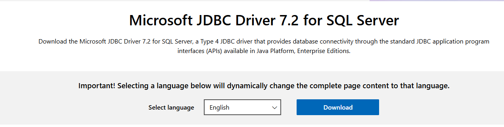

- [Setup a complete data warehouse with Spark cluster \& external Hive(MSSQL Metastore)](#setup-a-complete-data-warehouse-with-spark-cluster--external-hivemssql-metastore)
  - [For the busy people](#for-the-busy-people)
- [Details of the Setup](#details-of-the-setup)
  - [Spark Cluster Containers](#spark-cluster-containers)
  - [MSSQL 2019 Container](#mssql-2019-container)
  - [Hive Server](#hive-server)
    - [Hive-MSSQL Connection](#hive-mssql-connection)
    - [Errors:](#errors)
  - [Repository and Metastore Folder Creation](#repository-and-metastore-folder-creation)
    - [Concepts](#concepts)
- [Testing services](#testing-services)
  - [Testing Hive](#testing-hive)
- [Testing Code](#testing-code)
  - [Using spark-sql](#using-spark-sql)
  - [Using spark-shell](#using-spark-shell)
  - [Using pyspark](#using-pyspark)
    - [Commands to remember](#commands-to-remember)

# Setup a complete data warehouse with Spark cluster & external Hive(MSSQL Metastore)

Here, I will show you how to create a complete warehouse setup with a Spark Cluster and a standalone Hive with an external metastore database (MSSQL). The setup will use 5 containers:

| Containers            | Image                                       |
|----------------------|---------------------------------------------|
| Spark Master         | `spark:3.5.1-debian-12-r7`                      |
| Spark Worker 1       | `spark:3.5.1-debian-12-r7`                      |
| Spark Worker 2       | `spark:3.5.1-debian-12-r7`                      |
| MSSQL (Metastore DB) | `mcr.microsoft.com/mssql/server:2019-latest`|
| Hive Metastore       | `apache/hive:4.0.0`                         |

## For the busy people
Follow these steps to get your setup ready:

- Download the [zip](Dockerfiles/spark-hive-mssql-dockerfiles.zip) file on your laptop.
- Go to `Step1xx`, `Step2xx`, and `Step3xx` folders and run `run.bat` in each.

This will create a setup like the one shown below:


A shared volume should be present in the volumes with the mapping shown below:


Here are some important details about the setup:

| **Service**            | **URL/Connection**                                        |
|------------------------|-----------------------------------------------------------|
| Spark Master           | [http://localhost:8080/](http://localhost:8080/)          |
| Spark Worker 1         | [http://localhost:8081/](http://localhost:8081/)          |
| Spark Worker 2         | [http://localhost:8082/](http://localhost:8082/)          |
| SQL Server (SSMS)      | `localhost,1433`, SQL Server Auth: `dwdas/Passw0rd`       |

| **Configuration**      | **Details**                                                                                           |
|------------------------|-------------------------------------------------------------------------------------------------------|
| Hive Metastore URI     | `spark.hadoop.hive.metastore.uris=thrift://hive-metastore:9083`                                        |
| User and Database      | User `dwdas` (PASSWORD=`Passw0rd`), Database `hive_metastore`. `dwdas` has sudo privileges.            |
| **hive-site.xml**      | **Details**                                                                                           |
| `hive.metastore.warehouse.dir` | `/user/hive/warehouse`                                                                         |
| `javax.jdo.option.ConnectionURL` | `jdbc:sqlserver://<MSSQL_SERVER>:<PORT>;databaseName=<DATABASE_NAME>`                         |
| **spark-defaults.conf** | **Details**                                                                                          |
| `spark.sql.warehouse.dir` | `/data/spark-warehouse`                                                                            |

# Details of the Setup

## Spark Cluster Containers

First, I created the Spark cluster using the Bitnami Spark image `bitnami/spark:3.5.1-debian-12-r7`. I chose Bitnami because it is popular and offers a constant version for stability. However, you can also use `bitnami/spark:latest`.

I used a Dockerfile and docker-compose approach.

**Important steps:**

1. Created a `spark-defaults.conf` with just one setting:
   ```text
   spark.sql.warehouse.dir = /data/spark-warehouse
   ```

2. Created a `Dockerfile` with the following important activities:
   - Created a `/data` folder.
   - Copied the custom `spark-defaults.conf` to the `/conf`.
   - Created a user `dwdas` with sudo privileges and set a password for the root.

3. Created a `docker-compose.yml` file that included these changes:
   ```yaml
   volumes:
     - shared-data:/data
     - ./spark-defaults.conf:/opt/bitnami/spark/conf/spark-defaults.conf
   environment:
     - SPARK_MODE=master  # Environment variable to set the Spark mode to master
     - SPARK_LOCAL_DIRS=/data/tmp  # Local directories for Spark
   ```

4. Finally, created a `run.bat` to do the following:
   ```bat
   REM Create the Docker volume
   docker volume create shared-data

   REM Build and run the Docker Compose services
   docker-compose -p bitnami-spark-cluster build
   docker-compose -p bitnami-spark-cluster up -d
   ```

## MSSQL 2019 Container
Setting up the MSSQL container was more straightforward and required less customization than the Spark cluster. I used a Dockerfile and docker-compose approach.

Important steps:

1. Created a `Dockerfile` with the following important activities:
   - Created a user `dwdas` with the password `Passw0rd`.
   - Set the root user password to `Passw0rd`.

2. Created a `docker-compose.yml` file that included these changes:
   ```yaml
   ports:
     - "1433:1433"  # Map port 1433 of the host to port 1433 of the container for MSSQL communication.
   environment:
     - SA_PASSWORD=Passw0rd  # Set the system administrator password for MSSQL.

   networks:
     - spark-network
   ```

3. Finally, created a `run.bat` to do the following:
   ```bat
   REM Create the Docker volumes. This is mapped to all Spark containers and the Hive container.
   docker volume create shared-data

   REM Build and run the Docker Compose services
   docker-compose -p bitnami-spark-cluster build
   docker-compose -p bitnami-spark-cluster up -d

   REM Post-Setup: Create MSSQL user and database
   docker exec -it mssql-container-name /opt/mssql-tools/bin/sqlcmd -S localhost -U SA -P "Passw0rd" -Q "CREATE LOGIN dwdas WITH PASSWORD='Passw0rd'; CREATE DATABASE hive_metastore;"
   ```
> run.bat: After the container started, I created an MSSQL user `dwdas` with the password `Passw0rd` and an empty database `hive_metastore`. This was done inside the `run.bat` file.

## Hive Server

Setting up the Hive server can be very tricky. I used the official Apache Hive image with a Dockerfile and docker-compose approach.

**Important steps:**

1. **Download JDBC Driver**:
   - Downloaded `sqljdbc_7.2.2.0_enu.tar.gz` from [Microsoft Download Center](https://www.microsoft.com/en-us/download/details.aspx?id=57782).
    
    

   - Extracted the `mssql-jdbc-7.2.2.jre8.jar` driver to the current folder.

2. **Create a custom `hive-site.xml`**: Created a custom `hive-site.xml` with MSSQL connection information and directory configurations. Refer to the Step3-Hive/hive-site.xml in the setup folder for more details.

3. **Create a Dockerfile**: Refer to the dockerfile in Step3-Hive folder for more details. Apart from usual activity these two steps are most immortant. I.e. placing the driver to the /lib and hive-site.xml to conf.
   ```dockerfile
   COPY ./mssql-jdbc-7.2.2.jre8.jar /opt/hive/lib/
   COPY ./hive-site.xml /opt/hive/conf/
   ```

4. **Docker-compose Configuration**: Apart from usual stuff the most important was to  the environment variable `DB_DRIVER=mssql`.

5. **Run.bat**:
   - The `run.bat` script builds the images, runs the container, and copies `hive-site.xml` to the Spark master container.
   - Additinally it copies the custom hive-site.xml  to all the spark containers with three  commands like this:
   ```sh
   docker cp ./hive-site.xml <spark master, worker 1&2>:/opt/bitnami/spark/conf/hive-site.xml
   ```

### Hive-MSSQL Connection

Apache Hive containers usually use a startup script called '/entrypoint.sh'. This script is set to use **Derby**(*${DB_DRIVER:=derby}*) database by default. To use MSSQL instead:

1. Change the DB_DRIVER environment variable to 'mssql'.
4. Create an empty database called 'hive_metastore' on your MSSQL server.
2. Put your MSSQL connection and db  details in the 'hive-site.xml' file.
3. Add the MSSQL driver file (mssql-jdbc-7.2.2.jre8.jar) to the '/lib' folder.

**/entrypoint.sh**
```shell
#!/bin/bash
set -x

: ${DB_DRIVER:=derby}

SKIP_SCHEMA_INIT="${IS_RESUME:-false}"

function initialize_hive {
  COMMAND="-initOrUpgradeSchema"
  if [ "$(echo "$HIVE_VER" | cut -d '.' -f1)" -lt "4" ]; then
     COMMAND="-${SCHEMA_COMMAND:-initSchema}"
  fi
  $HIVE_HOME/bin/schematool -dbType $DB_DRIVER $COMMAND
  if [ $? -eq 0 ]; then
    echo "Initialized schema successfully.."
  else
    echo "Schema initialization failed!"
    exit 1
  fi
}
# Additional script content...
```
So, how I did this:

1. During mssql creation I already creatd the hive_metastore empty database and the user
2. The dockerfile managed the copying of the driver and the custom hive-site.xml
   ```dockerfile
   COPY ./mssql-jdbc-7.2.2.jre8.jar /opt/hive/lib/
   COPY ./hive-site.xml /opt/hive/conf/
   ```
3. docker-compose managed set the  `DB_DRIVER=mssql`

**Note:** An alternative approach to achieve the same feature would be to:

1. Let the container start with the default settings.
2. Open `/entrypoint.sh` and change `${DB_DRIVER:=mssql}`.
3. Run `su -c "chmod 777 /entrypoint.sh"` with the password `Passw0rd` as the permission will change.
4. Copy `hive-site.xml` containing MSSQL connection info to `/opt/hive/conf/`.
5. Restart the container.
---

### Errors:

If DB_DRIVER=derby in env var but hive-site.xml has no mssql connection:


## Repository and Metastore Folder Creation

We have two options to decide on the folder structure:

**Our choice:** Separate warehouses for Spark and Hive
1. Keep Hive warehouse as is:
   - In `hive-site.xml`:
     ```xml
     <property>
       <name>hive.metastore.warehouse.dir</name>
       <value>/data/hive/warehouse</value>
     </property>
     ```
2. Set a different warehouse for Spark:
   - In Spark configuration:
    ```
     spark.sql.warehouse.dir=/data/spark/warehouse
     ```
```
/data
├── hive-warehouse/
│   └── (Hive-managed tables)
├── spark-warehouse/
│   └── (Spark-managed tables, if using separate warehouses)
└── external-tables/
    └── (External table data for both Spark and Hive)
```

**Option 2:** Use Hive Warehouse for both Spark and Hive
1. Configure Spark to use the Hive metastore:
   - Set `spark.sql.hive.metastore.version` and `spark.sql.hive.metastore.jars` in Spark configuration.
2. Use the same warehouse directory for both:
   - In `hive-site.xml`:
     ```xml
     <property>
       <name>hive.metastore.warehouse.dir</name>
       <value>/data/spark-warehouse</value>
     </property>
     ```
   - In Spark configuration. Using(`spark-defaults.conf`) or setting during session etc.
     ```
     spark.sql.warehouse.dir=/data/spark-warehouse
     ```

### Concepts
**Hive Warehouse**
   - This is the default location where Hive stores table data.
   - Typically located at `/user/hive/warehouse` in HDFS, or a specified local path if you're not using HDFS.
   - Defined by the `hive.metastore.warehouse.dir` property in `hive-site.xml`.

**Spark Warehouse**:
   - This is the default location where Spark SQL stores table data when not using Hive.
   - By default, it's a directory named `spark-warehouse` in the current working directory.
   - Can be configured using the `spark.sql.warehouse.dir` property.


# Testing services

## Testing Hive


# Testing Code


## Using spark-sql
spark-sql \
    --conf spark.sql.extensions=org.apache.iceberg.spark.extensions.IcebergSparkSessionExtensions \
    --conf spark.sql.catalog.ice_test2=org.apache.iceberg.spark.SparkSessionCatalog \
    --conf spark.sql.catalog.ice_test2.type=hive \
    --conf spark.sql.catalog.ice_test2.uri=thrift://hive-metastore:9083
## Using spark-shell

I read that Spark-SQL uses Hive metastore under the cover? Is this true? I'm talking about a pure Spark-SQL application that does not explicitly connect to any Hive installation.

Spark SQL does not use a Hive metastore under the covers (and defaults to in-memory non-Hive catalogs unless you're in spark-shell that does the opposite).

```shell
spark-shell --conf spark.sql.catalogImplementation=hive --conf spark.hadoop.hive.metastore.uris=thrift://hive-metastore:9083
```
spark-shell --conf spark.sql.catalogImplementation=in-memory--conf spark.sql.catalogImplementation=in-memory

Note: To make it permanent put it in /opt/bitnami/spark/conf/`spark-defaults.conf`

```javascript
spark.sql.catalogImplementation=hive
spark.hadoop.hive.metastore.uris=thrift://hive-metastore:9083
```
## Using pyspark

### Commands to remember
**Spark-shell:**
spark.conf.getAll.foreach(println)

```scala
scala> spark
org.apache.spark.sql.SparkSession

scala> spark.version
res0: String = 2.4.0

scala> spark.sharedState.externalCatalog
org.apache.spark.sql.catalyst.catalog.ExternalCatalogWithListener

scala> println(spark.sharedState.externalCatalog.unwrapped)
org.apache.spark.sql.hive.HiveExternalCatalog@49d5b651
```
// Get the current warehouse directory
val warehouseDir = spark.conf.get("spark.sql.warehouse.dir", "Not Set")
println(s"Current Warehouse Directory: $warehouseDir")

// Get the current catalog implementation
val catalogImpl = spark.conf.get("spark.sql.catalogImplementation", "Not Set")
println(s"Current Catalog Implementation: $catalogImpl")

// Get the Hive metastore URI
val metastoreUri = spark.conf.get("spark.hadoop.hive.metastore.uris", "Not Set")
println(s"Current Hive Metastore URI: $metastoreUri")


