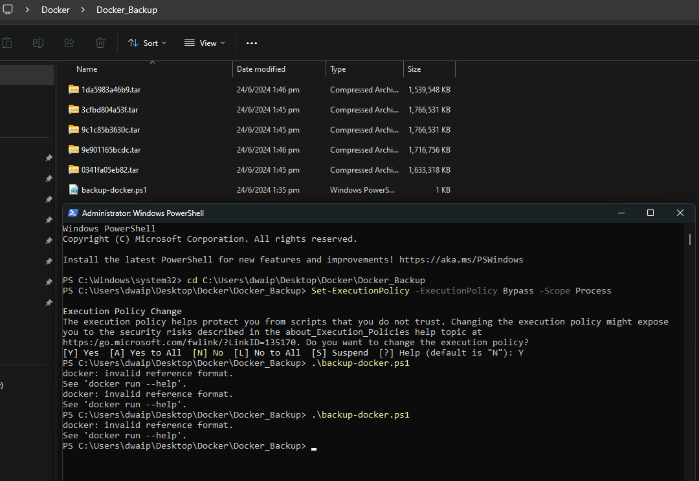

- [Understanding Dockerfile CMD and ENTRYPOINT Instructions](#understanding-dockerfile-cmd-and-entrypoint-instructions)
  - [What is ENTRYPOINT?](#what-is-entrypoint)
  - [What is CMD?](#what-is-cmd)
  - [Key Differences Between ENTRYPOINT and CMD](#key-differences-between-entrypoint-and-cmd)
- [Docker PS Error](#docker-ps-error)
  - [For Our Windows Users:](#for-our-windows-users)
  - [For Our Mac Users:](#for-our-mac-users)
- [Backup entire docker to your laptop](#backup-entire-docker-to-your-laptop)
  - [Save Docker Containers, Images, and Volumes on Mac/Linux](#save-docker-containers-images-and-volumes-on-maclinux)
  - [Save Docker Containers, Images, and Volumes on Windows](#save-docker-containers-images-and-volumes-on-windows)


# Understanding Dockerfile CMD and ENTRYPOINT Instructions

CMD and ENTRYPOINT are important Dockerfile instructions that define what command runs when a Docker container starts. Here, I will try to explain the concepts:
## What is ENTRYPOINT?

ENTRYPOINT sets the main process that will run inside the container. For example:
```dockerfile
ENTRYPOINT ["/usr/bin/my-app"]
```
In this case, `/usr/bin/my-app` is the process that will run when the container starts.

## What is CMD?

CMD specifies the default arguments for the ENTRYPOINT process. For instance:
```dockerfile
ENTRYPOINT ["/usr/bin/my-app"]
CMD ["help"]
```
Here, `help` is passed as an argument to `/usr/bin/my-app`.

## Key Differences Between ENTRYPOINT and CMD

- **ENTRYPOINT**: Defines the main process to run in the container.
- **CMD**: Provides default arguments for the ENTRYPOINT process.
- **Override**:
  - CMD can be easily overridden by passing arguments in the `docker run` command.
  - ENTRYPOINT can be changed using the `--entrypoint` flag in `docker run`, but this is rarely necessary.

# Docker PS Error
## For Our Windows Users:

1. **Verify Docker's Installation Path:** 
   - Navigate to `C:\Program Files\Docker\Docker\resources\bin` via your command prompt or PowerShell. 
   - While you're there, try running `docker ps`. If it responds, you're in luck! If not, let's move to the next step.

2. **Update the System PATH:** 
   - Sometimes, Windows isn't aware of where Docker is. We'll need to tell it.
   - Open 'System Properties' by right-clicking on the Windows start button and selecting 'System'.
   - Click on 'Advanced system settings', then choose 'Environment Variables'.
   - Locate the PATH variable under 'System Variables'. Click on it and then select 'Edit'.
   - Add a new entry with the path: `C:\Program Files\Docker\Docker\resources\bin`.
   - Confirm with 'OK'.

3. **Using PowerShell to Update the PATH:** 
   - If you're a fan of PowerShell, you can also add the path using the following command:
     ```powershell
     [Environment]::SetEnvironmentVariable("PATH", $env:PATH + ";C:\Program Files\Docker\Docker\resources\bin", "Machine")
     ```
4. **Check** if its running now. Just open command prompt and run `docker ps`. You should get some output. For example:


## For Our Mac Users:

1. **Verify Docker's Installation:** 
   - Open your terminal and type in `docker --version`. This ensures that Docker is installed.
   
2. **Is Docker Running?** 
   - Check if the Docker Desktop application is running. If it's not, fire it up!

3. **Update the Shell's PATH:** 
   - Sometimes, the shell doesn’t know where Docker is located. To fix this:
     ```bash
     echo "export PATH=/usr/local/bin:$PATH" >> ~/.bash_profile
     source ~/.bash_profile
     ```

4. **Final Check:** 
   - Close and reopen your terminal, then try `docker ps`. If all's well, it should work!

# Backup entire docker to your laptop
## Save Docker Containers, Images, and Volumes on Mac/Linux

To back up Docker containers, images, and volumes on Mac/Linux, you can use the following script:

```sh
#!/bin/bash

# Create directories to store backups
mkdir -p docker_image_backups docker_container_backups docker_volume_backups

# Backup Docker images
for image in $(docker images --format "{{.Repository}}:{{.Tag}}"); do
  sanitized_image_name=$(echo $image | tr / _)
  docker save -o docker_image_backups/${sanitized_image_name}.tar $image
done

# Backup Docker containers
for container in $(docker ps -a --format "{{.Names}}"); do
  docker export -o docker_container_backups/${container}.tar $container
done

# Backup Docker volumes
for volume in $(docker volume ls --format "{{.Name}}"); do
  docker run --rm -v ${volume}:/volume -v $(pwd)/docker_volume_backups:/backup alpine sh -c "cd /volume && tar czf /backup/${volume}.tar.gz ."
done

# Create a single tarball containing all backups
tar czf docker_backup_$(date +%Y%m%d).tar.gz docker_image_backups docker_container_backups docker_volume_backups

echo "Backup completed successfully!"
```

To run the script:

1. Save the script to a file, e.g., `backup_docker.sh`.
2. Make the script executable:

   ```sh
   chmod +x backup_docker.sh
   ```

3. Run the script:

   ```sh
   ./backup_docker.sh
   ```

This will create a full backup of all Docker images, containers, and volumes.

## Save Docker Containers, Images, and Volumes on Windows

To back up Docker containers, images, and volumes on Windows, follow these steps:

1. Create a folder and save the following content as `backup_docker.ps1`:

    ```powershell
    # Backup Docker Images
    docker images -q | ForEach-Object { docker save -o "$($_).tar" $_ }

    # Backup Running Containers
    docker ps -q | ForEach-Object { docker export -o "$($_).tar" $_ }

    # Backup Docker Volumes
    $volumes = docker volume ls -q
    foreach ($volume in $volumes) {
        docker run --rm -v ${volume}:/volume -v $(pwd):/backup ubuntu tar cvf /backup/${volume}_backup.tar /volume
    }

    # Backup Docker Configurations
    Copy-Item -Path "C:\path\to\your\docker\configurations" -Destination "C:\path\to\your\backup\location" -Recurse
    ```

2. Open PowerShell with administrative privileges and navigate to the folder you created:

    ```powershell
    cd path\to\your\folder
    ```

3. Set the execution policy to allow the script to run temporarily:

    ```powershell
    Set-ExecutionPolicy -ExecutionPolicy Bypass -Scope Process
    ```

4. Run the script:

    ```powershell
    .\backup_docker.ps1
    ```

This way you can back up all your Docker containers, images, and volumes to the current folder.

