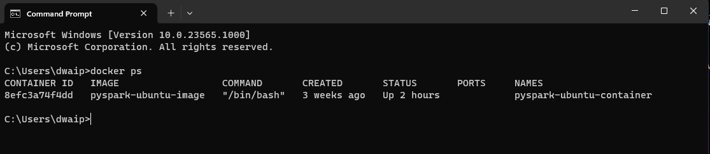

## Table of contents
- [Overview](#overview)
    - [For Our Windows Users:](#for-our-windows-users)
    - [For Our Mac Users:](#for-our-mac-users)


# Overview


## Understanding Dockerfile CMD and ENTRYPOINT Instructions

CMD and ENTRYPOINT are important Dockerfile instructions that define what command runs when a Docker container starts. Here, I will try to explain the concepts:
### What is ENTRYPOINT?

ENTRYPOINT sets the main process that will run inside the container. For example:
```dockerfile
ENTRYPOINT ["/usr/bin/my-app"]
```
In this case, `/usr/bin/my-app` is the process that will run when the container starts.

### What is CMD?

CMD specifies the default arguments for the ENTRYPOINT process. For instance:
```dockerfile
ENTRYPOINT ["/usr/bin/my-app"]
CMD ["help"]
```
Here, `help` is passed as an argument to `/usr/bin/my-app`.

### Key Differences Between ENTRYPOINT and CMD

- **ENTRYPOINT**: Defines the main process to run in the container.
- **CMD**: Provides default arguments for the ENTRYPOINT process.
- **Override**:
  - CMD can be easily overridden by passing arguments in the `docker run` command.
  - ENTRYPOINT can be changed using the `--entrypoint` flag in `docker run`, but this is rarely necessary.

### Examples

#### Example 1: Using ENTRYPOINT

```dockerfile
FROM alpine:latest
ENTRYPOINT ["ls"]
```
Build and run:
```bash
$ docker build -t entrypoint-demo .
$ docker run entrypoint-demo
```
This runs the `ls` command in the container.

#### Example 2: Using CMD

```dockerfile
FROM alpine:latest
CMD ["ls"]
```
Build and run:
```bash
$ docker build -t cmd-demo .
$ docker run cmd-demo
```
This runs `ls` using the default shell (`/bin/sh -c`).

#### Example 3: Using ENTRYPOINT and CMD Together

```dockerfile
FROM alpine:latest
ENTRYPOINT ["ls"]
CMD ["-alh"]
```
Build and run:
```bash
$ docker build -t entrypoint-cmd-demo .
$ docker run entrypoint-cmd-demo
```
This runs `ls -alh` in the container.

### Conclusion

ENTRYPOINT sets the process to run, while CMD sets the default arguments. Use ENTRYPOINT for the main application and CMD for default arguments to make Docker images flexible and user-friendly.

## Docker PS Error
### For Our Windows Users:

1. **Verify Docker's Installation Path:** 
   - Navigate to `C:\Program Files\Docker\Docker\resources\bin` via your command prompt or PowerShell. 
   - While you're there, try running `docker ps`. If it responds, you're in luck! If not, let's move to the next step.

2. **Update the System PATH:** 
   - Sometimes, Windows isn't aware of where Docker is. We'll need to tell it.
   - Open 'System Properties' by right-clicking on the Windows start button and selecting 'System'.
   - Click on 'Advanced system settings', then choose 'Environment Variables'.
   - Locate the PATH variable under 'System Variables'. Click on it and then select 'Edit'.
   - Add a new entry with the path: `C:\Program Files\Docker\Docker\resources\bin`.
   - Confirm with 'OK'.

3. **Using PowerShell to Update the PATH:** 
   - If you're a fan of PowerShell, you can also add the path using the following command:
     ```powershell
     [Environment]::SetEnvironmentVariable("PATH", $env:PATH + ";C:\Program Files\Docker\Docker\resources\bin", "Machine")
     ```
4. **Check** if its running now. Just open command prompt and run `docker ps`. You should get some output. For example:




### For Our Mac Users:

1. **Verify Docker's Installation:** 
   - Open your terminal and type in `docker --version`. This ensures that Docker is installed.
   
2. **Is Docker Running?** 
   - Check if the Docker Desktop application is running. If it's not, fire it up!

3. **Update the Shell's PATH:** 
   - Sometimes, the shell doesn’t know where Docker is located. To fix this:
     ```bash
     echo "export PATH=/usr/local/bin:$PATH" >> ~/.bash_profile
     source ~/.bash_profile
     ```

4. **Final Check:** 
   - Close and reopen your terminal, then try `docker ps`. If all's well, it should work!

If you wish to reach out, please email me at <a href="mailto:das.d@hotmail.com">das.d@hotmail.com</a>. Thanks!