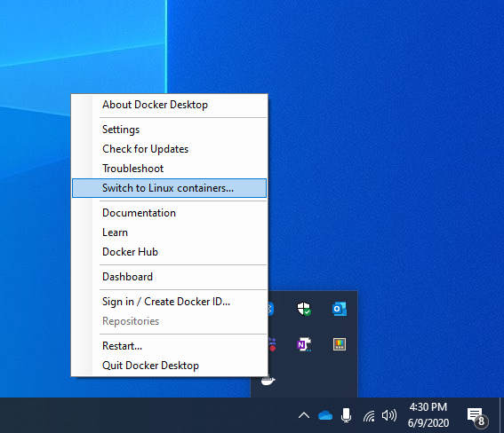
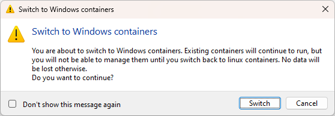

# <span style="color: blueviolet;Font-family: Segoe UI, sans-serif;">Running Windows OS as a Container in Docker</span>

When you think of containers, you usually picture a small Linux OS. And you’re right! But did you know that containers can run a small Windows OS too?

## <span style="color: MediumOrchid;Font-family: Segoe UI, sans-serif;">Switching Docker Desktop to Windows Mode</span>

For most of your tasks, you've likely been using Docker containers, which are typically Linux-based. Running a Windows container might seem unusual. By default, Docker on your Windows machine operates in 'Linux mode.' To run Windows containers, you'll need to switch from this default Linux mode to Windows mode.


And you can switch back to Linux containers easily.



**Note:** When you switch to Windows mode, you won’t be able to see your Linux containers.



## <span style="color: MediumOrchid;Font-family: Segoe UI, sans-serif;">Switching Using Command Line</span>

You can also switch using the command line:

```powershell
& $Env:ProgramFiles\Docker\Docker\DockerCli.exe -SwitchDaemon
```

## <span style="color: MediumOrchid;Font-family: Segoe UI, sans-serif;">Further Reading</span>

For more information, check out: [Windows Containers Documentation](https://learn.microsoft.com/en-us/virtualization/windowscontainers/)

## <span style="color: MediumOrchid;Font-family: Segoe UI, sans-serif;">Microsoft Base Images</span>

Microsoft offers several base images to start building your own container images:

- **Windows**: Contains the full set of Windows APIs and system services (excluding server roles).
- **Windows Server**: Contains the full set of Windows APIs and system services.
- **Windows Server Core**: A smaller image with a subset of Windows Server APIs, including the full .NET framework and most server roles (excluding some like Fax Server).
- **Nano Server**: The smallest Windows Server image, supporting .NET Core APIs and some server roles.

## <span style="color: MediumOrchid;Font-family: Segoe UI, sans-serif;">Ready-Made Bundles</span>

Microsoft offers ready-made bundles that combine Windows Server 2022 with apps like MongoDB.

For example, if you need MongoDB on Windows Server 2022, you can use this [Dockerfile](https://github.com/MicrosoftDocs/Virtualization-Documentation/tree/main/windows-container-samples/mongodb).

## <span style="color: MediumOrchid;Font-family: Segoe UI, sans-serif;">Other Combinations</span>

Other combinations you can create include:

- aspnet
- iis
- Django
- apache-http-php
- nginx
- dotnet35
- golang
- nodejs
- python
- python-django
- rails
- ruby
- server-jre-8u51-windows-x64
- mongodb
- mysql
- redis
- sqlite
- sqlserver-express
- PowerShellDSC_iis-10.0

Now you know that containers are not just small Linux OSs. They can be a mini Windows OS too!