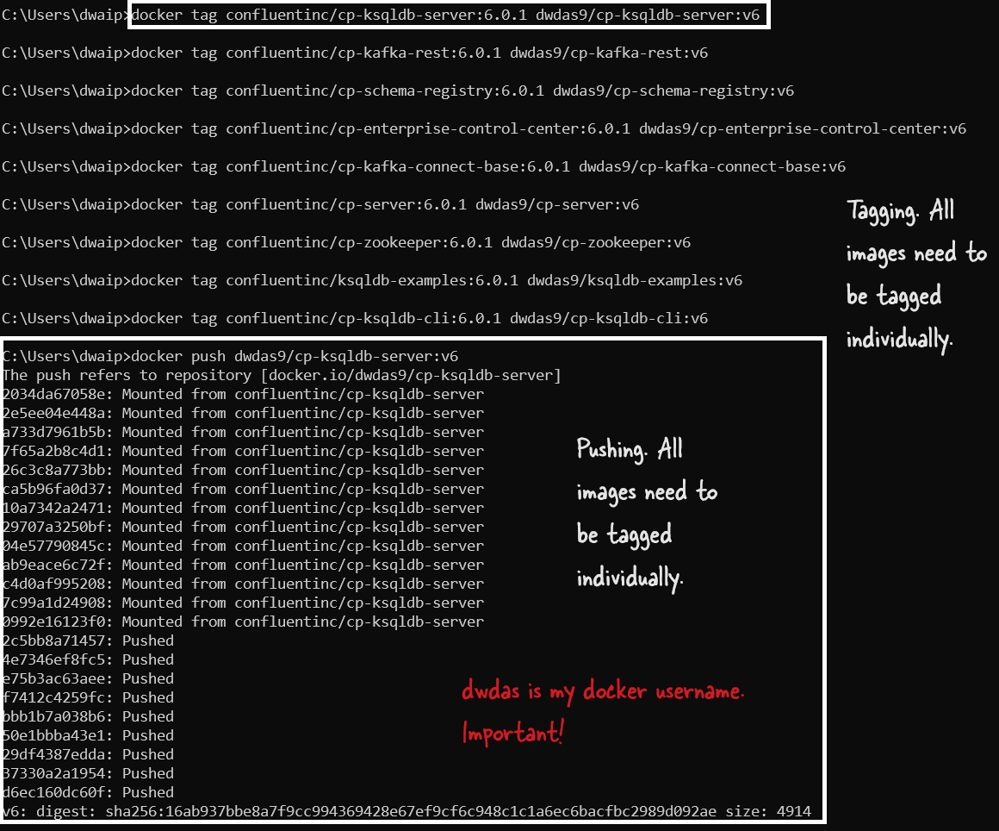

# How I push customized Images to Docker Hub(Website)

Recently, I set up a Kafka environment using the base images from Confluent. After tweaking and customizing these images to fit my specific needs, I realized that these modified images should be pushed to Docker Hub so I can easily reuse them later or share them with others. I had 9 images in total, so here’s the process I followed.

### Step 1: Log In to Docker Hub

The first thing I did was log in to Docker Hub using my Docker Hub username, `dwdas9`.

```bash
docker login
```

It asked for my Docker Hub username and password, and once I provided those, I was logged in.

### Step 2: Find the Image Names

To push the images, I needed to know their names. I used the following command to list all the Docker images on my local machine:

```bash
docker images
```

This command gave me a list of all the images, including their names, tags, and IDs. I picked out the relevant images that I had customized.

### Step 3: Tag the Images

Before I could push the images, I had to tag them with my Docker Hub username and the repository name I wanted them to go into. Here’s how I did it for each of the 9 images:

```bash
docker tag confluentinc/cp-ksqldb-server:6.0.1 dwdas9/cp-ksqldb-server:v6
docker tag confluentinc/cp-kafka-rest:6.0.1 dwdas9/cp-kafka-rest:v6
docker tag confluentinc/cp-schema-registry:6.0.1 dwdas9/cp-schema-registry:v6
docker tag confluentinc/cp-enterprise-control-center:6.0.1 dwdas9/cp-enterprise-control-center:v6
docker tag confluentinc/cp-kafka-connect-base:6.0.1 dwdas9/cp-kafka-connect-base:v6
docker tag confluentinc/cp-server:6.0.1 dwdas9/cp-server:v6
docker tag confluentinc/cp-zookeeper:6.0.1 dwdas9/cp-zookeeper:v6
docker tag confluentinc/ksqldb-examples:6.0.1 dwdas9/ksqldb-examples:v6
docker tag confluentinc/cp-ksqldb-cli:6.0.1 dwdas9/cp-ksqldb-cli:v6
```

I replaced `confluentinc` with my username `dwdas9` and added a custom tag `v6` to each image.

### Step 4: Push the Images to Docker Hub

With the images tagged, the next step was to push them to Docker Hub. I ran the following commands:

```bash
docker push dwdas9/cp-ksqldb-server:v6
docker push dwdas9/cp-kafka-rest:v6
docker push dwdas9/cp-schema-registry:v6
docker push dwdas9/cp-enterprise-control-center:v6
docker push dwdas9/cp-kafka-connect-base:v6
docker push dwdas9/cp-server:v6
docker push dwdas9/cp-zookeeper:v6
docker push dwdas9/ksqldb-examples:v6
docker push dwdas9/cp-ksqldb-cli:v6
```

Docker started uploading each image to the repository. Once the upload was complete, I could see all my modified images on Docker Hub under my account.



### Conclusion

And that’s it! Now, my customized Kafka environment images are safely stored on Docker Hub, ready to be pulled down whenever I need them. If you’re working on something similar, these steps should help you push your images too.