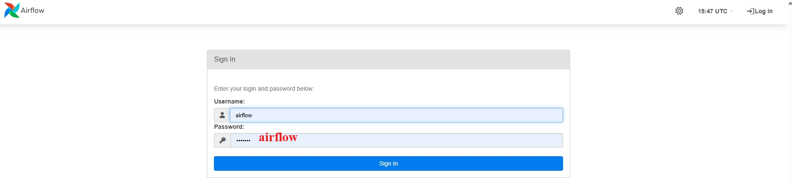
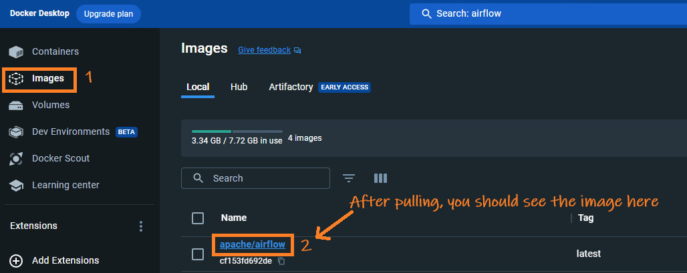
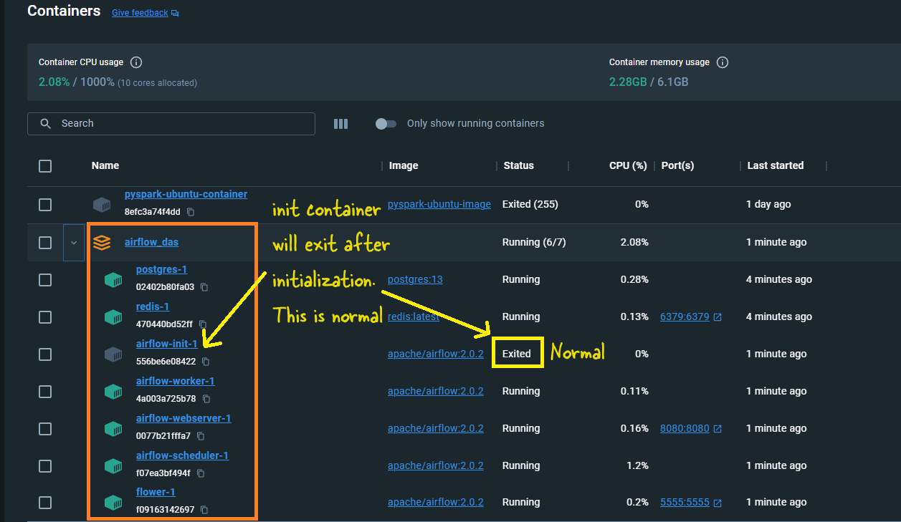

# <span style="color: MediumSlateBlue;">Apache Airflow on Windows Docker</span>

Here, I will show you how to install Airflow on a Docker container using two methods:
### <span style="color: gray; font-family: Segoe UI, sans-serif;">**Method 1: Simple Development Setup**</span>
- **Single Container**: This method runs everything inside **one container**. It includes all Airflow services like the scheduler, webserver, worker, etc., bundled together.
- **Database**: Uses **SQLite** as the database
- **Docker Volume**: A Docker volume is used to store data.

### <span style="color: gray; font-family: Segoe UI, sans-serif;">**Method 2: Full Production Setup**</span>
- **Number of Containers**: This method sets up **seven containers**. These include:
  - **Scheduler**: Manages task scheduling.
  - **Webserver**: Provides the Airflow user interface.
  - **Worker**: Executes the tasks.
  - **PostgreSQL**: Used as the database to store metadata.
  - **Redis**: Acts as a message broker between the components.
  - **Triggerer**: Manages task triggering.
  - **Flower**: For monitoring the Celery workers.
- **Local Folders**: Data is stored in local(laptop) folders.


## <span style="color: #003366;font-family: Segoe UI, sans-serif;">Method 1 - Simple Development Setup</span>


### <span style="color: #003366;font-family: Segoe UI, sans-serif;">Download Airflow Docker Image</span>
Run the following command in your command prompt or power shell to pull the latest Airflow Docker image: `docker pull apache/airflow:latest`

  

### <span style="color: #003366;font-family: Segoe UI, sans-serif;">Create a Docker Volume</span>
Execute this command to create a Docker volume named `airflow-volume` for data persistence: `docker volume create airflow-volume`

### <span style="color: #003366;font-family: Segoe UI, sans-serif;">Initialize Airflow Database</span>
Initialize the Airflow database using the following two commands:
```bash
docker run --rm --network dasnet -v airflow-volume:/opt/airflow apache/airflow:latest db init
```
```bash
docker run --rm --network dasnet -v airflow-volume:/opt/airflow apache/airflow:latest users create  --username airflow  --firstname FIRST_NAME  --lastname LAST_NAME   --role Admin   --email admin@example.com   --password airflow
```
> Note: I use a network dasnet. Hence --network part. You can totally remove the --network.

### <span style="color: #003366;font-family: Segoe UI, sans-serif;">Start the Airflow Webserver</span>
To start the Airflow webserver, use this command:

```bash
docker run -d --name airflow --network dasnet -p 8080:8080 -e AIRFLOW_UID=50000 -v airflow-volume:/opt/airflow apache/airflow:latest webserver
```


> Note: I use a network dasnet. Hence --network part. You can totally remove the --network.

### <span style="color: #003366;font-family: Segoe UI, sans-serif;">Login into Airflow UI</span>

To login open [http://localhost:8080](http://localhost:8080) and enter credential: **airflow/airflow**

## <span style="color: #695ED6; font-family: Segoe UI, sans-serif;">Method 2 - Full Production Setup</span>


### <span style="color: #574BB3; font-family: Segoe UI, sans-serif;">Create Required Folders</span>

- Create a base directory, anywhere, for Airflow, e.g., `C:\Airflow_Das`.
- Within this directory, create three subdirectories: `dags`, `plugins`, and `logs`.

### <span style="color: #574BB3; font-family: Segoe UI, sans-serif;">Download the Docker Compose File</span>

- Save the  `docker-compose.yaml` from [link](https://airflow.apache.org/docs/apache-airflow/2.7.2/docker-compose.yaml) to `Airflow_Das` folder. 

  


#### Note on `docker-compose.yaml`
- When this article was written, the Airflow image used was `apache/airflow:2.7.2`. You can find the relevant `docker-compose.yaml` file [here](https://airflow.apache.org/docs/apache-airflow/2.7.2/docker-compose.yaml).
- If the link doesn’t work, visit the [Apache Airflow site](https://airflow.apache.org) and search for the latest `docker-compose.yaml`.


### <span style="color: #574BB3; font-family: Segoe UI, sans-serif;">Initialize and Run Airflow</span>
- Open PowerShell(with admin priv) and **cd** to `Airflow_Das`
- Run command: `docker-compose up airflow-init`
     
- Then run command: `docker-compose up`
     
   You can see the logs cascading down your PowerShell window. Wait a few seconds and then you can safely close the window.

### <span style="color: #574BB3; font-family: Segoe UI, sans-serif;">Verify the Installation</span>
- On Docker Desktop, look for a container named `Airflow_Das`, containing seven subcontainers.

    

- Open `localhost:8080` in a web browser.
- Log in with the username and password: `airflow`.
    

### <span style="color: #574BB3; font-family: Segoe UI, sans-serif;">Components Installed</span>

The table shows some important components of our Airflow setup.

| **Component** | **What It Does** | **Environment Variables** | **Folders** | **Ports** | **Command** | **Locations Inside Container** |
|---------------|-----------------|---------------------------|-------------|-----------|-------------|------------------------------|
| **Webserver** | The main part of Airflow where you can see and manage your workflows, logs, etc. | `AIRFLOW__CORE__EXECUTOR` (sets the type of executor), `AIRFLOW__WEBSERVER__WORKERS` (number of workers) | `./dags:/opt/airflow/dags`, `./logs:/opt/airflow/logs`, `./plugins:/opt/airflow/plugins` | `8080:8080` | `airflow webserver` | `/opt/airflow` (inside container) |
| **Scheduler** | Handles the scheduling of workflows, making sure tasks run on time. | `AIRFLOW__SCHEDULER__DAG_DIR_LIST_INTERVAL` (how often to check the DAG folder) | `./dags:/opt/airflow/dags`, `./logs:/opt/airflow/logs`, `./plugins:/opt/airflow/plugins` | N/A | `airflow scheduler` | `/opt/airflow` |
| **Worker** | Runs the tasks in the workflows. Needed when using CeleryExecutor. | `AIRFLOW__CORE__EXECUTOR` (CeleryExecutor), `AIRFLOW__CELERY__BROKER_URL` (URL for Celery broker) | `./dags:/opt/airflow/dags`, `./logs:/opt/airflow/logs`, `./plugins:/opt/airflow/plugins` | N/A | `airflow celery worker` | `/opt/airflow` |
| **Postgres** | The database that stores all the Airflow information like DAGs, task statuses, etc. | `POSTGRES_USER=airflow`, `POSTGRES_PASSWORD=airflow`, `POSTGRES_DB=airflow` | `postgres_data:/var/lib/postgresql/data` | N/A | `postgres` | `/var/lib/postgresql/data` |
| **Redis** | A messaging service that helps workers communicate with each other when using CeleryExecutor. | `REDIS_PASSWORD=redis_password` (if you want to secure it) | `redis_data:/data` | N/A | `redis-server` | `/data` |
| **Flower** | A tool to monitor and manage Celery workers and tasks. | `FLOWER_BASIC_AUTH=admin:password` (to secure it) | N/A | `5555:5555` | `flower` | N/A |

© D Das  
📧 [das.d@hotmail.com](mailto:das.d@hotmail.com) | [ddasdocs@gmail.com](mailto:ddasdocs@gmail.com)