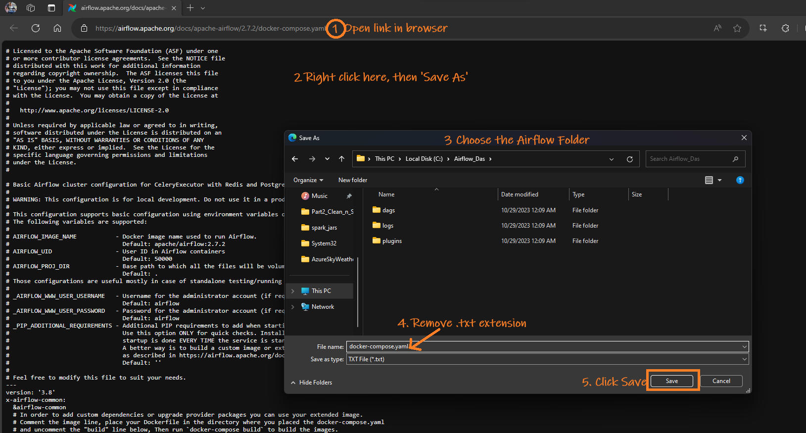
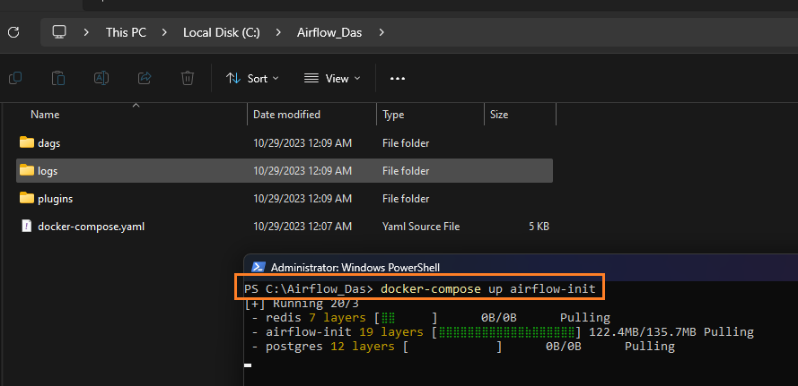

## Table of Contents

- [Setting Up Apache Airflow with Docker on Windows](#setting-up-apache-airflow-with-docker-on-windows)
  - [Method 1 - With Local Mounted Folders](#method-1---with-local-mounted-folders)
    - [Create Required Folders](#create-required-folders)
    - [Download the Docker Compose File](#download-the-docker-compose-file)
      - [Note on `docker-compose.yaml`](#note-on-docker-composeyaml)
    - [Initialize and Run Airflow](#initialize-and-run-airflow)
    - [Verify the Installation](#verify-the-installation)
  - [Method 2 - Using a Docker volume for data persistence](#method-2---using-a-docker-volume-for-data-persistence)
    - [Download Airflow Docker Image](#download-airflow-docker-image)
    - [Create a Docker Volume](#create-a-docker-volume)
    - [Initialize Airflow Database](#initialize-airflow-database)
    - [Start the Airflow Webserver](#start-the-airflow-webserver)
  - [Key Components of the setup:](#key-components-of-the-setup)


# <span style="color: MediumSlateBlue;">Setting Up Apache Airflow with Docker on Windows</span>

Here, I will show you how to install Airflow on a Docker container using two methods:

- **Method 1**: In this method, folders from your local laptop will be mounted to store data permanently. This setup is more suitable for production environments, as it helps avoid data loss, especially for important services like Postgres and Redis.
- **Method 2**: In this method, Docker volumes will be used to store data. This method is very simple and more suitable for development purposes.

## <span style="color: #695ED6; font-family: Segoe UI, sans-serif;">Method 1 - With Local Mounted Folders</span>

<p style="color: #006600; font-family: 'Trebuchet MS', Helvetica, sans-serif; background-color: #e6ffe6; padding: 15px; border-left: 5px solid #00cc66;">
Make sure you already have Docker Desktop installed.
</p>


### <span style="color: #574BB3; font-family: Segoe UI, sans-serif;">Create Required Folders</span>
</span>
- Create a base directory, anywhere, for Airflow, e.g., `C:\Airflow_Das`.
- Within this directory, create three subdirectories: `dags`, `plugins`, and `logs`.

### <span style="color: #574BB3; font-family: Segoe UI, sans-serif;">Download the Docker Compose File</span>

- Save the  `docker-compose.yaml` from [link](https://airflow.apache.org/docs/apache-airflow/2.7.2/docker-compose.yaml) to `Airflow_Das` folder. 
  

#### Note on `docker-compose.yaml`
- When this article was written, the Airflow image used was `apache/airflow:2.7.2`. You can find the relevant `docker-compose.yaml` file [here](https://airflow.apache.org/docs/apache-airflow/2.7.2/docker-compose.yaml).
- If the link doesn’t work, visit the [Apache Airflow site](https://airflow.apache.org) and search for the latest `docker-compose.yaml`.


### <span style="color: #574BB3; font-family: Segoe UI, sans-serif;">Initialize and Run Airflow</span>
- Open PowerShell(with admin priv) and **cd** to `Airflow_Das`
- Execute:
   ```powershell
   docker-compose up airflow-init
   ```
   
- Follow it with:
   ```powershell
   docker-compose up
   ```
   
   You can see the logs cascading down your PowerShell window. Wait a few seconds and then you can safely close the window.

### <span style="color: #574BB3; font-family: Segoe UI, sans-serif;">Verify the Installation</span>
- On Docker Desktop, look for a container named `Airflow_Das`, containing seven subcontainers.

    

- Open `localhost:8080` in a web browser.
- Log in with the username and password: `airflow`.
  

## <span style="color: #003366;font-family: Segoe UI, sans-serif;">Method 2 - Using a Docker volume for data persistence</span>

<p style="color: #004d99; font-family: 'Trebuchet MS', Helvetica, sans-serif; background-color: #e6f7ff; padding: 15px; border-left: 5px solid #3399ff;">
In Method 1 I showed how to install Airflow and use your local folder to store data permanently. Here, we will the same method but, store the data in Docker Volume and not on local laptop.
</p>

> Make sure you have Docker Desktop installed already

### <span style="color: #003366;font-family: Segoe UI, sans-serif;">Download Airflow Docker Image</span>
Run the following command in your command prompt or power shell to pull the latest Airflow Docker image:
```bash
docker pull apache/airflow:latest
```


### <span style="color: #003366;font-family: Segoe UI, sans-serif;">Create a Docker Volume</span>
Execute this command to create a Docker volume named `airflow-volume` for data persistence:
```bash
docker volume create airflow-volume
```

### <span style="color: #003366;font-family: Segoe UI, sans-serif;">Initialize Airflow Database</span>
Initialize the Airflow database using the following command:
```bash
docker run --rm --network dasnet -v airflow-volume:/opt/airflow apache/airflow:latest db init
```
> Note: I use a network dasnet. Hence --network part. You can totally remove the --network.

### <span style="color: #003366;font-family: Segoe UI, sans-serif;">Start the Airflow Webserver</span>
To start the Airflow webserver, use this command:

```bash
docker run -d --name airflow --network dasnet -p 8080:8080 -e AIRFLOW_UID=50000 -v airflow-volume:/opt/airflow apache/airflow:latest webserver

```
> Note: I use a network dasnet. Hence --network part. You can totally remove the --network.

Access the Airflow UI at(UID/Pwd: airflow) [http://localhost:8080](http://localhost:8080).


<p style="color: #004d99; font-family: 'Lucida Grande', 'Lucida Sans Unicode', Geneva, Verdana, sans-serif; background-color: #e6f7ff; padding: 15px; border-left: 5px solid #66cdaa;">
<strong>Conclusion:</strong> The method I described here is good for development purpose but, for production environment, we will stick to Method 1</p>

## Key Components of the setup:

| **Component** | **Description** | **Environment Variables** | **Volumes** | **Ports** | **Executable** | **Folder Locations** | **Pros** |
|---------------|-----------------|---------------------------|-------------|-----------|----------------|----------------------|-----------|
| **Webserver** | The main UI component of Airflow where users can manage DAGs, view logs, and monitor workflows. | `AIRFLOW__CORE__EXECUTOR` (sets executor type), `AIRFLOW__WEBSERVER__WORKERS` (number of worker processes) | `./dags:/opt/airflow/dags`, `./logs:/opt/airflow/logs`, `./plugins:/opt/airflow/plugins` | `8080:8080` | `airflow webserver` | `/opt/airflow` (inside container) | Provides an easy-to-use web interface. |
| **Scheduler** | Responsible for scheduling DAG runs and triggering tasks based on schedule or external triggers. | `AIRFLOW__SCHEDULER__DAG_DIR_LIST_INTERVAL` (interval for DAG directory polling) | `./dags:/opt/airflow/dags`, `./logs:/opt/airflow/logs`, `./plugins:/opt/airflow/plugins` | N/A | `airflow scheduler` | `/opt/airflow` | Efficiently manages DAG runs, allowing for scalable task scheduling. |
| **Worker** | Executes the tasks defined in DAGs. Required when using CeleryExecutor. | `AIRFLOW__CORE__EXECUTOR` (CeleryExecutor), `AIRFLOW__CELERY__BROKER_URL` (URL for Celery broker) | `./dags:/opt/airflow/dags`, `./logs:/opt/airflow/logs`, `./plugins:/opt/airflow/plugins` | N/A | `airflow celery worker` | `/opt/airflow` | Enables distributed execution of tasks, increasing scalability. |
| **Postgres** | The metadata database for Airflow, storing state information for DAGs, tasks, and more. | `POSTGRES_USER=airflow`, `POSTGRES_PASSWORD=airflow`, `POSTGRES_DB=airflow` | `postgres_data:/var/lib/postgresql/data` | N/A | `postgres` | `/var/lib/postgresql/data` | Reliable and robust database backend for Airflow metadata. |
| **Redis** | A message broker for CeleryExecutor, handling task queues and communication between workers. | `REDIS_PASSWORD=redis_password` (if secured) | `redis_data:/data` | N/A | `redis-server` | `/data` | Provides fast, in-memory message brokering for Celery tasks. |
| **Flower** | A web-based tool for monitoring Celery workers and tasks. | `FLOWER_BASIC_AUTH=admin:password` (for securing access) | N/A | `5555:5555` | `flower` | N/A | Simplifies monitoring of distributed Celery tasks. |

© D Das  
📧 [das.d@hotmail.com](mailto:das.d@hotmail.com) | [ddasdocs@gmail.com](mailto:ddasdocs@gmail.com)