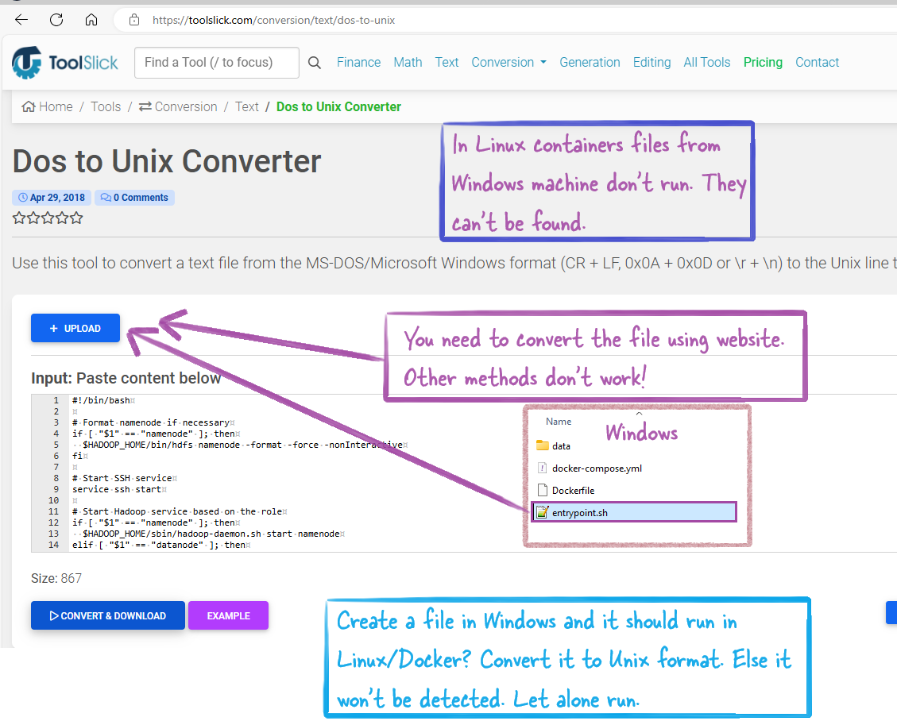

- If you create a file in Windows and want it to work on Linux, you need to convert it to Unix format using only a [this website](https://toolslick.com/conversion/text/dos-to-unix) because other methods have not worked. This is especially important for files like `entrypoint.sh` and other `.sh` files. These files must be converted to ensure they run properly on Linux.

