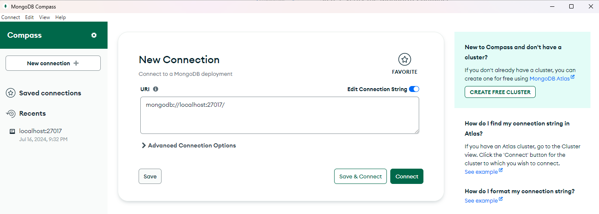

## Just one command to create the container

### Create the network and docker volume

```sh
docker network create spark-network
docker volume create mongo_data
```
### Now run the main command
```sh
docker run -d --name mongoDB --network spark-network -p 27017:27017 -v mongo-data:/data/db  mongo
```

- `-d`: Run the container in detached mode.
- `--name mongo`: Assign the name "mongo" to the container.
- `--network spark-network`: Connect the container to the netowrk you created, can be any network "spark-network".
- `-p 27017:27017`: Map port 27017 on the host to port 27017 in the container.
- `-v mongo-data:/data/db`: Use a Docker volume named "mongo-data" to persist MongoDB data.

### Connect to MongoDB

You can now connect to MongoDB using a MongoDB client or management tool like MongoDB Compass, Robo 3T, or Studio 3T. 

Here is an example:

```
mongodb://localhost:27017
```


## Details

| <span style="color: teal;">**Step by step details**</span> |                                                                    |
|--------------------------------------------------------------------|--------------------------------------------------------------------|
| <span style="color: #32CD32;">**Pull the MongoDB Image**</span>    | To begin, pull the latest MongoDB image from Docker Hub using the following Docker CLI command: <br> <span style="color: #32CD32;">`docker pull mongo`</span> |
| <span style="color: #FF4500;">**Run the MongoDB Container**</span> | Run a MongoDB container by issuing the following command, which includes options for naming the container, exposing the port, and setting up a volume for data persistence: <br> <span style="color: #FF4500;">`docker run -d --name mongoDB --network cms-network -p 27017:27017 -v mongo-data:/data/db  mongo`</span> |
| <span style="color: #FFD700;">**Access the MongoDB Shell**</span>  | After starting the MongoDB container, you can access the MongoDB shell with this command: <br> <span style="color: #FFD700;">`docker exec -it my-mongo mongo`</span> |
| <span style="color: #9932CC;">**Connect to MongoDB from an App**</span> | Connect to your MongoDB container from any application using `localhost` for the hostname and `27017` for the port. 
| <span style="color: #FF8C00;">**Adding a Docker Volume to a MongoDB Container**</span> | Docker volumes are the preferred mechanism for persisting data generated by and used by Docker containers. To create a volume and attach it to your MongoDB container, use the following commands: <br> <span style="color: #FF8C00;">`docker volume create mongo-data` <br> `docker run --name my-mongo -d -p 27017:27017 -v mongo-data:/data/db mongo`</span> <br> This sequence creates a new Docker volume named `mongo-data` and starts a new MongoDB container which will use this volume for storing its data. |
| <span style="color: #3CB371;">**Mounting a Host System Directory in a MongoDB Docker Container**</span> | Alternatively, you can mount a directory from the host system into the container to persist data. This can be useful for backups, restores, or for when you need to directly access MongoDB files: <br> <span style="color: #3CB371;">`docker run --name my-mongo -d -p 27017:27017 -v /path/on/host:/data/db mongo`</span> <br> Replace `/path/on/host` with the path to the directory on your host machine where you want the MongoDB data to be stored. This will link the `/data/db` directory in the container to the specified path on the host machine. |
| <span style="color: #20B2AA;">**Custom Configuration**</span> | For custom MongoDB configurations, you can mount a configuration file from the host into the container at runtime. |
| <span style="color: #DC143C;">**Secure MongoDB**</span> | In production, always secure MongoDB with authentication. Start by running the container with the `--auth` flag to enable authentication: <br> <span style="color: #DC143C;">`docker run --name my-mongo -d -p 27017:27017 -v ~/mongo-data:/data/db mongo --auth`</span> <br> Then, create an administrative user with the appropriate privileges inside the MongoDB shell. |
