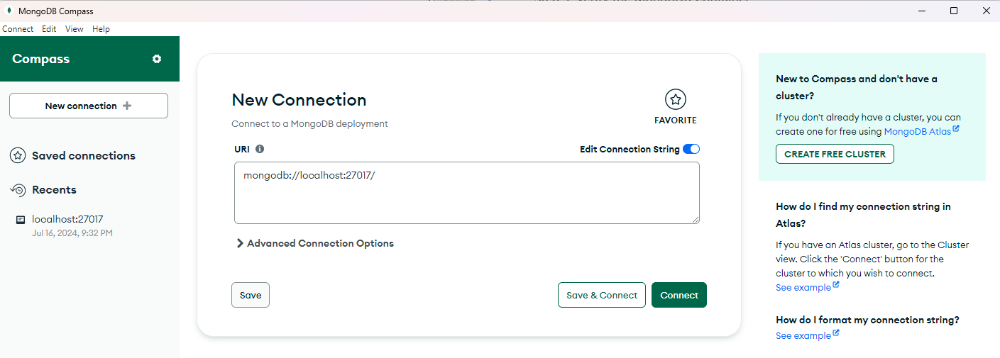

# <span style="color: #3CB371;">Create a MongoDB Container on Docker</span>

I will show you how to create a MongoDB container easily. We won't use Dockerfile, Docker-compose, or any files. Instead, we'll set up everything using just the command line. We'll use Docker volumes to store the data so it stays even after the container is closed.

## <span style="color: teal;">Create the network and docker volume</span>

```sh
docker network create spark-network
docker volume create mongo_data
```
## <span style="color: teal;">Now run the main command</span>

```sh
docker run -d --name mongoDB --network spark-network -p 27017:27017 -v mongo-data:/data/db  mongo
```

- `-d`: Run the container in detached mode.
- `--name mongo`: Assign the name "mongo" to the container.
- `--network spark-network`: Connect the container to the netowrk you created, can be any network "spark-network".
- `-p 27017:27017`: Map port 27017 on the host to port 27017 in the container.
- `-v mongo-data:/data/db`: Use a Docker volume named "mongo-data" to persist MongoDB data.

## <span style="color: teal;">Connect to MongoDB</span>

You can now connect to MongoDB using a MongoDB client or management tool like MongoDB Compass, Robo 3T, or Studio 3T. 

Here is an example:

```
mongodb://localhost:27017
```


## <span style="color: teal;">Summary of the setup and steps</span>

| <span style="color: teal;">**Step by Step Details**</span> |                                                                    |
|--------------------------------------------------------------------|--------------------------------------------------------------------|
| <span style="color: #32CD32;">**Pull MongoDB Image**</span>    | First, pull the latest MongoDB image from Docker Hub using this command: <br> <span style="color: #32CD32;">`docker pull mongo`</span> |
| <span style="color: #FF4500;">**Run MongoDB Container**</span> | Run a MongoDB container with this command. It names the container, exposes the port, and sets up a volume for data: <br> <span style="color: #FF4500;">`docker run -d --name mongoDB --network cms-network -p 27017:27017 -v mongo-data:/data/db mongo`</span> |
| <span style="color: #FFD700;">**Access MongoDB Shell**</span>  | After starting the MongoDB container, access the MongoDB shell with this command: <br> <span style="color: #FFD700;">`docker exec -it my-mongo mongo`</span> |
| <span style="color: #9932CC;">**Connect to MongoDB from an App**</span> | Connect to your MongoDB container from any app using `localhost` as the hostname and `27017` as the port. |
| <span style="color: #FF8C00;">**Add a Docker Volume to MongoDB**</span> | To persist data, create a Docker volume and attach it to your MongoDB container with these commands: <br> <span style="color: #FF8C00;">`docker volume create mongo-data` <br> `docker run --name my-mongo -d -p 27017:27017 -v mongo-data:/data/db mongo`</span> <br> This creates a volume named `mongo-data` and starts a MongoDB container using this volume for data storage. |
| <span style="color: #3CB371;">**Mount Host Directory in MongoDB Container**</span> | You can also mount a directory from your host system into the container to store data. This is useful for backups, restores, or direct access to MongoDB files: <br> <span style="color: #3CB371;">`docker run --name my-mongo -d -p 27017:27017 -v /path/on/host:/data/db mongo`</span> <br> Replace `/path/on/host` with the directory path on your host machine where you want to store MongoDB data. This links the `/data/db` directory in the container to the specified path on your host. |
| <span style="color: #20B2AA;">**Custom Configuration**</span> | For custom MongoDB settings, you can mount a configuration file from the host into the container when it runs. |
| <span style="color: #DC143C;">**Secure MongoDB**</span> | For production, secure MongoDB with authentication. Start by running the container with the `--auth` flag to enable security: <br> <span style="color: #DC143C;">`docker run --name my-mongo -d -p 27017:27017 -v ~/mongo-data:/data/db mongo --auth`</span> <br> Then, create an admin user inside the MongoDB shell. |