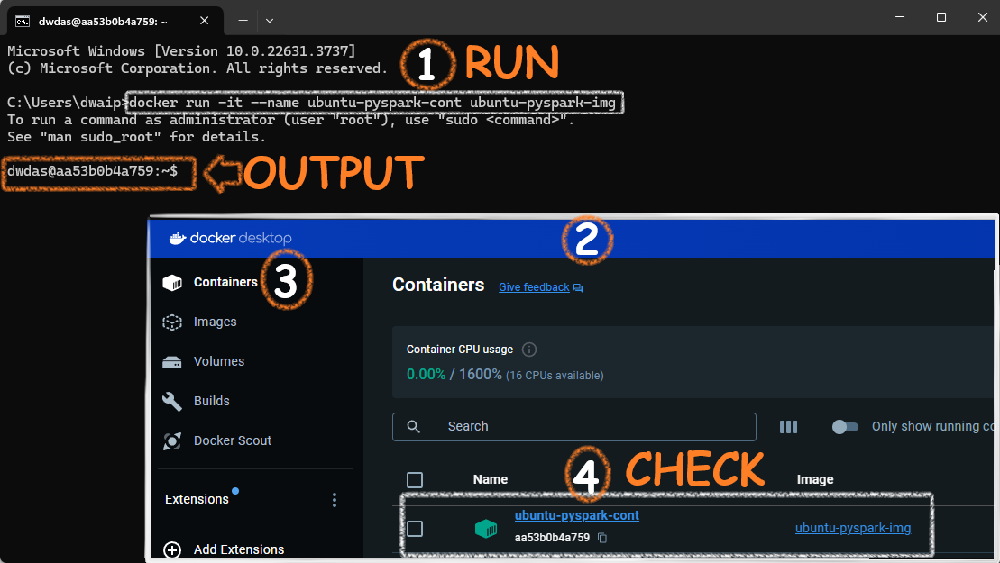

# <span style="color: MediumOrchid; font-family: Segoe UI, sans-serif;">Ubuntu Docker Container - Python, OpenJDK & PySpark</span>

## <span style="color: #682A6E; font-family: Segoe UI, sans-serif;">For Busy People</span>

1. Save the [Dockerfile](#dockerfile) content as `Dockerfile` (no extension).
2. `cd` to the folder containtng  the Dockerfile
3. **Run Commands**:
   ```sh
   docker build -t ubuntu-pyspark .
   docker run -it --name Ubuntu-PySpark --network dasnet ubuntu-pyspark
   ```

That’s it!

## <span style="color: #AD49B3; font-family: Segoe UI, sans-serif;">Background</span>

In this article I will show you how to create a single container with Ubuntu OS, Python and PySpark. We will use just a dockerfile to create it.

Follow the steps below to create the container.

## <span style="color: #682A6E; font-family: Segoe UI, sans-serif;">Step1: Create the Dockerfile</span>

In a folder create a file **Dockerfile**(No extension) with the content below.

```Dockerfile
# Use Ubuntu 20.04 as the base image to avoid "externally-managed-environment" restrictions
FROM ubuntu:20.04

# Set environment variable to avoid interactive prompts during package installation
ENV DEBIAN_FRONTEND=noninteractive

# Update the package list to ensure we have the latest information about available packages
RUN apt-get update

# Install necessary packages including curl, sudo, and nano
RUN apt-get install -y curl sudo nano software-properties-common

# Add the 'deadsnakes' PPA (Personal Package Archive) to access newer Python versions
RUN add-apt-repository ppa:deadsnakes/ppa

# Add the OpenJDK PPA to get the latest JDK versions
RUN add-apt-repository ppa:openjdk-r/ppa

# Update the package list again to include the new PPAs
RUN apt-get update

# Install Python 3.12, pip, and OpenJDK 17
RUN apt-get install -y python3.12 python3-pip openjdk-17-jdk-headless

# Install the PySpark library using pip
RUN pip3 install pyspark

# Clean up the package lists to reduce the image size
RUN apt-get clean && rm -rf /var/lib/apt/lists/*

# Create a root user and set its password
RUN echo 'root:Passw0rd' | chpasswd

# Create a new user 'dwdas', set a password, and add this user to the sudo group
RUN useradd -ms /bin/bash dwdas && echo 'dwdas:Passw0rd' | chpasswd && adduser dwdas sudo

# Allow the 'dwdas' user to run sudo commands without a password
RUN echo 'dwdas ALL=(ALL) NOPASSWD:ALL' >> /etc/sudoers

# Set the working directory to the home directory of the new user
WORKDIR /home/dwdas

# Switch to the new user 'dwdas'
USER dwdas

# Expose port 8888, commonly used for Jupyter Notebook, if needed
EXPOSE 8888

# Set the default command to start a bash shell
CMD ["bash"]
```

## <span style="color: #682A6E; font-family: Segoe UI, sans-serif;">Step 2: Build the Docker Image</span>

Open CMD, navigate to the folder with the Dockerfile, and run:

```sh
docker build -t ubuntu-pyspark-img .
```


After successfully running the command, you will see an image in your Docker Desktop app:


## <span style="color: #682A6E; font-family: Segoe UI, sans-serif;">Step 3: Run the Docker Container</span>

In command prompt, run:

```sh
docker run -it --name Debian-PySpark --network dasnet debian-pyspark
```

This will create a container with the image we created earlier and start it. You can see it from the Container section of your Docker window.



## <span style="color: #963F9C; font-family: Segoe UI, sans-serif;">Details of the container</span>

Here are the details of the installed components. The table will be a handy reference to know which components are installed and important locations, variables etc.

| **Component**                      | **Details**                                                                                     |
|------------------------------------|-------------------------------------------------------------------------------------------------|
| **Base Image**                     | `ubuntu:20.04`                                                                                  |
| **Python Version**                 | Python 3.12, installed via the `deadsnakes` PPA                                                 |
| **Java Version**                   | OpenJDK 17 (Headless), installed via the `openjdk-r` PPA                                        |
| **PySpark Version**                | Latest version of PySpark installed via pip                                                     |
| **Home Directory for User**        | `/home/dwdas`                                                                                   |
| **Spark Home**                     | `/opt/bitnami/spark`                                                                            |
| **Java Home**                      | `/opt/bitnami/java`                                                                             |
| **Python Path**                    | `/opt/bitnami/spark/python/` (for PySpark integration)                                          |
| **Spark Configuration Directory**  | `/opt/bitnami/spark/conf`                                                                       |
| **Spark Worker Directory**         | `/opt/bitnami/spark/work`                                                                       |
| **Environment Variables**          | `DEBIAN_FRONTEND=noninteractive` to avoid interactive prompts during installation               |
| **User Created**                   | `dwdas` with sudo privileges and passwordless sudo access                                       |
| **Exposed Port**                   | Port `8888`, commonly used for Jupyter Notebooks                                                |
| **Default Command**                | `bash` shell set as the default command                                                         |
| **Network Configuration**          | Connected to the `dasnet` network                                                               |
| **Spark Ports**                    | Spark Master: `7077` (mapped to host port `17077`), Spark Master UI: `8080` (mapped to host port `16080`), Spark Worker UI: `8081` (mapped to host port `16002`), `8082` (mapped to host port `16004`) |

### <span style="color: #963F9C; font-family: Segoe UI, sans-serif;">Error: Package Not Found (404 Not Found)</span>

When building the Docker image, I got a `404 Not Found` error because some packages like `python3.12` and `openjdk-17-jdk-headless` couldn't be found. This usually happens if the package lists are outdated or there's an issue with the repositories. Here's how to fix it:

1. **Update Package Lists**: Run `apt-get update` first to make sure your package lists are current.

2. **Add Correct PPAs**: Update the Dockerfile to include these PPAs:
   - `deadsnakes` for Python.
   - `openjdk-r` for OpenJDK.

3. **Use `--fix-missing` Option**: If the problem continues, try `apt-get install --fix-missing` to fix missing packages.

4. **Install Specific Versions**: If the latest version isn't available, try installing a slightly older but stable version.

*For any questions or further assistance, please contact me at das.d@hotmail.com.*
