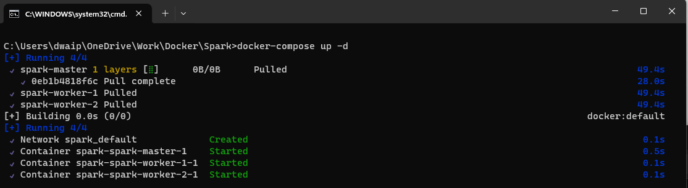

- [Create a Spark cluster using Bitnami Spark Image](#create-a-spark-cluster-using-bitnami-spark-image)
  - [Follow just three steps below to create the setup](#follow-just-three-steps-below-to-create-the-setup)
- [Dockerfile and docker-compose](#dockerfile-and-docker-compose)
  - [Dockerfile](#dockerfile)
  - [docker-compose.yml](#docker-composeyml)
- [How to add an extra node to the cluster](#how-to-add-an-extra-node-to-the-cluster)
- [Configuration Reference](#configuration-reference)
- [Bitnami Spark Reference](#bitnami-spark-reference)


# <span style="color: MediumOrchid; font-family: Segoe UI, sans-serif;">Create a Spark cluster using Bitnami Spark Image

Here I will show you how you can setup a Spark Cluster, 1 master, 2 workers node. We will use the VMWare Bitnami image for this. This cluster works wonderfully and the easiest of all setups. 

>Make sure Docker is installed and running on your machine. You can [Download](https://www.docker.com/products/docker-desktop) Docker Desktop for windows from here.

## <span style="color: #963F9C; font-family: Segoe UI, sans-serif;">Follow just three steps below to create the setup</span>

- Create a file **docker-compose.yml** with the content from the [docker-compose](#docker-composeyml) section.
- Create a file **Dockerfile**, with the content from [Dockerfile](#dockerfile). Note Dockerfile has **NO extension**.
- Now open Command prompt and run the following commands
  ```bash
  docker network create dasnet
  docker-compose -p bitnami-spark-cluster build
  docker-compose -p bitnami-spark-cluster up -d
  ```
  

- Open the Docker app and navigate to the container section. The containers should be up and running.
  


# <span style="color: MediumOrchid; font-family: Segoe UI, sans-serif;">Dockerfile and docker-compose</span>

## <span style="color: #963F9C; font-family: Segoe UI, sans-serif;">Dockerfile</span>

Save the content below in file, Dockerfile(no extension)

```bash
# Use the official Bitnami Spark image as the base image
# To use the latest version just replace the line below with FROM bitnami/spark:latest
FROM bitnami/spark:3.5

# Switch to root user to install necessary packages and set permissions
USER root

# Install sudo package
RUN apt-get update && apt-get install -y sudo

# Add a non-root user named dwdas with a home directory and bash shell
RUN useradd -ms /bin/bash dwdas

# Set the password for dwdas as Passw0rd
RUN echo "dwdas:Passw0rd" | chpasswd

# Add the user to the sudo group and configure sudoers file to allow passwordless sudo
RUN adduser dwdas sudo
RUN echo "dwdas ALL=(ALL) NOPASSWD:ALL" >> /etc/sudoers

# Ensure dwdas has write permissions to necessary directories and files
RUN mkdir -p /opt/bitnami/spark/tmp && chown -R dwdas:dwdas /opt/bitnami/spark/tmp
RUN chown -R dwdas:dwdas /opt/bitnami/spark/conf
RUN chown -R dwdas:dwdas /opt/bitnami/spark/work
RUN chown -R dwdas:dwdas /opt/bitnami/spark/logs

# Switch back to the non-root user
USER dwdas

# Set the working directory
WORKDIR /home/dwdas
```

## <span style="color: #963F9C; font-family: Segoe UI, sans-serif;">docker-compose.yml</span>

Here is the content for the docker-compose.yml file. Simply copy the contents into a file named `docker-compose.yml` in your folder.

```yaml

version: '3.9'  # Specify the version of Docker Compose syntax. Latest is 3.9 on Aug 2024

services:  # Define the services (containers) that make up your application

  master:
    build:
      context: .  # Build context is the current directory (where the Dockerfile is located)
      dockerfile: Dockerfile  # Dockerfile to use for building the image
    image: bitnami-spark-master  # Name the image for the master node
    container_name: master  # Set a custom name for the master container
    environment:
      - SPARK_MODE=master  # Environment variable to set the Spark mode to master
      - SPARK_RPC_AUTHENTICATION_ENABLED=no
      - SPARK_RPC_ENCRYPTION_ENABLED=no
      - SPARK_LOCAL_STORAGE_ENCRYPTION_ENABLED=no
      - SPARK_SSL_ENABLED=no
      - SPARK_USER=spark
    ports:
      # Mapping ports: <Host_Port>:<Container_Port>
      # Use rare ports on the host to avoid conflicts, while using standard ports inside the container
      - "16080:8080"  # Map a rare port on the host (16080) to the standard port 8080 on the container for Spark Master web UI
      - "17077:7077"  # Map a rare port on the host (17077) to the standard port 7077 on the container for Spark Master communication
    volumes:
      - spark-warehouse:/user/hive/warehouse  # Mount the shared volume for Hive warehouse
    networks:
      - dasnet  # Connect the master container to the defined network

  worker1:
    build:
      context: .  # Build context is the current directory (where the Dockerfile is located)
      dockerfile: Dockerfile  # Dockerfile to use for building the image
    image: bitnami-spark-worker  # Name the image for the worker node
    container_name: worker1  # Set a custom name for the first worker container
    environment:
      - SPARK_MODE=worker  # Environment variable to set the Spark mode to worker
      - SPARK_MASTER_URL=spark://master:7077  # URL for the worker to connect to the master, using the standard port 7077
      - SPARK_WORKER_MEMORY=2G  # Set the memory allocated for the worker
      - SPARK_WORKER_CORES=2  # Set the number of CPU cores allocated for the worker
      - SPARK_RPC_AUTHENTICATION_ENABLED=no
      - SPARK_RPC_ENCRYPTION_ENABLED=no
      - SPARK_LOCAL_STORAGE_ENCRYPTION_ENABLED=no
      - SPARK_SSL_ENABLED=no
      - SPARK_USER=spark
    depends_on:
      - master  # Ensure that the master service is started before this worker
    ports:
      # Mapping ports: <Host_Port>:<Container_Port>
      - "16002:8081"  # Map a rare port on the host (16002) to the standard port 8081 on the container for Spark Worker 1 web UI
    volumes:
      - spark-warehouse:/user/hive/warehouse  # Mount the shared volume for Hive warehouse
    networks:
      - dasnet  # Connect the worker container to the defined network

  worker2:
    build:
      context: .  # Build context is the current directory (where the Dockerfile is located)
      dockerfile: Dockerfile  # Dockerfile to use for building the image
    image: bitnami-spark-worker  # Name the image for the worker node
    container_name: worker2  # Set a custom name for the second worker container
    environment:
      - SPARK_MODE=worker  # Environment variable to set the Spark mode to worker
      - SPARK_MASTER_URL=spark://master:7077  # URL for the worker to connect to the master, using the standard port 7077
      - SPARK_WORKER_MEMORY=2G  # Set the memory allocated for the worker
      - SPARK_WORKER_CORES=2  # Set the number of CPU cores allocated for the worker
      - SPARK_RPC_AUTHENTICATION_ENABLED=no
      - SPARK_RPC_ENCRYPTION_ENABLED=no
      - SPARK_LOCAL_STORAGE_ENCRYPTION_ENABLED=no
      - SPARK_SSL_ENABLED=no
      - SPARK_USER=spark
    depends_on:
      - master  # Ensure that the master service is started before this worker
    ports:
      # Mapping ports: <Host_Port>:<Container_Port>
      - "16004:8082"  # Map a rare port on the host (16004) to a different standard port 8082 on the container for Spark Worker 2 web UI
    volumes:
      - spark-warehouse:/user/hive/warehouse  # Mount the shared volume for Hive warehouse
    networks:
      - dasnet  # Connect the worker container to the defined network

volumes:
  spark-warehouse:
    driver: local  # Use the local driver to create a shared volume for the warehouse

networks:
  dasnet:
    external: true  # Use the existing 'dasnet' network, created externally via 'docker network create dasnet'
```

# <span style="color: MediumOrchid; font-family: Segoe UI, sans-serif;">How to add an extra node to the cluster</span>

<p style="color: #006600; font-family: 'Trebuchet MS', Helvetica, sans-serif; background-color: #e6ffe6; padding: 15px; border-left: 5px solid #00cc66;">
To add an extra node just copy paste the contents worker2 and replace the values like `container_name: worker3` `ports: 16005:8083` etc.
</p>

# <span style="color: MediumOrchid; font-family: Segoe UI, sans-serif;">Configuration Reference</span>

| **Configuration Item**              | **Value**                                       |
|-------------------------------------|---------------------------------------------------------------|
| **Base Image**                      | `bitnami/spark:3.5`                                            |
| **Spark Version**                   | `3.5.2`                                                        |
| **Python Version**                  | `3.12`                                                         |
| **Java Version**                    | `OpenJDK 17.0.12`                                              |
| **Environment Variables**           | `SPARK_MODE`, `SPARK_USER`, `SPARK_MASTER_URL`, `SPARK_WORKER_MEMORY`, `SPARK_WORKER_CORES`, `SPARK_RPC_AUTHENTICATION_ENABLED=no`, `SPARK_RPC_ENCRYPTION_ENABLED=no`, `SPARK_LOCAL_STORAGE_ENCRYPTION_ENABLED=no`, `SPARK_SSL_ENABLED=no` |
| **Java Home**                       | `/opt/bitnami/java`                                            |
| **Spark Home**                      | `/opt/bitnami/spark`                                           |
| **Python Path**                     | `/opt/bitnami/spark/python/`                                   |
| **Pyspark Installation Location**   | `/opt/bitnami/spark/python/pyspark`                            |
| **Users**                           | `dwdas` with sudo privileges, `spark` (default user)           |
| **User Directory**                  | `/home/dwdas`                                                  |
| **Ports**                           | Master: `16080:8080` (Web UI), `17077:7077` (RPC); Workers: `16002:8081` (Web UI worker1), `16004:8082` (Web UI worker2) [Master http://localhost:16080/](http://localhost:16080/), [Worker1 http://localhost:16002/](http://localhost:16002/), [Worker2 http://localhost:16004/](http://localhost:16004/)|
| **Volumes**                         | `/opt/bitnami/spark/tmp`, `/opt/bitnami/spark/conf`, `/opt/bitnami/spark/work`, `/opt/bitnami/spark/logs`, `spark-warehouse:/user/hive/warehouse` |
| **Network Configuration**           | Custom Docker network `dasnet`                                 |
| **Entry Point**                     | `/opt/bitnami/scripts/spark/entrypoint.sh`                     |
| **CMD**                             | `/opt/bitnami/scripts/spark/run.sh`                            |
| **Spark Web UI Ports**              | Master: `8080`, Worker 1: `8081`, Worker 2: `8082`             |
| **Spark RPC Port**                  | `7077` (mapped to `17077` on host)                             |
| **Spark SSL Configuration**         | `SPARK_SSL_ENABLED=no`                                         |
| **Spark Authentication**            | `SPARK_RPC_AUTHENTICATION_ENABLED=no`                          |
| **Spark Configuration Files**       | `/opt/bitnami/spark/conf`                                      |
| **spark-sql CLI**                | Just use `spark-sql`. Location: `/opt/bitnami/spark/bin/spark-sql`                |
| **spark-shell CLI**                | Just use `spark-shell`. Location: `/opt/bitnami/spark/bin/spark-shell`                |

# <span style="color: MediumOrchid; font-family: Segoe UI, sans-serif;">Bitnami Spark Reference</span>

You can check out the [home directory](https://github.com/bitnami/containers/tree/main/bitnami/spark) for the Bitnami Spark Container here. It has all the documentation, configuration files, and version details you might need. If you want to see how the base image is built, you can look at their [Dockerfile](https://github.com/bitnami/containers/blob/main/bitnami/spark/3.5/debian-12/Dockerfile).

Bitnami makes sure to keep up with any changes from the source and quickly rolls out new versions using their automated systems. This means you get the latest fixes and features without any delay. Whether you're using containers, virtual machines, or cloud images, Bitnami keeps everything consistent, making it easy to switch formats based on what your project needs.

All Bitnami images are based on **minideb**, which is a lightweight Debian-based container image, or **scratch**, which is an empty image—so you get a small base that’s easy to work with.

<p style="color: #006600; font-family: 'Trebuchet MS', Helvetica, sans-serif; background-color: #e6ffe6; padding: 15px; border-left: 5px solid #00cc66;">
These containers are set up as non-root by default, but I’ve added myself as a root user.
</p>