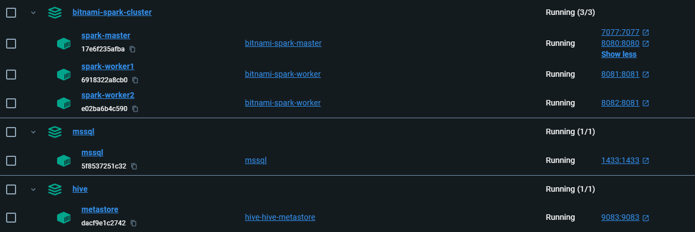
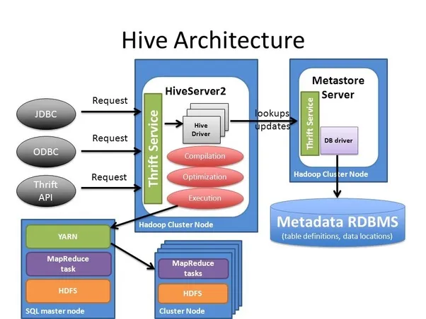
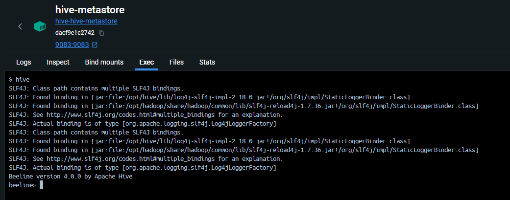
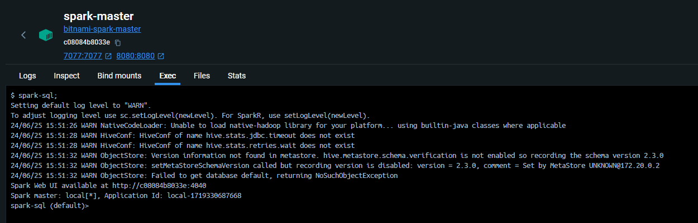

- [Setup a complete data warehouse with Spark cluster \& external Hive(MSSQL Metastore)](#setup-a-complete-data-warehouse-with-spark-cluster--external-hivemssql-metastore)
  - [For the busy people](#for-the-busy-people)
- [How was the setup created](#how-was-the-setup-created)
  - [Bit Background About Bitnami Spark Container](#bit-background-about-bitnami-spark-container)
    - [Their Dockerfile](#their-dockerfile)
    - [Non-Root Containers](#non-root-containers)
    - [The User 1001](#the-user-1001)
    - [Folder Structure](#folder-structure)
  - [Spark container setup details](#spark-container-setup-details)
  - [MSSQL 2019 container setup details](#mssql-2019-container-setup-details)
  - [Hive Server container setup details](#hive-server-container-setup-details)
    - [Hive-MSSQL Connection](#hive-mssql-connection)
  - [spark-defaults.conf \& hive-site.xml](#spark-defaultsconf--hive-sitexml)
    - [spark-defaults.conf \& hive-site.xml](#spark-defaultsconf--hive-sitexml-1)
      - [spark-defaults.conf important details](#spark-defaultsconf-important-details)
      - [hive-site important details](#hive-site-important-details)
  - [Repository and Metastore Folder Creation](#repository-and-metastore-folder-creation)
- [Testing](#testing)
- [When will be managed or external tables created?](#when-will-be-managed-or-external-tables-created)
- [Errors](#errors)
- [Server Details](#server-details)

# <span style="color: teal;">Setup a complete data warehouse with Spark cluster & external Hive(MSSQL Metastore)</span>

Here, I will show you how to create a complete warehouse setup with a Spark Cluster and a standalone Hive with an external metastore database (MSSQL). The setup will use 5 containers:

| **Service**            | **URL/Connection**                                        | **Image**                                     |
|------------------------|-----------------------------------------------------------|-----------------------------------------------|
| Spark Master           | [http://localhost:16789/](http://localhost:16789/)          | `spark:3.5.1-debian-12-r7`                    |
| Spark Worker 1         | [http://localhost:16791/](http://localhost:16791/)          | `spark:3.5.1-debian-12-r7`                    |
| Spark Worker 2         | [http://localhost:16792/](http://localhost:16792/)          | `spark:3.5.1-debian-12-r7`                    |
| SQL Server (SSMS)      | `localhost,1433`, SQL Server Auth: `dwdas/Passw0rd`       | `mcr.microsoft.com/mssql/server:2019-latest`  |
| Hive Metastore         | `thrift://hive-metastore:9083`                            | `apache/hive:4.0.0`                           |

## <span style="color: BlueViolet;">For the busy people</span>
Follow these steps to get your setup ready:

- Download the [zip](Dockerfiles/spark-hive-mssql-dockerfiles.zip) file on your laptop.
- Go to `Step1xx`, `Step2xx`, and `Step3xx` folders and run `run.bat` in each.

This will create a setup like the one shown below:



A shared volume should be present in the volumes with the mapping shown below:


Here are some important details about the setup:


# How was the setup created
## Bit Background About Bitnami Spark Container

### Their Dockerfile

The official Dockerfile used by Bitnami to create their Spark container can be found on [GitHub](https://hub.docker.com/r/bitnami/spark/dockerfile). Some key parts of the file are:

```dockerfile
RUN chown -R 1001:1001 /opt/bitnami/spark
WORKDIR /opt/bitnami/spark
USER 1001
ENTRYPOINT [ "/opt/bitnami/scripts/spark/entrypoint.sh" ]
CMD [ "/opt/bitnami/scripts/spark/run.sh" ]
```

### Non-Root Containers

By default, Bitnami containers run as non-root users. This means when you log into the container, you are not the root user. The container itself runs as a non-root user, but you can change this by specifying `User: root` in your Dockerfile or Docker-compose.

More details can be found [here](https://docs.vmware.com/en/VMware-Tanzu-Application-Catalog/services/tutorials/GUID-why-non-root-containers-are-important-for-security-index.html).

### The User 1001

Bitnami Spark containers use the non-root user ID 1001. When you start the container and log in, you will be user 1001. It's important that this user has access to all required directories and volumes. Ensure necessary permissions are set when building the container.

### Folder Structure

Bitnami containers store application files in `/opt/bitnami/APPNAME/`. For example, Spark files are located in `/opt/bitnami/spark`. More details can be found in the [Bitnami directory structure documentation](https://docs.bitnami.com/aws/faq/get-started/understand-directory-structure/).

## Spark container setup details

First, I created the Spark cluster using the Bitnami Spark image `bitnami/spark:3.5.1-debian-12-r7`. I chose Bitnami because it is popular and offers a constant version for stability. However, you can also use `bitnami/spark:latest`.

- I used a Dockerfile and docker-compose approach.
- Created a `spark-defaults.conf` with just one setting:
   ```text
   spark.sql.warehouse.dir = /data/spark-warehouse
   ```
- Created a `Dockerfile` with the following important activities:
   - Created a `/data` folder.
   - Copied the custom `spark-defaults.conf` from laptop to `/conf`.
   - Set the root password and provided user 1001 permissions to /data folder.
- Created a `docker-compose.yml` file that included these changes(rest are usual:
   ```yaml
   volumes:
     - shared-data:/data
     - ./spark-defaults.conf:/opt/bitnami/spark/conf/spark-defaults.conf
   environment:
     - SPARK_MODE=master  # Environment variable to set the Spark mode to master
     - SPARK_LOCAL_DIRS=/data/tmp  # Local directories for Spark
   ```

- Finally, created a `run.bat` to do the following:
   ```bat
   REM Create the Docker volume
   docker volume create shared-data

   REM Build and run the Docker Compose services
   docker-compose -p bitnami-spark-cluster build
   docker-compose -p bitnami-spark-cluster up -d
   ```

## MSSQL 2019 container setup details
Setting up the MSSQL container was more straightforward and required less customization than the Spark cluster. I used a Dockerfile and docker-compose approach.

- Created a `Dockerfile` with the following important activities:
   - Created a user `dwdas` with the password `Passw0rd`.
   - Set the root user password to `Passw0rd`.

- Created a `docker-compose.yml` file that included these changes:
   ```yaml
   ports:
     - "1433:1433"  # Map port 1433 of the host to port 1433 of the container for MSSQL communication.
   environment:
     - SA_PASSWORD=Passw0rd  # Set the system administrator password for MSSQL.

   networks:
     - spark-network
   ```

- Finally, created a `run.bat` to do the following:
   ```bat
   REM Create the Docker volumes. This is mapped to all Spark containers and the Hive container.
   docker volume create shared-data

   REM Build and run the Docker Compose services
   docker-compose -p bitnami-spark-cluster build
   docker-compose -p bitnami-spark-cluster up -d

   REM Post-Setup: Create MSSQL user and database
   docker exec -it mssql-container-name /opt/mssql-tools/bin/sqlcmd -S localhost -U SA -P "Passw0rd" -Q "CREATE LOGIN dwdas WITH PASSWORD='Passw0rd'; CREATE DATABASE hive_metastore;"
   ```
> run.bat: After the container started, I created an MSSQL user `dwdas` with the password `Passw0rd` and an empty database `hive_metastore`. This was done inside the `run.bat` file.

## Hive Server container setup details

Setting up the Hive server can be very tricky. I used the official Apache Hive image with a Dockerfile and docker-compose approach.

- **Download JDBC Driver**:
   - Downloaded `sqljdbc_7.2.2.0_enu.tar.gz` from [Microsoft Download Center](https://www.microsoft.com/en-us/download/details.aspx?id=57782).
    
    

   - Extracted the `mssql-jdbc-7.2.2.jre8.jar` driver to the current folder.

- **Create a custom `hive-site.xml`**: Created a custom `hive-site.xml` with MSSQL connection information and directory configurations. Refer to the Step3-Hive/hive-site.xml in the setup folder for more details.

- **Create a Dockerfile**: Refer to the dockerfile in Step3-Hive folder for more details. Apart from usual activity these two steps are most immortant. I.e. placing the driver to the /lib and hive-site.xml to conf.
   ```dockerfile
   COPY ./mssql-jdbc-7.2.2.jre8.jar /opt/hive/lib/
   COPY ./hive-site.xml /opt/hive/conf/
   ```

- **Docker-compose Configuration**: Apart from usual stuff the most important was to  the environment variable `DB_DRIVER=mssql`.

- **Run.bat**:
   - The `run.bat` script builds the images, runs the container.

### Hive-MSSQL Connection



Apache Hive containers usually use a startup script called '/entrypoint.sh'. This script is set to use **Derby**(*${DB_DRIVER:=derby}*) database by default. To use MSSQL instead:

1. Change the DB_DRIVER environment variable to 'mssql'.
4. Create an empty database called 'hive_metastore' on your MSSQL server.
2. Put your MSSQL connection and db  details in the 'hive-site.xml' file.
3. Add the MSSQL driver file (mssql-jdbc-7.2.2.jre8.jar) to the '/lib' folder.

**/entrypoint.sh**
```shell
#!/bin/bash
set -x

: ${DB_DRIVER:=derby}

SKIP_SCHEMA_INIT="${IS_RESUME:-false}"

function initialize_hive {
  COMMAND="-initOrUpgradeSchema"
  if [ "$(echo "$HIVE_VER" | cut -d '.' -f1)" -lt "4" ]; then
     COMMAND="-${SCHEMA_COMMAND:-initSchema}"
  fi
  $HIVE_HOME/bin/schematool -dbType $DB_DRIVER $COMMAND
  if [ $? -eq 0 ]; then
    echo "Initialized schema successfully.."
  else
    echo "Schema initialization failed!"
    exit 1
  fi
}
# Additional script content...
```
So, how I did this:

1. During mssql creation I already creatd the hive_metastore empty database and the user
2. The dockerfile managed the copying of the driver and the custom hive-site.xml
   ```dockerfile
   COPY ./mssql-jdbc-7.2.2.jre8.jar /opt/hive/lib/
   COPY ./hive-site.xml /opt/hive/conf/
   ```
3. docker-compose managed set the  `DB_DRIVER=mssql`

**Note:** An alternative approach to achieve the same feature would be to:

1. Let the container start with the default settings.
2. Open `/entrypoint.sh` and change `${DB_DRIVER:=mssql}`.
3. Run `su -c "chmod 777 /entrypoint.sh"` with the password `Passw0rd` as the permission will change.
4. Copy `hive-site.xml` containing MSSQL connection info to `/opt/hive/conf/`.
5. Restart the container.

## spark-defaults.conf & hive-site.xml

Only two configureation files were touched. Spark-defaults.conf  in spark server and hive-site.xml in hive server.

### spark-defaults.conf & hive-site.xml

#### spark-defaults.conf important details

Here, only one value was added. The same file is present in all the spark containres.
spark.sql.warehouse.dir=/data/spark-warehouse

#### hive-site important details
```xml
 <property>
    <name>hive.metastore.warehouse.dir</name>
    <value>/data/hive-warehouse</value>
  </property>
  <property>
    <name>javax.jdo.option.ConnectionDriverName</name>
    <value>com.microsoft.sqlserver.jdbc.SQLServerDriver</value>
  </property>
  <property>
    <name>javax.jdo.option.ConnectionURL</name>
    <value>jdbc:sqlserver://mssql:1433;DatabaseName=hive_metastore;</value>
  </property>
  <property>
  <property>
    <name>hive.metastore.uris</name>
    <value>thrift://hive-metastore:9083</value>
  </property>
   <property>
    <name>hive.metastore.db.type</name>
    <value>mssql</value>
    <description>
      Expects one of [derby, oracle, mysql, mssql, postgres].
    </description>
  </property>
```
## Repository and Metastore Folder Creation

We have two options to decide on the folder structure:

**Our choice:** Separate warehouses for Spark and Hive
1. Keep Hive warehouse as is:
   - In `hive-site.xml`:
     ```xml
     <property>
       <name>hive.metastore.warehouse.dir</name>
       <value>/data/hive/warehouse</value>
     </property>
     ```
2. Set a different warehouse for Spark:
   - In Spark configuration:
    ```
     spark.sql.warehouse.dir=/data/spark/warehouse
     ```
```
/data
├── hive-warehouse/
│   └── (Hive managed tables)
├── spark-warehouse/
│   └── (Spark-managed tables)

```

**Option 2:** Use Hive Warehouse for both Spark and Hive
1. Configure Spark to use the Hive metastore:
   - Set `spark.sql.hive.metastore.version` and `spark.sql.hive.metastore.jars` in Spark configuration.
2. Use the same warehouse directory for both:
   - In `hive-site.xml`:
     ```xml
     <property>
       <name>hive.metastore.warehouse.dir</name>
       <value>/data/spark-warehouse</value>
     </property>
     ```
   - In Spark configuration. Using(`spark-defaults.conf`) or setting during session etc.
     ```
     spark.sql.warehouse.dir=/data/spark-warehouse
     ```
# <span style="color: Blue;">Testing</span>

**Testing Hive**
Go the the hive container and type **hive**. You should see output lilke this:


**Testing spark-shell**
Go to any of hte spark containers's terminal and key in **spark-shell**, you should see output liek this:


**Testing spark-sql**
Go to any of hte spark containers's terminal and key in **spark-sql**, you should see output liek this:



# When will be managed or external tables created?

When configuring Spark to work with Hive, the type of table created (managed vs. external) depends on specific settings in your Spark configuration.

If `spark-defaults.xml` includes:
```xml
spark.hadoop.hive.metastore.uris=thrift://hive-metastore:9083
```
Then, spark will create all tables as `EXTERNAL`. Regardless of whatever settigngs you try.


If `spark-defaults.xml` does not include:
```xml
spark.hadoop.hive.metastore.uris=thrift://hive-metastore:9083
```
Then tables are created as `MANAGED` by default and stored in the directory specified by `spark.sql.warehouse.dir`.


You can still create Hive tables stored in the Hive warehouse. To do this, include:
```python
.config("spark.hadoop.hive.metastore.uris", "thrift://hive-metastore:9083") \
.enableHiveSupport() \
```
In this case, the tables will be `EXTERNAL` and stored in the directory specified by hive.`metastore.warehouse.dir` in `hive-site.xml`

# <span style="color: red;">Errors</span>

- If DB_DRIVER=derby in env var but hive-site.xml has no mssql connection:


- If you are unable to create folders or perform any operation. It could be the user 1001 is not having enough permissions. This is a typical user Bitnami spark configures to run the container.


# Server Details

| **Configuration**      | **Details**                                                                                           |
|------------------------|-------------------------------------------------------------------------------------------------------|
| Hive Metastore URI     | `spark.hadoop.hive.metastore.uris=thrift://hive-metastore:9083`                                        |
| User and Database      | User `dwdas` (PASSWORD=`Passw0rd`), Database `hive_metastore`. |
| **hive-site.xml**      | **Details**                                                                                           |
| `hive.metastore.warehouse.dir` | `/user/hive/warehouse`                                                                         |
| `javax.jdo.option.ConnectionURL` | `jdbc:sqlserver://mssql:1433;databaseName=hive_metastore`                         |
| **spark-defaults.conf** | **Details**                                                                                          |
| `spark.sql.warehouse.dir` | `/data/spark-warehouse`                                                                            |


| **Service**                 | **Configuration Details**                                    |
|-----------------------------|--------------------------------------------------------------|
| **Spark Server Configuration** |                                                              |
| Image                       | `spark:3.5.1-debian-12-r7`                                    |
| User running container      | `1001:1001`                                                   |
| Environment Variables       |                                                              |
|                             | `JAVA_HOME=/opt/bitnami/java`                                 |
|                             | `PYTHONPATH=/opt/bitnami/spark/python/`                       |
|                             | `SPARK_HOME=/opt/bitnami/spark`                               |
|                             | `SPARK_USER=spark`                                            |
|                             | `root: Passw0rd`                                              |
| Mounted Volume              | `shared-data:/data`                                           |
| **SQL Server Configuration** |                                                              |
| Environment Variables       |                                                              |
|                             | `SA_PASSWORD=Passw0rd`                                        |
|                             | `Server name: mssql`                                          |
|                             | `/opt/mssql/bin/sqlservr`                                     |
| **Hive Configuration**      |                                                              |
| Environment Variables       |                                                              |
|                             | `HIVE_HOME=/opt/hive`                                         |
|                             | `SERVICE_NAME=metastore`                                      |
|                             | `DB_DRIVER=mssql`                                             |
|                             | `TEZ_HOME=/opt/tez`                                           |
|                             | `HIVE_VER=4.0.0`                                              |
|                             | `JAVA_HOME=/usr/local/openjdk-8`                              |
|                             | `PWD=/home/dwdas`                                             |
|                             | `HADOOP_HOME=/opt/hadoop`                                     |
| Thrift Server URL           | `thrift://hive-metastore:9083`                                |
