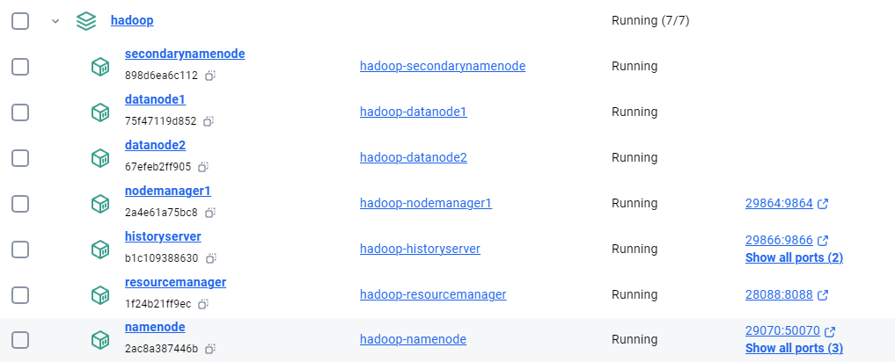

## Setting Up a Hadoop Cluster Using Docker

### Introduction
In this guide, I'll walk through the process of setting up an Apache Hadoop cluster using Docker containers. This setup is ideal for development and testing purposes on your local machine. I'll cover the configuration files, container setup, and how to verify that the cluster is functioning correctly.

**For busy people:**

- [Download](Dockerfiles/Hadoop-Docker.zip) and unzip the file to a folder
- CD and run the following commands
    ```bash
        docker-compose build
        docker-compose up -d
    ```
- You will have a full-fledged Hadoop setup



### Prerequisites
- Docker installed on your machine.
- Basic knowledge of Docker and Hadoop.

### Files Used
1. **Dockerfile**: Defines the environment and how the Hadoop services will be run inside the Docker containers.
2. **docker-compose.yml**: Manages the multi-container application, ensuring all necessary Hadoop services are launched and networked correctly.
3. **entrypoint.sh**: A script to start the appropriate Hadoop service based on the container's role (e.g., NameNode, DataNode).

> **Important**: If you create the `entrypoint.sh` file on Windows, you must convert it to Unix format using a tool like [Toolslick DOS to Unix Converter](https://toolslick.com/conversion/text/dos-to-unix) before using it in your Docker environment.

### Step 1: Prepare the Docker Environment

1. **Dockerfile**:
   The `Dockerfile` sets up the Java runtime and Hadoop environment. Here's the Dockerfile used:

   ```Dockerfile
   # Use Java 8 runtime as base image
   FROM openjdk:8-jdk

   # Set environment variables
   ENV HADOOP_VERSION=2.7.7
   ENV HADOOP_HOME=/usr/local/hadoop
   ENV HADOOP_CONF_DIR=$HADOOP_HOME/etc/hadoop
   ENV PATH=$PATH:$HADOOP_HOME/bin

   # Install Hadoop
   RUN wget https://archive.apache.org/dist/hadoop/core/hadoop-$HADOOP_VERSION/hadoop-$HADOOP_VERSION.tar.gz && \
       tar -xzvf hadoop-$HADOOP_VERSION.tar.gz && \
       mv hadoop-$HADOOP_VERSION $HADOOP_HOME && \
       rm hadoop-$HADOOP_VERSION.tar.gz

   # Copy and set entrypoint script
   # Note: If entrypoint.sh is created on Windows, convert it to Unix format using dos2unix website.
   COPY entrypoint.sh /entrypoint.sh
   RUN chmod +x /entrypoint.sh

   # Expose Hadoop ports
   EXPOSE 50070 8088 9000 9864 9870 9866 9867

   # Set entrypoint
   ENTRYPOINT ["/entrypoint.sh"]
   ```

2. **docker-compose.yml**:
   The `docker-compose.yml` file orchestrates the Hadoop cluster by defining services like NameNode, DataNode, and ResourceManager.

   ```yaml
   version: '3.8'

   services:
     namenode:
       build: .
       container_name: namenode
       hostname: namenode
       environment:
         - CLUSTER_NAME=my-hadoop-cluster
       volumes:
         - namenode_data:/hadoop/dfs/name
       ports:
         - "29070:50070"  # HDFS NameNode Web UI on port 29070
         - "29870:9870"   # NameNode Web UI port on port 29870
         - "29000:9000"   # HDFS port on port 29000
       command: namenode
       networks:
         - dasnet

     secondarynamenode:
       build: .
       container_name: secondarynamenode
       hostname: secondarynamenode
       volumes:
         - secondarynamenode_data:/hadoop/dfs/secondary
       command: secondarynamenode
       networks:
         - dasnet

     datanode1:
       build: .
       container_name: datanode1
       hostname: datanode1
       volumes:
         - datanode1_data:/hadoop/dfs/data
       command: datanode
       networks:
         - dasnet

     datanode2:
       build: .
       container_name: datanode2
       hostname: datanode2
       volumes:
         - datanode2_data:/hadoop/dfs/data
       command: datanode
       networks:
         - dasnet

     resourcemanager:
       build: .
       container_name: resourcemanager
       hostname: resourcemanager
       ports:
         - "28088:8088"  # ResourceManager Web UI on port 28088
       command: resourcemanager
       networks:
         - dasnet

     nodemanager1:
       build: .
       container_name: nodemanager1
       hostname: nodemanager1
       ports:
         - "29864:9864"  # NodeManager Web UI on port 29864
       command: nodemanager
       networks:
         - dasnet

     historyserver:
       build: .
       container_name: historyserver
       hostname: historyserver
       ports:
         - "29866:9866"  # HistoryServer Web UI on port 29866
         - "29867:9867"  # Additional service on port 29867
       command: historyserver
       networks:
         - dasnet

   volumes:
     namenode_data:
     secondarynamenode_data:
     datanode1_data:
     datanode2_data:

   networks:
     dasnet:
       external: true
   ```

3. **entrypoint.sh**:
   This script starts the appropriate Hadoop service based on the container’s role. Below is the script:

   ```bash
   #!/bin/bash
   # Format namenode if necessary
   if [ "$1" == "namenode" ]; then
     $HADOOP_HOME/bin/hdfs namenode -format -force -nonInteractive
   fi
   # Start SSH service
   service ssh start
   # Start Hadoop service based on the role
   if [ "$1" == "namenode" ]; then
     $HADOOP_HOME/sbin/hadoop-daemon.sh start namenode
   elif [ "$1" == "datanode" ]; then
     $HADOOP_HOME/sbin/hadoop-daemon.sh start datanode
   elif [ "$1" == "secondarynamenode" ]; then
     $HADOOP_HOME/sbin/hadoop-daemon.sh start secondarynamenode
   elif [ "$1" == "resourcemanager" ]; then
     $HADOOP_HOME/sbin/yarn-daemon.sh start resourcemanager
   elif [ "$1" == "nodemanager" ]; then
     $HADOOP_HOME/sbin/yarn-daemon.sh start nodemanager
   elif [ "$1" == "historyserver" ]; then
     $HADOOP_HOME/sbin/mr-jobhistory-daemon.sh start historyserver
   fi
   # Keep the container running
   tail -f /dev/null
   ```

   > **Note**: Convert `entrypoint.sh` to Unix format if it's created on Windows using [Toolslick DOS to Unix Converter](https://toolslick.com/conversion/text/dos-to-unix).

### Step 2: Build and Start the Cluster

1. **Build the Docker Images**:
   - Navigate to the directory containing the `Dockerfile`, `docker-compose.yml`, and `entrypoint.sh` files.
   - Run the following command to build the Docker images:
     ```bash
     docker-compose build
     ```

2. **Start the Cluster**:
   - Start the cluster using the following command:
     ```bash
     docker-compose up -d
     ```

### Step 3: Verify the Setup

1. **Access Hadoop Web UIs**:
   - **NameNode Web UI**: `http://localhost:29870`
   - **HDFS NameNode Web UI**: `http://localhost:29070`
   - **ResourceManager Web UI**: `http://localhost:28088`
   - **NodeManager Web UI**: `http://localhost:29864`
   - **HistoryServer Web UI**: `http://localhost:29866`

   These interfaces will allow you to monitor the status of your Hadoop cluster and the jobs running on it.

2. **Run a Test Job**:
   - **Create Input Directory in HDFS**:
     ```bash
     docker exec -it namenode /bin/bash
     hdfs dfs -mkdir -p /input
     echo "Hello Hadoop" > /tmp/sample.txt
     hdfs dfs -put /tmp/sample.txt /input/
     ```

   - **Run the WordCount Job**:
     ```bash
     hadoop jar $HADOOP_HOME/share/hadoop/mapreduce/hadoop-mapreduce-examples-*.jar wordcount /input /output
     ```

   - **Check the Output**:
     ```bash
     hdfs dfs -cat /output/part-r-00000
     ```

     Expected output:
     ```
     Hadoop  1
     Hello   1
     ```

### Conclusion
Remember to convert any scripts created on Windows to Unix format before using them in your Docker containers to avoid potential issues. Happy coding!

### Config reference

| **Element**               | **Location/Value**                                    | **Description**                                                                                  |
|---------------------------|-------------------------------------------------------|--------------------------------------------------------------------------------------------------|
| **Hadoop Installation Dir**| `/usr/local/hadoop`                                   | The directory where Hadoop is installed inside the Docker containers (`HADOOP_HOME`).            |
| **Hadoop Config Dir**      | `/usr/local/hadoop/etc/hadoop`                        | Directory containing Hadoop configuration files (`HADOOP_CONF_DIR`).                             |
| **HDFS Data Directory**    | `/hadoop/dfs/name` (NameNode), `/hadoop/dfs/data` (DataNode) | Directories used to store HDFS data, mapped to Docker volumes for persistence.                |
| **Mapped Ports**           | See `docker-compose.yml`                              | Ports mapped between host and container for accessing Hadoop Web UIs.                            |
| **NameNode Web UI**        | `http://localhost:29870`                              | Access URL for NameNode Web UI from the host machine.                                            |
| **HDFS NameNode UI**       | `http://localhost:29070`                              | Access URL for HDFS NameNode Web UI from the host machine.                                       |
| **ResourceManager Web UI** | `http://localhost:28088`                              | Access URL for YARN ResourceManager Web UI from the host machine.                                |
| **NodeManager Web UI**     | `http://localhost:29864`                              | Access URL for YARN NodeManager Web UI from the host machine.                                    |
| **HistoryServer Web UI**   | `http://localhost:29866`                              | Access URL for MapReduce Job HistoryServer Web UI from the host machine.                         |
| **HDFS Input Directory**   | `/input` in HDFS                                      | Directory where input files for MapReduce jobs are stored in HDFS.                               |
| **HDFS Output Directory**  | `/output` in HDFS                                     | Directory where output files from MapReduce jobs are stored in HDFS.                             |
