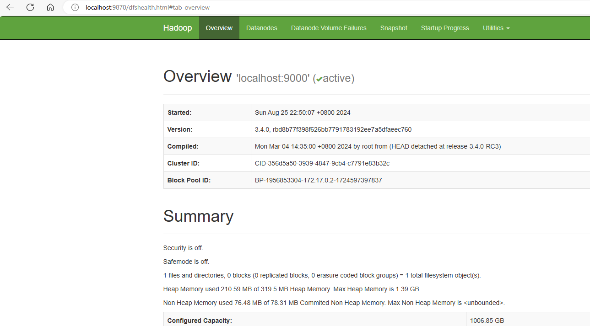
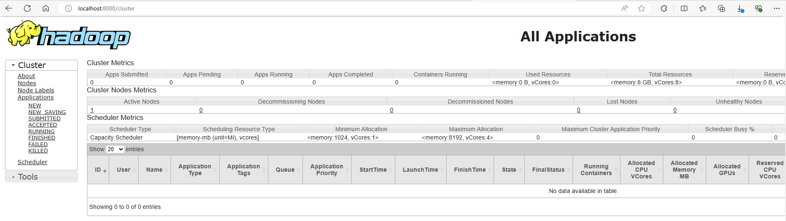
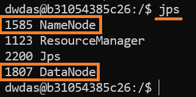
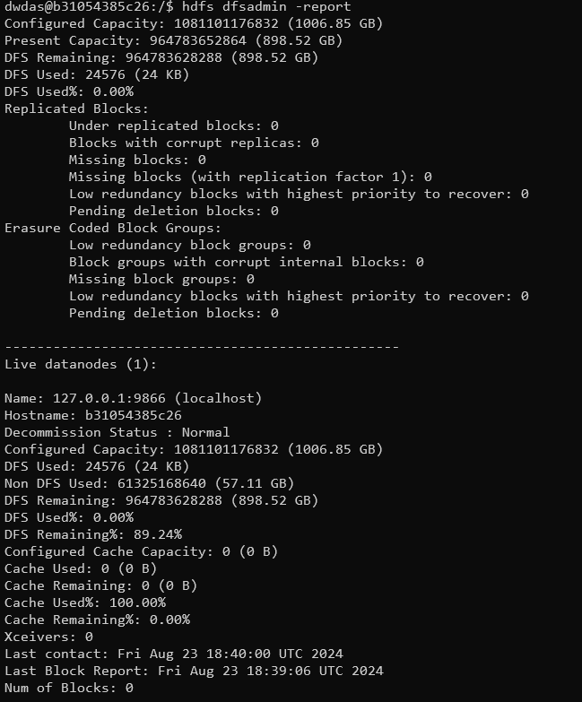

# <span style="color: MediumOrchid; font-family: Segoe UI, sans-serif;">Create a Single-Node Hadoop Container on Docker</span>

Setting up Hadoop can be quite confusing, especially if you're new to it. The best ready-to-use setups used to be provided by Cloudera, their current docker image(as on Aug 2024) has many issues. In this guide, I’ll help you create a pure Hadoop container with just one node. This guide is divided into two sections: one for quick steps and another for a detailed setup. The container setup has been thoroughly tested and can be created easily.

## <span style="color: #AD49B3; font-family: Segoe UI, sans-serif;">Quick Steps for the Busy People</span>

If you’re short on time and don’t want to go through the entire process of setting everything up manually, this section is for you. Just follow the instructions here, use the ready-to-use files, and your container will be up and running in a few minutes!

### <span style="color: #963F9C; font-family: Segoe UI, sans-serif;">Steps to build the container using ready-to-use files</span>

<p style="color: #006600; font-family: 'Consolas', 'Courier New', monospace; background-color: #e6ffe6; padding: 15px; border-left: 5px solid #00cc66; font-size: 12px;">
Note: The `hadoop-3.4.0.tar.gz` file is not included in the zip because of its large size. I’ve set up the Dockerfile to download this file automatically from the Apache website if it’s not found in the folder. However, sometimes these download links change. If you encounter any issues with the automatic download, you can manually download the `hadoop-3.4.0.tar.gz` file from <a href="https://downloads.apache.org/hadoop/common/hadoop-3.4.0/hadoop-3.4.0.tar.gz">this link</a>. If this link doesn’t work, simply search online for the file, download it, and place it in the folder. You don’t need to change anything in the Dockerfile; it will work as long as the file is named `hadoop-3.4.0.tar.gz`.
</p>

<p style="color: #006600; font-family: 'Consolas', 'Courier New', monospace; background-color: #ffe6e6; padding: 15px; border-left: 5px solid #cc0000; font-size: 12px;">
If you create a .sh file or any file on Windows and plan to use it in Linux, make sure you convert it to a Linux-friendly format using this <a href="https://toolslick.com/conversion/text/dos-to-unix" target="_blank">site</a>. Other methods may not work as well. It's important to convert the file, or else it might cause many unexpected errors.
</p>


- Download the [hadoop-singlenode.zip](Dockerfiles/hadoop-singlenode.zip) file.
- Unzip it to a folder on your laptop.
- Open command prompt/terminal and cd to the folder where you unziped the files

    ```bash
    cd path_to_unzipped_folder
    ```
- Build the doccker image from the Dockerfile. There is a **dot**
    ```bash
    docker build -t hadoop-singlenode .
    ```
- Run the container from the built image

    ```bash
    docker run -it --name hadoop-singlenode --network dasnet -p 9870:9870 -p 8088:8088 -v namenode-data:/hadoop/dfs/namenode  -v datanode-data:/hadoop/dfs/datanode -v secondarynamenode-data:/hadoop/dfs/secondarynamenode  hadoop-singlenode
    ```
- From inside the running container, start the Hadoop services:

    ```bash
    sudo service ssh start
    $HADOOP_HOME/sbin/start-dfs.sh
    $HADOOP_HOME/sbin/start-yarn.sh
    ```
### <span style="color: #963F9C; font-family: Segoe UI, sans-serif;">Check the setup</span>
  - Once the services are up you can access the Hadoop links:
     - **HDFS NameNode Web UI:** http://localhost:9870
        

     - **YARN ResourceManager Web UI:** http://localhost:8088
        

## <span style="color: #AD49B3; font-family: Segoe UI, sans-serif;">Detailed steps - building the setup, file by file</span>

If you want to understand how to build the Docker container from scratch or make custom modifications, follow these steps.


### <span style="color: #963F9C; font-family: Segoe UI, sans-serif;">Details of the files used</span>

The setup uses 6 files, `Dockerfile`, `core-site.xml`, `hdfs-site.xml`, `mapred-site.xml`, `yarn-site.xml` and `hadoop-env.sh`

- **Dockerfile:** This is the main file. We only use Dockerfile for our setup and no docker-compose.yml. But, you can add a docker-compose if you need. The filename is `Dockerfile`(no extension) and has the following content:

    ```bash
    # Use a base image with Java 8
    FROM openjdk:8-jdk

    # Set environment variables for Hadoop
    ENV HADOOP_VERSION=3.4.0
    ENV HADOOP_HOME=/usr/local/hadoop
    ENV JAVA_HOME=/usr/local/openjdk-8
    ENV PATH=$PATH:$HADOOP_HOME/bin:$HADOOP_HOME/sbin
    ENV HDFS_NAMENODE_USER=dwdas
    ENV HDFS_DATANODE_USER=dwdas
    ENV HDFS_SECONDARYNAMENODE_USER=dwdas
    ENV YARN_RESOURCEMANAGER_USER=dwdas
    ENV YARN_NODEMANAGER_USER=dwdas

    # Install necessary packages
    RUN apt-get update && \
        apt-get install -y ssh rsync sudo wget && \
        apt-get clean

    # Set root password
    RUN echo "root:Passw0rd" | chpasswd

    # Create a user 'dwdas' with sudo privileges
    RUN useradd -m -s /bin/bash dwdas && \
        echo "dwdas:Passw0rd" | chpasswd && \
        usermod -aG sudo dwdas && \
        echo "dwdas ALL=(ALL) NOPASSWD: ALL" >> /etc/sudoers

    # Optional: Download and extract Hadoop tarball if not already provided
    COPY hadoop-${HADOOP_VERSION}.tar.gz /tmp/
    RUN if [ ! -f /tmp/hadoop-${HADOOP_VERSION}.tar.gz ]; then \
            wget https://archive.apache.org/dist/hadoop/common/hadoop-${HADOOP_VERSION}/hadoop-${HADOOP_VERSION}.tar.gz -O /tmp/hadoop-${HADOOP_VERSION}.tar.gz; \
        fi && \
        tar -xzf /tmp/hadoop-${HADOOP_VERSION}.tar.gz -C /usr/local && \
        mv /usr/local/hadoop-${HADOOP_VERSION} $HADOOP_HOME && \
        rm /tmp/hadoop-${HADOOP_VERSION}.tar.gz

    # Configure Hadoop - Create necessary directories on Docker volumes
    RUN mkdir -p /hadoop/dfs/namenode && \
        mkdir -p /hadoop/dfs/datanode && \
        mkdir -p /hadoop/dfs/secondarynamenode

    # Copy configuration files
    COPY core-site.xml $HADOOP_HOME/etc/hadoop/
    COPY hdfs-site.xml $HADOOP_HOME/etc/hadoop/
    COPY mapred-site.xml $HADOOP_HOME/etc/hadoop/
    COPY yarn-site.xml $HADOOP_HOME/etc/hadoop/
    # Copy and configure hadoop-env.sh. JAVA_HOME MUST be set here also.
    COPY hadoop-env.sh $HADOOP_HOME/etc/hadoop/hadoop-env.sh

    # Set ownership for Hadoop directories and volumes to 'dwdas'
    RUN chown -R dwdas:dwdas $HADOOP_HOME /hadoop/dfs/namenode /hadoop/dfs/datanode /hadoop/dfs/secondarynamenode

    # Switch to the dwdas user for all subsequent operations
    USER dwdas

    # Create the .ssh directory and set permissions
    RUN mkdir -p /home/dwdas/.ssh && \
        chmod 700 /home/dwdas/.ssh

    # Generate SSH keys for passwordless SSH login and configure SSH
    RUN ssh-keygen -t rsa -P '' -f /home/dwdas/.ssh/id_rsa && \
        cat /home/dwdas/.ssh/id_rsa.pub >> /home/dwdas/.ssh/authorized_keys && \
        chmod 600 /home/dwdas/.ssh/authorized_keys && \
        echo "Host localhost" >> /home/dwdas/.ssh/config && \
        echo "   StrictHostKeyChecking no" >> /home/dwdas/.ssh/config && \
        chmod 600 /home/dwdas/.ssh/config

    # Format HDFS as 'dwdas' user
    RUN $HADOOP_HOME/bin/hdfs namenode -format

    # Expose the necessary ports for Hadoop services
    EXPOSE 9870 8088 19888

    # Set the container to start in the dwdas user's home directory
    WORKDIR /home/dwdas

    # Set the container to start with a bash shell
    CMD ["bash"]

    ```
- **core-site.xml**: Configures the default filesystem and permissions.
    ```xml
    <configuration>
        <property>
            <name>fs.defaultFS</name>
            <value>hdfs://localhost:9000</value>
        </property>
        <property>
            <name>dfs.permissions</name>
            <value>false</value>
        </property>
    </configuration>
    ```

- **hdfs-site.xml**: Configures the NameNode and DataNode directories.
    ```xml
    <configuration>
        <property>
            <name>dfs.namenode.name.dir</name>
            <value>file:///usr/local/hadoop/tmp/hdfs/namenode</value>
        </property>
        <property>
            <name>dfs.datanode.data.dir</name>
            <value>file:///usr/local/hadoop/tmp/hdfs/datanode</value>
        </property>
        <property>
            <name>dfs.replication</name>
            <value>1</value>
        </property>
        <property>
            <name>dfs.permissions.superusergroup</name>
            <value>dwdas</value>
        </property>
        <property>
            <name>dfs.cluster.administrators</name>
            <value>dwdas</value>
        </property>
    </configuration>
    ```

- **mapred-site.xml**: Configures the MapReduce framework to use YARN.
    ```xml
    <configuration>
        <property>
            <name>mapreduce.framework.name</name>
            <value>yarn</value>
        </property>
        <property>
            <name>mapred.job.tracker</name>
            <value>hadoop-master:9001</value>
        </property>
    </configuration>
    ```

- **yarn-site.xml**: Configures YARN services.
    ```xml
    <configuration>
        <property>
            <name>yarn.nodemanager.aux-services</name>
            <value>mapreduce_shuffle</value>
        </property>
        <property>
            <name>yarn.nodemanager.aux-services.mapreduce.shuffle.class</name>
            <value>org.apache.hadoop.mapred.ShuffleHandler</value>
        </property>
    </configuration>
    ```


- **hadoop-env.sh:** I haven’t included this entire file because it’s large, and there’s only **one change** you need to make. Refer to the `hadoop-env.sh` file in the zip folder. The only modification required is shown below. Note: This step is crucial. Without this, Hadoop will give an error saying it can’t find `JAVA_HOME`, even if you’ve already set it as an environment variable. This change follows Apache's instructions.


    ```bash
    export JAVA_HOME=/usr/local/openjdk-8
    ```

### <span style="color: #963F9C; font-family: Segoe UI, sans-serif;">Building, Running, and Testing the Setup</span>

The process for building, running, and testing the setup is the same as described in the [Quick Steps section](#quick-steps-for-the-busy-people). Simply navigate to the folder, build the container, and then run it as before.

### <span style="color: #963F9C; font-family: Segoe UI, sans-serif;">How to test the setup?</span>

The table below shows how various components and functionalities could be tested:

| **Category**               | **Action**                                    | **Command/URL**                                                                            | **What to Look For**                                                             |
|----------------------------|-----------------------------------------------|--------------------------------------------------------------------------------------------|----------------------------------------------------------------------------------|
| **Verify HDFS**            | Check HDFS status                             | `hdfs dfsadmin -report`                                                                    | A detailed report on the HDFS cluster, showing live nodes, configured capacity, used space, etc. |
|                            | Browse HDFS NameNode Web UI                   | `http://localhost:9870`                                                                    | The HDFS NameNode web interface should load, showing the health of the file system.             |
|                            | Create a directory                            | `hdfs dfs -mkdir /test`                                                                    | No errors, and the directory `/test` should be created successfully in HDFS.                    |
|                            | List directory contents                       | `hdfs dfs -ls /`                                                                           | The newly created `/test` directory should be listed.                                            |
| **Verify YARN**            | Check YARN NodeManager status                 | `yarn node -list`                                                                          | A list of nodes managed by YARN, showing their status (e.g., healthy, active).                   |
|                            | Browse YARN ResourceManager Web UI            | `http://localhost:8088`                                                                    | The YARN ResourceManager web interface should load, showing job and node statuses.               |
| **Verify Hadoop Services** | Check running services                        | `jps`                                                                                      | List of Java processes such as `NameNode`, `DataNode`, `ResourceManager`, and `NodeManager`.     |
| **Test MapReduce**         | Run a test MapReduce job                      | `hadoop jar $HADOOP_HOME/share/hadoop/mapreduce/hadoop-mapreduce-examples-*.jar wordcount /test /output` | The MapReduce job should complete successfully, creating an output directory in HDFS.            |
|                            | Verify MapReduce output                       | `hdfs dfs -ls /output`                                                                     | The `/output` directory should contain the results of the MapReduce job.                        |

### <span style="color: #963F9C; font-family: Segoe UI, sans-serif;">Setup details</span>

| **Component**                | **Item**                                | **Location/Value**                                                                                  | **Description**                                                                              |
|------------------------------|-----------------------------------------|-----------------------------------------------------------------------------------------------------|----------------------------------------------------------------------------------------------|
| **Hadoop Installation**       | **Directory**                          | `/usr/local/hadoop`                                                                                 | Hadoop installation directory.                                                               |
|                              | **Version**                            | `3.4.0`                                                                                             | Hadoop version.                                                                              |
|                              | **Core Config**                        | `$HADOOP_HOME/etc/hadoop/core-site.xml`                                                              | Core configuration file.                                                                     |
|                              | **HDFS Config**                        | `$HADOOP_HOME/etc/hadoop/hdfs-site.xml`                                                              | HDFS configuration file.                                                                     |
|                              | **MapReduce Config**                   | `$HADOOP_HOME/etc/hadoop/mapred-site.xml`                                                            | MapReduce configuration file.                                                                |
|                              | **YARN Config**                        | `$HADOOP_HOME/etc/hadoop/yarn-site.xml`                                                              | YARN configuration file.                                                                     |
|                              | **Env Variables**                      | `$HADOOP_HOME/etc/hadoop/hadoop-env.sh`                                                              | Hadoop environment variables.                                                                |
| **HDFS Directories**          | **NameNode**                           | `/hadoop/dfs/namenode`                                                                               | HDFS NameNode data directory (Docker volume).                                                |
|                              | **DataNode**                           | `/hadoop/dfs/datanode`                                                                               | HDFS DataNode data directory (Docker volume).                                                |
|                              | **Secondary NameNode**                 | `/hadoop/dfs/secondarynamenode`                                                                      | Secondary NameNode directory (Docker volume).                                                |
| **Environment Variables**     | **Hadoop Home**                        | `/usr/local/hadoop`                                                                                 | Path to Hadoop installation.                                                                 |
|                              | **Java Home**                          | `/usr/local/openjdk-8`                                                                              | Path to Java installation.                                                                   |
|                              | **System Path**                        | `$PATH:$HADOOP_HOME/bin:$HADOOP_HOME/sbin`                                                          | Updated path including Hadoop binaries.                                                      |
|                              | **HDFS_NAMENODE_USER**                 | `dwdas`                                                                                             | User for NameNode service.                                                                   |
|                              | **HDFS_DATANODE_USER**                 | `dwdas`                                                                                             | User for DataNode service.                                                                   |
|                              | **HDFS_SECONDARYNAMENODE_USER**        | `dwdas`                                                                                             | User for Secondary NameNode service.                                                         |
|                              | **YARN_RESOURCEMANAGER_USER**          | `dwdas`                                                                                             | User for ResourceManager service.                                                            |
|                              | **YARN_NODEMANAGER_USER**              | `dwdas`                                                                                             | User for NodeManager service.                                                                |
| **Networking**                | **Docker Network**                     | `dasnet`                                                                                            | Docker network for the Hadoop container.                                                     |
| **Ports Mapped**              | **HDFS NameNode UI**                   | `9870:9870`                                                                                         | Port mapping for HDFS NameNode web interface.                                                |
|                              | **YARN ResourceManager UI**            | `8088:8088`                                                                                         | Port mapping for YARN ResourceManager web interface.                                         |

## <span style="color: #AD49B3; font-family: Segoe UI, sans-serif;">Appendix</span>

- **Alternate command - Start the Namenode**
    ```sh
    $HADOOP_HOME/sbin/hadoop-daemon.sh start namenode
    ```
- **Alternate command - Start the Datanode**
    ```sh
    $HADOOP_HOME/sbin/hadoop-daemon.sh start datanode
    ```

- **Enter `jps` to see all the hadoop services**

    

- **Command to get a report on the Hadoop setup**

    ```sh
    hdfs dfsadmin -report
    ```
    

## <span style="color: #AD49B3; font-family: Segoe UI, sans-serif;">Common Errors and Their Solutions</span>

- **Port Binding Error**:
   - **Error**: `Ports are not available: exposing port TCP 0.0.0.0:50070 -> 0.0.0.0:0: listen tcp 0.0.0.0:50070: bind: An attempt was made to access a socket in a way forbidden by its access permissions.`
   - **Solution**: Make sure that the ports you’re using aren’t already in use by other services. You can check and stop any process using these ports with these commands:
     ```sh
     netstat -aon | findstr :50070
     taskkill /PID <PID> /F
     ```
     Or you can change the port numbers in the Dockerfile and `docker run` command.

- **Permission Denied Error**:
   - **Error**: `ERROR: Attempting to operate on hdfs namenode as root but there is no HDFS_NAMENODE_USER defined.`
   - **Solution**: Hadoop services should not run as the root user. The Dockerfile sets up a non-root user (`dwdas`) to run Hadoop and Hive services:
     ```Dockerfile
     ENV HDFS_NAMENODE_USER=dwdas
     ENV HDFS_DATANODE_USER=dwdas
     ENV HDFS_SECONDARYNAMENODE_USER=dwdas
     ENV YARN_RESOURCEMANAGER_USER=dwdas
     ENV YARN_NODEMANAGER_USER=dwdas
     ```

- **Multiple SLF4J Bindings Error**:
   - **Error**: `SLF4J: Class path contains multiple SLF4J bindings.`
   - **Solution**: This is usually just a warning, not an error. It means there are multiple SLF4J bindings in the classpath. It can generally be ignored, but if it causes issues, you might need to clean up the classpath by removing conflicting SLF4J jars.