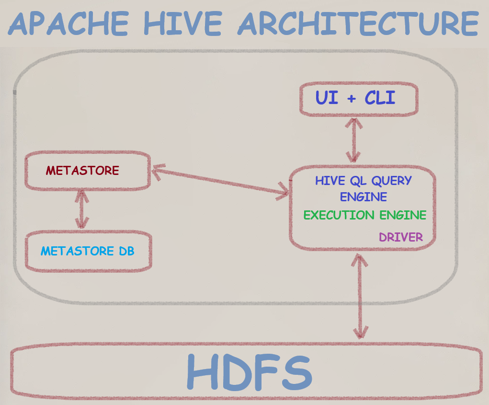

- [End-to-End Tutorial for Installing Hadoop and Hive in a Docker Container](#end-to-end-tutorial-for-installing-hadoop-and-hive-in-a-docker-container)
  - [Step 1: Download Hadoop and Hive](#step-1-download-hadoop-and-hive)
  - [Step 2: Prepare the Configuration Files](#step-2-prepare-the-configuration-files)
  - [Step 3: Create the Dockerfile](#step-3-create-the-dockerfile)
  - [Step 4: Build the Docker Image](#step-4-build-the-docker-image)
  - [Step 5: Create and Connect to the Docker Network](#step-5-create-and-connect-to-the-docker-network)
  - [Step 6: Run the Docker Container](#step-6-run-the-docker-container)
- [Testing the Hadoop and Hive Setup](#testing-the-hadoop-and-hive-setup)
- [Notes:](#notes)
- [Error Handling and Troubleshooting](#error-handling-and-troubleshooting)
  - [Common Errors and Resolutions](#common-errors-and-resolutions)
- [User `dwdas`](#user-dwdas)
- [Important Locations and Variables for Hadoop and Hive Setup in Docker](#important-locations-and-variables-for-hadoop-and-hive-setup-in-docker)
- [Summary](#summary)




### End-to-End Tutorial for Installing Hadoop and Hive in a Docker Container

This tutorial will guide you through the process of setting up a Docker container with Hadoop and Hive, downloaded from the official Apache websites. 

#### Step 1: Download Hadoop and Hive

Download the following files from the Apache official websites:

- **Hadoop 3.4.0**: [Download Link](https://downloads.apache.org/hadoop/common/hadoop-3.4.0/hadoop-3.4.0.tar.gz)
- **Hive 4.0.0**: [Download Link](https://dlcdn.apache.org/hive/hive-4.0.0/apache-hive-4.0.0-bin.tar.gz)

Place these files in a directory where you will create your Dockerfile and configuration files.

#### Step 2: Prepare the Configuration Files

Create the five .xml files in the same folder with the contents below (`core-site.xml`, `hdfs-site.xml`, `mapred-site.xml`, `yarn-site.xml`, `hive-site.xml`).

**core-site.xml**:
```xml
<configuration>
    <property>
        <name>fs.defaultFS</name>
        <value>hdfs://localhost:9000</value>
    </property>
</configuration>
```

**hdfs-site.xml**:
```xml
<configuration>
    <property>
        <name>dfs.namenode.name.dir</name>
        <value>file:///usr/local/hadoop/tmp/hdfs/namenode</value>
    </property>
    <property>
        <name>dfs.datanode.data.dir</name>
        <value>file:///usr/local/hadoop/tmp/hdfs/datanode</value>
    </property>
    <property>
        <name>dfs.replication</name>
        <value>1</value>
    </property>
</configuration>
```

**mapred-site.xml**:
```xml
<configuration>
    <property>
        <name>mapreduce.framework.name</name>
        <value>yarn</value>
    </property>
</configuration>
```

**yarn-site.xml**:
```xml
<configuration>
    <property>
        <name>yarn.nodemanager.aux-services</name>
        <value>mapreduce_shuffle</value>
    </property>
    <property>
        <name>yarn.nodemanager.aux-services.mapreduce.shuffle.class</name>
        <value>org.apache.hadoop.mapred.ShuffleHandler</value>
    </property>
</configuration>
```

**hive-site.xml**:
```xml
<configuration>
    <property>
        <name>javax.jdo.option.ConnectionURL</name>
        <value>jdbc:derby:;databaseName=metastore_db;create=true</value>
    </property>
    <property>
        <name>javax.jdo.option.ConnectionDriverName</name>
        <value>org.apache.derby.jdbc.EmbeddedDriver</value>
    </property>
    <property>
        <name>hive.metastore.warehouse.dir</name>
        <value>/user/hive/warehouse</value>
    </property>
</configuration>
```

#### Step 3: Create the Dockerfile

Create a Dockerfile in the same directory where you have placed the Hadoop and Hive tar.gz files.

**Dockerfile**:
```Dockerfile
# Use a base image with Java
FROM openjdk:8-jdk

# Set environment variables
ENV HADOOP_VERSION=3.4.0
ENV HIVE_VERSION=4.0.0
ENV HADOOP_HOME=/usr/local/hadoop
ENV HIVE_HOME=/usr/local/hive
ENV PATH=$PATH:$HADOOP_HOME/bin:$HADOOP_HOME/sbin:$HIVE_HOME/bin
ENV HDFS_NAMENODE_USER=dwdas
ENV HDFS_DATANODE_USER=dwdas
ENV HDFS_SECONDARYNAMENODE_USER=dwdas
ENV YARN_RESOURCEMANAGER_USER=dwdas
ENV YARN_NODEMANAGER_USER=dwdas

# Install necessary packages
RUN apt-get update && \
    apt-get install -y ssh rsync && \
    apt-get clean

# Create a user dwdas
RUN useradd -m dwdas

# Copy and extract Hadoop binary tarball
COPY hadoop-${HADOOP_VERSION}.tar.gz /tmp/
RUN tar -xzf /tmp/hadoop-${HADOOP_VERSION}.tar.gz -C /usr/local && \
    mv /usr/local/hadoop-${HADOOP_VERSION} $HADOOP_HOME && \
    rm /tmp/hadoop-${HADOOP_VERSION}.tar.gz

# Copy and extract Hive
COPY apache-hive-${HIVE_VERSION}-bin.tar.gz /tmp/
RUN tar -xzf /tmp/apache-hive-${HIVE_VERSION}-bin.tar.gz -C /usr/local && \
    mv /usr/local/apache-hive-${HIVE_VERSION}-bin $HIVE_HOME && \
    rm /tmp/apache-hive-${HIVE_VERSION}-bin.tar.gz

# Configure Hadoop
RUN mkdir -p /usr/local/hadoop/tmp/hdfs/namenode && \
    mkdir -p /usr/local/hadoop/tmp/hdfs/datanode

COPY core-site.xml $HADOOP_HOME/etc/hadoop/core-site.xml
COPY hdfs-site.xml $HADOOP_HOME/etc/hadoop/hdfs-site.xml
COPY mapred-site.xml $HADOOP_HOME/etc/hadoop/mapred-site.xml
COPY yarn-site.xml $HADOOP_HOME/etc/hadoop/yarn-site.xml

# Configure Hive
COPY hive-site.xml $HIVE_HOME/conf/hive-site.xml

# Create metastore_db directory and set permissions
RUN mkdir -p /metastore_db && \
    chown -R dwdas:dwdas /metastore_db

# Change ownership of Hadoop and Hive directories
RUN chown -R dwdas:dwdas $HADOOP_HOME && \
    chown -R dwdas:dwdas $HIVE_HOME

# Format HDFS as dwdas user
USER dwdas
RUN $HADOOP_HOME/bin/hdfs namenode -format

# Expose different ports
EXPOSE 60070 6088 11000 11002

# Remove and recreate metastore_db directory and start services
CMD rm -rf /metastore_db && \
    mkdir -p /metastore_db && \
    chown -R dwdas:dwdas /metastore_db && \
    $HADOOP_HOME/sbin/start-dfs.sh && \
    $HADOOP_HOME/sbin/start-yarn.sh && \
    $HIVE_HOME/bin/hive --service metastore & \
    $HIVE_HOME/bin/hive --service hiveserver2 & \
    /bin/bash
```

#### Step 4: Build the Docker Image

Navigate to the directory containing your Dockerfile and run the following command to build the Docker image:

```sh
docker build -t hadoop-hive-single-node .
```

#### Step 5: Create and Connect to the Docker Network

Ensure that the network `spark-network` exists. If not, create it:

```sh
docker network create spark-network
```

#### Step 6: Run the Docker Container

Run the Docker container with the appropriate port mappings and connect it to the `spark-network`:

```sh
docker run -it --network spark-network -p 60070:50070 -p 6088:8088 -p 11000:10000 -p 11002:10002 hadoop-hive-single-node
```

### Testing the Hadoop and Hive Setup

The table below shows some important test for the Hadoop and Hive setup:

| **Category**               | **Action**                                    | **Command/URL**                                                                            | **Description**                                                                 |
|----------------------------|-----------------------------------------------|--------------------------------------------------------------------------------------------|---------------------------------------------------------------------------------|
| **Start Docker Container** | Start the Docker container                    | ```docker run -it --network spark-network -p 60070:50070 -p 6088:8088 -p 11000:10000 -p 11002:10002 hadoop-hive-single-node``` | Start the container and map the necessary ports.                               |
| **Verify HDFS**            | Check HDFS status                             | `hdfs dfsadmin -report`                                                                    | Provides a report on the HDFS cluster.                                          |
|                            | Browse HDFS                                   | `http://localhost:60070`                                                                   | Access the HDFS NameNode web interface.                                         |
|                            | Create a directory                            | `hdfs dfs -mkdir /test` <br> `hdfs dfs -ls /`                                              | Create and list a directory in HDFS.                                            |
| **Verify YARN**            | Check YARN status                             | `yarn node -list`                                                                          | Lists the nodes managed by YARN.                                                |
|                            | Browse YARN ResourceManager                   | `http://localhost:6088`                                                                    | Access the YARN ResourceManager web interface.                                  |
| **Verify Hive**            | Start Hive CLI                                | `hive`                                                                                     | Start the Hive CLI and connect to the metastore.                                |
|                            | Create and query a Hive table                 | ```sql<br>CREATE TABLE test_table (id INT, name STRING);<br>INSERT INTO test_table (id, name) VALUES (1, 'Alice'), (2, 'Bob');<br>SELECT * FROM test_table;<br>``` | Create a table and perform a query in the Hive CLI.                             |
| **Access HiveServer2**     | Test HiveServer2 connection                   | `beeline -u jdbc:hive2://localhost:10000`                                                  | Use Beeline to connect to HiveServer2 and run queries.                          |

### Notes:
- **Start Docker Container**: Ensure that the container is running with the specified network and port mappings.
- **Verify HDFS**: Check the HDFS status, browse the NameNode web interface, and create a directory in HDFS to ensure HDFS is operational.
- **Verify YARN**: Check the YARN status and access the ResourceManager web interface to ensure YARN is running correctly.
- **Verify Hive**: Start the Hive CLI, create and query a table to ensure Hive is working, and test the HiveServer2 connection using Beeline.

### Error Handling and Troubleshooting

In this section, we’ll cover some common errors you might encounter during the setup process and how to resolve them.

#### Common Errors and Resolutions

1. **Port Binding Error**:
   - **Error**: `Ports are not available: exposing port TCP 0.0.0.0:50070 -> 0.0.0.0:0: listen tcp 0.0.0.0:50070: bind: An attempt was made to access a socket in a way forbidden by its access permissions.`
   - **Resolution**: Ensure that the specified ports are not being used by other services. You can check and terminate any process using these ports using the following commands:
     ```sh
     netstat -aon | findstr :50070
     taskkill /PID <PID> /F
     ```
     Alternatively, change the port mappings in the Dockerfile and `docker run` command.

2. **Directory Exists Error**:
   - **Error**: `ERROR XBM0J: Directory /metastore_db already exists.`
   - **Resolution**: This error occurs because the Hive metastore directory already exists. The Dockerfile has been updated to handle this by removing and recreating the directory before starting Hive services:
     ```Dockerfile
     CMD rm -rf /metastore_db && \
         mkdir -p /metastore_db && \
         chown -R dwdas:dwdas /metastore_db && \
         $HADOOP_HOME/sbin/start-dfs.sh && \
         $HADOOP_HOME/sbin/start-yarn.sh && \
         $HIVE_HOME/bin/hive --service metastore & \
         $HIVE_HOME/bin/hive --service hiveserver2 & \
         /bin/bash
     ```

3. **Permission Denied Error**:
   - **Error**: `ERROR: Attempting to operate on hdfs namenode as root but there is no HDFS_NAMENODE_USER defined.`
   - **Resolution**: The container should not run Hadoop services as the root user. The Dockerfile includes setting environment variables and creating a non-root user (`dwdas`) for running Hadoop and Hive services:
     ```Dockerfile
     ENV HDFS_NAMENODE_USER=dwdas
     ENV HDFS_DATANODE_USER=dwdas
     ENV HDFS_SECONDARYNAMENODE_USER=dwdas
     ENV YARN_RESOURCEMANAGER_USER=dwdas
     ENV YARN_NODEMANAGER_USER=dwdas
     ```

4. **Multiple SLF4J Bindings Error**:
   - **Error**: `SLF4J: Class path contains multiple SLF4J bindings.`
   - **Resolution**: This is typically a warning rather than an error. It indicates multiple SLF4J bindings in the classpath. This can usually be ignored, but if it causes issues, you might need to clean up the classpath by removing conflicting SLF4J jars.

### User `dwdas`

In this setup, a non-root user `dwdas` is created to run Hadoop and Hive services. This approach follows best practices for running services in a secure and controlled environment.

- **User Creation**:
  ```Dockerfile
  # Create a user dwdas
  RUN useradd -m dwdas
  ```
- **Environment Variables**:
  ```Dockerfile
  ENV HDFS_NAMENODE_USER=dwdas
  ENV HDFS_DATANODE_USER=dwdas
  ENV HDFS_SECONDARYNAMENODE_USER=dwdas
  ENV YARN_RESOURCEMANAGER_USER=dwdas
  ENV YARN_NODEMANAGER_USER=dwdas
  ```
- **Running Services as `dwdas`**:
  The Dockerfile ensures that all Hadoop and Hive services are started as the user `dwdas`:
  ```Dockerfile
  USER dwdas
  RUN $HADOOP_HOME/bin/hdfs namenode -format
  ```

### Important Locations and Variables for Hadoop and Hive Setup in Docker

| **Category**                  | **Variable/Location**                  | **Value/Description**                                                                                 |
|-------------------------------|----------------------------------------|-------------------------------------------------------------------------------------------------------|
| **Hadoop Installation**       | `HADOOP_HOME`                          | `/usr/local/hadoop` - Installation directory for Hadoop                                               |
|                               | `HADOOP_VERSION`                       | `3.4.0` - The version of Hadoop being used                                                            |
|                               | `core-site.xml`                        | `$HADOOP_HOME/etc/hadoop/core-site.xml` - Configuration file for Hadoop core settings                 |
|                               | `hdfs-site.xml`                        | `$HADOOP_HOME/etc/hadoop/hdfs-site.xml` - Configuration file for HDFS settings                        |
|                               | `mapred-site.xml`                      | `$HADOOP_HOME/etc/hadoop/mapred-site.xml` - Configuration file for MapReduce settings                 |
|                               | `yarn-site.xml`                        | `$HADOOP_HOME/etc/hadoop/yarn-site.xml` - Configuration file for YARN settings                        |
| **Hive Installation**         | `HIVE_HOME`                            | `/usr/local/hive` - Installation directory for Hive                                                   |
|                               | `HIVE_VERSION`                         | `4.0.0` - The version of Hive being used                                                              |
|                               | `hive-site.xml`                        | `$HIVE_HOME/conf/hive-site.xml` - Configuration file for Hive settings                                |
| **HDFS Data Directories**     | `NameNode`                             | `/usr/local/hadoop/tmp/hdfs/namenode` - Directory for HDFS NameNode metadata                          |
|                               | `DataNode`                             | `/usr/local/hadoop/tmp/hdfs/datanode` - Directory for HDFS DataNode data                              |
| **Hive Metastore Directory**  | `Metastore Directory`                  | `/metastore_db` - Directory for Hive metastore data                                                   |
| **Environment Variables**     | `HADOOP_HOME`                          | `/usr/local/hadoop` - Hadoop home directory                                                           |
|                               | `HIVE_HOME`                            | `/usr/local/hive` - Hive home directory                                                               |
|                               | `PATH`                                 | `$PATH:$HADOOP_HOME/bin:$HADOOP_HOME/sbin:$HIVE_HOME/bin` - System path updated for Hadoop and Hive    |
|                               | `HDFS_NAMENODE_USER`                   | `dwdas` - User running the Hadoop NameNode service                                                    |
|                               | `HDFS_DATANODE_USER`                   | `dwdas` - User running the Hadoop DataNode service                                                    |
|                               | `HDFS_SECONDARYNAMENODE_USER`          | `dwdas` - User running the Hadoop Secondary NameNode service                                          |
|                               | `YARN_RESOURCEMANAGER_USER`            | `dwdas` - User running the YARN ResourceManager service                                               |
|                               | `YARN_NODEMANAGER_USER`                | `dwdas` - User running the YARN NodeManager service                                                   |

### Summary

1. Download Hadoop and Hive.
2. Creae the necessary configuration files.
3. Create a Dockerfile and place it in the same directory as the downloaded files.
4. Build the Docker image.
5. Create a Docker network (if it doesn’t exist).
6. Run the Docker container, mapping the necessary ports and connecting it to the network.