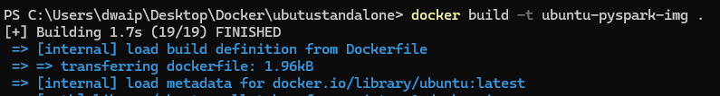
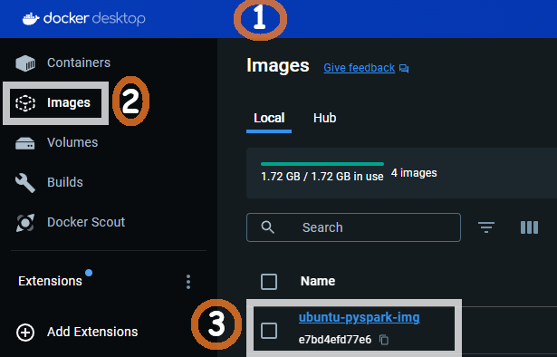

- [Ubuntu, Python, OpenJDK \& PySpark](#ubuntu-python-openjdk--pyspark)
  - [For Busy People](#for-busy-people)
  - [Background](#background)
  - [Step1: Create the Dockerfile](#step1-create-the-dockerfile)
  - [Step 2: Build the Docker Image](#step-2-build-the-docker-image)
  - [Step 3: Run the Docker Container](#step-3-run-the-docker-container)
  - [Details of the container](#details-of-the-container)
    - [Error: Package Not Found (404 Not Found)](#error-package-not-found-404-not-found)
- [Debian, Downloaded Python, Pyspark - no venv.](#debian-downloaded-python-pyspark---no-venv)
  - [Steps to Create the Image and Container](#steps-to-create-the-image-and-container)
    - [**Create a Dockerfile**:](#create-a-dockerfile)
    - [**Download  Python and place in the same folder**](#download--python-and-place-in-the-same-folder)
    - [**Build the Docker Image**:](#build-the-docker-image)
    - [**Run the Docker Container**:](#run-the-docker-container)
  - [Details of the Container](#details-of-the-container-1)
- [Debian, Pip Python, Pip Pyspark - venv.](#debian-pip-python-pip-pyspark---venv)
  - [Steps to Create the Image and Container](#steps-to-create-the-image-and-container-1)
    - [**Create a Dockerfile**:](#create-a-dockerfile-1)
    - [**Build the Docker Image**:](#build-the-docker-image-1)
    - [**Run the Docker Container**:](#run-the-docker-container-1)
  - [Details of the Container](#details-of-the-container-2)
- [Single-Node Bitnami Spark With Master and Worker](#single-node-bitnami-spark-with-master-and-worker)
  - [Steps to create the container](#steps-to-create-the-container)
    - [1. Create a Custom Dockerfile](#1-create-a-custom-dockerfile)
    - [2. Create a Local `conf` Directory](#2-create-a-local-conf-directory)
    - [3. Build the Docker Image](#3-build-the-docker-image)
    - [4. Run the Container and Map the `conf` Directory](#4-run-the-container-and-map-the-conf-directory)
  - [Configuration Reference](#configuration-reference)
    - [Environment Details](#environment-details)
    - [Theoretical Reference: Read-only Environment Variables (Official Bitnami github)](#theoretical-reference-read-only-environment-variables-official-bitnami-github)


# <h2 style="text-align: center; background-color: #008080; color: white; font-family: 'Segoe UI', sans-serif; padding: 20px 25px; border-radius: 10px; box-shadow: 0 4px 12px rgba(0, 0, 0, 0.15); letter-spacing: 1px;">Ubuntu, Python, OpenJDK & PySpark</h2>


## <span style="color: #682A6E; font-family: Segoe UI, sans-serif;">For Busy People</span>

1. Save the [Dockerfile](#dockerfile) content as `Dockerfile` (no extension).
2. `cd` to the folder containtng  the Dockerfile
3. **Run Commands**:
   ```sh
   docker build -t ubuntu-pyspark .
   docker run -it --name Ubuntu-PySpark --network dasnet ubuntu-pyspark
   ```

That’s it!

## <span style="color: #AD49B3; font-family: Segoe UI, sans-serif;">Background</span>

In this article I will show you how to create a single container with Ubuntu OS, Python and PySpark. We will use just a dockerfile to create it.

Follow the steps below to create the container.

## <span style="color: #682A6E; font-family: Segoe UI, sans-serif;">Step1: Create the Dockerfile</span>

In a folder create a file **Dockerfile**(No extension) with the content below.

```Dockerfile
# Use Ubuntu 20.04 as the base image to avoid "externally-managed-environment" restrictions
FROM ubuntu:20.04

# Set environment variable to avoid interactive prompts during package installation
ENV DEBIAN_FRONTEND=noninteractive

# Update the package list to ensure we have the latest information about available packages
RUN apt-get update

# Install necessary packages including curl, sudo, and nano
RUN apt-get install -y curl sudo nano software-properties-common

# Add the 'deadsnakes' PPA (Personal Package Archive) to access newer Python versions
RUN add-apt-repository ppa:deadsnakes/ppa

# Add the OpenJDK PPA to get the latest JDK versions
RUN add-apt-repository ppa:openjdk-r/ppa

# Update the package list again to include the new PPAs
RUN apt-get update

# Install Python 3.12, pip, and OpenJDK 17
RUN apt-get install -y python3.12 python3-pip openjdk-17-jdk-headless

# Install the PySpark library using pip
RUN pip3 install pyspark

# Clean up the package lists to reduce the image size
RUN apt-get clean && rm -rf /var/lib/apt/lists/*

# Create a root user and set its password
RUN echo 'root:Passw0rd' | chpasswd

# Create a new user 'dwdas', set a password, and add this user to the sudo group
RUN useradd -ms /bin/bash dwdas && echo 'dwdas:Passw0rd' | chpasswd && adduser dwdas sudo

# Allow the 'dwdas' user to run sudo commands without a password
RUN echo 'dwdas ALL=(ALL) NOPASSWD:ALL' >> /etc/sudoers

# Set the working directory to the home directory of the new user
WORKDIR /home/dwdas

# Switch to the new user 'dwdas'
USER dwdas

# Expose port 8888, commonly used for Jupyter Notebook, if needed
EXPOSE 8888

# Set the default command to start a bash shell
CMD ["bash"]
```

## <span style="color: #682A6E; font-family: Segoe UI, sans-serif;">Step 2: Build the Docker Image</span>

Open CMD, navigate to the folder with the Dockerfile, and run:

```sh
docker build -t ubuntu-pyspark-img .
```



After successfully running the command, you will see an image in your Docker Desktop app:



## <span style="color: #682A6E; font-family: Segoe UI, sans-serif;">Step 3: Run the Docker Container</span>

In command prompt, run:

```sh
docker run -it --name Debian-PySpark --network dasnet debian-pyspark
```

This will create a container with the image we created earlier and start it. You can see it from the Container section of your Docker window.


## <span style="color: #963F9C; font-family: Segoe UI, sans-serif;">Details of the container</span>

Here are the details of the installed components. The table will be a handy reference to know which components are installed and important locations, variables etc.

| **Component**                      | **Details**                                                                                     |
|------------------------------------|-------------------------------------------------------------------------------------------------|
| **Base Image**                     | `ubuntu:20.04`                                                                                  |
| **Python Version**                 | Python 3.12, installed via the `deadsnakes` PPA                                                 |
| **Java Version**                   | OpenJDK 17 (Headless), installed via the `openjdk-r` PPA                                        |
| **PySpark Version**                | Latest version of PySpark installed via pip                                                     |
| **Home Directory for User**        | `/home/dwdas`                                                                                   |
| **Spark Home**                     | `/opt/bitnami/spark`                                                                            |
| **Java Home**                      | `/opt/bitnami/java`                                                                             |
| **Python Path**                    | `/opt/bitnami/spark/python/` (for PySpark integration)                                          |
| **Spark Configuration Directory**  | `/opt/bitnami/spark/conf`                                                                       |
| **Spark Worker Directory**         | `/opt/bitnami/spark/work`                                                                       |
| **Environment Variables**          | `DEBIAN_FRONTEND=noninteractive` to avoid interactive prompts during installation               |
| **User Created**                   | `dwdas` with sudo privileges and passwordless sudo access                                       |
| **Exposed Port**                   | Port `8888`, commonly used for Jupyter Notebooks                                                |
| **Default Command**                | `bash` shell set as the default command                                                         |
| **Network Configuration**          | Connected to the `dasnet` network                                                               |
| **Spark Ports**                    | Spark Master: `7077` (mapped to host port `17077`), Spark Master UI: `8080` (mapped to host port `16080`), Spark Worker UI: `8081` (mapped to host port `16002`), `8082` (mapped to host port `16004`) |

### <span style="color: #963F9C; font-family: Segoe UI, sans-serif;">Error: Package Not Found (404 Not Found)</span>

When building the Docker image, I got a `404 Not Found` error because some packages like `python3.12` and `openjdk-17-jdk-headless` couldn't be found. This usually happens if the package lists are outdated or there's an issue with the repositories. Here's how to fix it:

1. **Update Package Lists**: Run `apt-get update` first to make sure your package lists are current.

2. **Add Correct PPAs**: Update the Dockerfile to include these PPAs:
   - `deadsnakes` for Python.
   - `openjdk-r` for OpenJDK.

3. **Use `--fix-missing` Option**: If the problem continues, try `apt-get install --fix-missing` to fix missing packages.

4. **Install Specific Versions**: If the latest version isn't available, try installing a slightly older but stable version.

*For any questions or further assistance, please contact me at das.d@hotmail.com.*

# Debian, Downloaded Python, Pyspark - no venv.

This Section shows you how to create a Docker container with the latest Debian, Python 3.11, OpenJDK 17, and PySpark. We’ll set up a root user and a named user with essential environment variables.

Note: If you install python using  apt-get install in new Debain it will ask you to install in venv mode. We want to avoid this. Hence we download it(weget) then intstall it manually.

We’ll use a Dockerfile and docker-compose.yml for the setup.

## Steps to Create the Image and Container

### **Create a Dockerfile**:
   - Create a **Dockerfile.txt** with the contents below and **remove the .txt** extension

     ```dockerfile
     # Use Debian as the base image
     FROM debian:latest

     # Set environment variable to avoid interactive prompts during package installation
     ENV DEBIAN_FRONTEND=noninteractive

     # Update the package lists and install essential packages
     RUN apt-get update && apt-get install -y --no-install-recommends \
       curl \
       wget \
       tar \
       bash \
       ca-certificates \
       sudo \
       build-essential \
       libssl-dev \
       zlib1g-dev \
       libbz2-dev \
       libreadline-dev \
       libsqlite3-dev \
       libffi-dev

     # Copy the Python source tarball into the image
     COPY Python-3.11.9.tgz /tmp/

     # Extract, build, and install Python 3.11.9
     RUN cd /tmp && \
         tar -xvf Python-3.11.9.tgz && \
         cd Python-3.11.9 && \
         ./configure --enable-optimizations && \
         make -j 8 && \
         make altinstall && \
         cd .. && \
         rm -rf Python-3.11.9 Python-3.11.9.tgz

     # Create symbolic links for python, python3, pip, and pip3
     RUN ln -s /usr/local/bin/python3.11 /usr/bin/python && \
         ln -s /usr/local/bin/python3.11 /usr/bin/python3 && \
         ln -s /usr/local/bin/pip3.11 /usr/bin/pip && \
         ln -s /usr/local/bin/pip3.11 /usr/bin/pip3

     # Install OpenJDK 17
     RUN apt-get install -y openjdk-17-jdk-headless

     # Install the PySpark library using pip
     RUN python3.11 -m pip install pyspark

     # Set environment variables
     ENV JAVA_HOME=/usr/lib/jvm/java-17-openjdk-amd64
     ENV PYTHONPATH=/usr/local/lib/python3.11/dist-packages
     ENV PYSPARK_PYTHON=/usr/local/bin/python3.11
     ENV PATH=$PATH:$JAVA_HOME/bin

     # Clean up the package lists to reduce the image size
     RUN apt-get clean && rm -rf /var/lib/apt/lists/*

     # Create a root user and set its password
     RUN echo 'root:Passw0rd' | chpasswd

     # Create a new user 'dwdas', set a password, and add this user to the sudo group
     RUN useradd -ms /bin/bash dwdas && echo 'dwdas:Passw0rd' | chpasswd && adduser dwdas sudo

     # Allow the 'dwdas' user to run sudo commands without a password
     RUN echo 'dwdas ALL=(ALL) NOPASSWD:ALL' >> /etc/sudoers

     # Set the working directory to the home directory of the new user
     WORKDIR /home/dwdas

     # Switch to the new user 'dwdas'
     USER dwdas

     # Expose port 8888, commonly used for Jupyter Notebook, if needed
     EXPOSE 8888

     # Set the default command to start a bash shell
     CMD ["bash"]
     ```
### **Download  Python and place in the same folder**

Download Python 3.11.9 from [this site](https://www.python.org/ftp/python/3.11.9/Python-3.11.9.tgz) and place it in the same directory.

### **Build the Docker Image**:
   - Open a terminal and navigate to the directory containing the Dockerfile.
   - Run the following command to build the Docker image:

     ```bash
     docker build -t my-debian-pyspark .
     ```

### **Run the Docker Container**:
   - Once the image is built, run the container using the command:

     ```bash
     docker run -it --name my-debian-pyspark-container my-debian-pyspark
     ```

## Details of the Container

- **Base Image**: Debian (latest version at the time of build)
- **Python Version**: Python 3.11.9
- **Java Version**: OpenJDK 17
- **PySpark Version**: The latest version available via pip at the time of installation
- **Environment Variables**:
  - `JAVA_HOME`: `/usr/lib/jvm/java-17-openjdk-amd64`
  - `PYTHONPATH`: `/usr/local/lib/python3.11/dist-packages`
  - `PYSPARK_PYTHON`: `/usr/local/bin/python3.11`
  - `PATH`: `$PATH:$JAVA_HOME/bin`

- **Installed Packages**:
  - Essential build and development tools (`curl`, `wget`, `tar`, `bash`, `ca-certificates`, `sudo`, `build-essential`, `libssl-dev`, `zlib1g-dev`, `libbz2-dev`, `libreadline-dev`, `libsqlite3-dev`, `libffi-dev`)
  - Python 3.11.9, built and installed from source
  - OpenJDK 17 for Java runtime
  - PySpark installed via pip

- **User Configuration**:
  - Root user with password `Passw0rd`
  - New user `dwdas` with password `Passw0rd`, added to the sudo group with passwordless sudo privileges

- **Exposed Port**: 8888 (commonly used for Jupyter Notebook)

- **Default Command**: The container starts with a bash shell

# <h2 style="text-align: center; background-color: #4682B4; color: white; font-family: 'Segoe UI', sans-serif; padding: 15px 20px; border-radius: 10px; box-shadow: 2px 2px 8px rgba(0, 0, 0, 0.3); border: 2px solid #653090; letter-spacing: 1px;">Debian, Pip Python, Pip Pyspark - venv.</h2>

This section shows you how to create a Docker container with the latest Debian, Python 3.11, OpenJDK 17, and PySpark using the recommended venv approach. We’ll set up a root user and a named user with essential environment variables.

Note: Newer Debian versions enforce using venv for pip install. We will install Python using apt-get and set up venv from the command line.

We’ll use a Dockerfile and docker-compose.yml for the setup.

## Steps to Create the Image and Container

### **Create a Dockerfile**:
   - Create a Dockerfile with the following content:

     ```dockerfile
     # Use the latest version of Debian as the base image
     FROM debian:latest

     # Set environment variable to avoid interactive prompts during package installation
     ENV DEBIAN_FRONTEND=noninteractive

     # Update the package lists and install essential packages
     RUN apt-get update && \
         apt-get install -y curl wget tar bash ca-certificates sudo gnupg

     # Install Python 3.11, venv, pip, and OpenJDK 17
     RUN apt-get install -y python3.11 python3.11-venv python3.11-dev python3-pip openjdk-17-jdk-headless

     # Create a virtual environment
     RUN python3.11 -m venv /opt/venv

     # Activate the virtual environment and install PySpark
     RUN /opt/venv/bin/python -m pip install pyspark

     # Set environment variables
     ENV JAVA_HOME=/usr/lib/jvm/java-17-openjdk-amd64
     ENV PYTHONPATH=/opt/venv/lib/python3.11/site-packages
     ENV PYSPARK_PYTHON=/opt/venv/bin/python
     ENV PATH=$PATH:$JAVA_HOME/bin:/opt/venv/bin

     # Clean up the package lists to reduce the image size
     RUN apt-get clean && rm -rf /var/lib/apt/lists/*

     # Create a root user and set its password
     RUN echo 'root:Passw0rd' | chpasswd

     # Create a new user 'dwdas', set a password, and add this user to the sudo group
     RUN useradd -ms /bin/bash dwdas && echo 'dwdas:Passw0rd' | chpasswd && adduser dwdas sudo

     # Allow the 'dwdas' user to run sudo commands without a password
     RUN echo 'dwdas ALL=(ALL) NOPASSWD:ALL' >> /etc/sudoers

     # Set the working directory to the home directory of the new user
     WORKDIR /home/dwdas

     # Switch to the new user 'dwdas'
     USER dwdas

     # Expose port 8888, commonly used for Jupyter Notebook, if needed
     EXPOSE 8888

     # Set the default command to start a bash shell
     CMD ["bash"]
     ```

### **Build the Docker Image**:
   - Open a terminal and navigate to the directory containing the Dockerfile.
   - Run the following command to build the Docker image:

     ```bash
     docker build -t my-debian-pyspark-venv .
     ```

### **Run the Docker Container**:
   - Once the image is built, run the container using the command:

     ```bash
     docker run -it --name my-debian-pyspark-venv-container my-debian-pyspark-venv
     ```

## Details of the Container

- **Base Image**: Debian (latest version at the time of build)
- **Python Version**: Python 3.11.9
- **Java Version**: OpenJDK 17
- **PySpark Version**: Installed via pip in a virtual environment
- **Virtual Environment**: Created using `python3.11 -m venv /opt/venv`
- **Environment Variables**:
  - `JAVA_HOME`: `/usr/lib/jvm/java-17-openjdk-amd64`
  - `PYTHONPATH`: `/opt/venv/lib/python3.11/site-packages`
  - `PYSPARK_PYTHON`: `/opt/venv/bin/python`
  - `PATH`: `$PATH:$JAVA_HOME/bin:/opt/venv/bin`

- **Installed Packages**:
  - Essential tools (`curl`, `wget`, `tar`, `bash`, `ca-certificates`, `sudo`, `gnupg`)
  - Python 3.11, venv, pip, and OpenJDK 17
  - PySpark installed in the virtual environment

- **User Configuration**:
  - Root user with password `Passw0rd`
  - New user `dwdas` with password `Passw0rd`, added to the sudo group with passwordless sudo privileges

- **Exposed Port**: 8888 (commonly used for Jupyter Notebook)

- **Default Command**: The container starts with a bash shell


To modify the setup so that the `conf` directory in the Spark container is mapped to a local folder on your machine (and the folder is auto-created), we need to update the `docker run` command to include a volume mapping. 

# <h2 style="text-align: center; background-color: #7A3DAA; color: white; font-family: 'Segoe UI', sans-serif; padding: 15px 20px; border-radius: 10px; box-shadow: 2px 2px 8px rgba(0, 0, 0, 0.3); border: 2px solid #653090; letter-spacing: 1px;">Single-Node Bitnami Spark With Master and Worker</h2>


Here, we will use the official Bitnami Spark Docker image to set up a single-node Spark environment. This setup will include both the Master and Worker.

## Steps to create the container

You can either download, unzip, and run the `.bat` file from [this link](Dockerfiles/Bitnami_Spark_SingleNode_GOLD.zip) to create the entire container. Or, you can follow the steps manually. Both methods will give the same result.

### 1. Create a Custom Dockerfile

In your folder create a file Dockerfile(no extension) with the following content:

**Dockerfile**:  
```dockerfile
# Use the official Bitnami Spark image as the base. I always pull a constant image and not :latest.
FROM bitnami/spark:3.5.2-debian-12-r2

# Step 1: Switch to root user to install software
# We need to be root to install utilities and set up sudo permissions.
USER root

# Step 2: Update the package list and install utilities
# Install common utilities like sudo, ping, and nano.
RUN apt-get update && apt-get install -y sudo ping nano

# Step 3: Set the root user password to 'Passw0rd'
# This sets the root password to 'Passw0rd' for future access.
RUN echo "root:Passw0rd" | chpasswd

# Step 4: Give sudo privileges to the 'spark' user
# Here, we are allowing the 'spark' user to run commands as sudo without a password.
RUN echo "spark ALL=(ALL) NOPASSWD: ALL" >> /etc/sudoers

# After finishing the setup, we dont switch back to any user. The bitnami original Dockerfile switches to user 1001 and the directory is /opt/bitnami/spark

# Step 6: Expose necessary ports for Spark Web UI and communication
# 4040: Spark Worker Web UI
# 7077: Spark Master communication
# 8080: Spark Master Web UI
EXPOSE 4040 7077 8080

# End of the Dockerfile
```

### 2. Create a Local `conf` Directory

Before running the container, create a folder named `local-spark-conf` in the same folder where your Dockerfiles are. This folder will store the configuration files and will be mapped to the `conf` directory inside the container.

```bash
mkdir local-spark-conf
```

### 3. Build the Docker Image

Once the Dockerfile is ready, you can build the Docker image with the following command:

```bash
docker build -t bitnami-spark-single-node .
```

This command will create a Docker image called `bitnami-spark-single-node` using the Dockerfile you just created.

### 4. Run the Container and Map the `conf` Directory

Now, we run the Spark container with the `conf` directory mapped to the local folder you created earlier. If the folder doesn’t exist, Docker will create it.

```bash
docker run -d --network dasnet --name bitnami-spark-single-node -p 4040:4040 -p 8080:8080 -p 7077:7077 -v ./local-spark-conf:/opt/spark/conf bitnami-spark-single-node
```


## Configuration Reference

Here is a list of some components in this environment. The list is compiled from the official bitnami spark github [page](https://github.com/bitnami/containers/blob/main/bitnami/spark/README.md).

### Environment Details

| **Component**                      | **Value**                                                        |
|------------------------------------|------------------------------------------------------------------|
| **OS**                             | debian 12: bitnami/minideb:bookworm                              |
| **Python**                         | python-3.12.5-1: /opt/bitnami/python/bin/python                  |
| **PYTHONPATH**                     | /opt/bitnami/spark/python/                                       |
| **Java**                           | java-17.0.12-10-1: JAVA_HOME = /opt/bitnami/java                 |
| **JAVA_HOME**                      | /opt/bitnami/java                                                |
| **SPARK_HOME**                     | /opt/bitnami/spark                                               |
| **SPARK_USER**                     | spark                                                            |
| **SPARK JARS Location for Installing External Jars** | /opt/bitnami/spark/jars                                          |
| **Workdir**                        | /opt/bitnami/spark                                               |
| **User**                           | 1001                                                             |
| **Entrypoint**                     | /opt/bitnami/scripts/spark/entrypoint.sh                         |
| **Command**                        | /opt/bitnami/scripts/spark/run.sh                                |
| **Certificates**                   | /opt/bitnami/spark/conf/certs                                    |
| **SPARK_SSL_KEYSTORE_FILE**        | /opt/bitnami/spark/conf/certs/spark-keystore.jks                 |
| **SPARK_MODE**                     | master                                                           |
| **SPARK_MASTER_URL**               | spark://spark-master:7077                                        |
| **SPARK_SSL_ENABLED**              | no                                                               |
| **Docker Logs Command**            | docker logs bitnami-spark-single-node                            |

### Theoretical Reference: Read-only Environment Variables ([Official Bitnami github](https://github.com/bitnami/containers/blob/main/bitnami/spark/README.md))

| **Name**                    | **Description**                           | **Value**                           |
|-----------------------------|-------------------------------------------|-------------------------------------|
| **SPARK_BASE_DIR**           | Spark installation directory.             | ${BITNAMI_ROOT_DIR}/spark           |
| **SPARK_CONF_DIR**           | Spark configuration directory.            | ${SPARK_BASE_DIR}/conf              |
| **SPARK_DEFAULT_CONF_DIR**   | Spark default configuration directory.    | ${SPARK_BASE_DIR}/conf.default      |
| **SPARK_WORK_DIR**           | Spark workspace directory.                | ${SPARK_BASE_DIR}/work              |
| **SPARK_CONF_FILE**          | Spark configuration file path.            | ${SPARK_CONF_DIR}/spark-defaults.conf |
| **SPARK_LOG_DIR**            | Spark logs directory.                     | ${SPARK_BASE_DIR}/logs              |
| **SPARK_TMP_DIR**            | Spark tmp directory.                      | ${SPARK_BASE_DIR}/tmp               |
| **SPARK_JARS_DIR**           | Spark jar directory.                      | ${SPARK_BASE_DIR}/jars              |
| **SPARK_INITSCRIPTS_DIR**    | Spark init scripts directory.             | /docker-entrypoint-initdb.d         |
| **SPARK_USER**               | Spark user.                               | spark                               |
| **SPARK_DAEMON_USER**        | Spark system user.                        | spark                               |
| **SPARK_DAEMON_GROUP**       | Spark system group.                       | spark                               |