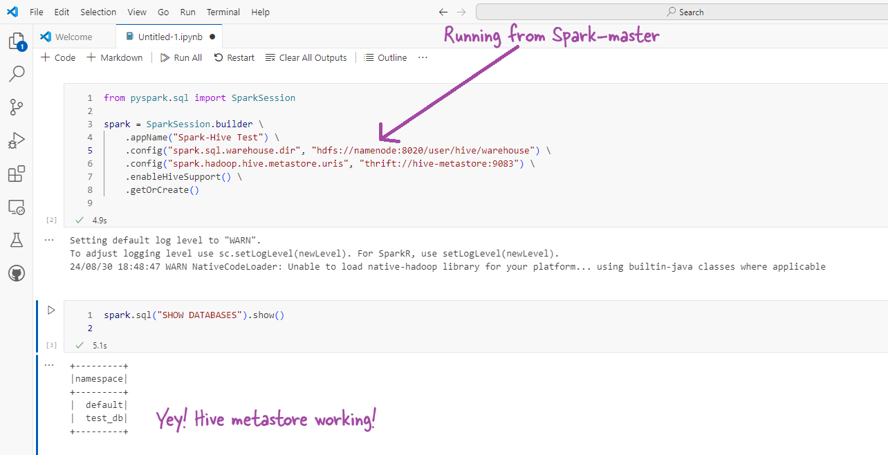

## Setting Up a Hadoop, Hive, and Presto Cluster Using Docker Compose

This guide will walk you through setting up a Hadoop ecosystem including HDFS, YARN, Hive, and Presto using Docker Compose. This setup will allow you to perform distributed data processing and SQL-based querying on large datasets. The services are containerized, making it easy to deploy and manage.

### **Overview of the Setup**

This setup involves several Docker containers, each providing a different service in the Hadoop ecosystem:

- **HDFS**: Provides a distributed file system that stores data across multiple nodes.
- **YARN**: Manages resources and job scheduling across the cluster.
- **Hive**: A data warehouse that allows SQL-like querying on data stored in HDFS.
- **Presto**: A distributed SQL query engine that allows querying large datasets from multiple sources.

The entire setup can be managed using Docker Compose, which simplifies the orchestration of multiple containers.

### **Using the Setup**

To use this setup, follow these steps:

1. **Download the Zip File**: 
   - Download the provided zip file that contains all the necessary configuration files and scripts.

2. **Unzip the File**: 
   - Extract the contents of the zip file to a directory of your choice:
     ```bash
     unzip hadoop-hive-presto-setup.zip
     cd hadoop-hive-presto-setup
     ```

3. **Run the Setup**: 
   - Start the entire setup by running the following command:
     ```bash
     docker-compose up -d
     ```
   - This command will spin up all the necessary containers and services.

4. **Access the Services**:
   - You can access the various services via their respective ports as described below.

### **Description of Services and Ports**


## Description of Services, Ports, and Folder Paths

Below is a detailed description of the services included in this setup, along with the ports used, relevant folder paths, and user access information. This will help both users and administrators to understand and manage the setup effectively.

| **Service**           | **Port** | **Description**                                                        | **Folder Path**                                      | **User Access** | **Details**                                                                 |
|-----------------------|----------|------------------------------------------------------------------------|------------------------------------------------------|-----------------|----------------------------------------------------------------------------|
| **Namenode (HDFS)**   | 50070    | Web UI for monitoring the HDFS Namenode.                               | `/hadoop/dfs/name`                                   | `root`          | Used for monitoring the HDFS cluster, filesystem namespace management.     |
| **Datanode (HDFS)**   | 50075    | Web UI for monitoring Datanode data transfer.                          | `/hadoop/dfs/data`                                   | `root`          | Stores actual data blocks, communicates with the Namenode.                 |
| **ResourceManager (YARN)** | 8088 | Web UI for monitoring resource allocation and job scheduling.          | `/rmstate`                                           | `root`          | Manages resources across the cluster, schedules and monitors jobs.         |
| **NodeManager (YARN)** | 8042    | Web UI for monitoring resource usage on individual nodes.              | `/app-logs`                                          | `root`          | Manages containers on each node, monitors resource usage.                  |
| **HistoryServer (YARN)** | 19888 | Web UI for accessing logs and statistics of completed MapReduce jobs.  | `/hadoop/yarn/timeline`                              | `root`          | Provides access to history logs and statistics of completed jobs.          |
| **HiveServer2 (Hive)** | 10000   | Service for executing SQL-based queries via JDBC/ODBC.                 | `/user/hive/warehouse`                               | `hive`          | Used for running SQL queries on data stored in HDFS via Hive.              |
| **Hive Metastore**    | 9083     | Service for managing metadata for Hive tables.                         | `/user/hive/warehouse` (metadata)                    | `hive`          | Stores metadata for Hive tables, accessed by HiveServer2 and clients.      |
| **Hive Metastore PostgreSQL** | N/A | Internal PostgreSQL database for Hive Metastore metadata storage. | `/var/lib/postgresql/data` (inside PostgreSQL container) | `postgres`     | Stores metadata about Hive tables, partitions, etc., used by the Metastore.|
| **Presto Coordinator** | 8081    | Web UI for monitoring queries and worker nodes in Presto.              | N/A                                                  | `root`          | Provides a distributed SQL query engine to run queries across data sources.|

## Hive Table and Data Location

- **Hive Tables**: The tables created in Hive are stored in HDFS under the directory `/user/hive/warehouse/`.
- **HDFS Data**: All data stored in HDFS, including Hive table data, is managed by the Namenode and Datanode services. The default directory for Hive tables is `/user/hive/warehouse/`.

## Users and Access

- **root**: The `root` user has access to all the Hadoop services and directories.
- **hive**: The `hive` user has access to Hive-specific directories and can execute SQL queries via HiveServer2.
- **postgres**: The `postgres` user is the database administrator for the PostgreSQL database used by the Hive Metastore.

## Testing the Setup

### 1. **Connecting to Hive**

To test the Hive setup, you can connect to HiveServer2 using Beeline:

```bash
docker exec -it hive-server2 beeline -u jdbc:hive2://localhost:10000 -n hive -p hive
```

### 2. **Creating and Managing Hive Tables**

Once connected to Hive, you can create databases, tables, and insert data:

```sql
CREATE DATABASE test_db;
USE test_db;
CREATE TABLE test_table (id INT, name STRING);
INSERT INTO test_table VALUES (1, 'Hadoop'), (2, 'Hive');
SELECT * FROM test_table;
```

### 3. **Checking HDFS**

To verify that the data is stored correctly in HDFS, you can use the following command:

```bash
docker exec -it namenode hadoop fs -ls /user/hive/warehouse/test_db.db/test_table
```

This command will list the files in the specified Hive table directory in HDFS.

### 4. **Monitoring Services**

- **HDFS Namenode Web UI**: [http://localhost:50070](http://localhost:50070)
- **YARN ResourceManager Web UI**: [http://localhost:8088](http://localhost:8088)
- **YARN NodeManager Web UI**: [http://localhost:8042](http://localhost:8042)
- **YARN HistoryServer Web UI**: [http://localhost:19888](http://localhost:19888)
- **Presto Web UI**: [http://localhost:8081](http://localhost:8081)

These interfaces provide detailed information about the health and status of the services running in your cluster.

### **Testing the Setup**

To ensure that your setup is working correctly, you can perform the following tests:

1. **Connect to Hive**:
   - Use the Beeline CLI to connect to HiveServer2:
     ```bash
     docker exec -it hive-server2 beeline -u jdbc:hive2://localhost:10000 -n hive -p hive
     ```
   - Once connected, create a database and a table:
     ```sql
     CREATE DATABASE test_db;
     USE test_db;
     CREATE TABLE test_table (id INT, name STRING);
     ```
   - Insert some data into the table:
     ```sql
     INSERT INTO test_table VALUES (1, 'Hadoop'), (2, 'Hive');
     ```
   - Query the data to verify the setup:
     ```sql
     SELECT * FROM test_table;
     ```

2. **Check HDFS**:
   - Ensure that the data was correctly stored in HDFS:
     ```bash
     docker exec -it namenode hadoop fs -ls /user/hive/warehouse/test_db.db/test_table
     ```
   - You should see the files corresponding to the inserted data.

3. **Monitor YARN Jobs**:
   - Visit the ResourceManager Web UI at `http://localhost:8088` to monitor job execution.

4. **Access the Presto UI**:
   - Visit the Presto Web UI at `http://localhost:8081` to monitor queries and worker nodes.

### **Conclusion**

This setup provides a robust environment for distributed data processing and querying using Hadoop, Hive, and Presto. By containerizing these services, you can easily manage and scale your data processing infrastructure. Testing the setup with sample data ensures that all components are correctly configured and working together seamlessly.

## Connecting with Spark Cluster

As we are using bitnami spark cluster the conf direcotory is in . Put the following hive-conf.xml

```xml
<?xml version="1.0"?>
<?xml-stylesheet type="text/xsl" href="configuration.xsl"?>
<!-- 
    hive-site.xml for Spark to connect with Hive
    This configuration enables Spark to interact with Hive Metastore and HDFS.
-->
<configuration>
    <!-- 
        Configures the JDBC connection URL for the Hive Metastore.
        The hostname and port must match your Docker Compose setup.
    -->
    <property>
        <name>javax.jdo.option.ConnectionURL</name>
        <value>jdbc:postgresql://hive-metastore-postgresql/metastore</value>
        <description>JDBC connection URL for the Hive Metastore database.</description>
    </property>
    <!-- 
        Specifies the JDBC driver class for PostgreSQL.
    -->
    <property>
        <name>javax.jdo.option.ConnectionDriverName</name>
        <value>org.postgresql.Driver</value>
        <description>JDBC driver class for connecting to the PostgreSQL database.</description>
    </property>
    <!-- 
        The username and password for connecting to the Hive Metastore database.
        These credentials should match those used in your PostgreSQL setup.
    -->
    <property>
        <name>javax.jdo.option.ConnectionUserName</name>
        <value>hive</value>
        <description>Username for connecting to the PostgreSQL database.</description>
    </property>
    <property>
        <name>javax.jdo.option.ConnectionPassword</name>
        <value>hive</value>
        <description>Password for connecting to the PostgreSQL database.</description>
    </property>
    <!-- 
        Configures the URI for the Hive Metastore service.
        This URI must match the service in your Hive setup.
    -->
    <property>
        <name>hive.metastore.uris</name>
        <value>thrift://hive-metastore:9083</value>
        <description>Thrift URI for the Hive Metastore service.</description>
    </property>
    <!-- 
        The location of the Hive warehouse directory in HDFS.
        It should match the configuration used in your Hive setup.
    -->
    <property>
        <name>hive.metastore.warehouse.dir</name>
        <value>/user/hive/warehouse</value>
        <description>Location of the Hive warehouse directory in HDFS.</description>
    </property>
    <!-- 
        Enabling Hive support in Spark.
        This setting allows Spark to interact with Hives Metastore.
    -->
    <property>
        <name>spark.sql.catalogImplementation</name>
        <value>hive</value>
        <description>Enables Hive support in Spark.</description>
    </property>
    <!-- 
        Configuring dynamic partitioning in Spark when writing data to Hive tables.
    -->
    <property>
        <name>hive.exec.dynamic.partition</name>
        <value>true</value>
        <description>Enables dynamic partitioning in Spark for Hive tables.</description>
    </property>
    <property>
        <name>hive.exec.dynamic.partition.mode</name>
        <value>nonstrict</value>
        <description>Allows dynamic partitioning without requiring explicit partition columns.</description>
    </property>
    <!-- 
        HDFS Configuration: Telling Spark where to find the HDFS Namenode.
        The Namenode is typically accessed at port 8020 in Hadoop setups.
    -->
    <property>
        <name>fs.defaultFS</name>
        <value>hdfs://namenode:8020</value>
        <description>URI of the HDFS Namenode.</description>
    </property>
</configuration>

```

```python
from pyspark.sql import SparkSession

spark = SparkSession.builder \
    .appName("Spark-Hive Test") \
    .config("spark.sql.warehouse.dir", "hdfs://namenode:8020/user/hive/warehouse") \
    .config("spark.hadoop.hive.metastore.uris", "thrift://hive-metastore:9083") \
    .enableHiveSupport() \
    .getOrCreate()
spark.sql("SHOW DATABASES").show()
```



## Further reading

### Create the first project

Download the keggel [dataset](https://www.kaggle.com/datasets/manjeetsingh/retaildataset/data) to a folder retailkegraw
Copy the folder to the container /home/dwdas


Frst create a virtual enviornment. It resolves many permission issues and makes work very smooth. It's not just an improvement it helps work with pyspark easier.

mv C:\Users\dwaip\Desktop\retailkegraw master:/home/dwdas

**dwdas@1478d9ddd5d8:**`/home/dwdas$ python -m venv keglrtl-venv`

source keglrtl-venv/bin/activate

https://medium.com/@madtopcoder/putting-hadoop-hive-and-spark-together-for-the-first-time-bf44262575bd


| **Error** | **Description** | **Possible Reason** | **How to Troubleshoot** | **Resolution** |
|-----------|-----------------|---------------------|-------------------------|----------------|
| `SparkClassNotFoundException: [DATA_SOURCE_NOT_FOUND] Failed to find the data source: delta` | Spark could not find the Delta Lake source. | Missing Delta Lake libraries or incorrect configuration. | Ensure Delta Lake is installed and correctly configured in the Spark session. | Installed `delta-spark` and configured Spark with the appropriate Delta Lake JARs. |
| `java.io.FileNotFoundException: /opt/bitnami/spark/.ivy2/cache/resolved-org.apache.spark-spark-submit-parent...` | Spark was unable to write to the Ivy cache directory. | Permission issues in the directory. | Check and adjust directory permissions or set a custom Ivy cache directory. | Adjusted permissions or set a custom Ivy cache directory with write permissions. |
| `Permission denied: '/.local/lib'` | Insufficient permissions to install Python packages globally. | Trying to install packages globally without sufficient privileges. | Use `pip install --user` or run with `sudo -H`. | Installed with `--user` flag or `sudo -H`. |
| `java.lang.NoClassDefFoundError: scala/collection/SeqOps` | A Scala version mismatch where a dependency required Scala 2.13. | Using libraries compiled with Scala 2.13 with Spark compiled for Scala 2.12. | Ensure all libraries match Scala 2.12 and clear any Scala 2.13 JARs. | Used Scala 2.12-compatible Delta Lake JARs and cleared cached Scala 2.13 JARs. |
| `java.lang.NoClassDefFoundError: scala/collection/IterableOnce` | Another Scala version mismatch due to Scala 2.13 libraries. | Similar to the SeqOps error; mixing Scala 2.13 libraries with a Scala 2.12 Spark environment. | Check library versions, ensure consistency, and clear any Scala 2.13 dependencies. | Aligned all dependencies with Scala 2.12 and cleared conflicting JARs. |
| `Py4JJavaError: An error occurred while calling o37.applyModifiableSettings.` | Spark encountered issues applying settings due to a version mismatch. | Likely caused by using incompatible versions of libraries or JARs. | Review and match versions of all libraries with Spark’s Scala version. | Ensured correct Delta Lake version for Scala 2.12 and cleared cache. |
| `Cannot use io.delta.sql.DeltaSparkSessionExtension to configure session extensions.` | Spark was unable to use Delta Lake extensions. | Incorrect or missing dependencies, likely due to Scala version mismatch. | Ensure the Delta Lake JAR matches the Scala version used by Spark. | Used the correct Delta Lake JARs for Scala 2.12 and Spark 3.5.2. |
| `rm -rf ~/.ivy2/cache/io.delta` <br> `rm -rf ~/.ivy2/jars/io.delta` <br> `rm -rf ~/.m2/repository/io/delta` | Commands used to clear cached JAR files. | Old or conflicting cached dependencies causing version conflicts. | Clear Ivy or Maven cache to remove outdated or conflicting JARs. | Removed cached JARs to prevent conflicts and ensure fresh downloads. |

```python

from pyspark.sql import SparkSession
from delta import configure_spark_with_delta_pip

# Build the Spark session with Delta Lake support
# - config("spark.sql.extensions", "io.delta.sql.DeltaSparkSessionExtension"): Adds Delta Lake SQL extensions to Spark, allowing it to recognize and work with Delta Lake features.
# - config("spark.sql.catalog.spark_catalog", "org.apache.spark.sql.delta.catalog.DeltaCatalog"): Configures Spark to use Delta Lake as the default catalog for managing tables.
# - config("spark.jars.packages", "io.delta:delta-core_2.12:2.3.0"): Specifies the Maven coordinates for the Delta Lake library compatible with Scala 2.12 and Spark 3.5.2. This ensures the necessary Delta Lake JARs are included in the Spark session.
builder = SparkSession.builder.appName("DeltaTutorial") \
    .config("spark.sql.extensions", "io.delta.sql.DeltaSparkSessionExtension") \
    .config("spark.sql.catalog.spark_catalog", "org.apache.spark.sql.delta.catalog.DeltaCatalog") \
    .config("spark.jars.packages", "io.delta:delta-core_2.12:2.3.0")

# Set up Spark to work with Delta Lake
# - configure_spark_with_delta_pip(builder): This function from Delta Lake makes sure Spark is ready to use Delta features.
spark = configure_spark_with_delta_pip(builder).getOrCreate()

spark.sparkContext.setLogLevel("ERROR")
df = spark.createDataFrame(data, ["id", "value"])

# - save("/tmp/delta-table"): Specifies the location where the Delta table will be saved. In this case, it's saved in the `/tmp/delta-table` directory.
df.write.format("delta").mode("overwrite").save("/tmp/delta-table")
df_read = spark.read.format("delta").load("/tmp/delta-table")
df_read.show()
```