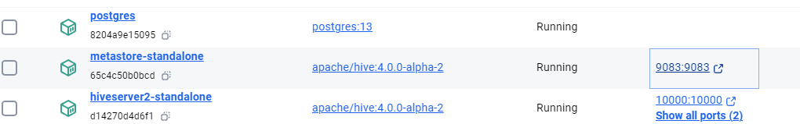

# Hive Metastore and HiveServer2 Setup On Docker

## Overview
This guide will help you set up a Hive Metastore and HiveServer2 using Docker on the `dasnet` network. You will download the required PostgreSQL JDBC driver, place it in the current directory, and then run three Docker commands to start the PostgreSQL, Metastore, and HiveServer2 services.

> This steup is based on [Official Hive docker site](https://hive.apache.org/developement/quickstart/). There is almost no customization, except the addtion of network dasnet.
> The only issue with this setup is that restarting HiveServer2 will result in the error: "HiveServer2 running as process 7. Stop it first." Apart from that it's an excellent setup. But, you have to rerun hiveserver2 from scracth everytime. metastore and postgres combination works fine always. No need of restart.

## Quick Step

Just download the [zip file](Dockerfiles/Hive-ApacheOfficial-Setup_GOLD.zip). Unzip it and run the run.bat It will create three conatiners like this:



## Step 1: Download the Required JDBC Driver
You need to download the PostgreSQL JDBC driver `postgresql-42.5.0.jar`. Place the downloaded JAR file in the current directory where you will run the Docker commands.

You can download the JDBC driver from the official [PostgreSQL JDBC website](https://jdbc.postgresql.org/download.html) or use Maven with the following command:

```bash
mvn dependency:copy -Dartifact="org.postgresql:postgresql:42.5.0" -DoutputDirectory=.
```

## Step 2: Run the PostgreSQL Service
Before starting the Hive Metastore, you need to run a PostgreSQL container. Use the following command:

```bash
docker run -d --network dasnet --name postgres -e POSTGRES_DB=metastore_db -e POSTGRES_USER=hive -e POSTGRES_PASSWORD=password postgres:13
```

This command starts a PostgreSQL container named `postgres` on the `dasnet` network, with a database named `metastore_db`, and the username `hive` with the password `password`.

## Step 3: Run the Metastore Service
Run the following Docker command to start the Hive Metastore service in the current directory:

```bash
docker run -d --network dasnet -p 9083:9083 --env SERVICE_NAME=metastore --env DB_DRIVER=postgres --env SERVICE_OPTS="-Djavax.jdo.option.ConnectionDriverName=org.postgresql.Driver -Djavax.jdo.option.ConnectionURL=jdbc:postgresql://postgres:5432/metastore_db -Djavax.jdo.option.ConnectionUserName=hive -Djavax.jdo.option.ConnectionPassword=password" --mount source=warehouse,target=/opt/hive/data/warehouse --mount type=bind,source=%cd%\postgresql-42.5.0.jar,target=/opt/hive/lib/postgres.jar --name metastore-standalone apache/hive:4.0.0-alpha-2
```

This command will start the Hive Metastore service on port `9083`. The PostgreSQL JDBC driver will be mounted from the current directory to the container. The service will be named `metastore-standalone`.

## Step 4: Run the HiveServer2 Service
Next, run the following Docker command to start the HiveServer2 service in the current directory:

```bash
docker run -d --network dasnet -p 10000:10000 -p 10002:10002 --env SERVICE_NAME=hiveserver2 --env SERVICE_OPTS="-Dhive.metastore.uris=thrift://metastore:9083" --mount source=warehouse,target=/opt/hive/data/warehouse --env IS_RESUME="true" --name hiveserver2-standalone apache/hive:4.0.0-alpha-2
```

This command will start the HiveServer2 service on ports `10000` and `10002`. The service will connect to the previously started Metastore service and will be named `hiveserver2-standalone`.

## Step 5: Verify the Services
To verify that all services are running, use the following command:

```bash
docker ps
```

You should see the `postgres`, `metastore-standalone`, and `hiveserver2-standalone` containers listed as running.

## Step 6: Connecting and Testing
To connect to HiveServer2, you can use a JDBC client like [DBeaver](https://dbeaver.io/) or the Beeline command-line tool.

Using Beeline, connect with the following command:

```bash
beeline -u jdbc:hive2://localhost:10000
```

If everything is set up correctly, you should be able to connect to HiveServer2 and execute SQL queries.

---

© 2024 Das. All Rights Reserved.