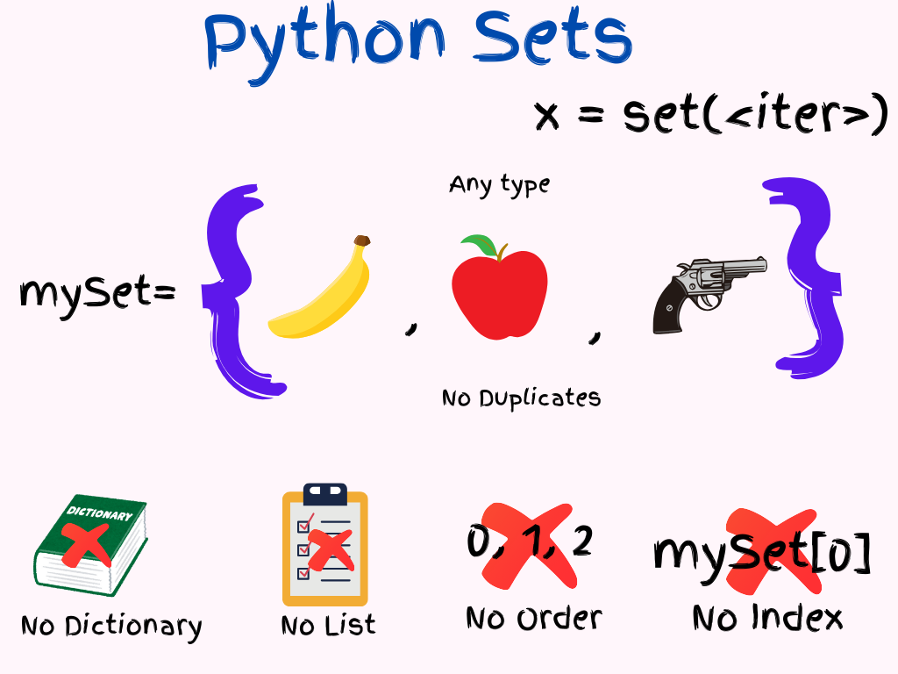

- [Python Sets](#python-sets)
  - [Python Sets Properties](#python-sets-properties)
    - [Items have No Index:](#items-have-no-index)
    - [No Duplicates:](#no-duplicates)
    - [No In-Place Replace. Add/remove instead.](#no-in-place-replace-addremove-instead)
    - [No Lists/Dictionaries, Tuples Are OK.](#no-listsdictionaries-tuples-are-ok)
  - [Python Set Operations](#python-set-operations)
  - [When to use sets](#when-to-use-sets)
    - [Removing Duplicates](#removing-duplicates)
    - [Membership Testing](#membership-testing)
    - [Set Operations](#set-operations)
    - [Data Validation](#data-validation)
    - [Tracking Unique Elements](#tracking-unique-elements)
    - [Efficient Data Lookups](#efficient-data-lookups)


# <span style="color: blueviolet;Font-family: Comic Sans MS, sans-serif;">Python Sets</span>


<p style="font-family: 'Segoe UI', 'SegoeUI', 'Helvetica Neue', Helvetica, Arial, sans-serif;">

A Python set is like your travel kit. Collection of unique items. There can be different items. But, they should be unique.

<strong>Set items don't have serial numbers (Index).</strong> 
    Without a serial number, you can't do something like <code>mySet[2]="Guava"</code>. 
    All items in a set must be different. Otherwise, how would you tell them apart? 
    If your set has two apples, which one is which? 
    But, you can remove items from a set. You can take out an apple and add a guava. 
    Don't think about removing an apple and adding another apple. 
    <span style="color: red; font-family: 'Comic Sans MS', sans-serif;">Sets can't contain a <code>list</code> or a <code>dictionary</code></span>. Period. 
    <span style="color: green; font-family: 'Comic Sans MS', sans-serif;">They can contain tuples</span>, but these tuples can't have lists or dictionaries inside them. 
    (It won't cause an error, but it can make the code unstable.)
</p>

## <span style="color: blueviolet;Font-family: Comic Sans MS, sans-serif;">Python Sets Properties</span>

So, here are some properties of Python Sets:

### <span style="color: CornflowerBlue;Font-family: Comic Sans MS, sans-serif;">Items have No Index:</span>

<p style="font-family: 'Segoe UI', 'SegoeUI', 'Helvetica Neue', Helvetica, Arial, sans-serif;">

Python stores Set items but does not keep track of their order. This means there is no first item, second item, etc. For example, if you input `apple`, `orange`, `banana`, you might get `banana`, `apple`, `orange` as the output.

</p>


    ```python
    my_set = {1, 2, 3}
    print(my_set)  # Output could be {1, 2, 3} or {3, 1, 2} or any permutation

    my_set[0] # THIS IS AN ERROR. No one is sitting at 0. There is no order, no index.
    ```


### <span style="color: CornflowerBlue;Font-family: Comic Sans MS, sans-serif;">No Duplicates:</span>

<p style="font-family: 'Segoe UI', 'SegoeUI', 'Helvetica Neue', Helvetica, Arial, sans-serif;">
Since items in a set do not have serial numbers, duplicates are not allowed. If you try to add two apples, how would you distinguish between them? Therefore, when you add duplicates to a set, Python automatically removes the duplicates.</p>


```python
my_set = {1, 2, 2, 3}
print(my_set)  # Output: {1, 2, 3}
```

### <span style="color: CornflowerBlue;Font-family: Comic Sans MS, sans-serif;">No In-Place Replace. Add/remove instead.</span>

<p style="font-family: 'Segoe UI', 'SegoeUI', 'Helvetica Neue', Helvetica, Arial, sans-serif;">
You can add/remove items, but can't change an item's value directly. Can't in-place replace items. First, remove the old one and add the new one.</p>


    ```python
    my_set = {1, 2, 3}

    my_set.remove(2) # OK
    my_set.add(4) # OK
    my_set[0] = 5 # ERROR
    ```

### <span style="color: CornflowerBlue;Font-family: Comic Sans MS, sans-serif;">No Lists/Dictionaries, Tuples Are OK.</span>

<p style="font-family: 'Segoe UI', 'SegoeUI', 'Helvetica Neue', Helvetica, Arial, sans-serif;">
Sets use hashing, so you can't store lists or dictionaries in them. However, you can store tuples. Just make sure these tuples don't contain lists or dictionaries inside them.</p>


    ```python
    # Valid elements
    my_set = {1, "hello", (1, 2)} # TUPLES OK

    # Invalid elements
    my_set = {[1, 2], {"key": "value"}} # ERROR, NO LISTS, NO DICTS
    ```


## <span style="color: blueviolet;Font-family: Comic Sans MS, sans-serif;">Python Set Operations</span>

| **Operation**             | **Description**                                                                 | **Example**                                              |
|---------------------------|---------------------------------------------------------------------------------|----------------------------------------------------------|
| **Creation**              | Create a set using curly braces `{}` or the `set()` function                     | `my_set = {1, 2, 3}` <br> `my_set = set([1, 2, 3])`      |
| **Iteration**             | Iterate through a set using a `for` loop                                        | `for item in my_set:` <br> `print(item)`                 |
| **Union**                 | Combines all elements from both sets, without duplicates                        | `set1 | set2` <br> `set1.union(set2)`                     |
| **Intersection**          | Returns elements that are common to both sets                                   | `set1 & set2` <br> `set1.intersection(set2)`             |
| **Difference**            | Returns elements that are in the first set but not in the second set            | `set1 - set2` <br> `set1.difference(set2)`               |
| **Symmetric Difference**  | Returns elements that are in either set, but not in both                        | `set1 ^ set2` <br> `set1.symmetric_difference(set2)`     |
| **Subset**                | Checks if all elements of one set are in another set                            | `set1 <= set2` <br> `set1.issubset(set2)`                |
| **Superset**              | Checks if one set contains all elements of another set                          | `set1 >= set2` <br> `set1.issuperset(set2)`              |
| **Add Element**           | Adds a single element to the set                                                | `my_set.add(4)`                                          |
| **Remove Element**        | Removes a specific element from the set. Raises KeyError if not found           | `my_set.remove(2)`                                       |
| **Discard Element**       | Removes a specific element from the set if it is present                        | `my_set.discard(2)`                                      |
| **Clear Set**             | Removes all elements from the set                                               | `my_set.clear()`                                         |
| **Copy Set**              | Creates a shallow copy of the set                                               | `new_set = my_set.copy()`                                |

| **Property**               | **Description**                                      | **Example**                                 |
|----------------------------|------------------------------------------------------|---------------------------------------------|
| **No Duplicates**          | Automatically removes duplicate items                | `my_set = {1, 2, 2, 3}` <br> `my_set` becomes `{1, 2, 3}` |
| **Unordered**              | Elements have no index or order                      | `my_set = {1, 2, 3}` <br> Order is not guaranteed |
| **Membership Test**        | Fast membership testing                              | `2 in my_set` <br> Returns `True` if 2 is in `my_set` |

## <span style="color: blueviolet;Font-family: Comic Sans MS, sans-serif;">When to use sets</span>



<p style="font-family: 'Segoe UI', 'SegoeUI', 'Helvetica Neue', Helvetica, Arial, sans-serif;">
Sets for Python are very useful when you need keep unique items and do quick membership checks.

Here are some scenarios where sets are frequently used:</p>

### <span style="color: teal; font-family: 'Comic Sans MS', sans-serif;">Removing Duplicates</span>
- **Use Case**: When you need to ensure that a collection of elements contains no duplicates.
- **Example**: Removing duplicates from a list.
  ```python
  items = [1, 2, 2, 3, 4, 4, 5]
  unique_items = list(set(items))  # [1, 2, 3, 4, 5]
  ```

### <span style="color: teal; font-family: 'Comic Sans MS', sans-serif;">Membership Testing</span>
- **Use Case**: When you need to check if an element exists in a collection. Sets provide average O(1) time complexity for membership tests.
- **Example**: Checking if an item exists in a collection.
  ```python
  allowed_items = {"apple", "banana", "cherry"}
  if "banana" in allowed_items:
      print("Banana is allowed")
  ```

### <span style="color: teal; font-family: 'Comic Sans MS', sans-serif;">Set Operations</span>
- **Use Case**: When you need to perform operations like union, intersection, difference, and symmetric difference between collections.
- **Example**: Finding common elements between two sets.
  ```python
  set1 = {1, 2, 3}
  set2 = {3, 4, 5}
  common_items = set1 & set2  # {3}
  ```

### <span style="color: teal; font-family: 'Comic Sans MS', sans-serif;">Data Validation</span>
- **Use Case**: When validating data to ensure uniqueness, such as checking for duplicate entries in a dataset.
- **Example**: Validating unique user IDs.
  ```python
  user_ids = [101, 102, 103, 101]
  unique_user_ids = set(user_ids)
  if len(user_ids) != len(unique_user_ids):
      print("Duplicate user IDs found")
  ```

### <span style="color: teal; font-family: 'Comic Sans MS', sans-serif;">Tracking Unique Elements</span>
- **Use Case**: When you need to keep track of unique items encountered during processing.
- **Example**: Tracking unique words in a text.
  ```python
  text = "hello world hello"
  words = text.split()
  unique_words = set(words)  # {"hello", "world"}
  ```

### <span style="color: teal; font-family: 'Comic Sans MS', sans-serif;">Efficient Data Lookups</span>
- **Use Case**: When you need a data structure that allows for fast lookups, insertions, and deletions.
- **Example**: Keeping track of visited URLs in a web crawler.
  ```python
  visited_urls = set()
  visited_urls.add("https://example.com")
  if "https://example.com" in visited_urls:
      print("URL already visited")
  ```
