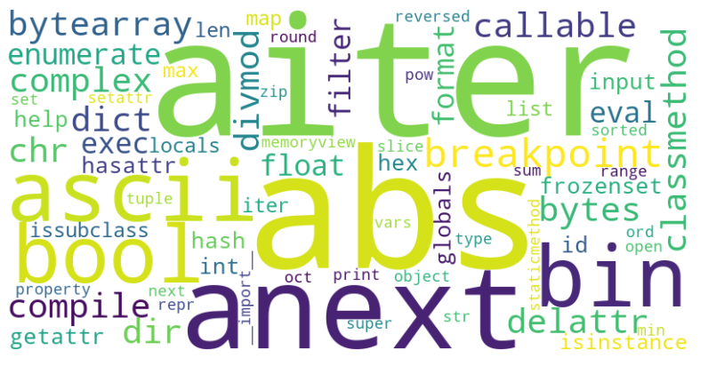

  

    Table of contents
  

  {: .text-delta }
1. TOC
{:toc}

# Python built-in functions

These are built-in functions that are available to Python interpreter always. You don't have to pip install anything for this.

I compiled the list from the following [link](https://docs.python.org/3/library/functions.html#open)

| Function Description & Syntax                                                                                       | Usage Example                                    |
|----------------------------------------------------------------------------------------------------------------------|--------------------------------------------------|
| **`abs(x)`**: Returns the absolute value of a number.                                                               | `abs(-5)` returns `5`                            |
| **`aiter(iterable)`**: Returns an asynchronous iterator for an asynchronous iterable.                               | `async for item in aiter(async_iterable): pass`  |
| **`all(iterable)`**: Returns True if all elements of an iterable are true.                                          | `all([True, True, False])` returns `False`       |
| **`anext(async_iterator)`**: Retrieves the next item from an asynchronous iterator.                                 | `await anext(async_iterator)`                    |
| **`any(iterable)`**: Returns True if any element of an iterable is true.                                            | `any([False, True, False])` returns `True`       |
| **`ascii(object)`**: Returns a string representation of an object with non-ASCII characters escaped.                | `ascii('ü')` returns `'\\xfc'`                   |
| **`bin(x)`**: Converts an integer to a binary string.                                                               | `bin(10)` returns `'0b1010'`                     |
| **`bool(x)`**: Converts a value to a boolean, returning either True or False.                                       | `bool(1)` returns `True`                         |
| **`breakpoint()`**: Drops you into the debugger at the call site.                                                   | `breakpoint()`                                   |
| **`bytearray([source[, encoding[, errors]]])`**: Returns a new array of bytes.                                      | `bytearray(b'hello')` returns `bytearray(b'hello')` |
| **`bytes([source[, encoding[, errors]]])`**: Returns a new bytes object.                                            | `bytes('hello', 'utf-8')` returns `b'hello'`     |
| **`callable(object)`**: Returns True if the object appears callable.                                                | `callable(len)` returns `True`                   |
| **`chr(i)`**: Returns the character that represents the specified unicode.                                          | `chr(97)` returns `'a'`                          |
| **`classmethod(function)`**: Converts a method into a class method.                                                 | `class C: @classmethod def f(cls): pass`         |
| **`compile(source, filename, mode, flags=0, dont_inherit=False, optimize=-1)`**: Compiles source into a code object that can be executed by exec() or eval(). | `compile('print(1)', '', 'exec')`                |
| **`complex([real[, imag]])`**: Creates a complex number.                                                            | `complex(1, 2)` returns `(1+2j)`                 |
| **`delattr(object, name)`**: Deletes the named attribute from an object.                                            | `delattr(obj, 'attr')`                           |
| **`dict(**kwargs)`**: Creates a new dictionary.                                                                     | `dict(a=1, b=2)` returns `{'a': 1, 'b': 2}`      |
| **`dir([object])`**: Returns a list of the attributes and methods of any object.                                    | `dir()`                                          |
| **`divmod(a, b)`**: Returns a tuple containing the quotient and remainder when dividing two numbers.                | `divmod(10, 3)` returns `(3, 1)`                 |
| **`enumerate(iterable, start=0)`**: Returns an enumerate object.                                                    | `enumerate(['a', 'b'], 1)` returns `[(1, 'a'), (2, 'b')]` |
| **`eval(expression, globals=None, locals=None)`**: Evaluates the specified expression.                              | `eval('1 + 2')` returns `3`                      |
| **`exec(object[, globals[, locals]])`**: Executes the specified code.                                               | `exec('print("Hello, World!")')`                 |
| **`filter(function, iterable)`**: Constructs an iterator from elements of iterable for which function returns true. | `filter(lambda x: x > 0, [1, -2, 3, 0])`         |
| **`float([x])`**: Converts a number or string to a floating point number.                                           | `float('3.14')` returns `3.14`                   |
| **`format(value[, format_spec])`**: Formats a value using a format specification.                                   | `format(255, '02x')` returns `'ff'`              |
| **`frozenset([iterable])`**: Returns a new frozenset object, optionally with elements taken from iterable.          | `frozenset([1, 2, 3])` returns `frozenset({1, 2, 3})` |
| **`getattr(object, name[, default])`**: Returns the value of the named attribute of an object.                      | `getattr(obj, 'attr', None)`                     |
| **`globals()`**: Returns a dictionary representing the current global symbol table.                                 | `globals()`                                      |
| **`hasattr(object, name)`**: Returns True if the object has the named attribute.                                    | `hasattr(obj, 'attr')`                           |
| **`hash(object)`**: Returns the hash value of the object.                                                           | `hash('hello')`                                  |
| **`help([object])`**: Invokes the built-in help system.                                                             | `help(print)`                                    |
| **`hex(x)`**: Converts an integer to a hexadecimal string.                                                          | `hex(255)` returns `'0xff'`                      |
| **`id(object)`**: Returns the identity of an object.                                                                | `id(3)`                                          |
| **`input([prompt])`**: Reads a line from input.                                                                     | `input('Enter your name: ')`                     |
| **`int([x[, base]])`**: Converts a number or string to an integer.                                                  | `int('10')` returns `10`                         |
| **`isinstance(object, classinfo)`**: Returns True if the object is an instance of the class or of a subclass thereof. | `isinstance(3, int)`                             |
| **`issubclass(class, classinfo)`**: Returns True if the class is a subclass of classinfo.                           | `issubclass(bool, int)`                          |
| **`iter(object[, sentinel])`**: Returns an iterator object.                                                         | `iter([1, 2, 3])`                                |
| **`len(s)`**: Returns the length of an object.                                                                      | `len('hello')` returns `5`                       |
| **`list([iterable])`**: Creates a new list.                                                                         | `list('hello')` returns `['h', 'e', 'l', 'l', 'o']` |
| **`locals()`**: Updates and returns a dictionary representing the current local symbol table.                       | `locals()`                                       |
| **`map(function, iterable, ...)`**: Applies function to every item of iterable and returns an iterator.             | `map(str.upper, ['a', 'b', 'c'])`                |
| **`max(iterable, *[, key, default])`**: Returns the largest item in an iterable or the largest of two or more arguments. | `max([1, 2, 3])`                                 |
| **`memoryview(obj)`**: Returns a memory view object.                                                                | `memoryview(b'abc')`                             |
| **`min(iterable, *[, key, default])`**: Returns the smallest item in an iterable or the smallest of two or more arguments. | `min([1, 2, 3])`                                 |
| **`next(iterator[, default])`**: Retrieves the next item from the iterator.                                         | `next(iter([1, 2, 3]))`                          |
| **`object()`**: Returns a new featureless object.                                                                   | `object()`                                       |
| **`oct(x)`**: Converts an integer to an octal string.                                                              | `oct(8)` returns `'0o10'`                        |
| **`open(file, mode='r', buffering=-1, encoding=None, errors=None, newline=None, closefd=True, opener=None)`**: Opens a file and returns a corresponding file object. | `open('file.txt', 'r')`                          |
| **`ord(c)`**: Returns the Unicode code point for a single character.                                                | `ord('a')` returns `97`                          |
| **`pow(x, y[, z])`**: Returns x to the power of y; if z is present, returns x to the power of y, modulo z.          | `pow(2, 3)` returns `8`                          |
| **`print(*objects, sep=' ', end='\n', file=sys.stdout, flush=False)`**: Prints the objects to the text stream file, separated by sep and followed by end. | `print('hello')`                                 |
| **`property(fget=None, fset=None, fdel=None, doc=None)`**: Returns a property attribute.                            | `class C: @property def x(self): return self._x` |
| **`range(stop)`**: Returns an immutable sequence of numbers from 0 to stop | **`repr(object)`**: Returns a string containing a printable representation of an object.                            | `repr([1, 2, 3])` returns `'[1, 2, 3]'`          |
| **`reversed(seq)`**: Returns a reversed iterator.                                                                   | `list(reversed([1, 2, 3]))` returns `[3, 2, 1]`  |
| **`round(number[, ndigits])`**: Rounds a number to a given precision in decimal digits.                             | `round(3.14159, 2)` returns `3.14`               |
| **`set([iterable])`**: Returns a new set object, optionally with elements taken from iterable.                      | `set([1, 2, 2, 3])` returns `{1, 2, 3}`          |
| **`setattr(object, name, value)`**: Sets the value of the named attribute of an object.                             | `setattr(obj, 'attr', 10)`                       |
| **`slice(stop)`**: Returns a slice object representing the set of indices specified by range(start, stop, step).    | `slice(1, 5, 2)` returns `slice(1, 5, 2)`        |
| **`sorted(iterable, *, key=None, reverse=False)`**: Returns a new sorted list from the items in iterable.           | `sorted([3, 1, 2])` returns `[1, 2, 3]`          |
| **`staticmethod(function)`**: Converts a method into a static method.                                                | `class C: @staticmethod def f(): pass`           |
| **`str(object='')`**: Returns a string version of object.                                                           | `str(123)` returns `'123'`                       |
| **`sum(iterable, /, start=0)`**: Sums the items of an iterable from left to right and returns the total.            | `sum([1, 2, 3])` returns `6`                     |
| **`super([type[, object-or-type]])`**: Returns a proxy object that delegates method calls to a parent or sibling class of type. | `super().method()`                       |
| **`tuple([iterable])`**: Returns a tuple object, optionally with elements taken from iterable.                      | `tuple([1, 2, 3])` returns `(1, 2, 3)`           |
| **`type(object)`**: Returns the type of an object.                                                                  | `type(123)` returns `<class 'int'>`              |
| **`vars([object])`**: Returns the `__dict__` attribute for a module, class, instance, or any other object with a `__dict__` attribute. | `vars()`                              |
| **`zip(*iterables)`**: Returns an iterator of tuples, where the i-th tuple contains the i-th element from each of the argument sequences or iterables. | `list(zip([1, 2, 3], ['a', 'b', 'c']))` returns `[(1, 'a'), (2, 'b'), (3, 'c')]` |
| **`__import__(name, globals=None, locals=None, fromlist=(), level=0)`**: Invoked by the `import` statement.         | `__import__('math')`                            |