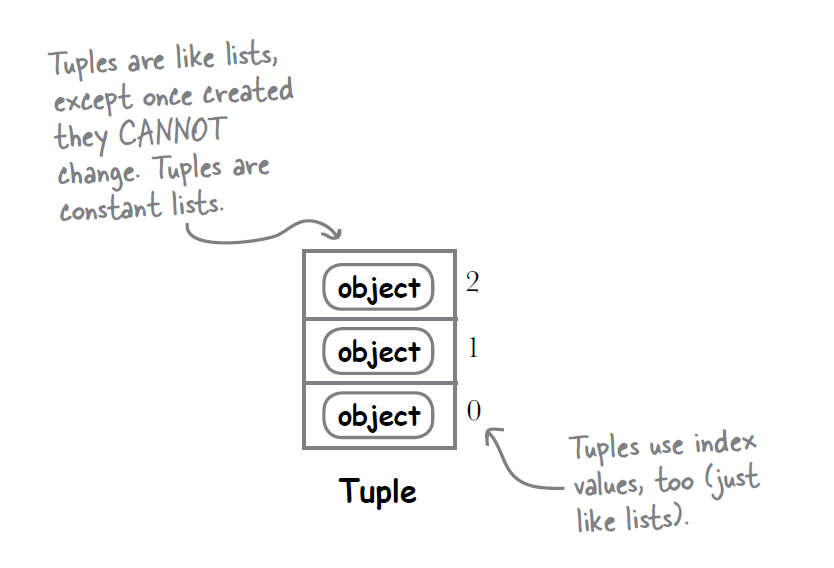

<details open markdown="block">
  <summary>
    Table of contents
  </summary>
  {: .text-delta }
1. TOC
{:toc}
</details>


# <span style="color: CornflowerBlue; font-family: Comic Sans MS, sans-serif;">Python (Tuples)</span>

<p style="font-family: 'Segoe UI', 'SegoeUI', 'Helvetica Neue', Helvetica, Arial, sans-serif;">
Tuples are collections of items where items have serial numbers, but they can't be changed - No add/remove/reorder. They can have duplicates. Tuples are like a necklace. Once you create them you can't change them. You can't add/remove items. You can't reorder items.</p>

<p style="font-family: 'Segoe UI', 'SegoeUI', 'Helvetica Neue', Helvetica, Arial, sans-serif;">Technically they are ordered collections of immutable objects. Phew!</p>


<p style="color: #006600; font-family: 'Trebuchet MS', Helvetica, sans-serif; background-color: #e6ffe6; padding: 15px; border-left: 5px solid #00cc66;">
Python has 4 built-in data types - LSTD - List, Set, Tuple, Dictionary.
</p>

<p style="font-family: 'Segoe UI', 'SegoeUI', 'Helvetica Neue', Helvetica, Arial, sans-serif;">
Tuples and lists both store items, but there are key differences. **Tuples** can't be changed once created; you can't add, remove, or modify items. **Lists** can be changed; you can add, remove, or modify items.

Both can have duplicate items.
</p>

## <span style="color: darkgreen; font-family: Comic Sans MS, sans-serif;">Tuples vs. Lists</span>



<p style="font-family: 'Segoe UI', 'SegoeUI', 'Helvetica Neue', Helvetica, Arial, sans-serif;">
Tuples and lists both store items, but there are key differences. **Tuples** can't be changed once created; you can't add, remove, or modify items. **Lists** can be changed; you can add, remove, or modify items.

Both can have duplicate items.
</p>

```python
# Tuples can have duplicates
my_tuple = (1, 2, 2, 3, 4, 4)
print(my_tuple)  # Output: (1, 2, 2, 3, 4, 4)

# Lists can also have duplicates
my_list = [1, 2, 2, 3, 4, 4]
print(my_list)  # Output: [1, 2, 2, 3, 4, 4]
```

<p style="color: #006600; font-family: 'Trebuchet MS', Helvetica, sans-serif; background-color: #e6ffe6; padding: 15px; border-left: 5px solid #00cc66;">
Tuples use `()`, and lists use `[]`. Use <b>tuples</b> for fixed data and <b>lists</b> for data that changes.
</p>


## <span style="color: blueviolet; font-family: Comic Sans MS, sans-serif;">Features of Tuples</span>

### <span style="color: darkgreen; font-family: Comic Sans MS, sans-serif;"> Ordered and Indexed</span>

Tuple items have serial numbers(Index). And they stay the same. The first item stays first, the second stays second, and so on.

I.e., Tuples are 'ordered'

```python
my_tuple = (1, 2, 3)
print(my_tuple[0])  # Output: 1
print(my_tuple[1])  # Output: 2
```

### <span style="color: darkgreen; font-family: Comic Sans MS, sans-serif;"> Immutable(Rigid)</span>

Once created, you can't change the items in a tuple. This means you can't add, remove, or replace items in a tuple. This makes tuples very reliable for storing data that shouldn't change.

```python
my_tuple = (1, 2, 3)
# Trying to change a value will cause an error
my_tuple[0] = 10  # Error: TypeError: 'tuple' object does not support item assignment

# Trying to add an item will cause an error
my_tuple.append(4)  # Error: AttributeError: 'tuple' object has no attribute 'append'

# Trying to remove an item will cause an error
my_tuple.remove(2)  # Error: AttributeError: 'tuple' object has no attribute 'remove'
```

### <span style="color: darkgreen; font-family: Comic Sans MS, sans-serif;"> Hetro..Hetrogenxblabla - urrgh! All datatypes welcome!</span>

Tuples can hold items of different types, including other tuples.

```python
mixed_tuple = (1, "hello", 3.14, (2, 4))
print(mixed_tuple)  # Output: (1, 'hello', 3.14, (2, 4))
```
<p style="color: black; font-family: 'Trebuchet MS', Helvetica, sans-serif; background-color: pink; padding: 15px; border-left: 5px solid #00cc66;">
Tuples take less memory than others
</p>

## <span style="color: blueviolet; font-family: Comic Sans MS, sans-serif;">Creating Tuples</span>

There are a few ways to create tuples in Python:

### <span style="color: gray; font-family: Comic Sans MS, sans-serif;">Using Parentheses `()`</span>

```python
# Creating an empty tuple
empty_tuple = ()

# Creating a tuple with items
my_tuple = (1, 2, 3)
```

### <span style="color: gray; font-family: Comic Sans MS, sans-serif;">Without Parentheses</span>

You can also create a tuple by simply separating items with commas.

```python
my_tuple = 1, 2, 3
```

### <span style="color: gray; font-family: Comic Sans MS, sans-serif;">Using the `tuple()` Function</span>

You can convert other data types (like lists) to tuples using the `tuple()` function.

```python
my_list = [1, 2, 3]
my_tuple = tuple(my_list)
```


## <span style="color: blueviolet; font-family: Comic Sans MS, sans-serif;">Common Errors</span>

### <span style="color: red; font-family: Comic Sans MS, sans-serif;">Trying to Modify a Tuple</span>

Since tuples are immutable, trying to change an item will result in an error.

```python
my_tuple = (1, 2, 3)
my_tuple[0] = 10  # Error: TypeError: 'tuple' object does not support item assignment
```

### <span style="color: red; font-family: Comic Sans MS, sans-serif;">Forgetting Comma in Single-Item Tuples</span>

A tuple with one item needs a comma, otherwise, Python will not recognize it as a tuple.

```python
single_item_tuple = (1,)
print(type(single_item_tuple))  # Output: <class 'tuple'>

not_a_tuple = (1)
print(type(not_a_tuple))  # Output: <class 'int'>
```

## <span style="color: blueviolet; font-family: Comic Sans MS, sans-serif;">Examples of Using Tuples</span>

### <span style="color: teal; font-family: Comic Sans MS, sans-serif;"> Storing Coordinates</span>

Tuples are great for storing fixed sets of data like coordinates.

```python
coordinates = (10.0, 20.0)
print(coordinates)  # Output: (10.0, 20.0)
```

### <span style="color: teal; font-family: Comic Sans MS, sans-serif;"> Returning Multiple Values from Functions</span>

Functions can return multiple values using tuples.

```python
def get_name_and_age():
    name = "Alice"
    age = 30
    return name, age

name, age = get_name_and_age()
print(name)  # Output: Alice
print(age)  # Output: 30
```

### <span style="color: teal; font-family: Comic Sans MS, sans-serif;">Using Tuples as Dictionary Keys</span>

Because tuples are immutable, they can be used as keys in dictionaries.

```python
location_data = {}
location = (10.0, 20.0)
location_data[location] = "Location 1"
print(location_data)  # Output: {(10.0, 20.0): 'Location 1'}
```

> Did you know this?
```python
"Hello, %s! You're %s years old." % ("Kim John", 150)
```

## <span style="color: darkmagenta; font-family: Comic Sans MS, sans-serif;">Summary</span>

- **Tuples**: Like lists but can't modify.
- **Create**: Using `()`, commas, or `tuple()`.
- **Features**: Ordered, immutable, and can hold different data types.
- **Use Cases**: Fixed collections, multiple return values, dictionary keys.

Tuples are useful to put constant items in a group. They are easy to understand and make code easy to read.

## <span style="color: Navy; font-family: 'Comic Sans MS', sans-serif;">Test your knowledge</span>

Highlight the answer section to reveal!

### <span style="color: teal; font-family: 'Comic Sans MS', sans-serif;">Question - Tuple Indexing</span>

<span style="color: Navy; font-family: 'Comic Sans MS', sans-serif;">
What will be the output of the following statement?</span>

```python
my_tuple = (1, 2, 3, 4, 5)
print(my_tuple[-1])
```

**Answer:** <span style="color: white;">5</span>

### <span style="color: gray; font-family: 'Comic Sans MS', sans-serif;">Question - Tuple Containing a List</span>

<span style="color: Navy; font-family: 'Comic Sans MS', sans-serif;">
What will happen if you try to include a list inside a tuple?</span>

```python
my_tuple = (1, [2, 3], 4)
my_tuple[1][0] = 5
print(my_tuple)
```

**Answer:** <span style="color: white;">(1, [5, 3], 4)</span>

### <span style="color: teal; font-family: 'Comic Sans MS', sans-serif;">Question - Tuple Concatenation</span>

<span style="color: Navy; font-family: 'Comic Sans MS', sans-serif;">
What will be the output of the following statement?</span>

```python
tuple1 = (1, 2)
tuple2 = (3, 4)
print(tuple1 + tuple2)
```

**Answer:** <span style="color: white;">(1, 2, 3, 4)</span>

### <span style="color: gray; font-family: 'Comic Sans MS', sans-serif;">Question - Immutable Tuples</span>

<span style="color: Navy; font-family: 'Comic Sans MS', sans-serif;">
What will happen if you try to change an element of a tuple?</span>

```python
my_tuple = (1, 2, 3)
my_tuple[0] = 4
```

**Answer:** <span style="color: white;">TypeError: 'tuple' object does not support item assignment</span>

### <span style="color: teal; font-family: 'Comic Sans MS', sans-serif;">Question - Single-Item Tuple</span>

<span style="color: Navy; font-family: 'Comic Sans MS', sans-serif;">
How do you create a tuple with a single item?</span>

```python
single_item_tuple = (1)
print(type(single_item_tuple))
```

**Answer:** <span style="color: white;">&lt;class 'int'&gt;</span>

### <span style="color: gray; font-family: 'Comic Sans MS', sans-serif;">Question - Tuple Methods</span>

<span style="color: Navy; font-family: 'Comic Sans MS', sans-serif;">
Which method would you use to find the index of a value in a tuple?</span>

```python
my_tuple = (10, 20, 30, 40)
print(my_tuple.index(30))
```

**Answer:** <span style="color: white;">2</span>

### <span style="color: teal; font-family: 'Comic Sans MS', sans-serif;">Question - Tuple Length</span>

<span style="color: Navy; font-family: 'Comic Sans MS', sans-serif;">
What will be the output of the following statement?</span>

```python
my_tuple = (1, 2, 3, 4, 5)
print(len(my_tuple))
```

**Answer:** <span style="color: white;">5</span>

### <span style="color: gray; font-family: 'Comic Sans MS', sans-serif;">Question - Nested Tuples</span>

<span style="color: Navy; font-family: 'Comic Sans MS', sans-serif;">
What will be the output of the following statement?</span>

```python
nested_tuple = (1, (2, 3), 4)
print(nested_tuple[1])
```

**Answer:** <span style="color: white;">(2, 3)</span>

### <span style="color: teal; font-family: 'Comic Sans MS', sans-serif;">Question - Tuple Slicing</span>

<span style="color: Navy; font-family: 'Comic Sans MS', sans-serif;">
What will be the output of the following statement?</span>

```python
my_tuple = (1, 2, 3, 4, 5)
print(my_tuple[1:3])
```

**Answer:** <span style="color: white;">(2, 3)</span>

### <span style="color: gray; font-family: 'Comic Sans MS', sans-serif;">Question - Tuple Containment</span>

<span style="color: Navy; font-family: 'Comic Sans MS', sans-serif;">
What will be the output of the following statement?</span>

```python
my_tuple = (1, 2, 3, 4, 5)
print(3 in my_tuple)
```

**Answer:** <span style="color: white;">True</span>

### <span style="color: teal; font-family: 'Comic Sans MS', sans-serif;">Question - Tuple Unpacking</span>

<span style="color: Navy; font-family: 'Comic Sans MS', sans-serif;">
What will be the output of the following statement?</span>

```python
my_tuple = (1, 2, 3)
a, b, c = my_tuple
print(a, b, c)
```

**Answer:** <span style="color: white;">1 2 3</span>

### <span style="color: gray; font-family: 'Comic Sans MS', sans-serif;">Question - Tuple Multiplication</span>

<span style="color: Navy; font-family: 'Comic Sans MS', sans-serif;">
What will be the output of the following statement?</span>

```python
my_tuple = (1, 2, 3)
print(my_tuple * 2)
```

**Answer:** <span style="color: white;">(1, 2, 3, 1, 2, 3)</span>

### <span style="color: teal; font-family: 'Comic Sans MS', sans-serif;">Question - Tuple Conversion</span>

<span style="color: Navy; font-family: 'Comic Sans MS', sans-serif;">
What will be the output of the following statement?</span>

```python
my_list = [1, 2, 3]
my_tuple = tuple(my_list)
print(my_tuple)
```

**Answer:** <span style="color: white;">(1, 2, 3)</span>

### <span style="color: gray; font-family: 'Comic Sans MS', sans-serif;">Question - Tuple with Mixed Types</span>

<span style="color: Navy; font-family: 'Comic Sans MS', sans-serif;">
What will be the output of the following statement?</span>

```python
my_tuple = (1, "hello", 3.14)
print(my_tuple[1])
```

**Answer:** <span style="color: white;">hello</span>

### <span style="color: teal; font-family: 'Comic Sans MS', sans-serif;">Question - Tuple Indexing</span>

<span style="color: Navy; font-family: 'Comic Sans MS', sans-serif;">
What will be the output of the following statement?</span>

```python
my_tuple = (1, 2, 3, 4, 5)
print(my_tuple[-1])
```

**Answer:** <span style="color: white;">5</span>

### <span style="color: gray; font-family: 'Comic Sans MS', sans-serif;">Question - Tuple Containing a List</span>

<span style="color: Navy; font-family: 'Comic Sans MS', sans-serif;">
What will happen if you try to include a list inside a tuple?</span>

```python
my_tuple = (1, [2, 3], 4)
my_tuple[1][0] = 5
print(my_tuple)
```

**Answer:** <span style="color: white;">(1, [5, 3], 4)</span>

### <span style="color: darkred; font-family: 'Comic Sans MS', sans-serif;">Question - Tuple Concatenation</span>

<span style="color: Navy; font-family: 'Comic Sans MS', sans-serif;">
What will be the output of the following statement?</span>

```python
tuple1 = (1, 2)
tuple2 = (3, 4)
print(tuple1 + tuple2)
```

**Answer:** <span style="color: white;">(1, 2, 3, 4)</span>

### <span style="color: darkgreen; font-family: 'Comic Sans MS', sans-serif;">Question - Immutable Tuples</span>

<span style="color: Navy; font-family: 'Comic Sans MS', sans-serif;">
What will happen if you try to change an element of a tuple?</span>

```python
my_tuple = (1, 2, 3)
my_tuple[0] = 4
```

**Answer:** <span style="color: white;">TypeError: 'tuple' object does not support item assignment</span>

### <span style="color: darkblue; font-family: 'Comic Sans MS', sans-serif;">Question - Single-Item Tuple</span>

<span style="color: Navy; font-family: 'Comic Sans MS', sans-serif;">
How do you create a tuple with a single item?</span>

```python
single_item_tuple = (1)
print(type(single_item_tuple))
```

**Answer:** <span style="color: white;">&lt;class 'int'&gt;</span>

### <span style="color: purple; font-family: 'Comic Sans MS', sans-serif;">Question - Tuple Methods</span>

<span style="color: Navy; font-family: 'Comic Sans MS', sans-serif;">
Which method would you use to find the index of a value in a tuple?</span>

```python
my_tuple = (10, 20, 30, 40)
print(my_tuple.index(30))
```

**Answer:** <span style="color: white;">2</span>

### <span style="color: teal; font-family: 'Comic Sans MS', sans-serif;">Question - Tuple Length</span>

<span style="color: Navy; font-family: 'Comic Sans MS', sans-serif;">
What will be the output of the following statement?</span>

```python
my_tuple = (1, 2, 3, 4, 5)
print(len(my_tuple))
```

**Answer:** <span style="color: white;">5</span>

### <span style="color: gray; font-family: 'Comic Sans MS', sans-serif;">Question - Nested Tuples</span>

<span style="color: Navy; font-family: 'Comic Sans MS', sans-serif;">
What will be the output of the following statement?</span>

```python
nested_tuple = (1, (2, 3), 4)
print(nested_tuple[1])
```

**Answer:** <span style="color: white;">(2, 3)</span>

### <span style="color: darkred; font-family: 'Comic Sans MS', sans-serif;">Question - Tuple Slicing</span>

<span style="color: Navy; font-family: 'Comic Sans MS', sans-serif;">
What will be the output of the following statement?</span>

```python
my_tuple = (1, 2, 3, 4, 5)
print(my_tuple[1:3])
```

**Answer:** <span style="color: white;">(2, 3)</span>

### <span style="color: darkgreen; font-family: 'Comic Sans MS', sans-serif;">Question - Tuple Containment</span>

<span style="color: Navy; font-family: 'Comic Sans MS', sans-serif;">
What will be the output of the following statement?</span>

```python
my_tuple = (1, 2, 3, 4, 5)
print(3 in my_tuple)
```

**Answer:** <span style="color: white;">True</span>

### <span style="color: darkblue; font-family: 'Comic Sans MS', sans-serif;">Question - Tuple Unpacking</span>

<span style="color: Navy; font-family: 'Comic Sans MS', sans-serif;">
What will be the output of the following statement?</span>

```python
my_tuple = (1, 2, 3)
a, b, c = my_tuple
print(a, b, c)
```

**Answer:** <span style="color: white;">1 2 3</span>

### <span style="color: purple; font-family: 'Comic Sans MS', sans-serif;">Question - Tuple Multiplication</span>

<span style="color: Navy; font-family: 'Comic Sans MS', sans-serif;">
What will be the output of the following statement?</span>

```python
my_tuple = (1, 2, 3)
print(my_tuple * 2)
```

**Answer:** <span style="color: white;">(1, 2, 3, 1, 2, 3)</span>

### <span style="color: teal; font-family: 'Comic Sans MS', sans-serif;">Question - Tuple Conversion</span>

<span style="color: Navy; font-family: 'Comic Sans MS', sans-serif;">
What will be the output of the following statement?</span>

```python
my_list = [1, 2, 3]
my_tuple = tuple(my_list)
print(my_tuple)
```

**Answer:** <span style="color: white;">(1, 2, 3)</span>

### <span style="color: gray; font-family: 'Comic Sans MS', sans-serif;">Question - Tuple with Mixed Types</span>

<span style="color: Navy; font-family: 'Comic Sans MS', sans-serif;">
What will be the output of the following statement?</span>

```python
my_tuple = (1, "hello", 3.14)
print(my_tuple[1])
```

**Answer:** <span style="color: white;">hello</span>

### <span style="color: darkred; font-family: 'Comic Sans MS', sans-serif;">Question - Tuple Assignment</span>

<span style="color: Navy; font-family: 'Comic Sans MS', sans-serif;">
What will happen when you try to reassign a tuple variable?</span>

```python
my_tuple = (1, 2, 3)
my_tuple = (4, 5, 6)
print(my_tuple)
```

**Answer:** <span style="color: white;">(4, 5, 6)</span>

### <span style="color: darkgreen; font-family: 'Comic Sans MS', sans-serif;">Question - Tuple Immutability with List</span>

<span style="color: Navy; font-family: 'Comic Sans MS', sans-serif;">
What will be the output of the following statement?</span>

```python
my_tuple = (1, [2, 3], 4)
my_tuple[1].append(5)
print(my_tuple)
```

**Answer:** <span style="color: white;">(1, [2, 3, 5], 4)</span>