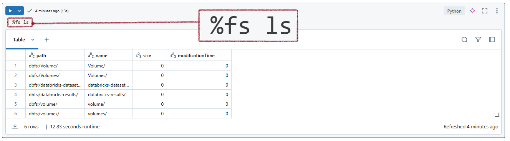

# Useful Databricks Magic Commands

<h2>Some frequently used magic commands in Databricks</h2>

| **Magic Command** | **Description**                             | **Example**                                          |
|-------------------------------|---------------------------------------------|-------------------------------------------------------------|
| **%run**          | Runs a Python file or a notebook.               | `%run ./path/to/notebook`                              |
| **%sh**           | Executes shell commands on the cluster nodes.   | `%sh ls /dbfs`                                        |
| **%fs**           | Interacts with the Databricks file system.      | `%fs ls /mnt/data`                                    |
| **%sql**          | Runs SQL queries.                              | `%sql SELECT * FROM table_name`                       |
| **%scala**        | Switches the notebook context to Scala.        | `%scala val x = 10`                                   |
| **%python**       | Switches the notebook context to Python.       | `%python print("Hello, Databricks!")`                 |
| **%md**           | Writes markdown text.                          | `%md # This is a Markdown Header`                     |
| **%r**            | Switches the notebook context to R.            | `%r summary(data_frame)`                              |
| **%lsmagic**      | Lists all the available magic commands.        | `%lsmagic`                                            |
| **%jobs**         | Lists all the running jobs.                    | `%jobs`                                               |
| **%config**       | Sets configuration options for the notebook.   | `%config notebook.display.max_rows=1000`              |
| **%reload**       | Reloads the contents of a module.              | `%reload module_name`                                 |
| **%pip**          | Installs Python packages.                      | `%pip install pandas`                                 |
| **%load**         | Loads the contents of a file into a cell.      | `%load ./path/to/file.py`                             |
| **%matplotlib**   | Sets up the matplotlib backend.                | `%matplotlib inline`                                  |
| **%who**          | Lists all the variables in the current scope.  | `%who`                                                |
| **%env**          | Sets environment variables.                    | `%env MY_VARIABLE=my_value`                            |

## Mounting and Unmounting Storage

| **Command**       | **Example**                                                                                                                                       |
|------------------------|---------------------------------------------------------------------------------------------------------------------------------------------------------------------------------------------------|
| **Mount ADLS**    | dbutils.fs.mount( &nbsp;&nbsp;source = "adl://<storage-account-name>.azuredatalakestore.net/<filesystem-name>", &nbsp;&nbsp;mount_point = "/mnt/<mount-name>", &nbsp;&nbsp;extra_configs = { &nbsp;&nbsp;&nbsp;&nbsp;"dfs.adls.oauth2.access.token.provider.type": "ClientCredential", &nbsp;&nbsp;&nbsp;&nbsp;"dfs.adls.oauth2.client.id": dbutils.secrets.get(scope = "<scope-name>", key = "client-id"), &nbsp;&nbsp;&nbsp;&nbsp;"dfs.adls.oauth2.credential": dbutils.secrets.get(scope = "<scope-name>", key = "client-secret"), &nbsp;&nbsp;&nbsp;&nbsp;"dfs.adls.oauth2.refresh.url": "https://login.microsoftonline.com/<directory-id>/oauth2/token"} ) |
| **Unmount Storage** | dbutils.fs.unmount("/mnt/<mount-name>")                                                                                                                                  |
| **List Mount Points** | display(dbutils.fs.mounts())                                                                                                                                               |

## File Operations

| **Command**             | **Example**                                                                                                  |
|----------------------------|--------------------------------------------------------------------------------------------------------------------------------------------------------|
| **Read CSV File**       | df = spark.read.csv("/mnt/<mount-name>/data/file.csv", header=True, inferSchema=True) display(df)                                 |
| **Write CSV File**      | df.write.mode("overwrite").csv("/mnt/<mount-name>/output/")                                                                         |
| **List Files**          | display(dbutils.fs.ls("/mnt/<mount-name>"))                                                                                          |

## Secret Management

| **Command**       | **Example**                                                                                                             |
|------------------------|-----------------------------------------------------------------------------------------------------------------------------------|
| **Set a Secret** | databricks secrets create-scope --scope <scope-name> databricks secrets put --scope <scope-name> --key <key-name> --string-value <value> |
| **Get a Secret** | secret = dbutils.secrets.get(scope = "<scope-name>", key = "<key-name>")                                  |

## Shell Commands

| **Command**        | **Example**                                                                                                    |
|-------------------------|------------------------------------------------------------------------------------------------------------------------------------------------------------|
| **Run Shell Command** | %sh ls -lh /dbfs/mnt/<mount-name>/                                                                                                 |

## SQL and Context Switching

| **Command**          | **Example**                                                                                               |
|---------------------------|------------------------------------------------------------------------------------------------------------------------------------------------------|
| **Run SQL Query**    | %sql SELECT * FROM table_name WHERE column = 'value'                                                                                 |
| **Switch to Scala**  | %scala val x = 10                                                                                                                 |
| **Switch to Python** | %python print("Hello, Databricks!")                                                                                               |
| **Switch to R**      | %r summary(data_frame)                                                                                                                |

## Package Management

| **Command**     | **Example**                                                                                              |
|----------------------|----------------------------------------------------------------------------------------------------------------------------------------------------------|
| **Install Packages** | %pip install pandas matplotlib                                                                                           |

## Environment and Module Management

| **Command**    | **Example**                                                                                                |
|----------------------|------------------------------------------------------------------------------------------------------------------------------------------------------------|
| **Set Environment Variable** | %env MY_VARIABLE=my_value                                                                                           |
| **Load Python File**         | %load ./scripts/helper.py                                                                                              |
| **Reload Module**            | %reload my_module                                                                                                    |

## Variable and Configuration Management

| **Command**      | **Example**                                                                                                |
|----------------------|------------------------------------------------------------------------------------------------------------------------------------------------------------|
| **List Variables** | %who                                                                                                                         |
| **Notebook Configuration** | %config notebook.display.max_rows=1000                                                                                       |

## Markdown and Plotting

| **Command**      | **Example**                                                                                                |
|----------------------|------------------------------------------------------------------------------------------------------------------------------------------------------------|
| **Write Markdown** | %md # This is a Markdown Header Here is some detailed description.                                       |
| **Setup Matplotlib** | %matplotlib inline import matplotlib.pyplot as plt plt.plot([1, 2, 3], [4, 5, 6]) plt.show() |

## Job Management

| **Command**      | **Example**                                                                                                |
|----------------------|------------------------------------------------------------------------------------------------------------------------------------------------------------|
| **List Running Jobs** | %jobs                                                                                                                         |

