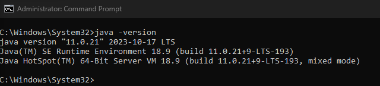
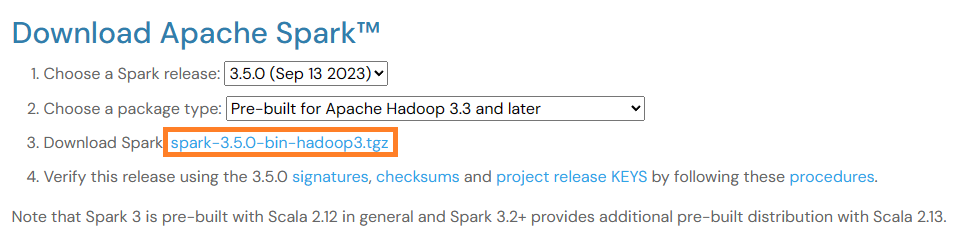
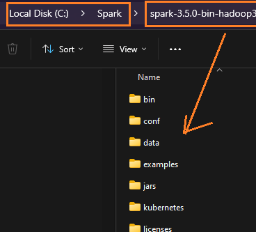
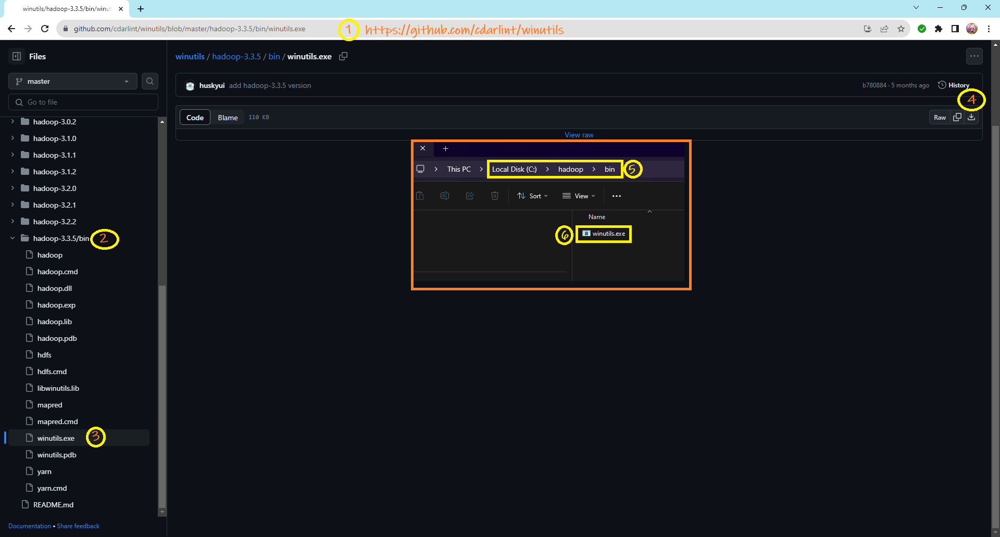
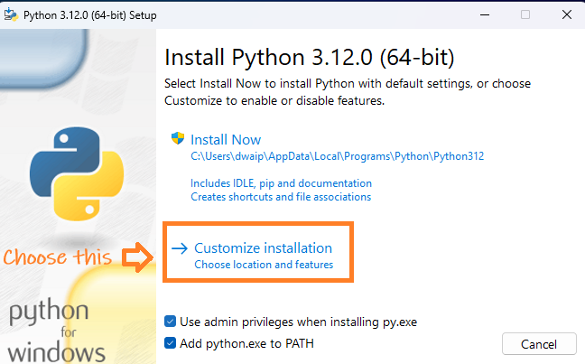
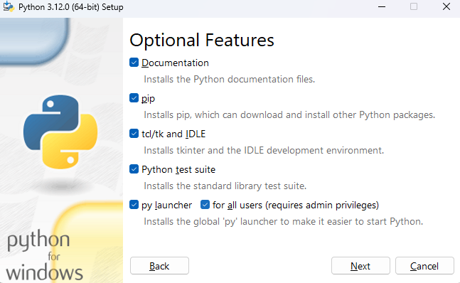
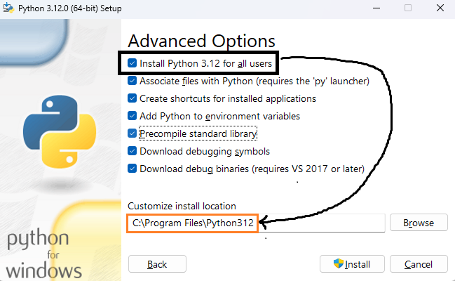
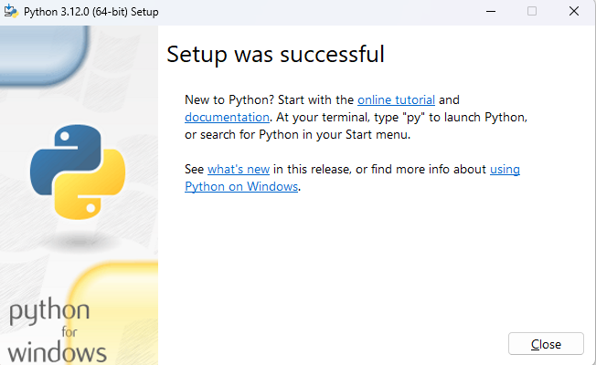
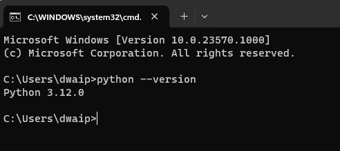
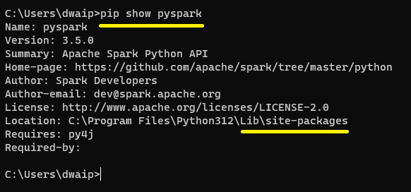

## Table of Contents
- [Getting Started with Data Engineering: Key Installations of Java, Spark, \& Python PySpark](#getting-started-with-data-engineering-key-installations-of-java-spark--python-pyspark)
  - [Install Java \[Oracle JDK\]](#install-java-oracle-jdk)
  - [Install Full Apache SPARK](#install-full-apache-spark)
  - [Install Python \[python.org\]](#install-python-pythonorg)
  - [Set Env Variables](#set-env-variables)
    - [Entries](#entries)
    - [Explanation](#explanation)
      - [Link python.exe with `PYSPARK_PYTHON`](#link-pythonexe-with-pyspark_python)
      - [`%JAVA_HOME%\bin` to PATH](#java_homebin-to-path)
  - [Install Pyspark](#install-pyspark)
    - [Background](#background)
    - [Install Pyspark System-Wide](#install-pyspark-system-wide)
    - [Check the Installation](#check-the-installation)
    - [See Actual Working](#see-actual-working)
  - [Appendix](#appendix)
    - [`PYSPARK_PYTHON` Overview](#pyspark_python-overview)
    - [Pyspark Vs Full Spark Overview](#pyspark-vs-full-spark-overview)


# Getting Started with Data Engineering: Key Installations of Java, Spark, & Python PySpark

<p style="color: #333399; font-family: Verdana, Geneva, sans-serif; background-color: #f2f4f7; padding: 15px; border-left: 5px solid #5b9bd5;">
In this guide, I will show how to set up a complete data engineering setup including Java, Full Hadoop, Python, and PySpark. Additionally, I'll describe the significance of setting different environment variables, their roles, and the key differences between Pyspark and a complete Spark setup.
</p>

## <span style="color: #ff6600;">Install Java [Oracle JDK]</span>

I've opted for the traditional Java, bringing with it the familiar folder system. Feel free to explore variants like OpenJDK.

- Download the JDK 11 (or later) installer from [Oracle JDK Downloads page](https://www.oracle.com/java/technologies/javase-jdk11-downloads.html)
- Install JDK in the default directory (typically `C:\Program Files\Java\jdk-11`).

- To verify the installation, enter `java -version` in your command prompt. You should see output similar to this:
   
  


## <span style="color: #33691e;">Install Full Apache SPARK</span>

- Download `spark-3.5.0-bin-hadoop3.tgz` from [spark.apache.org](https://spark.apache.org/downloads.html)
  
  

- Create a folder `C:\Spark`. Place the unzipped contents of `spark-3.5.0-bin-hadoop3.tgz` inside it. Your `C:\Spark` folder should now contain lib, bin etc.

  

- Establish this folder structure: `C:\hadoop\bin`.
- Download `winutils.exe` from [github/cdarlint](https://github.com/cdarlint/winutils/tree/master) and place it inside `C:\hadoop\bin`

  

## <span style="color: #0066cc;">Install Python [python.org]</span>

- Download `python-3.12.0-amd64.exe` (or similar) from the [Python Downloads page](https://www.python.org/downloads/)
  - Execute the downloaded installer and opt for **Customize Installation**. Ensure you select **Add python.exe to PATH**.
  
    

  - Proceed with all optional features and click Next.
    
    

  - In Advanced Options, select "Install Python 3.12 for all users".
  
    

  - A successful setup should show up in a Setup Success message.
    
    

  - Verify the installation by typing `python --version` in your command prompt. The Python version number indicates a successful installation.
    
    

## <span style="color: #9e0059;">Set Env Variables</span>

### <span style="color: #7e0041;">Entries</span>

Navigate to Run ➤ SYSDM.CPL ➤ Advanced ➤ Environment Variables, and create or set these environment variables at the system (recommended) or user levels:

| Variable         | Value                         |
|------------------|-------------------------------|
| `JAVA_HOME`      | `C:\Program Files\Java\jdk-11`|
| `SPARK_HOME`     | `C:\Spark`                    |
| `HADOOP_HOME`    | `C:\hadoop`                   |
| `PYSPARK_PYTHON` | `C:\Python39\python.exe`      |
| Path             | `%JAVA_HOME%\bin`             |
|                  | `%SPARK_HOME%\bin`            |
|                  | `%HADOOP_HOME%\bin`           |

<p style="color: #663399; font-family: Arial, Helvetica, sans-serif;">
For a PowerShell command to set these variables with Admin privileges, remember to change 'Machine' (for system-wide level) to 'User' (for user level) as required.
</p>

### <span style="color: #003366;">Explanation</span>

#### Link python.exe with `PYSPARK_PYTHON`

We set the `PYSPARK_PYTHON` environment variable to `C:\Python39\python.exe` to specify which Python executable Spark should use. This is vital, particularly if you have multiple Python installations.

#### `%JAVA_HOME%\bin` to PATH

While `C:\Program Files\Common Files\Oracle\Java\javapath` might already be in your system's `Path` environment variable, it's generally advisable to add `%JAVA_HOME%\bin` to your `Path`. This ensures your system uses the JDK's executables, rather than those from another Java installation.

## <span style="color: #cc0066;">Install Pyspark</span>

### <span style="color: #99004d;">Background</span>
If your code involves creating a Spark session and dataframes, you'll need PySpark Libraries. Install it using `pip install pyspark`. This does two things:
- Installs the libraries
- Installs a 'miniature, standalone' Spark environment for testing

However, in our case, we don't need the 'miniature Spark' that comes with PySpark libraries. We'll manage potential Spark conflicts with the `SPARK_HOME` variable set to our full Spark environment.

### <span style="color: #cc3300;">Install Pyspark System-Wide</span>
Open a command prompt with Admin privilege. Use pip (included with our Python) and execute `pip install pyspark` for a system-wide installation.

### <span style="color: #006600;">Check the Installation</span>

After installation, confirm if PySpark is in the global `site-packages`:
```
pip show pyspark
```
The `Location:` field in the output reveals the installation location.



### <span style="color: #3333cc;">See Actual Working</span>

Test your PySpark installation by starting a Spark session in a Python environment:
```python
from pyspark.sql import SparkSession
spark = SparkSession.builder \
    .appName("TestApp") \
    .getOrCreate()
print(spark.version)
spark.stop()
```
If Spark starts without errors, your PySpark setup with Python is successful.

## <span style="color: #b35900;">Appendix</span>

### <span style="color: #804000;">`PYSPARK_PYTHON` Overview</span>

1. **Selects Python Interpreter**: Designates which Python version Spark executors should use for UDFs and transformations. Key in setups with multiple Python versions.

2. **Uniformity in Clusters**: Guarantees that all cluster nodes use the same Python environment, maintaining consistency in PySpark.

### <span style="color: #003366;">Pyspark Vs Full Spark Overview</span>

I have put this in another section here. [Read More..](/Pyspark_And_Spark/PysparkIsNotFullSpark.html)

---

© D Das  
📧 [das.d@hotmail.com](mailto:das.d@hotmail.com) | [ddasdocs@gmail.com](mailto:ddasdocs@gmail.com)