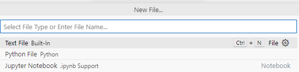

## Table of Contents
- [Validating JSON Data with Python and JSON Schema](#validating-json-data-with-python-and-json-schema)
    - [Introduction](#introduction)
    - [Prerequisites](#prerequisites)
    - [How to Run the Script](#how-to-run-the-script)
    - [Code Overview](#code-overview)
    - [Conclusion](#conclusion)


# <span style="color: SteelBlue;">Validating JSON Data with Python and JSON Schema</span>

### <span style="color: Coral;">Introduction</span>

This is a short tutorial on how to use Python to validate JSON file data. Rather than iterating through all the fields in the JSON, usage of libraries like JSONschema etc. are considered more efficient. Hence, I thought of sharing my experience.

### <span style="color: MediumSeaGreen;">Prerequisites</span>

1. **Python Installation**: 
   Ensure Python is installed on your system. If not, download and install it from the [official Python website](https://www.python.org/downloads/).

2. **JSON Files**:
   - **Weather Data File (`weather.json`)**: A JSON file containing weather data, typically obtained from weather APIs e.g. [weatherapi](https://www.weatherapi.com/).
   - **JSON Schema File (`weather_schema.json`)**: A JSON schema file that defines the expected structure, required fields, and data types of the weather data JSON. Tools like [Quicktype](https://quicktype.io) or [JSON Schema Tool](https://jsonschema.net) can help generate a schema from a JSON example.

3. **`jsonschema` Library**: 
   This Python library is used for validating JSON data against a schema. 
   
   Install it using pip:
   <code style="background-color: LightGray; color: DarkRed;">pip install jsonschema</code>

### <span style="color: Teal;">How to Run the Script</span>

1. **Prepare Your JSON Files**: 
   Ensure your `weather.json` and `weather_schema.json` are placed in the same directory as your script.

2. **Run the Script**: 
   Open Visual Studio Code, create a Python file or a Jupyter notebook
    
    


3.  **And copy-paste the code below. Adjust as needed.**
    ```python
    import json
    from jsonschema import validate, ValidationError

    # Load the JSON data and schema
    with open('weather.json', 'r') as file:
        weather_data = json.load(file)

    with open('weather_schema.json', 'r') as file:
        schema = json.load(file)

    # Function to validate JSON
    def is_valid_json(data, schema):
        try:
            validate(instance=data, schema=schema)
            return True
        except ValidationError as ve:
            print(f"Validation error: {ve}")
            return False

    # Validate the weather data
    if is_valid_json(weather_data, schema):
        print("Validation Successful!")
    else:
        print("Validation Failed!")
    ```
   Run and debug using the editor.

### <span style="color: DodgerBlue;">Code Overview</span>

The script consists of the following components:

1. **Loading JSON Data and Schema**: We use Python's built-in `json` module to load the weather data and the schema from their respective files.

2. **Validation Logic**: Utilizing the `jsonschema.validate()` function, we check if the JSON data adheres to the schema, capturing any validation errors that might indicate discrepancies.

3. **Error Handling**: The script identifies and prints specific validation errors, making it easier to pinpoint issues in the data or the schema.


### <span style="color: Violet;">Conclusion</span>

<p style="color: SlateGray;">
This code can be further enhanced to be included in an Azure Function. For example, if you are fetching data as JSON format from a web API, this code can be added there to perform data validation.
</p>

---

© D Das  
📧 [das.d@hotmail.com](mailto:das.d@hotmail.com) | [ddasdocs@gmail.com](mailto:ddasdocs@gmail.com)