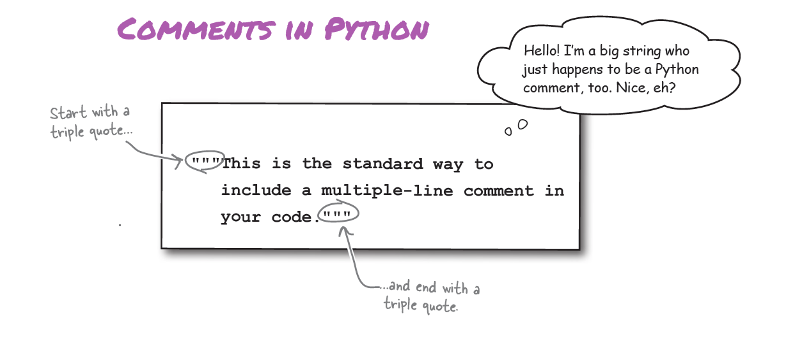
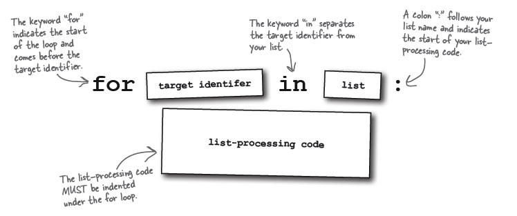
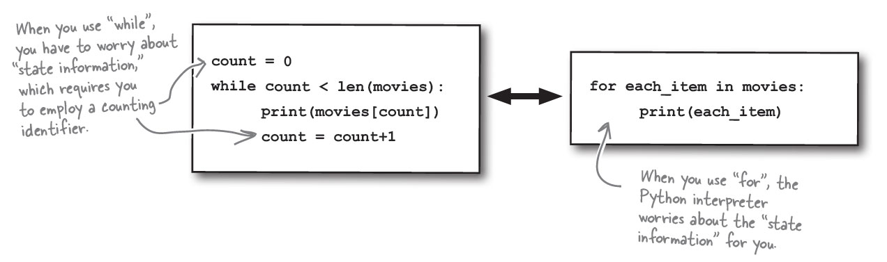
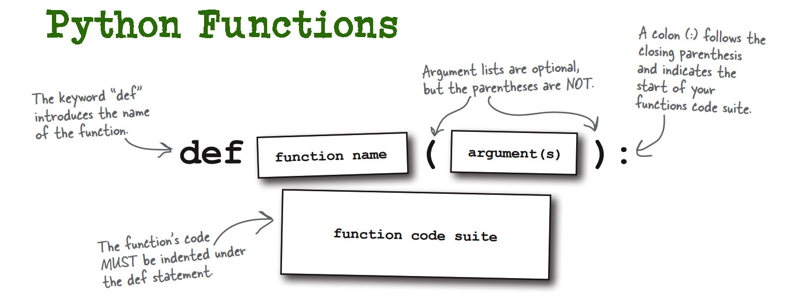

- [Python Variables](#python-variables)
- [Python comments](#python-comments)
- [Python list](#python-list)
  - [For item in list](#for-item-in-list)
  - [While in list](#while-in-list)
- [Python functions](#python-functions)
- [Python Sets Properties](#python-sets-properties)
- [Python Snippets](#python-snippets)
  - [Get Current User info](#get-current-user-info)
- [Populat MSSQL Tables with random data](#populat-mssql-tables-with-random-data)

# Python Variables

Python variables don't have a type. They are just names. If you have a python list the variable holding it doesn't need to know what is the type. It just knows its a list and it has some collection.

List in Python my look like arrays. But, they are more. They are full blown Python collection objects. This means, they come with ready-to-use list methods.

# Python comments



# Python list

**List are like Arrays v2**


**Access list items with the Square Bracket []**


First few important list methods

print()
pop()
extend()
insert()

## For item in list



## While in list



# Python functions



# Python Sets Properties

- **No Order**: There is no order in Python sets. You might input `apple`, `orange`, `banana` and get `banana`, `apple`, `orange` as output.


```python
my_set = {1, 2, 3}
print(my_set)  # Output could be {1, 2, 3} or {3, 1, 2} or any permutation
```

- **No Index**: There is no index in sets, like a jail where no inmate has a badge number.


```python
my_set = {3, 1, 2}
print(my_set[0]) # THIS IS AN ERROR
```

- **No Duplicates**: You can't have the same item twice in a set. Duplicates are removed automatically.


```python
my_set = {1, 2, 2, 3}
print(my_set)  # Output: {1, 2, 3}
```

- **No In-Place Replace. Add/remove instead.**: You can add/remove items, but can't change an item's value directly. Can't in-place replace items. First, remove the old one and add the new one.


```python
my_set = {1, 2, 3}

my_set.remove(2) # OK
my_set.add(4) # OK
my_set[0] = 5 # ERROR
```

- **No Lists/Dictionaries as Elements**: Elements in a set must be immutable. You can't use lists or dictionaries as elements because they are mutable.


```python
# Valid elements
my_set = {1, "hello", (1, 2)} # TUPLES OK

# Invalid elements
my_set = {[1, 2], {"key": "value"}} # ERROR, NO LISTS, NO DICTS
```

# Python Snippets

## Get Current User info

```python
import os
import getpass
print("Current user:", getpass.getuser())

# Directory to check
directory_to_check = "/data/spark-warehouse/test_db.db/films"

# Get the current user running the Spark application
current_user = getpass.getuser()
print(f"Current user: {current_user}")

# Check read, write, and execute permissions
has_read_permission = os.access(directory_to_check, os.R_OK)
has_write_permission = os.access(directory_to_check, os.W_OK)
has_execute_permission = os.access(directory_to_check, os.X_OK)

print(f"Read permission: {has_read_permission}")
print(f"Write permission: {has_write_permission}")
print(f"Execute permission: {has_execute_permission}")
```

# Populat MSSQL Tables with random data

This Python script populates a SQL Server database table, `dbo.student`, with random data. The `dbo.student` table should have:

- **id** (integer): A unique identifier for each student.
- **Name** (varchar): A randomly generated student's first name.
- **Age** (integer): A randomly generated age between 18 and 30.

Here's a step-by-step breakdown:

1. **Database Connection**: Connects to the `Oxford` SQL Server database using Windows Authentication (`Trusted_Connection=yes`).
2. **Row Count**: The `num_rows` variable determines how many rows of data to insert. Adjust this to change the number of rows added.
3. **Random Data with Faker**: Uses the `Faker` library to produce random student names.
4. **Get Last ID Value**: Checks the highest `id` in `dbo.student` to determine the next available ID. If no records are present, it starts from 0.
5. **Create INSERT Commands**: The script creates individual `INSERT` commands for each new student record.
6. **Run INSERT Commands**: Executes each `INSERT` command to add new rows to `dbo.student`.
7. **Commit and Disconnect**: Saves the changes and ends the database connection.

For the script to work, ensure the table exists. It's optimal to execute the script from Azure Data Studio on the server itself. Modify connection details if running from a different location.

---
```python
# Faker was not found hence we installed the faker library using pip. Alternatively you can  the command in terminal(mac) or command prompt(windows)
# Dont run it if faker already installed
pip install faker

```
```python
import pyodbc
from faker import Faker
import random

# Establish a connection to your SQL Server
conn = pyodbc.connect('Driver={SQL Server};'
                      'Server=.;'
                      'Database=Oxford;'
                      'Trusted_Connection=yes;')

# Define the number of rows to insert
num_rows = 1000  # Change this to the desired number of rows

# Create a Faker instance for generating random names
fake = Faker()

# Get the last primary key value in the table
cursor = conn.cursor()
cursor.execute("SELECT MAX(id) FROM dbo.student")
last_id = cursor.fetchone()[0]
if last_id is None:
    last_id = 0

# Generate and execute the INSERT statements
for i in range(1, num_rows + 1):
    last_id += 1  # Increment the primary key value
    student_name = fake.first_name()  # Generate a random first name
    student_age = random.randint(18, 30)  # Generate a random age between 18 and 30
    sql = f"INSERT INTO dbo.student VALUES ({last_id}, '{student_name}', {student_age})"
    cursor.execute(sql)

print("Executed succesfully. Rows updated: " + str(i))
# Commit the changes and close the connection
conn.commit()
conn.close()

```