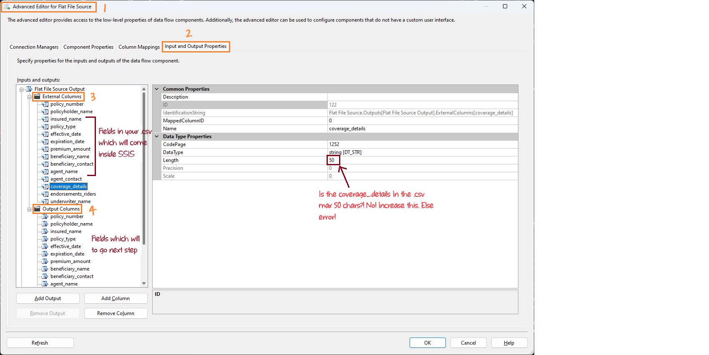
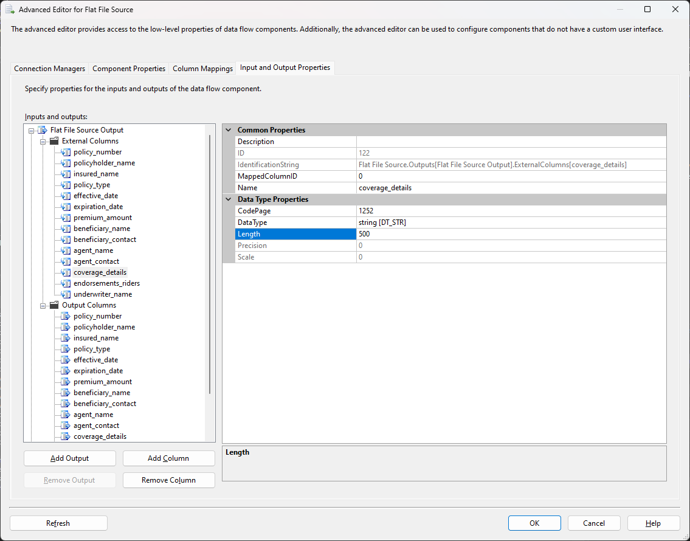
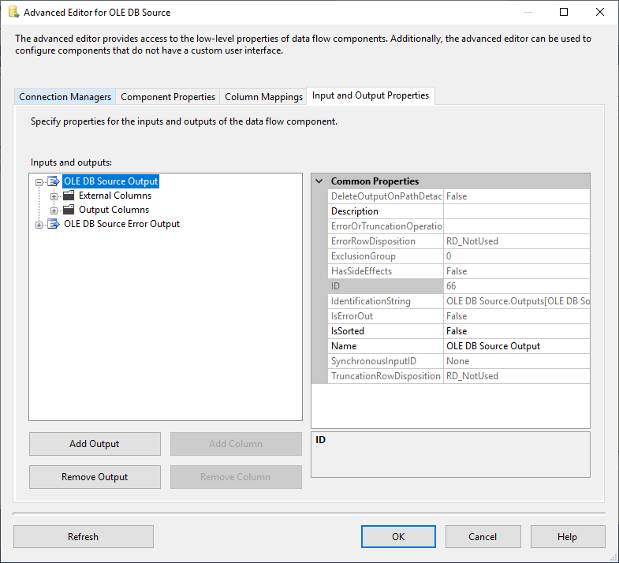

# Understanding External Columns and Output Columns in SSIS

In SSIS (SQL Server Integration Services), "External Columns" and "Output Columns" play crucial roles in managing how data moves through the data flow. 

## External Columns
- **What It Is**: External columns represent how the data appears in your source file (like a CSV file). These columns reflect the structure and data types as defined in the source.
- **Why It Matters**: They tell SSIS what kind of data is in each column, such as whether it’s text, a number, or a date, and how long the text can be.
- **Example**: If your CSV file has a column called `coverage_details` and the longest text in this column is 200 characters, you need to set the length of this column to 200 in External Columns. This tells SSIS to expect up to 200 characters of text in that column.

## Output Columns
- **What It Is**: Output columns are the columns that SSIS will pass on to the next step in your data flow. These are the columns that will be used by other components like Data Conversion or SQL Server Destination.
- **Why It Matters**: They define how the data is passed from the Flat File Source to other components in your data flow. The data types and lengths must match or be compatible with the next step’s requirements.
- **Example**: The `coverage_details` column in Output Columns should be set to the same length (200 characters in this case) as in External Columns. This ensures that the data from the source file is correctly transferred to the next component without errors.

## Where to Find External Columns and Output Columns

External Columns and Output Columns is mainly found in components that handle data sources and transformations in the Data Flow task (like Flat File Source, OLE DB Source, Excel Source, or Data Conversion Transformation).

**How to See Them**:
1. Double-click the component in the Data Flow task.
2. Click on the "Advanced Editor…" button.
3. Go to the "Input and Output Properties" tab.
4. You will see sections for "External Columns" and "Output Columns".

**Example for Flat File Source**:

**Example for OLE DB Source**:

This way, you can easily find and manage External Columns and Output Columns in SSIS to ensure your data flows correctly.

## Common errors related to External Columns and Output Columns

If External Columns and Output Columns are not set correctly, various types of errors can occur:

1. **Truncation Errors** If `coverage_details` is set to 50 characters in External Columns but the actual data is 200 characters, SSIS will try to fit long text into a smaller space, causing a truncation error. The error message will say, "Text was truncated or one or more characters had no match in the target code page."

2. **Data Conversion Errors** If `coverage_details` is defined as a numeric column in SSIS but the source file contains text data, a conversion error will occur. The error message will say, "Data conversion failed. The data conversion for column 'coverage_details' returned status value 2 and status text 'The value could not be converted because of a potential loss of data.'"

3. **Mapping Errors** happen when the source column and destination column are not compatible in terms of data types or lengths. For example, if `coverage_details` is set to 200 characters in SSIS but the SQL Server table defines it as 100 characters, SSIS will not be able to map the data correctly. The error message will say, "Cannot convert between Unicode and non-Unicode string data types."
