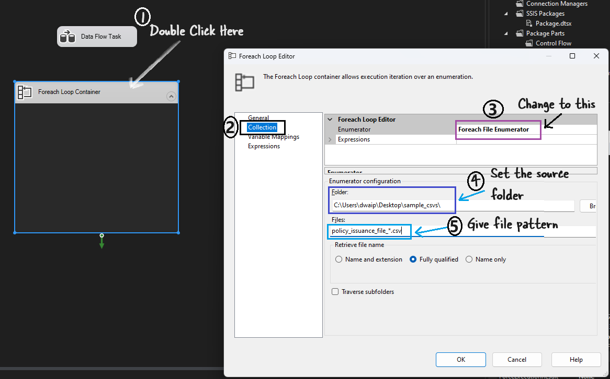
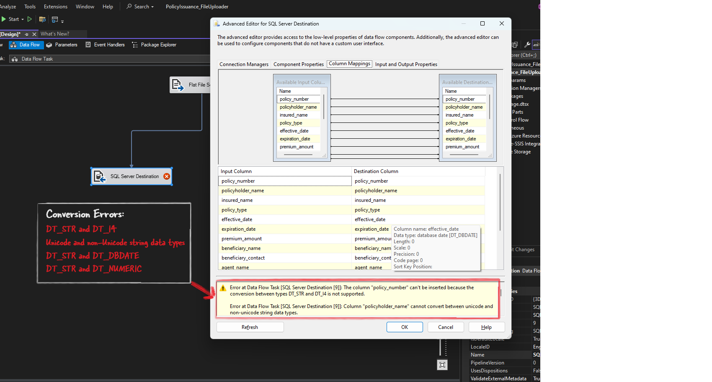
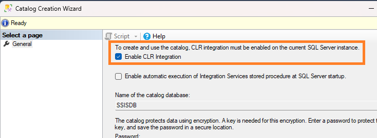
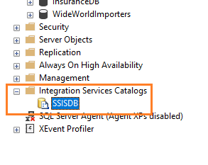
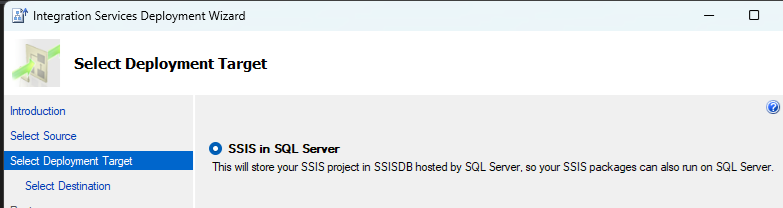
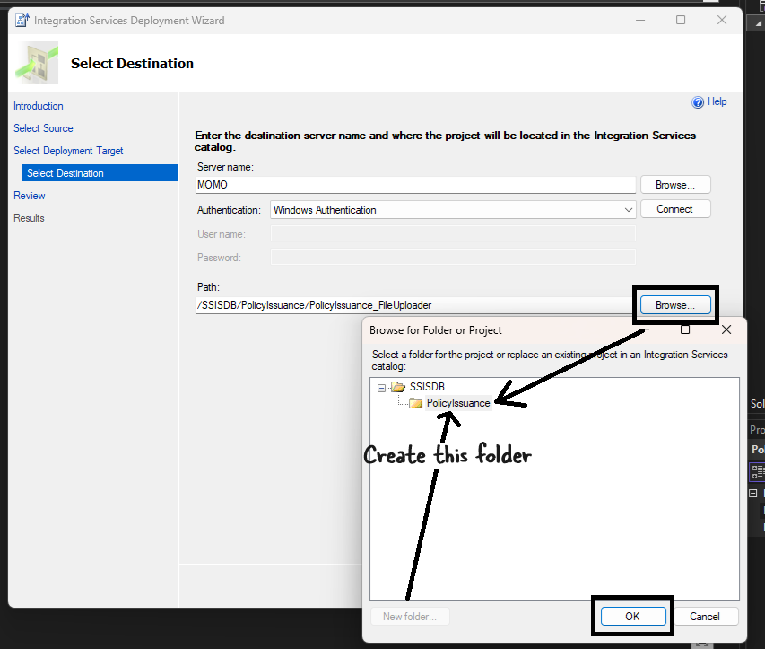
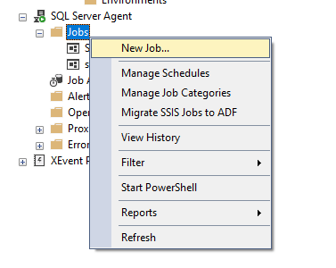
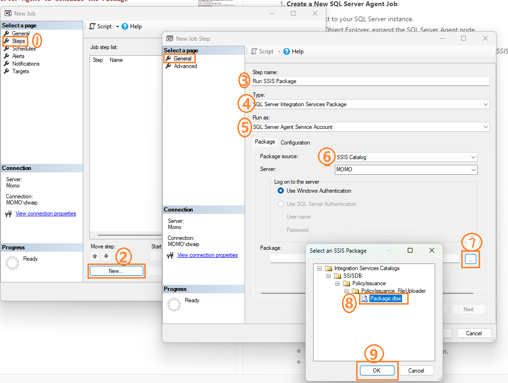

- [ETL from Flat Files to MSSQL in Banking/Insurance Domain](#etl-from-flat-files-to-mssql-in-bankinginsurance-domain)
  - [Project Overview](#project-overview)
  - [Step 1: Create the Required Database in MSSQL](#step-1-create-the-required-database-in-mssql)
  - [Step 2: Create the SSIS Package](#step-2-create-the-ssis-package)
    - [**Configure the Foreach Loop Container**](#configure-the-foreach-loop-container)
    - [**Configure the Data Flow Task**](#configure-the-data-flow-task)
    - [**Configure Flat File Connection Manager**](#configure-flat-file-connection-manager)
    - [**Set Connection String to Dynamic**](#set-connection-string-to-dynamic)
    - [**Add Data Conversion Transformation (if needed)**](#add-data-conversion-transformation-if-needed)
    - [**Add SQL Server Destination**:](#add-sql-server-destination)
    - [**Map Columns in OLE DB Destination**:](#map-columns-in-ole-db-destination)
    - [**Run the Package**](#run-the-package)
- [Common Errors and Their Solutions](#common-errors-and-their-solutions)
  - [Input and Ouput Properties Tab - Common place for error troubleshooting](#input-and-ouput-properties-tab---common-place-for-error-troubleshooting)
    - [**Truncation Errors**](#truncation-errors)
    - [**Data Conversion Errors**](#data-conversion-errors)
    - [**Mapping Errors**](#mapping-errors)
  - [SSIS toolbox not visible](#ssis-toolbox-not-visible)
- [SSISDB not found](#ssisdb-not-found)
  - [Resolution](#resolution)
- [Deploying SSIS Package to Run Once a Day in MSSQL Server](#deploying-ssis-package-to-run-once-a-day-in-mssql-server)
    - [Step 1: Deploy the SSIS Package](#step-1-deploy-the-ssis-package)
    - [Step 2: Configure SQL Server Agent to Schedule the Package](#step-2-configure-sql-server-agent-to-schedule-the-package)

# ETL from Flat Files to MSSQL in Banking/Insurance Domain

This project is a small version of a real-time project often used in the banking and insurance sectors. Here, data is received from different sources as flat files (like .csv or .xml). In banking, this file is sometimes called a control file. The file may come from right-fax servers, through web services, etc. This data needs to be ingested into SQL Server. The data comes from various branches or field offices throughout the day, and the workflow needs to run at a regular time each day to process all the files.

## Project Overview

- **Data Source**: A folder containing .csv files with the following data:
  ```
  policy_number,policyholder_name,insured_name,policy_type,effective_date,expiration_date,premium_amount,beneficiary_name,beneficiary_contact,agent_name,agent_contact,coverage_details,endorsements_riders,underwriter_name
  0_1722756562687,Pamela Bennett,Steven Dunn,Home,2021-08-24,2021-02-03,83572,Dana Hampton,366-752-7514x4594,Troy Young,+1-818-775-4416x2930,Set like go entire ground.,Drive generation major.,Candice Williams
  ```

- **File Naming Convention**: The CSV file names will be in the format `policy_issuance_file_x.csv` where x is 1, 2, 3...

- **SSIS Workflow**: The workflow will contain a Foreach Loop container. Inside the Foreach Loop, there will be a Data Flow Task. The Data Flow Task will contain: Flat File Source -> Data Conversion -> OLE DB Destination.

- **Setup Required**: You can develop this easily on a Windows machine. You will need MSSQL server. Visual Studio(Community edition will do). SSDT(to create the SSIS package in VS).

## Step 1: Create the Required Database in MSSQL

Open SQL Server Management Studio (SSMS) and run the following SQL script to create the database and table.

```sql
-- Create the database
CREATE DATABASE InsuranceDB;
GO

-- Use the newly created database
USE InsuranceDB;
GO

-- Create the table
CREATE TABLE PolicyIssuance (
    policy_number NVARCHAR(50) PRIMARY KEY,
    policyholder_name NVARCHAR(100),
    insured_name NVARCHAR(100),
    policy_type NVARCHAR(50),
    effective_date DATE,
    expiration_date DATE,
    premium_amount DECIMAL(10, 2),
    beneficiary_name NVARCHAR(100),
    beneficiary_contact NVARCHAR(50),
    agent_name NVARCHAR(100),
    agent_contact NVARCHAR(50),
    coverage_details NVARCHAR(255),
    endorsements_riders NVARCHAR(255),
    underwriter_name NVARCHAR(100)
);
GO

-- Verify the table creation
SELECT * FROM PolicyIssuance;
GO
```

To check the details of the table created, use:

```sql
sp_help PolicyIssuance;
```

## Step 2: Create the SSIS Package

### **Configure the Foreach Loop Container**

- Open SQL Server Data Tools (SSDT) or Visual Studio with SSIS extension installed.
- Create a new SSIS project.
- Create a variable `var_FilePath` (String) to store the full path of the current file being processed.
- Drag a **Foreach Loop Container** onto the Control Flow tab.
- Double-click the Foreach Loop Container to open the editor.
   - In the **Collection** tab:
     - Set **Enumerator** to **Foreach File Enumerator**.
     - Set **Folder** to `C:\Users\dwaip\Desktop\sample_csvs\`.
     - Set **Files** to `policy_issuance_file_*.csv` to process all files matching this pattern.
     
     
   - In the **Variable Mappings** tab:
     - Add the `FilePath` variable and set the **Index** to 0.
     
     
- Drag a **Data Flow Task** into the Foreach Loop Container.

### **Configure the Data Flow Task**
   - Double-click the Data Flow Task to open the Data Flow tab.
   - Add a **Flat File Source** to the Data Flow.
   - Double-click the Flat File Source to configure it.

### **Configure Flat File Connection Manager**
   - In the Flat File Source Editor, click **New** to create a new Flat File Connection Manager.
   - Set up the connection manager using any one of the sample CSV files (e.g., `policy_issuance_file_1.csv`) to configure the columns.
   - Once configured, click **OK**.

### **Set Connection String to Dynamic**
   - In the Flat File Connection Manager:
     - Go to **Properties** and find **Expressions**.
     - Click the ellipsis (`...`) next to **Expressions**.
     - In the **Property** dropdown, select **ConnectionString**.
     - Set the expression to use the `var_FilePath` variable: `@[User::var_FilePath]`.
     
     
     
     If the setting is correct you will see this:
     
     

### **Add Data Conversion Transformation (if needed)**
   - If you need to convert data types, add a **Data Conversion Transformation**.
   - Configure it to convert the necessary columns as described in the previous steps:
     - `policyholder_name` (original) converted to `Copy of policyholder_name`
     - `insured_name` (original) converted to `Copy of insured_name`
     - `beneficiary_name` (original) converted to `Copy of beneficiary_name`

### **Add SQL Server Destination**:
   - Add an **OLE DB Destination** to the Data Flow.
   - Connect the Data Conversion Transformation (if used) or Flat File Source to the OLE DB Destination.
   - Configure the OLE DB Destination to map the columns correctly to the `PolicyIssuance` table.

### **Map Columns in OLE DB Destination**:
   - Open the SQL Server Destination Editor.
   - Go to the Mappings Tab.
   - Map the converted columns:
     - `Copy of policyholder_name` to `policyholder_name`
     - `Copy of insured_name` to `insured_name`
     - `Copy of beneficiary_name` to `beneficiary_name`
     - Similarly, map other converted columns as needed.

### **Run the Package**
   - Save the package.
   - Right-click the package and select Execute Package.
   - Check the MSSQL table to verify the data has been loaded correctly.


# Common Errors and Their Solutions

The most common errors will be related to size mismatch and type mismatch. There will also be Unicode-non-Unicode type mismatch issues.

For text files, I chose Unicode string [DT_WSTR] as the output which can be mapped to MSSQL server NVARCHAR variables.

I was able to ingest data from .csv files correctly using the DT_STR format. This means the data can come in as DT_STR, but it needs to go into MSSQL as DT_WSTR.

The `coverage_details` field was the largest in the .csv file and caused the most errors. So, I will explain the errors using this field as an example.

## Input and Ouput Properties Tab - Common place for error troubleshooting
Go to the Input and Output Properties in the Advanced Editor (right-click the step).


###  **Truncation Errors**
If `coverage_details` is set to 50 characters in External Columns but the actual data is 200 characters, SSIS will try to fit long text into a smaller space, causing a truncation error. The error message will say, "Text was truncated or one or more characters had no match in the target code page."

### **Data Conversion Errors**

If `coverage_details` is defined as a numeric column in SSIS but the source file contains text data, a conversion error will occur. The error message will say, "Data conversion failed. The data conversion for column 'coverage_details' returned status value 2 and status text 'The value could not be converted because of a potential loss of data.'"

   

### **Mapping Errors**

These happen when the source column and destination column are not compatible in terms of data types or lengths. For example, if `coverage_details` is set to 200 characters in SSIS but the SQL Server table defines it as 100 characters, SSIS will not be able to map the data correctly. The error message will say, "Cannot convert between Unicode and non-Unicode string data types."

## SSIS toolbox not visible

In the newer version of VS sometimes the SSIS Toolbox might be absent. You just have to right click and select SSIS Toolbox. That's it.

   


# SSISDB not found

An Integration Services catalog (SSISDB) was not found on this server instance. To deploy a project to this server, you must create the SSISDB catalog. Open the Create Catalog dialog box from the Integration Services Catalogs node.


## Resolution
  - Open SSMS and connect to your SQL Server instance.
  - In the Object Explorer, expand the "Integration Services Catalogs" node.
  - Right-click and select "Create Catalog…".
   
  - In the "Create Catalog" dialog box, check the "Enable CLR Integration" checkbox.
   

  - Enter a password for the SSISDB database master key. This password will be used to secure the catalog.
  - Click "OK" to create the catalog. You will  see a SSISDB created inside Integration Services Catalogs folder. Now, you can deploy your projects here.

   

# Deploying SSIS Package to Run Once a Day in MSSQL Server

To deploy your SSIS package and schedule it to run once a day, follow these steps:


### Step 1: Deploy the SSIS Package

1. **Build the SSIS Project**:
   - Open your SSIS project in SQL Server Data Tools (SSDT) or Visual Studio.
   - Right-click the project in the Solution Explorer and select "Build" to ensure there are no errors.

2. **Deploy the Package**:
   - Right-click the project and select "Deploy".
      
   - The Integration Services Deployment Wizard will open. Follow the steps:
     - Select **SSIS in SQL Server** as the deployment target.
      
     - Provide the server name and path where the package will be deployed.
      
     - Finally click Deploy to deploy the package
      
      - If everthing goes well, your package will be deployed
      
### Step 2: Configure SQL Server Agent to Schedule the Package

1. **Create a New SQL Server Agent Job**:
   - Connect to your SQL Server instance.
   - In the Object Explorer, expand the SQL Server Agent node.
   - Right-click Jobs and select "New Job".
   - In the "New Job" window, provide a name for the job (e.g., "Daily SSIS Package Run").
   
3. **Set Job Steps**:
   - In the "Steps" page, click "New" to create a new step.
   - Set the "Step name" (e.g., "Run SSIS Package").
   - Set "Type" to "SQL Server Integration Services Package".
   - Set "Package source" to "SSIS Catalog".
   - Select the server and the package you deployed.
   - Click "OK" to save the step.
   

4. **Set Job Schedule**:
   - In the "Schedules" page, click "New" to create a new schedule.
   - Provide a name for the schedule (e.g., "Daily Schedule").
   - Set the frequency to "Daily".
   - Set the time of day you want the package to run.
   - Click "OK" to save the schedule.
   
5. **Set Notifications (Optional)**:
   - In the "Notifications" page, set up notifications to receive alerts in case of job failure or success.

6. **Save the Job**:
   - Click "OK" to save the job.
