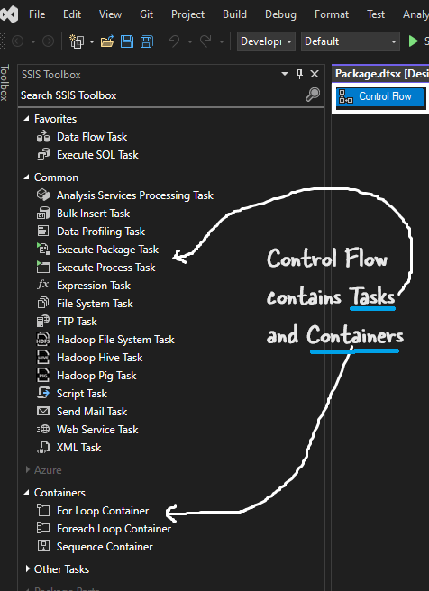

# [SQL Server Integration Services](https://learn.microsoft.com/en-us/sql/integration-services/sql-server-integration-services?view=sql-server-ver16)

To put simply SSIS is the ETL tool for MSSQL Server. Before Azure Data Factory this was the ETL tool for Microosft ecosystem.

Common activity with this tool is extracting data from XML, Csvs, .txt files and load into MSSQL Server.

# How to install SSIS

SSIS is installed as an option during MSSQL installation. There is no separate installation of this. 

# [Control Flow](https://learn.microsoft.com/en-us/sql/integration-services/control-flow/control-flow?view=sql-server-ver16) and [Data Flow](https://learn.microsoft.com/en-us/sql/integration-services/data-flow/data-flow?view=sql-server-ver16)

The SSIS ETL workflow is made up two main components:

Control Flow: This is the 'roadmap/blueprint/overall plan/sequence of steps' of the ETL workflow. It tell what steps to perform in which order. E.g.

First check if the file exists,
Then read the data from it,
Then, put the data to SQL server.

Control flow contains tasks and containers(for loop etc)

Data flow 

It is the actual transformation and movement of data. It contains Source, transformation and destination.

Oversimplified summary: Control flow is the Workflow and Dataflow is the transformation.

> Remember, control flow is the workflow. Dataflow is the transformation. Dataflow task is a task in the control flow.

### Key Differences
| Feature | Control Flow | Data Flow |
|---|---|---|
| Basic Unit | Task | Transformation |
| Focus | Workflow and execution order | Data movement and transformation |
| Processing | Sequential | Parallel |
| Examples | Execute SQL, send email, file transfer | Extract from database, clean data, load to data warehouse |

### Relationship between Control Flow and Data Flow
* The control flow **initiates** and **controls** the data flow.
* A **Data Flow Task** is a type of task in the control flow.
* Multiple data flows can be executed within a single SSIS package.

