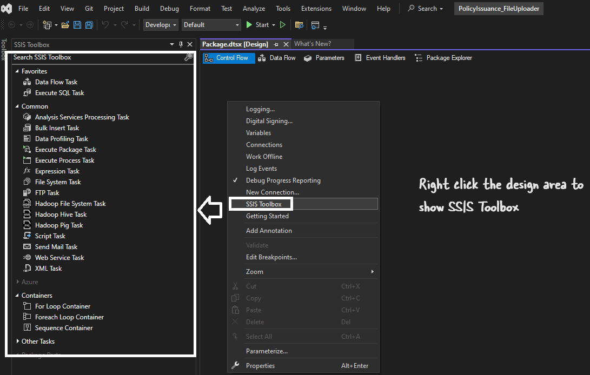
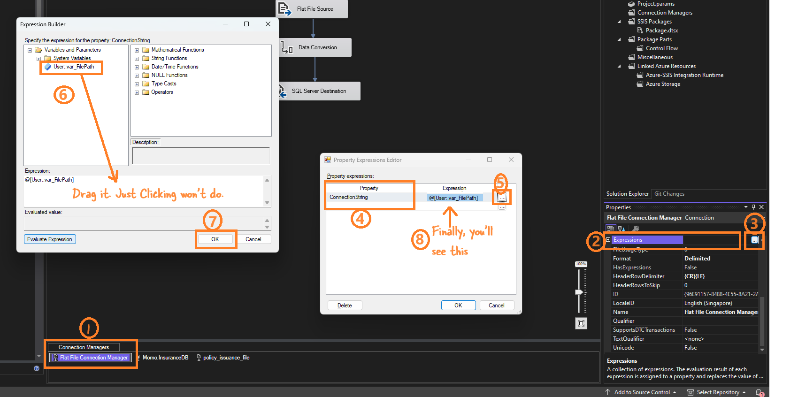

# [SQL Server Integration Services](https://learn.microsoft.com/en-us/sql/integration-services/sql-server-integration-services?view=sql-server-ver16)

To put simply SSIS is the ETL tool for MSSQL Server. Before Azure Data Factory this was the ETL tool for Microosft ecosystem.

Common activity with this tool is extracting data from XML, Csvs, .txt files and load into MSSQL Server.

# How to install SSIS

SSIS is installed as an option during MSSQL installation. There is no separate installation of this. 


# [Control Flow](https://learn.microsoft.com/en-us/sql/integration-services/control-flow/control-flow?view=sql-server-ver16) and [Data Flow](https://learn.microsoft.com/en-us/sql/integration-services/data-flow/data-flow?view=sql-server-ver16)


The SSIS ETL workflow is made up two main components:

Control Flow: This is the 'roadmap/blueprint/overall plan/sequence of steps' of the ETL workflow. It tell what steps to perform in which order. E.g.

First check if the file exists,
Then read the data from it,
Then, put the data to SQL server.

Control flow contains tasks and containers(for loop etc)


Data flow 

It is the actual transformation and movement of data. It contains Source, transformation and destination.

Oversimplified summary: Control flow is the Workflow and Dataflow is the transformation.

> Remember, control flow is the workflow. Dataflow is the transformation. Dataflow task is a task in the control flow.

### Key Differences
| Feature | Control Flow | Data Flow |
|---|---|---|
| Basic Unit | Task | Transformation |
| Focus | Workflow and execution order | Data movement and transformation |
| Processing | Sequential | Parallel |
| Examples | Execute SQL, send email, file transfer | Extract from database, clean data, load to data warehouse |

### Relationship between Control Flow and Data Flow
* The control flow **initiates** and **controls** the data flow.
* A **Data Flow Task** is a type of task in the control flow.
* Multiple data flows can be executed within a single SSIS package.


# Project 1

Overview:

Load  data into MSSQL table from flat file
Rename the file with current datetime
Move file to processed folder
Zip the renamed file
Delete moved file

The setup:

## Create the required Database in MSSQL

```sql
-- Create the database
CREATE DATABASE InsuranceDB;
GO

-- Use the newly created database
USE InsuranceDB;
GO

-- Create the table
CREATE TABLE PolicyIssuance (
    policy_number INT PRIMARY KEY,
    policyholder_name NVARCHAR(100),
    insured_name NVARCHAR(100),
    policy_type NVARCHAR(50),
    effective_date DATE,
    expiration_date DATE,
    premium_amount DECIMAL(10, 2),
    beneficiary_name NVARCHAR(100),
    beneficiary_contact NVARCHAR(50),
    agent_name NVARCHAR(100),
    agent_contact NVARCHAR(50),
    coverage_details NVARCHAR(255),
    endorsements_riders NVARCHAR(255),
    underwriter_name NVARCHAR(100)
);
GO

-- Verify the table creation
SELECT * FROM PolicyIssuance;
GO

```

Check the details of the table created. Describe command wont work in MSSQL.

```sql
sp_help PolicyIssuance;
```


# Common Errors

SSIS toolbox not visible



# Conversion errors

While mapping csv files/.txt files conversion errors are very common:


**Resolution:**

1. **Add Data Conversion Transformation**:
    - If the data types in the Flat File Source do not match the SQL Server table, use the Data Conversion transformation to convert them.
    - Drag a **Data Conversion** transformation onto the Data Flow tab.
    - Connect the Flat File Source to the Data Conversion transformation.
    - In the Data Conversion transformation, configure the following:
        - Convert `policy_number` to `DT_I4` (4-byte signed integer).
        - Convert `effective_date` and `expiration_date` to `DT_DBDATE` or `DT_DBTIMESTAMP`.
        - Convert `premium_amount` to `DT_NUMERIC` with precision 10 and scale 2.
	- Convert `policyholder_name`, `insured_name`, `beneficiary_name` to `DT_WSTR` if the target SQL Server table columns are `NVARCHAR`.

2. **Map Converted Columns to Destination**:
    - Use the converted columns in the Data Conversion transformation as input to the SQL Server destination.
    - Connect the Data Conversion transformation to the SQL Server destination.
    - In the SQL Server destination, map the converted columns to the corresponding columns in the `PolicyIssuance` table.

Assuming you have the following conversions:

- `policyholder_name` (original) converted to `Copy of policyholder_name`
- `insured_name` (original) converted to `Copy of insured_name`
- `beneficiary_name` (original) converted to `Copy of beneficiary_name`

### In SQL Server Destination:

1. **Open the SQL Server Destination Editor**.
2. **Go to the Mappings Tab**.
3. **Map the Converted Columns**:
    - `Copy of policyholder_name` to `policyholder_name`
    - `Copy of insured_name` to `insured_name`
    - `Copy of beneficiary_name` to `beneficiary_name`
    - Similarly, map other converted columns as needed.

# Add variables to make it dynamic


To upload multiple CSV files using SSIS, you can use the **Foreach Loop Container** to iterate over all the files in a specified directory and process them one by one. Here’s how you can configure your SSIS package to handle multiple CSV files:

### Step-by-Step Guide to Process Multiple CSV Files

1. **Create Variables**:
    - `FilePath` (String): To store the full path of the current file being processed.

2. **Add Foreach Loop Container**:
    - Drag a **Foreach Loop Container** onto the Control Flow tab.

3. **Configure Foreach Loop Container**:
    - Double-click the Foreach Loop Container to open the editor.
    - In the **Collection** tab:
        - Set **Enumerator** to **Foreach File Enumerator**.
        - Set **Folder** to `C:\Users\dwaip\Desktop\sample_csvs\`.
        - Set **Files** to `policy_issuance_file_*.csv` to process all files matching this pattern.
    
    - In the **Variable Mappings** tab:
        - Add the `var_FilePath` variable and set the **Index** to 0.
        

4. **Add a Data Flow Task Inside the Foreach Loop Container**:
    - Drag a **Data Flow Task** into the Foreach Loop Container.

5. **Configure the Data Flow Task**:
    - Double-click the Data Flow Task to open the Data Flow tab.
    - Add a **Flat File Source** to the Data Flow.
    - Double-click the Flat File Source to configure it.

6. **Configure Flat File Connection Manager**:
    - In the Flat File Source Editor, click **New** to create a new Flat File Connection Manager.
    - Set up the connection manager using any one of the sample CSV files (e.g., `policy_issuance_file_1.csv`) to configure the columns.
    - Once configured, click **OK**.

7. **Set Connection String to Dynamic**
    - In the Flat File Connection Manager:
      - Go to **Properties**.
      - Find **Expressions**.
      - Click the ellipsis (`...`) next to **Expressions**.
      - In the **Property** dropdown, select **ConnectionString**.
      - Set the expression to use the `FilePath` variable: `@[User::FilePath]`.

    
    
    If the setting is correct you will see this:

    
    

8. **Add Data Conversion Transformation (if needed)**:
    - If you need to convert data types, add a **Data Conversion Transformation**.
    - Configure it to convert the necessary columns as described in the previous steps.

9.  **Add SQL Server Destination**:
    - Add an **OLE DB Destination** to the Data Flow.
    - Connect the Data Conversion Transformation (if used) or Flat File Source to the OLE DB Destination.
    - Configure the OLE DB Destination to map the columns correctly to the `PolicyIssuance` table.

Let's clarify the process and the variables involved to ensure everything is set up correctly:

1. **Destination Folder**: This is the folder where you want to move the processed files.
2. **Moved File Path**: This is the path of the file after it has been moved to the destination folder.
3. **Processed File Name**: This is the new file name with the timestamp after it has been renamed.

### Step-by-Step Guide

#### 1. Define Variables
- **var_FilePath** (String): Stores the current file path (full path including the file name).
- **var_DestinationFolder** (String): The folder where you want to move the processed files.
- **var_MovedFilePath** (String): Stores the full path of the moved file.
- **var_ProcessedFileName** (String): Stores the new file name with the timestamp.

#### 2. Add a Foreach Loop Container
- This should already be configured to iterate over the CSV files.

#### 3. Add a Data Flow Task Inside the Foreach Loop Container
- This processes each file and loads data into the SQL Server table.

#### 4. Add a File System Task to Move the Files
1. **Drag a File System Task** after the Data Flow Task inside the Foreach Loop Container.
2. **Configure the File System Task**:
    - Set **Operation** to **Move File**.
    - In the **Source Connection** section, set `IsSourcePathVariable` to `True` and select `User::var_FilePath`.
    - In the **Destination Connection** section, set `IsDestinationPathVariable` to `True` and select `User::var_MovedFilePath`.
    - Set the `var_MovedFilePath` variable to be an expression that combines `var_DestinationFolder` and the file name:

    ```plaintext
    @[User::var_DestinationFolder] + "\\" + System.IO.Path.GetFileName(@[User::var_FilePath])
    ```

#### 5. Add a Script Task to Rename the File
1. **Drag a Script Task** after the File System Task inside the Foreach Loop Container.
2. **Configure the Script Task**:
    - Add `var_MovedFilePath` and `var_ProcessedFileName` as ReadWriteVariables.
    - Use the following C# code in the Script Task to rename the file with a timestamp:

    ```csharp
    using System;
    using System.IO;
    using Microsoft.SqlServer.Dts.Runtime;

    public void Main()
    {
        string movedFilePath = Dts.Variables["User::var_MovedFilePath"].Value.ToString();
        string timestamp = DateTime.Now.ToString("yyyyMMddHHmmss");
        string fileName = Path.GetFileNameWithoutExtension(movedFilePath);
        string fileExtension = Path.GetExtension(movedFilePath);
        string newFileName = $"{fileName}_processed_{timestamp}{fileExtension}";
        string newFilePath = Path.Combine(Path.GetDirectoryName(movedFilePath), newFileName);

        File.Move(movedFilePath, newFilePath);

        Dts.Variables["User::var_ProcessedFileName"].Value = newFilePath;

        Dts.TaskResult = (int)ScriptResults.Success;
    }
    ```

#### 6. Add an Execute Process Task to Zip the Files
1. **Add an Execute Process Task** after the Foreach Loop Container to zip the files.
2. **Configure the Execute Process Task**:
    - Set the **Executable** to the path of your zip utility (e.g., `C:\Program Files\7-Zip\7z.exe`).
    - In the **Arguments** field, specify the arguments to zip the files. For example, to zip all files in the destination folder:

    ```plaintext
    a -tzip "C:\Users\dwaip\Desktop\sample_csvs\ProcessedFiles\archive.zip" "C:\Users\dwaip\Desktop\sample_csvs\ProcessedFiles\*.csv"
    ```

    - Set the **Working Directory** to the destination folder.

### Summary of Variable Usage

- **var_FilePath**: Path of the current file being processed.
- **var_DestinationFolder**: Folder where files are moved to.
- **var_MovedFilePath**: Full path of the file after being moved to the destination folder (constructed using an expression).
- **var_ProcessedFileName**: Full path of the file after being renamed with a timestamp.